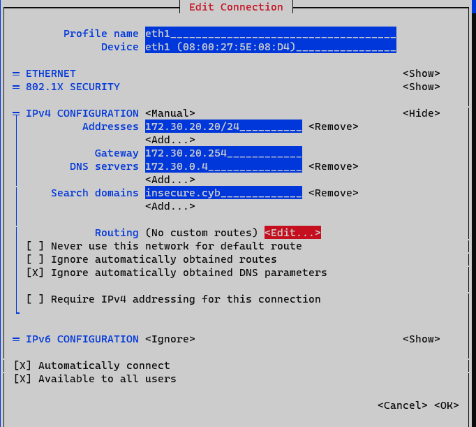

# bastion

## Lab 00: Lab environment Guidelines

## Lab 01: Lecture 1 Exercises

## Lab 02: Lecture 2 Exercises

## Lab 03: Lecture 3 Exercises

`setting up a fresh virtual machine with vagrant`

```code
PS C:\data\git\CA\bastion> cat .\Vagrantfile
# -*- mode: ruby -*-
# vi: set ft=ruby :

Vagrant.configure("2") do |config|
  config.vm.define "bastion" do |my_machine|
    config.vm.box = "almalinux/9"
    config.vm.box_version = "9.2.20230513"
    config.vm.hostname = "bastion"
    config.vm.network "private_network", virtualbox__intnet: "dmz", type: "static", ip: "172.30.20.20"
    config.vm.provider "virtualbox" do |vb|
      vb.gui = true
      vb.name = "ca_c_bastion"
      vb.memory = "512"
      vb.cpus = "1"
      vb.customize ["modifyvm", :id, "--clipboard-mode", "bidirectional"]
    end
  end
end
PS C:\data\git\CA\bastion> vagrant status
Current machine states:

bastion                   not created (virtualbox)

The environment has not yet been created. Run `vagrant up` to
create the environment. If a machine is not created, only the
default provider will be shown. So if a provider is not listed,
then the machine is not created for that environment.
PS C:\data\git\CA\bastion> vagrant up
Bringing machine 'bastion' up with 'virtualbox' provider...
==> bastion: Box 'almalinux/9' could not be found. Attempting to find and install...
    bastion: Box Version: 9.2.20230513
==> bastion: Loading metadata for box 'almalinux/9'
    bastion: URL: https://vagrantcloud.com/almalinux/9
==> bastion: Adding box 'almalinux/9' (v9.2.20230513) for provider: virtualbox
    bastion: Downloading: https://vagrantcloud.com/almalinux/boxes/9/versions/9.2.20230513/providers/virtualbox/unknown/vagrant.box
    bastion:
==> bastion: Successfully added box 'almalinux/9' (v9.2.20230513) for 'virtualbox'!
==> bastion: Importing base box 'almalinux/9'...
==> bastion: Matching MAC address for NAT networking...
==> bastion: Checking if box 'almalinux/9' version '9.2.20230513' is up to date...
==> bastion: Setting the name of the VM: ca_c_bastion
==> bastion: Fixed port collision for 22 => 2222. Now on port 2201.
==> bastion: Clearing any previously set network interfaces...
==> bastion: Preparing network interfaces based on configuration...
    bastion: Adapter 1: nat
    bastion: Adapter 2: intnet
==> bastion: Forwarding ports...
    bastion: 22 (guest) => 2201 (host) (adapter 1)
==> bastion: Running 'pre-boot' VM customizations...
==> bastion: Booting VM...
==> bastion: Waiting for machine to boot. This may take a few minutes...
    bastion: SSH address: 127.0.0.1:2201
    bastion: SSH username: vagrant
    bastion: SSH auth method: private key
    bastion:
    bastion: Vagrant insecure key detected. Vagrant will automatically replace
    bastion: this with a newly generated keypair for better security.
    bastion:
    bastion: Inserting generated public key within guest...
    bastion: Removing insecure key from the guest if it's present...
    bastion: Key inserted! Disconnecting and reconnecting using new SSH key...
==> bastion: Machine booted and ready!
==> bastion: Checking for guest additions in VM...
==> bastion: Setting hostname...
==> bastion: Configuring and enabling network interfaces...
==> bastion: Mounting shared folders...
    bastion: /vagrant => C:/DATA/GIT/CA/bastion
PS C:\data\git\CA\bastion> vagrant ssh
[vagrant@bastion ~]$ ip -4 a
1: lo: <LOOPBACK,UP,LOWER_UP> mtu 65536 qdisc noqueue state UNKNOWN group default qlen 1000
    inet 127.0.0.1/8 scope host lo
       valid_lft forever preferred_lft forever
2: eth0: <BROADCAST,MULTICAST,UP,LOWER_UP> mtu 1500 qdisc fq_codel state UP group default qlen 1000
    altname enp0s3
    inet 10.0.2.15/24 brd 10.0.2.255 scope global dynamic noprefixroute eth0
       valid_lft 86279sec preferred_lft 86279sec
3: eth1: <BROADCAST,MULTICAST,UP,LOWER_UP> mtu 1500 qdisc fq_codel state UP group default qlen 1000
    altname enp0s8
    inet 172.30.20.20/24 brd 172.30.20.255 scope global noprefixroute eth1
       valid_lft forever preferred_lft forever
[vagrant@bastion ~]$ ip r
default via 10.0.2.2 dev eth0 proto dhcp src 10.0.2.15 metric 100
10.0.2.0/24 dev eth0 proto kernel scope link src 10.0.2.15 metric 100
172.30.20.0/24 dev eth1 proto kernel scope link src 172.30.20.20 metric 101
[vagrant@bastion ~]$ ip neigh
10.0.2.2 dev eth0 lladdr 52:54:00:12:35:02 REACHABLE
10.0.2.3 dev eth0 lladdr 52:54:00:12:35:03 STALE
[vagrant@bastion ~]$ sudo dnf update > /dev/null
[vagrant@bastion ~]$ logout
Connection to 127.0.0.1 closed.
```

`to disable NAT and set the companyrouter as default gateway: unplugging the eth0 cable`

```code
PS C:\data\git\CA\bastion> vagrant halt
==> bastion: Attempting graceful shutdown of VM...
PS C:\data\git\CA\bastion> VBoxManage modifyvm "ca_c_bastion" --cable-connected1=off
PS C:\data\git\CA\bastion> VBoxManage startvm "ca_c_bastion"
Waiting for VM "ca_c_bastion" to power on...
VM "ca_c_bastion" has been successfully started.
```

`using the VirtualBox gui for convenience, sudo nmtui`



`resulting in ... after a reboot`

```code
PS C:\data\git\CA\bastion> ssh vagrant@172.30.20.20
The authenticity of host '172.30.20.20 (172.30.20.20)' can't be established.
ECDSA key fingerprint is SHA256:FAadimlU9gjKamuGCu1Y+McUonc6J0DqFZ3ZNds1Vgg.
Are you sure you want to continue connecting (yes/no/[fingerprint])? yes
Warning: Permanently added '172.30.20.20' (ECDSA) to the list of known hosts.
vagrant@172.30.20.20's password:
[vagrant@bastion ~]$ ip -4 a
1: lo: <LOOPBACK,UP,LOWER_UP> mtu 65536 qdisc noqueue state UNKNOWN group default qlen 1000
    inet 127.0.0.1/8 scope host lo
       valid_lft forever preferred_lft forever
3: eth1: <BROADCAST,MULTICAST,UP,LOWER_UP> mtu 1500 qdisc fq_codel state UP group default qlen 1000
    altname enp0s8
    inet 172.30.20.20/24 brd 172.30.20.255 scope global noprefixroute eth1
       valid_lft forever preferred_lft forever
[vagrant@bastion ~]$ ip r
default via 172.30.20.254 dev eth1 proto static metric 100
172.30.20.0/24 dev eth1 proto kernel scope link src 172.30.20.20 metric 100
[vagrant@bastion ~]$ ip neigh
172.30.20.254 dev eth1 lladdr 08:00:27:71:a7:1e REACHABLE
[vagrant@bastion ~]$ cat /etc/sysconfig/network-scripts/ifcfg-eth1
#VAGRANT-BEGIN
# The contents below are automatically generated by Vagrant. Do not modify.
NM_CONTROLLED=yes
BOOTPROTO=none
ONBOOT=yes
IPADDR=172.30.20.20
NETMASK=255.255.255.0
DEVICE=eth1
PEERDNS=no
#VAGRANT-END
TYPE=Ethernet
PROXY_METHOD=none
BROWSER_ONLY=no
PREFIX=24
GATEWAY=172.30.20.254
DNS1=172.30.0.4
DOMAIN=insecure.cyb
DEFROUTE=yes
IPV4_FAILURE_FATAL=no
IPV6INIT=no
IPV6_DEFROUTE=yes
IPV6_FAILURE_FATAL=no
NAME=eth1
UUID=9c92fad9-6ecb-3e6c-eb4d-8a47c6f50c04
[vagrant@bastion ~]$ ping -c 2 8.8.8.8
PING 8.8.8.8 (8.8.8.8) 56(84) bytes of data.
64 bytes from 8.8.8.8: icmp_seq=1 ttl=55 time=22.2 ms
64 bytes from 8.8.8.8: icmp_seq=2 ttl=55 time=20.1 ms

--- 8.8.8.8 ping statistics ---
2 packets transmitted, 2 received, 0% packet loss, time 1001ms
rtt min/avg/max/mdev = 20.052/21.148/22.245/1.096 ms
[vagrant@bastion ~]$ ping -c 2 www.google.be
PING www.google.be (142.251.39.99) 56(84) bytes of data.
64 bytes from ams15s48-in-f3.1e100.net (142.251.39.99): icmp_seq=1 ttl=55 time=24.8 ms
64 bytes from ams15s48-in-f3.1e100.net (142.251.39.99): icmp_seq=2 ttl=55 time=27.6 ms

--- www.google.be ping statistics ---
2 packets transmitted, 2 received, 0% packet loss, time 1002ms
rtt min/avg/max/mdev = 24.794/26.211/27.628/1.417 ms
[vagrant@bastion ~]$ ping -c 2 dc.insecure.cyb
PING dc.insecure.cyb (172.30.0.4) 56(84) bytes of data.
64 bytes from 172.30.0.4 (172.30.0.4): icmp_seq=1 ttl=127 time=0.804 ms
64 bytes from 172.30.0.4 (172.30.0.4): icmp_seq=2 ttl=127 time=0.959 ms

--- dc.insecure.cyb ping statistics ---
2 packets transmitted, 2 received, 0% packet loss, time 1002ms
rtt min/avg/max/mdev = 0.804/0.881/0.959/0.077 ms
[vagrant@bastion ~]$ logout
Connection to 172.30.20.20 closed.
```

`adding these to C:\Windows\System32\drivers\etc\hosts`

```code
172.30.20.20 bastion
172.30.20.20 bastion.insecure.cyb
```

`so this would work`

```code
PS C:\data\git\CA\bastion> ssh vagrant@bastion
The authenticity of host 'bastion (172.30.20.20)' can't be established.
ECDSA key fingerprint is SHA256:FAadimlU9gjKamuGCu1Y+McUonc6J0DqFZ3ZNds1Vgg.
Are you sure you want to continue connecting (yes/no/[fingerprint])? yes
Warning: Permanently added 'bastion' (ECDSA) to the list of known hosts.
vagrant@bastion's password:
Last login: Fri Dec 29 18:42:46 2023 from 192.168.100.1
[vagrant@bastion ~]$ logout
Connection to bastion closed.
```

`now this basic box is set up and connected : adding (admin) user walt`

```code
[vagrant@bastion ~]$ sudo useradd -m -s /bin/bash -p "$(openssl passwd -1 'Friday13th!')" walt
[vagrant@bastion ~]$ sudo cp /etc/sudoers.d/vagrant /etc/sudoers.d/walt
[vagrant@bastion ~]$ sudo sed -i 's/vagrant/walt/g' /etc/sudoers.d/walt
[vagrant@bastion ~]$ sudo cat /etc/sudoers.d/walt
walt     ALL=(ALL)     NOPASSWD: ALL
[vagrant@bastion ~]$ whoami
vagrant
[vagrant@bastion ~]$ sudo whoami
root
```

`adding a bit of hardening by adding 699 -which is not in the nmap default scan- as an ssh port, with my favourite editor`

```code
[vagrant@bastion ~]$ sudo dnf install -yq nano

Installed:
  nano-5.6.1-5.el9.x86_64

[vagrant@bastion ~]$ sudo nano /etc/ssh/sshd_config
[vagrant@bastion ~]$ sudo grep -E "^Port|^Listen" /etc/ssh/sshd_config
Port 22
Port 699
ListenAddress 172.30.20.20
[vagrant@bastion ~]$ sudo dnf install -yq policycoreutils-python-utils

Upgraded:
  audit-3.0.7-104.el9.x86_64                      audit-libs-3.0.7-104.el9.x86_64                      libsemanage-3.5-2.el9.x86_64                      policycoreutils-3.5-3.el9_3.x86_64
Installed:
  checkpolicy-3.5-1.el9.x86_64                policycoreutils-python-utils-3.5-3.el9_3.noarch  python3-audit-3.0.7-104.el9.x86_64       python3-distro-1.5.0-7.el9.noarch  python3-libsemanage-3.5-2.el9.x86_64
  python3-policycoreutils-3.5-3.el9_3.noarch  python3-setools-4.4.3-1.el9.x86_64               python3-setuptools-53.0.0-12.el9.noarch

[vagrant@bastion ~]$ sudo semanage port -l | grep ssh
ssh_port_t                     tcp      22
[vagrant@bastion ~]$ sudo semanage port -a -t ssh_port_t -p tcp 699
[vagrant@bastion ~]$ sudo semanage port -l | grep ssh
ssh_port_t                     tcp      699, 22
[vagrant@bastion ~]$ sudo systemctl restart sshd
[vagrant@bastion ~]$ sudo ss -tlnp
State             Recv-Q            Send-Q                         Local Address:Port                         Peer Address:Port            Process
LISTEN            0                 4096                                 0.0.0.0:111                               0.0.0.0:*                users:(("rpcbind",pid=609,fd=4),("systemd",pid=1,fd=103))
LISTEN            0                 128                             172.30.20.20:22                                0.0.0.0:*                users:(("sshd",pid=15535,fd=4))
LISTEN            0                 128                             172.30.20.20:699                               0.0.0.0:*                users:(("sshd",pid=15535,fd=3))
LISTEN            0                 4096                                    [::]:111                                  [::]:*                users:(("rpcbind",pid=609,fd=6),("systemd",pid=1,fd=105))
[vagrant@bastion ~]$ logout
Connection to bastion closed.
```

`from now on walt will be used to configure the bastion host (on porte 699)`

```code
PS C:\data\git\CA\bastion> ssh -p699 walt@bastion
walt@bastion's password:
[walt@bastion ~]$ whoami
walt
[walt@bastion ~]$ sudo whoami
root
[walt@bastion ~]$ logout
Connection to bastion closed.
```

`offcourse we allso want to set up public key authentication here`

```code
PS C:\data\git\CA\bastion> ssh -p699 walt@bastion 'mkdir -p ~/.ssh && chmod 700 ~/.ssh && touch ~/.ssh/authorized_keys && chmod 600 ~/.ssh/authorized_keys'
walt@bastion's password:
PS C:\data\git\CA\bastion> ssh -p699 walt@bastion 'echo "ssh-rsa AAAAB3NzaC1yc2EAAAADAQABAAABgQDFI4Qm7YeH2CZQlKcmlpj2U0zpIYT74nRpiVfWnYy9p+vjChA0lF4lZ9XSGevq+ZVHWV3RBzpmcBS5i0XrZSGbEfh6zwsYpAy7K8ErIbSepdNJkBm1jMslGO3E5gabU2tP/+TUpyfrHuuV377IrwQ3XxPOjuCPj0WOwlcFgZovtLc0ZH39ns6O8K3SVYLkho2NdgMXi4gJAlQCOj99kjA+ZT5xhOJ832w2rJn7t8XfS+fgOwoNhErv9Mq6r8c7zyE3eYKkMfk0S24jFyC66fZSu7/LERC/F4ipGGc4MyB9ODu47CAE9knRA358nuB9x4lnklVYP7twPP0iOPrgqLEcYt6fakNaniHCJxmyokINys2NqtjZNDJEBkPBWvOPoRoM555GNIsVpnsJparVmFVoCtMGCUNnvyClRBI90To1t39LMhiN8oTshU0zbuErdkln2iHX4E8czQyfcYkSNtZ0x8FPWBQxzsc/t5UR6NDLHorZTBqbXS0gHH0oxJvVL58= benny.clemmens@student.hogent.be" >> ~/.ssh/authorized_keys'
walt@bastion's password:
PS C:\data\git\CA\bastion> ssh -p699 walt@bastion
Last login: Fri Dec 29 19:06:12 2023 from 192.168.100.1
[walt@bastion ~]$
```

`now this is set up, time for some furter hardening`

```code
[walt@bastion ~]$ sudo nano /etc/ssh/sshd_config
[walt@bastion ~]$ sudo grep ^Port /etc/ssh/sshd_config
Port 699
[walt@bastion ~]$ sudo systemctl restart sshd
[walt@bastion ~]$ sudo ss -tlnp
State             Recv-Q            Send-Q                         Local Address:Port                         Peer Address:Port            Process
LISTEN            0                 4096                                 0.0.0.0:111                               0.0.0.0:*                users:(("rpcbind",pid=609,fd=4),("systemd",pid=1,fd=103))
LISTEN            0                 128                             172.30.20.20:699                               0.0.0.0:*                users:(("sshd",pid=15736,fd=3))
LISTEN            0                 4096                                    [::]:111                                  [::]:*                users:(("rpcbind",pid=609,fd=6),("systemd",pid=1,fd=105))
[walt@bastion ~]$ sudo systemctl stop rpcbind
Warning: Stopping rpcbind.service, but it can still be activated by:
  rpcbind.socket
[walt@bastion ~]$ sudo systemctl disable rpcbind.socket
Removed "/etc/systemd/system/sockets.target.wants/rpcbind.socket".
[walt@bastion ~]$ sudo systemctl stop rpcbind.socket
[walt@bastion ~]$ sudo ss -tlnp
State                    Recv-Q                   Send-Q                                     Local Address:Port                                     Peer Address:Port                  Process
LISTEN                   0                        128                                         172.30.20.20:699                                           0.0.0.0:*                      users:(("sshd",pid=15736,fd=3))
```

`allways a good idea`

```code
[walt@bastion ~]$ sudo dnf upgrade -yq

Upgraded:
  NetworkManager-1:1.44.0-3.el9.x86_64                               NetworkManager-libnm-1:1.44.0-3.el9.x86_64                        NetworkManager-team-1:1.44.0-3.el9.x86_64
  NetworkManager-tui-1:1.44.0-3.el9.x86_64                           almalinux-gpg-keys-9.3-1.el9.x86_64                               almalinux-release-9.3-1.el9.x86_64
  almalinux-repos-9.3-1.el9.x86_64                                   alternatives-1.24-1.el9.x86_64                                    authselect-1.2.6-2.el9.x86_64
  authselect-libs-1.2.6-2.el9.x86_64                                 c-ares-1.19.1-1.el9.x86_64                                        ca-certificates-2023.2.60_v7.0.306-90.1.el9_2.noarch
  cpp-11.4.1-2.1.el9.alma.x86_64                                     crypto-policies-20230731-1.git94f0e2c.el9_3.1.noarch              crypto-policies-scripts-20230731-1.git94f0e2c.el9_3.1.noarch
  cryptsetup-libs-2.6.0-3.el9.x86_64                                 curl-7.76.1-26.el9_3.2.x86_64                                     dbus-1:1.12.20-8.el9.x86_64
  dbus-common-1:1.12.20-8.el9.noarch                                 dbus-libs-1:1.12.20-8.el9.x86_64                                  device-mapper-9:1.02.195-3.el9.x86_64
  device-mapper-libs-9:1.02.195-3.el9.x86_64                         dmidecode-1:3.5-1.el9.x86_64                                      dnf-4.14.0-8.el9.alma.1.noarch
  dnf-data-4.14.0-8.el9.alma.1.noarch                                dnf-plugins-core-4.3.0-11.el9_3.alma.1.noarch                     dracut-057-44.git20230822.el9.x86_64
  dracut-config-generic-057-44.git20230822.el9.x86_64                dracut-network-057-44.git20230822.el9.x86_64                      dracut-squash-057-44.git20230822.el9.x86_64
  elfutils-debuginfod-client-0.189-3.el9.x86_64                      elfutils-default-yama-scope-0.189-3.el9.noarch                    elfutils-libelf-0.189-3.el9.x86_64
  elfutils-libs-0.189-3.el9.x86_64                                   ethtool-2:6.2-1.el9.x86_64                                        file-5.39-14.el9.x86_64
  file-libs-5.39-14.el9.x86_64                                       findutils-1:4.8.0-6.el9.x86_64                                    firewalld-1.2.5-2.el9_3.noarch
  firewalld-filesystem-1.2.5-2.el9_3.noarch                          fwupd-1.8.16-1.el9.alma.1.x86_64                                  fwupd-plugin-flashrom-1.8.16-1.el9.alma.1.x86_64
  gettext-0.21-8.el9.x86_64                                          gettext-libs-0.21-8.el9.x86_64                                    glib2-2.68.4-11.el9.x86_64
  glibc-2.34-83.el9_3.7.x86_64                                       glibc-common-2.34-83.el9_3.7.x86_64                               glibc-gconv-extra-2.34-83.el9_3.7.x86_64
  glibc-headers-2.34-83.el9_3.7.x86_64                               glibc-minimal-langpack-2.34-83.el9_3.7.x86_64                     gmp-1:6.2.0-13.el9.x86_64
  gnupg2-2.3.3-4.el9.x86_64                                          gnutls-3.7.6-23.el9.x86_64                                        go-srpm-macros-3.2.0-2.el9.noarch
  grub2-common-1:2.06-70.el9_3.1.alma.1.noarch                       grub2-efi-x64-1:2.06-70.el9_3.1.alma.1.x86_64                     grub2-pc-1:2.06-70.el9_3.1.alma.1.x86_64
  grub2-pc-modules-1:2.06-70.el9_3.1.alma.1.noarch                   grub2-tools-1:2.06-70.el9_3.1.alma.1.x86_64                       grub2-tools-minimal-1:2.06-70.el9_3.1.alma.1.x86_64
  gssproxy-0.8.4-6.el9.x86_64                                        hwdata-0.348-9.11.el9.noarch                                      iproute-6.2.0-5.el9.x86_64
  iproute-tc-6.2.0-5.el9.x86_64                                      iputils-20210202-9.el9.x86_64                                     irqbalance-2:1.9.2-3.el9.x86_64
  kbd-2.4.0-9.el9.x86_64                                             kbd-misc-2.4.0-9.el9.noarch                                       kernel-srpm-macros-1.0-13.el9.noarch
  kernel-tools-5.14.0-362.13.1.el9_3.x86_64                          kernel-tools-libs-5.14.0-362.13.1.el9_3.x86_64                    kexec-tools-2.0.26-8.el9.x86_64
  kmod-28-9.el9.x86_64                                               kmod-libs-28-9.el9.x86_64                                         kpartx-0.8.7-22.el9.x86_64
  krb5-libs-1.21.1-1.el9.x86_64                                      less-590-2.el9_2.x86_64                                           libblkid-2.37.4-15.el9.x86_64
  libbpf-2:1.2.0-1.el9.x86_64                                        libcap-2.48-9.el9_2.x86_64                                        libcurl-7.76.1-26.el9_3.2.x86_64
  libdnf-0.69.0-6.el9_3.alma.1.x86_64                                libeconf-0.4.1-3.el9_2.x86_64                                     libedit-3.1-38.20210216cvs.el9.x86_64
  libfastjson-0.99.9-5.el9.x86_64                                    libfdisk-2.37.4-15.el9.x86_64                                     libffi-3.4.2-8.el9.x86_64
  libfido2-1.13.0-1.el9.x86_64                                       libgcc-11.4.1-2.1.el9.alma.x86_64                                 libgomp-11.4.1-2.1.el9.alma.x86_64
  libgusb-0.3.8-2.el9.x86_64                                         libibverbs-46.0-1.el9.x86_64                                      libldb-2.7.2-2.el9.x86_64
  libmount-2.37.4-15.el9.x86_64                                      libnfsidmap-1:2.5.4-20.el9.x86_64                                 libnghttp2-1.43.0-5.el9_3.1.x86_64
  libsmartcols-2.37.4-15.el9.x86_64                                  libsolv-0.7.24-2.el9.x86_64                                       libssh-0.10.4-11.el9.x86_64
  libssh-config-0.10.4-11.el9.noarch                                 libsss_certmap-2.9.1-4.el9_3.1.alma.1.x86_64                      libsss_idmap-2.9.1-4.el9_3.1.alma.1.x86_64
  libsss_nss_idmap-2.9.1-4.el9_3.1.alma.1.x86_64                     libsss_sudo-2.9.1-4.el9_3.1.alma.1.x86_64                         libstdc++-11.4.1-2.1.el9.alma.x86_64
  libstdc++-devel-11.4.1-2.1.el9.alma.x86_64                         libtalloc-2.4.0-2.el9.x86_64                                      libtdb-1.4.8-2.el9.x86_64
  libtevent-0.14.1-2.el9.x86_64                                      libtirpc-1.3.3-2.el9.x86_64                                       libuser-0.63-13.el9.x86_64
  libuuid-2.37.4-15.el9.x86_64                                       libxml2-2.9.13-5.el9_3.x86_64                                     linux-firmware-20230814-140.el9_3.noarch
  linux-firmware-whence-20230814-140.el9_3.noarch                    llvm-libs-16.0.6-4.el9.alma.1.x86_64                              lshw-B.02.19.2-10.el9.x86_64
  lua-libs-5.4.4-4.el9.x86_64                                        microcode_ctl-4:20230808-2.el9.noarch                             ncurses-6.2-10.20210508.el9.x86_64
  ncurses-base-6.2-10.20210508.el9.noarch                            ncurses-libs-6.2-10.20210508.el9.x86_64                           nfs-utils-1:2.5.4-20.el9.x86_64
  nftables-1:1.0.4-11.el9_3.x86_64                                   numactl-libs-2.0.16-1.el9.x86_64                                  openldap-2.6.3-1.el9.x86_64
  openldap-compat-2.6.3-1.el9.x86_64                                 openssh-8.7p1-34.el9.x86_64                                       openssh-clients-8.7p1-34.el9.x86_64
  openssh-server-8.7p1-34.el9.x86_64                                 openssl-1:3.0.7-24.el9.x86_64                                     openssl-devel-1:3.0.7-24.el9.x86_64
  openssl-libs-1:3.0.7-24.el9.x86_64                                 pam-1.5.1-15.el9.x86_64                                           perl-HTTP-Tiny-0.076-461.el9.noarch
  procps-ng-3.3.17-13.el9.x86_64                                     pyproject-srpm-macros-1.9.0-1.el9.noarch                          python-unversioned-command-3.9.18-1.el9_3.noarch
  python3-3.9.18-1.el9_3.x86_64                                      python3-dateutil-1:2.8.1-7.el9.noarch                             python3-dnf-4.14.0-8.el9.alma.1.noarch
  python3-dnf-plugins-core-4.3.0-11.el9_3.alma.1.noarch              python3-firewall-1.2.5-2.el9_3.noarch                             python3-hawkey-0.69.0-6.el9_3.alma.1.x86_64
  python3-libdnf-0.69.0-6.el9_3.alma.1.x86_64                        python3-libs-3.9.18-1.el9_3.x86_64                                python3-nftables-1:1.0.4-11.el9_3.x86_64
  python3-pip-wheel-21.2.3-7.el9.noarch                              python3-rpm-4.16.1.3-25.el9.x86_64                                qt5-srpm-macros-5.15.9-1.el9.noarch
  redhat-rpm-config-201-1.el9.alma.noarch                            rpm-4.16.1.3-25.el9.x86_64                                        rpm-build-libs-4.16.1.3-25.el9.x86_64
  rpm-libs-4.16.1.3-25.el9.x86_64                                    rpm-plugin-audit-4.16.1.3-25.el9.x86_64                           rpm-plugin-selinux-4.16.1.3-25.el9.x86_64
  rpm-plugin-systemd-inhibit-4.16.1.3-25.el9.x86_64                  rpm-sign-libs-4.16.1.3-25.el9.x86_64                              rsyslog-8.2102.0-117.el9.x86_64
  rsyslog-logrotate-8.2102.0-117.el9.x86_64                          selinux-policy-38.1.23-1.el9.noarch                               selinux-policy-targeted-38.1.23-1.el9.noarch
  shadow-utils-2:4.9-8.el9.x86_64                                    sssd-client-2.9.1-4.el9_3.1.alma.1.x86_64                         sssd-common-2.9.1-4.el9_3.1.alma.1.x86_64
  sssd-kcm-2.9.1-4.el9_3.1.alma.1.x86_64                             sssd-nfs-idmap-2.9.1-4.el9_3.1.alma.1.x86_64                      systemd-252-18.el9.x86_64
  systemd-libs-252-18.el9.x86_64                                     systemd-pam-252-18.el9.x86_64                                     systemd-rpm-macros-252-18.el9.noarch
  systemd-udev-252-18.el9.x86_64                                     systemtap-sdt-devel-4.9-3.el9.x86_64                              tpm2-tss-3.2.2-2.el9.x86_64
  util-linux-2.37.4-15.el9.x86_64                                    util-linux-core-2.37.4-15.el9.x86_64                              which-2.21-29.el9.x86_64
  xfsprogs-5.19.0-4.el9.x86_64                                       yum-4.14.0-8.el9.alma.1.noarch                                    zlib-1.2.11-40.el9.x86_64
  zlib-devel-1.2.11-40.el9.x86_64
Installed:
  binutils-2.35.2-42.el9.x86_64                       binutils-gold-2.35.2-42.el9.x86_64                    freetype-2.10.4-9.el9.x86_64                    graphite2-1.3.14-9.el9.x86_64
  grub2-tools-efi-1:2.06-70.el9_3.1.alma.1.x86_64     grub2-tools-extra-1:2.06-70.el9_3.1.alma.1.x86_64     harfbuzz-2.7.4-8.el9.x86_64                     kbd-legacy-2.4.0-9.el9.noarch
  kernel-5.14.0-362.13.1.el9_3.x86_64                 kernel-core-5.14.0-362.13.1.el9_3.x86_64              kernel-modules-5.14.0-362.13.1.el9_3.x86_64     kernel-modules-core-5.14.0-362.13.1.el9_3.x86_64
  libpng-2:1.6.37-12.el9.x86_64

```

`setting up the firewall`

```code
[walt@bastion ~]$ cat ~/firewall.nft
flush ruleset

table inet bastion_filter {
        set internal_range {
                typeof ip saddr
                flags interval
                auto-merge
                elements = { 192.168.100.1, 172.30.0.0/24 , 172.30.10.0/24 , 172.30.20.0/24 }
        }

        set loopbacktraffic {
                typeof tcp dport;
        }

        set allowed_in_pings {
                typeof ip saddr . ip daddr;
                counter;
        }

        set dropped_in_pings {
                typeof ip saddr . ip daddr;
                counter;
        }

        set allowed_out_pings {
                typeof ip saddr . ip daddr;
                counter;
        }

        set incomming_ssh_connections {
                typeof ip saddr . tcp dport;
                counter;
        }

        set outgoing_tcp_connections {
                typeof meta skuid . ip daddr . tcp dport;
                counter;
        }

        set outgoing_udp_connections {
                typeof meta skuid . ip daddr . udp dport;
                counter;
        }

        chain bastion_input {
                type filter hook input priority filter; policy accept;
                counter;
                iif lo counter add @loopbacktraffic { tcp dport } accept;
                ct state established, related counter accept;
                ip saddr @internal_range ip protocol icmp add @allowed_in_pings { ip saddr . ip daddr } accept;
                ip protocol icmp add @dropped_in_pings { ip saddr . ip daddr } drop;
                ct state invalid counter drop;
                ct state new tcp dport 699 add @incomming_ssh_connections { ip saddr . tcp dport } accept;
                counter accept; #later reject

        }

        chain bastion_output {
                type filter hook output priority filter; policy accept;
                ct state new ip protocol tcp add @outgoing_tcp_connections { meta skuid . ip daddr . tcp dport } accept;
                ct state new udp dport { 53 , 123 } add @outgoing_udp_connections { meta skuid . ip daddr . udp dport } accept;
                ct state established, related counter accept
                ip protocol icmp add @allowed_out_pings { ip saddr . ip daddr } accept;
                counter accept; #later reject
        }

        #this is not a router so this counter should be empty
        chain bastion_forward {
                type filter hook forward priority filter; policy accept;
                counter accept; #later reject
        }
}
[walt@bastion ~]$ sudo nft -f firewall.nft
```

`does the firewall affect the attack surface? (here with the companyrouter firewall not even active....)`

```code
vagrant@red:~$ sudo nmap -sn 172.30.20.0/24
Starting Nmap 7.93 ( https://nmap.org ) at 2023-12-30 09:40 UTC
Nmap scan report for www.insecure.cyb (172.30.20.10)
Host is up (0.0013s latency).
Nmap scan report for 172.30.20.254
Host is up (0.00049s latency).
Nmap done: 256 IP addresses (2 hosts up) scanned in 3.91 seconds
vagrant@red:~$ sudo nmap 172.30.20.20
Starting Nmap 7.93 ( https://nmap.org ) at 2023-12-30 09:40 UTC
Note: Host seems down. If it is really up, but blocking our ping probes, try -Pn
Nmap done: 1 IP address (0 hosts up) scanned in 3.07 seconds
vagrant@red:~$ sudo nmap -Pn 172.30.20.20
Starting Nmap 7.93 ( https://nmap.org ) at 2023-12-30 09:40 UTC
Nmap scan report for 172.30.20.20
Host is up.
All 1000 scanned ports on 172.30.20.20 are in ignored states.
Not shown: 1000 filtered tcp ports (no-response)

Nmap done: 1 IP address (1 host up) scanned in 201.38 seconds
vagrant@red:~$ sudo nmap -Pn -p22,80,111,443,666,699,8000 172.30.20.20
Starting Nmap 7.93 ( https://nmap.org ) at 2023-12-30 09:45 UTC
Nmap scan report for 172.30.20.20
Host is up (0.0014s latency).

PORT     STATE    SERVICE
22/tcp   filtered ssh
80/tcp   filtered http
111/tcp  filtered rpcbind
443/tcp  filtered https
666/tcp  filtered doom
699/tcp  open     accessnetwork
8000/tcp filtered http-alt

Nmap done: 1 IP address (1 host up) scanned in 1.29 seconds
vagrant@red:~$ sudo nmap -Pn -p699 -sV -sC 172.30.20.20
Starting Nmap 7.93 ( https://nmap.org ) at 2023-12-30 09:45 UTC
Nmap scan report for 172.30.20.20
Host is up (0.00099s latency).

PORT    STATE SERVICE VERSION
699/tcp open  ssh     OpenSSH 8.7 (protocol 2.0)
| ssh-hostkey:
|   256 dd0ba67db636c1c5a5780aec77a78669 (ECDSA)
|_  256 67fbaed5eacc1f5d7a74d812ae7fbd5e (ED25519)

Service detection performed. Please report any incorrect results at https://nmap.org/submit/ .
Nmap done: 1 IP address (1 host up) scanned in 5.34 seconds
```

`first adding a non known hostname`

```code
[walt@bastion ~]$ cat /etc/hosts
127.0.0.1   localhost localhost.localdomain localhost4 localhost4.localdomain4
::1         localhost localhost.localdomain localhost6 localhost6.localdomain6
127.0.1.1 bastion bastion
172.30.20.254 companyrouter companyrouter.insecure.cyb
```

`can bastion be used as a jump host (on a host where the public key was allready added)`

```code
PS C:\data\git\CA\bastion> ssh -J walt@bastion:699 walt@web
walt@web's password:
Last login: Fri Dec 29 18:17:54 2023
[walt@web ~]$
```

`now adding public key from walt@bastion to walt@web's authorized keys`

```code
PS C:\data\git\IA\infra-labs-23-24-BennyClemmens\vmlab> ssh -J walt@bastion:699 walt@companyrouter
Last login: Fri Dec 29 18:11:10 2023 from 192.168.100.1
[walt@companyrouter ~]$
```

`how were these counted?`

```code
sudo nft list ruleset
...
        set incomming_ssh_connections {
                typeof ip saddr . tcp dport
                size 65535
                flags dynamic
                counter
                elements = { 192.168.100.1 . 699 counter packets 5 bytes 260 }
        }

        set outgoing_tcp_connections {
                typeof meta skuid . ip daddr . tcp dport
                size 65535
                flags dynamic
                counter
                elements = { 1001 . 172.30.20.10 . 22 counter packets 1 bytes 60,
                             1001 . 172.30.20.254 . 22 counter packets 2 bytes 120 }
        }

        set outgoing_udp_connections {
                typeof meta skuid . ip daddr . udp dport
                size 65535
                flags dynamic
                counter
                elements = { 1001 . 172.30.0.4 . 53 counter packets 10 bytes 700,
                             997 . 85.201.76.178 . 123 counter packets 1 bytes 76,
                             997 . 193.190.253.214 . 123 counter packets 1 bytes 76,
                             997 . 193.104.37.238 . 123 counter packets 1 bytes 76 }
        }
...
```

`what let's us do what`

```code
PS C:\data\git\IA\infra-labs-23-24-BennyClemmens\vmlab> ssh -J walt@bastion:699 walt@companyrouter whoami
walt
PS C:\data\git\IA\infra-labs-23-24-BennyClemmens\vmlab> ssh -J vagrant@bastion:699 walt@companyrouter whoami
vagrant@bastion's password:
walt
PS C:\data\git\IA\infra-labs-23-24-BennyClemmens\vmlab> ssh -J walt@bastion:699 vagrant@companyrouter whoami
vagrant@companyrouter's password:
vagrant
PS C:\data\git\IA\infra-labs-23-24-BennyClemmens\vmlab> ssh -J vagrant@bastion:699 vagrant@companyrouter whoami
vagrant@bastion's password:
vagrant@companyrouter's password:
vagrant
```

`so when jumping the public key of flab2021 must be in authorized_keys of bastion and or companyrouter to use public key authentication`

`this should make it clear, using the companyrouter as a jumprouter to illustrate what key is used/needed`

```code
PS C:\data\git\IA\infra-labs-23-24-BennyClemmens\vmlab> ssh -J walt@companyrouter -p 699 walt@bastion whoami
channel 0: open failed: connect failed: Name or service not known
stdio forwarding failed
kex_exchange_identification: Connection closed by remote host
```

`bastion is not in companyrouter /etc/hosts (aor in dns - which companyrouter doesn't even use)`

```cdoe
PS C:\data\git\IA\infra-labs-23-24-BennyClemmens\vmlab> ssh -J walt@companyrouter -p 699 walt@172.30.20.20 whoami
walt
PS C:\data\git\IA\infra-labs-23-24-BennyClemmens\vmlab> ssh -J walt@companyrouter -p 699 vagrant@172.30.20.20 whoami
vagrant@172.30.20.20's password:
vagrant
PS C:\data\git\IA\infra-labs-23-24-BennyClemmens\vmlab> ssh -i C:\DATA\GIT\CA\bastion\.vagrant\machines\bastion\virtualbox\private_key -J walt@companyrouter -p 699 vagrant@172.30.20.20 whoami
vagrant
```

`for bastion I actually had the private key since I created the vagrant box myself`

`now setting up the host to easilly automatically use the bastion`

```code
PS C:\data\git\IA\infra-labs-23-24-BennyClemmens\vmlab> cat C:\Users\Benny\.ssh\config
Host web
        ProxyJump walt@bastion:699
PS C:\data\git\IA\infra-labs-23-24-BennyClemmens\vmlab> ssh walt@web whoami
walt@web's password:
walt
PS C:\data\git\IA\infra-labs-23-24-BennyClemmens\vmlab> ssh -p22 walt@172.30.20.10 'mkdir -p ~/.ssh && chmod 700 ~/.ssh && touch ~/.ssh/authorized_keys && chmod 600 ~/.ssh/authorized_keys'
walt@172.30.20.10's password:
PS C:\data\git\IA\infra-labs-23-24-BennyClemmens\vmlab> ssh -p22 walt@172.30.20.10 'echo "ssh-rsa AAAAB3NzaC1yc2EAAAADAQABAAABgQDFI4Qm7YeH2CZQlKcmlpj2U0zpIYT74nRpiVfWnYy9p+vjChA0lF4lZ9XSGevq+ZVHWV3RBzpmcBS5i0XrZSGbEfh6zwsYpAy7K8ErIbSepdNJkBm1jMslGO3E5gabU2tP/+TUpyfrHuuV377IrwQ3XxPOjuCPj0WOwlcFgZovtLc0ZH39ns6O8K3SVYLkho2NdgMXi4gJAlQCOj99kjA+ZT5xhOJ832w2rJn7t8XfS+fgOwoNhErv9Mq6r8c7zyE3eYKkMfk0S24jFyC66fZSu7/LERC/F4ipGGc4MyB9ODu47CAE9knRA358nuB9x4lnklVYP7twPP0iOPrgqLEcYt6fakNaniHCJxmyokINys2NqtjZNDJEBkPBWvOPoRoM555GNIsVpnsJparVmFVoCtMGCUNnvyClRBI90To1t39LMhiN8oTshU0zbuErdkln2iHX4E8czQyfcYkSNtZ0x8FPWBQxzsc/t5UR6NDLHorZTBqbXS0gHH0oxJvVL58= benny.clemmens@student.hogent.be" >> ~/.ssh/authorized_keys'
walt@172.30.20.10's password:
PS C:\data\git\IA\infra-labs-23-24-BennyClemmens\vmlab> ssh walt@web whoami
walt
```

`did it actually go through the bastion though ?`

```code
        set incomming_ssh_connections {
                typeof ip saddr . tcp dport
                size 65535
                flags dynamic
                counter
                elements = { 192.168.100.1 . 699 counter packets 2 bytes 104 }
        }

        set outgoing_tcp_connections {
                typeof meta skuid . ip daddr . tcp dport
                size 65535
                flags dynamic
                counter
                elements = { 1001 . 172.30.20.10 . 22 counter packets 2 bytes 120 }
        }

        set outgoing_udp_connections {
                typeof meta skuid . ip daddr . udp dport
                size 65535
                flags dynamic
                counter
                elements = { 1001 . 172.30.0.4 . 53 counter packets 4 bytes 248,
                             997 . 193.190.253.214 . 123 counter packets 1 bytes 76 }
        }
```

`poc: adjusting router firewall to not forward port 22 anymore`

<!-- TODO :) -->

`extra hardening: instead of using admin walt to jump: user jump that can not log in`

```code
[walt@bastion ~]$ sudo useradd -m -s /bin/bash -p "$(openssl passwd -1 'jump')" jump
PS C:\data\git\IA\infra-labs-23-24-BennyClemmens\vmlab> ssh -p699 jump@172.30.20.20 'mkdir -p ~/.ssh && chmod 700 ~/.ssh && touch ~/.ssh/authorized_keys && chmod 600 ~/.ssh/authorized_keys'
jump@172.30.20.20's password:
PS C:\data\git\IA\infra-labs-23-24-BennyClemmens\vmlab> ssh -p699 jump@172.30.20.20 'echo "ssh-rsa AAAAB3NzaC1yc2EAAAADAQABAAABgQDFI4Qm7YeH2CZQlKcmlpj2U0zpIYT74nRpiVfWnYy9p+vjChA0lF4lZ9XSGevq+ZVHWV3RBzpmcBS5i0XrZSGbEfh6zwsYpAy7K8ErIbSepdNJkBm1jMslGO3E5gabU2tP/+TUpyfrHuuV377IrwQ3XxPOjuCPj0WOwlcFgZovtLc0ZH39ns6O8K3SVYLkho2NdgMXi4gJAlQCOj99kjA+ZT5xhOJ832w2rJn7t8XfS+fgOwoNhErv9Mq6r8c7zyE3eYKkMfk0S24jFyC66fZSu7/LERC/F4ipGGc4MyB9ODu47CAE9knRA358nuB9x4lnklVYP7twPP0iOPrgqLEcYt6fakNaniHCJxmyokINys2NqtjZNDJEBkPBWvOPoRoM555GNIsVpnsJparVmFVoCtMGCUNnvyClRBI90To1t39LMhiN8oTshU0zbuErdkln2iHX4E8czQyfcYkSNtZ0x8FPWBQxzsc/t5UR6NDLHorZTBqbXS0gHH0oxJvVL58= benny.clemmens@student.hogent.be" >> ~/.ssh/authorized_keys'
jump@172.30.20.20's password:
PS C:\data\git\IA\infra-labs-23-24-BennyClemmens\vmlab> ssh -p699 jump@172.30.20.20
[jump@bastion ~]$ logout
Connection to 172.30.20.20 closed.
```

```code
[walt@bastion ~]$ sudo tail -14 /etc/ssh/sshd_config
PermitRootLogin no
PasswordAuthentication no
Protocol 2
PermitEmptyPasswords no

Match User jump
        X11Forwarding no
        PermitTTY no
        PermitTunnel no
        AllowTcpForwarding no
        GatewayPorts no
        ForceCommand /usr/sbin/nologin
        ForceCommand cvs server
[walt@bastion ~]$ sudo systemctl restart sshd
```

```code
PS C:\data\git\IA\infra-labs-23-24-BennyClemmens\vmlab> ssh -p699 jump@172.30.20.20
PTY allocation request failed on channel 0
This account is currently not available.
Connection to 172.30.20.20 closed.
```

`does the jump still work now?`

```code
PS C:\data\git\IA\infra-labs-23-24-BennyClemmens\vmlab> cat C:\Users\Benny\.ssh\config
Host web
        hostname web
        User walt
        Port 22
        ProxyJump jump@bastion:699
PS C:\data\git\IA\infra-labs-23-24-BennyClemmens\vmlab> ssh web whoami
walt
```

`did this pass basiton?`

```code
        set incomming_ssh_connections {
                typeof ip saddr . tcp dport
                size 65535
                flags dynamic
                counter
                elements = { 192.168.100.1 . 699 counter packets 1 bytes 52 }
        }

        set outgoing_tcp_connections {
                typeof meta skuid . ip daddr . tcp dport
                size 65535
                flags dynamic
                counter
                elements = { 1002 . 172.30.20.10 . 22 counter packets 1 bytes 60 }
        }

        set outgoing_udp_connections {
                typeof meta skuid . ip daddr . udp dport
                size 65535
                flags dynamic
                counter
                elements = { 1002 . 172.30.0.4 . 53 counter packets 2 bytes 124 }
        }
```

`can bastion be bypassed (let's say I need to run 1 vm less)`

<!-- TODO : alternate router firewall setup: allow 22 to be forwarded -->
```code

```

```code
PS C:\data\git\IA\infra-labs-23-24-BennyClemmens\vmlab> cat C:\Users\Benny\.ssh\config
Host web
        hostname web
        User walt
        Port 22
        ProxyJump jump@bastion:699
Host webDIRECT
        hostname web
        User walt
        Port 22
PS C:\data\git\IA\infra-labs-23-24-BennyClemmens\vmlab> ssh webDIRECT whoami
walt
```

`did this pass bastion ?`

```code
        set incomming_ssh_connections {
                typeof ip saddr . tcp dport
                size 65535
                flags dynamic
                counter
        }

        set outgoing_tcp_connections {
                typeof meta skuid . ip daddr . tcp dport
                size 65535
                flags dynamic
                counter
        }

        set outgoing_udp_connections {
                typeof meta skuid . ip daddr . udp dport
                size 65535
                flags dynamic
                counter
        }
```

`was it logged in te companyrouter firewall ?`

<!-- TODO -->

`in production users vagrant and walt would no be also restricted from ssh login. I'm leaving them in because otherwise i won't be able to show the setup during the exam withut logging into a virtualbox gui and it would be frowned uppon :)`

`repeating the POC for the database vm`

```code
PS C:\data\git\IA\infra-labs-23-24-BennyClemmens\vmlab> ssh -p22 walt@172.30.0.15 'mkdir -p ~/.ssh && chmod 700 ~/.ssh && touch ~/.ssh/authorized_keys && chmod 600 ~/.ssh/authorized_keys'
walt@172.30.0.15's password:
PS C:\data\git\IA\infra-labs-23-24-BennyClemmens\vmlab> ssh -p22 walt@172.30.0.15 'echo "ssh-rsa AAAAB3NzaC1yc2EAAAADAQABAAABgQDFI4Qm7YeH2CZQlKcmlpj2U0zpIYT74nRpiVfWnYy9p+vjChA0lF4lZ9XSGevq+ZVHWV3RBzpmcBS5i0XrZSGbEfh6zwsYpAy7K8ErIbSepdNJkBm1jMslGO3E5gabU2tP/+TUpyfrHuuV377IrwQ3XxPOjuCPj0WOwlcFgZovtLc0ZH39ns6O8K3SVYLkho2NdgMXi4gJAlQCOj99kjA+ZT5xhOJ832w2rJn7t8XfS+fgOwoNhErv9Mq6r8c7zyE3eYKkMfk0S24jFyC66fZSu7/LERC/F4ipGGc4MyB9ODu47CAE9knRA358nuB9x4lnklVYP7twPP0iOPrgqLEcYt6fakNaniHCJxmyokINys2NqtjZNDJEBkPBWvOPoRoM555GNIsVpnsJparVmFVoCtMGCUNnvyClRBI90To1t39LMhiN8oTshU0zbuErdkln2iHX4E8czQyfcYkSNtZ0x8FPWBQxzsc/t5UR6NDLHorZTBqbXS0gHH0oxJvVL58= benny.clemmens@student.hogent.be" >> ~/.ssh/authorized_keys'
walt@172.30.0.15's password:
PS C:\data\git\IA\infra-labs-23-24-BennyClemmens\vmlab> cat C:\Users\Benny\.ssh\config
Host web
        hostname web
        User walt
        Port 22
        ProxyJump jump@bastion:699
Host webDIRECT
        hostname web
        User walt
        Port 22
Host database
        hostname database
        User walt
        Port 22
        ProxyJump jump@bastion:699
Host databaseDIRECT
        hostname database
        User walt
        Port 22
PS C:\data\git\IA\infra-labs-23-24-BennyClemmens\vmlab> ssh database 'hostname && whoami'
database
walt
```

`and now the windows machine`

```code


PS C:\data\git\ca> ssh dcDIRECT
walt@dc's password:
Microsoft Windows [Version 10.0.20348.887]
(c) Microsoft Corporation. All rights reserved.

insecure\walt@DC C:\Users\walt>powershell
Windows PowerShell
Copyright (C) Microsoft Corporation. All rights reserved.

Install the latest PowerShell for new features and improvements! https://aka.ms/PSWindows

PS C:\Users\walt> mkdir .ssh


    Directory: C:\Users\walt


Mode                 LastWriteTime         Length Name
----                 -------------         ------ ----
d-----        12/30/2023  12:43 PM                .ssh


PS C:\Users\walt> cd .ssh
PS C:\Users\walt\.ssh> echo 'ssh-rsa AAAAB3NzaC1yc2EAAAADAQABAAABgQDFI4Qm7YeH2CZQlKcmlpj2U0zpIYT74nRpiVfWnYy9p+vjChA0lF4lZ9XSGevq+ZVHWV3RBzpmcBS5i0XrZSGbEfh6zwsYpAy7K8ErIbSepdNJkBm1jMslGO3E5gabU2tP/+TUpyfrHuuV377IrwQ3XxPOjuCPj0WOwlcFgZovtLc0ZH39ns6O8K3SVYLkho2NdgMXi4gJAlQCOj99kjA+ZT5xhOJ832w2rJn7t8XfS+fgOwoNhErv9Mq6r8c7zyE3eYKkMfk0S24jFyC66fZSu7/LERC/F4ipGGc4MyB9ODu47CAE9knRA358nuB9x4lnklVYP7twPP0iOPrgqLEcYt6fakNaniHCJxmyokINys2NqtjZNDJEBkPBWvOPoRoM555GNIsVpnsJparVmFVoCtMGCUNnvyClRBI90To1t39LMhiN8oTshU0zbuErdkln2iHX4E8czQyfcYkSNtZ0x8FPWBQxzsc/t5UR6NDLHorZTBqbXS0gHH0oxJvVL58= benny.clemmens@student.hogent.be' > authorized_keys
PS C:\Users\walt\.ssh> cat .\authorized_keys
ssh-rsa AAAAB3NzaC1yc2EAAAADAQABAAABgQDFI4Qm7YeH2CZQlKcmlpj2U0zpIYT74nRpiVfWnYy9p+vjChA0lF4lZ9XSGevq+ZVHWV3RBzpmcBS5i0XrZSGbEfh6zwsYpAy7K8ErIbSepdNJkBm1jMslGO3E5gabU2tP/+TUpyfrHuuV377IrwQ3XxPOjuCPj0WOwlcFgZovtLc0ZH39ns6O8K3SVYLkho2NdgMXi4gJAlQCOj99kjA+ZT5xhOJ832w2rJn7t8XfS+fgOwoNhErv9Mq6r8c7zyE3eYKkMfk0S24jFyC66fZSu7/LERC/F4ipGGc4MyB9ODu47CAE9knRA358nuB9x4lnklVYP7twPP0iOPrgqLEcYt6fakNaniHCJxmyokINys2NqtjZNDJEBkPBWvOPoRoM555GNIsVpnsJparVmFVoCtMGCUNnvyClRBI90To1t39LMhiN8oTshU0zbuErdkln2iHX4E8czQyfcYkSNtZ0x8FPWBQxzsc/t5UR6NDLHorZTBqbXS0gHH0oxJvVL58= benny.clemmens@student.hogent.be

PS C:\Users\walt> Set-Acl -Path "$env:USERPROFILE\.ssh" -AclObject (Get-Acl -Path "$env:USERPROFILE\.ssh" | Set-Acl -Path "$env:USERPROFILE\.ssh" -Passthru)
PS C:\Users\walt> Set-Acl -Path "$env:USERPROFILE\.ssh\authorized_keys" -AclObject (Get-Acl -Path "$env:USERPROFILE\.ssh\authorized_keys" | Set-Acl -Path "$env:USERPROFILE\.ssh\authorized_keys" -Passthru)

PS C:\Users\walt> Get-Acl "$env:USERPROFILE\.ssh"


    Directory: C:\Users\walt


Path Owner                  Access
---- -----                  ------
.ssh BUILTIN\Administrators NT AUTHORITY\SYSTEM Allow  FullControl...


PS C:\Users\walt> Get-Acl "$env:USERPROFILE\.ssh\authorized_keys"


    Directory: C:\Users\walt\.ssh


Path            Owner                  Access
----            -----                  ------
authorized_keys BUILTIN\Administrators NT AUTHORITY\SYSTEM Allow  FullControl...


PS C:\Users\walt> New-Item -ItemType Directory -Path "$env:USERPROFILE\.ssh" -Force


    Directory: C:\Users\walt


Mode                 LastWriteTime         Length Name
----                 -------------         ------ ----
d-----        12/30/2023  12:50 PM                .ssh


PS C:\Users\walt\.ssh> $desiredOwner = "insecure\walt"
PS C:\Users\walt\.ssh> $sshDirectory = "$env:USERPROFILE\.ssh"
PS C:\Users\walt\.ssh> $authorizedKeysFile = Join-Path $sshDirectory "authorized_keys"


PS C:\Users\walt\.ssh> takeown /F $authorizedKeysFile

SUCCESS: The file (or folder): "C:\Users\walt\.ssh\authorized_keys" now owned by user "insecure\walt".
PS C:\Users\walt\.ssh> Get-Acl "$env:USERPROFILE\.ssh\authorized_keys"


    Directory: C:\Users\walt\.ssh


Path            Owner         Access
----            -----         ------
authorized_keys insecure\walt NT AUTHORITY\SYSTEM Allow  FullControl...


PS C:\Users\walt> # Set the desired owner (insecure\walt) for the authorized_keys file
PS C:\Users\walt> $desiredOwner = "insecure\walt"
PS C:\Users\walt> $sshDirectory = "$env:USERPROFILE\.ssh"
PS C:\Users\walt> $authorizedKeysFile = Join-Path $sshDirectory "authorized_keys"
PS C:\Users\walt>
PS C:\Users\walt> # Take ownership of the authorized_keys file
PS C:\Users\walt> takeown /F $authorizedKeysFile

SUCCESS: The file (or folder): "C:\Users\walt\.ssh\authorized_keys" now owned by user "insecure\walt".

PS C:\Users\walt> icacls $authorizedKeysFile /grant:r "${desiredOwner}:(OI)(CI)F"
processed file: C:\Users\walt\.ssh\authorized_keys
Successfully processed 1 files; Failed processing 0 files


PS C:\Users\walt> echo "ssh-rsa AAAAB3NzaC1yc2EAAAADAQABAAABgQDFI4Qm7YeH2CZQlKcmlpj2U0zpIYT74nRpiVfWnYy9p+vjChA0lF4lZ9XSGevq+ZVHWV3RBzpmcBS5i0XrZSGbEfh6zwsYpAy7K8ErIbSepdNJkBm1jMslGO3E5gabU2tP/+TUpyfrHuuV377IrwQ3XxPOjuCPj0WOwlcFgZovtLc0ZH39ns6O8K3SVYLkho2NdgMXi4gJAlQCOj99kjA+ZT5xhOJ832w2rJn7t8XfS+fgOwoNhErv9Mq6r8c7zyE3eYKkMfk0S24jFyC66fZSu7/LERC/F4ipGGc4MyB9ODu47CAE9knRA358nuB9x4lnklVYP7twPP0iOPrgqLEcYt6fakNaniHCJxmyokINys2NqtjZNDJEBkPBWvOPoRoM555GNIsVpnsJparVmFVoCtMGCUNnvyClRBI90To1t39LMhiN8oTshU0zbuErdkln2iHX4E8czQyfcYkSNtZ0x8FPWBQxzsc/t5UR6NDLHorZTBqbXS0gHH0oxJvVL58= benny.clemmens@student.hogent.be" | Out-File -Append -FilePath "$env:USERPROFILE\.ssh\authorized_keys"


PS C:\Users\walt> notepad.exe C:\ProgramData\ssh\sshd_config

PS C:\Users\walt> mkdir .ssh


    Directory: C:\Users\walt


Mode                 LastWriteTime         Length Name
----                 -------------         ------ ----
d-----        12/30/2023   1:37 PM                .ssh


PS C:\Users\walt> echo "ssh-rsa AAAAB3NzaC1yc2EAAAADAQABAAABgQDFI4Qm7YeH2CZQlKcmlpj2U0zpIYT74nRpiVfWnYy9p+vjChA0lF4lZ9XSGevq+ZVHWV3RBzpmcBS5i0XrZSGbEfh6zwsYpAy7K8ErIbSepdNJkBm1jMslGO3E5gabU2tP/+TUpyfrHuuV377IrwQ3XxPOjuCPj0WOwlcFgZovtLc0ZH39ns6O8K3SVYLkho2NdgMXi4gJAlQCOj99kjA+ZT5xhOJ832w2rJn7t8XfS+fgOwoNhErv9Mq6r8c7zyE3eYKkMfk0S24jFyC66fZSu7/LERC/F4ipGGc4MyB9ODu47CAE9knRA358nuB9x4lnklVYP7twPP0iOPrgqLEcYt6fakNaniHCJxmyokINys2NqtjZNDJEBkPBWvOPoRoM555GNIsVpnsJparVmFVoCtMGCUNnvyClRBI90To1t39LMhiN8oTshU0zbuErdkln2iHX4E8czQyfcYkSNtZ0x8FPWBQxzsc/t5UR6NDLHorZTBqbXS0gHH0oxJvVL58= benny.clemmens@student.hogent.be" | Out-File -Append -FilePath "$env:USERPROFILE\.ssh\authorized_keys"
PS C:\Users\walt> cat .\.ssh\authorized_keys
ssh-rsa AAAAB3NzaC1yc2EAAAADAQABAAABgQDFI4Qm7YeH2CZQlKcmlpj2U0zpIYT74nRpiVfWnYy9p+vjChA0lF4lZ9XSGevq+ZVHWV3RBzpmcBS5i0XrZSGbEfh6zwsYpAy7K8ErIbSepdNJkBm1jMslGO3E5gabU2tP/+TUpyfrHuuV377IrwQ3XxPOjuCPj0WOwlcFgZovtLc0ZH39ns6O8K3SVYLkho2NdgMXi4gJAlQCOj99kjA+ZT5xhOJ832w2rJn7t8XfS+fgOwoNhErv9Mq6r8c7zyE3eYKkMfk0S24jFyC66fZSu7/LERC/F4ipGGc4MyB9ODu47CAE9knRA358nuB9x4lnklVYP7twPP0iOPrgqLEcYt6fakNaniHCJxmyokINys2NqtjZNDJEBkPBWvOPoRoM555GNIsVpnsJparVmFVoCtMGCUNnvyClRBI90To1t39LMhiN8oTshU0zbuErdkln2iHX4E8czQyfcYkSNtZ0x8FPWBQxzsc/t5UR6NDLHorZTBqbXS0gHH0oxJvVL58= benny.clemmens@student.hogent.be
PS C:\Users\walt> cd .ssh
PS C:\Users\walt\.ssh> icacls.exe authorized_keys
authorized_keys NT AUTHORITY\SYSTEM:(I)(F)
                BUILTIN\Administrators:(I)(F)
                insecure\walt:(I)(F)

Successfully processed 1 files; Failed processing 0 files
PS C:\Users\walt\.ssh> icacls.exe authorized_keys /inheritance:r
processed file: authorized_keys
Successfully processed 1 files; Failed processing 0 files
PS C:\Users\walt\.ssh> Get-Acl "$env:USERPROFILE\.ssh\authorized_keys"


    Directory: C:\Users\walt\.ssh


Path            Owner                  Access
----            -----                  ------
authorized_keys BUILTIN\Administrators


PS C:\Users\walt\.ssh> takeown /F "$env:USERPROFILE\.ssh\authorized_keys"

SUCCESS: The file (or folder): "C:\Users\walt\.ssh\authorized_keys" now owned by user "insecure\walt".
PS C:\Users\walt\.ssh> Get-Acl "$env:USERPROFILE\.ssh\authorized_keys"


    Directory: C:\Users\walt\.ssh


Path            Owner         Access
----            -----         ------
authorized_keys insecure\walt


PS C:\Users\walt\.ssh> icacls.exe authorized_keys
authorized_keys
Successfully processed 1 files; Failed processing 0 files
PS C:\Users\walt\.ssh> icacls.exe authorized_keys /inheritance:r
processed file: authorized_keys
Successfully processed 1 files; Failed processing 0 files
PS C:\Users\walt\.ssh> icacls.exe authorized_keys
authorized_keys
Successfully processed 1 files; Failed processing 0 files
PS C:\Users\walt\.ssh> icacls.exe authorized_keys /grant SYSTEM:F
processed file: authorized_keys
Successfully processed 1 files; Failed processing 0 files
PS C:\Users\walt\.ssh> icacls.exe authorized_keys
authorized_keys NT AUTHORITY\SYSTEM:(F)

Successfully processed 1 files; Failed processing 0 files
PS C:\Users\walt\.ssh> icacls.exe authorized_keys /grant SYSTEM:I,F
Invalid parameter "SYSTEM:I,F"
PS C:\Users\walt\.ssh> icacls.exe authorized_keys /grant SYSTEM:(F)
F : The term 'F' is not recognized as the name of a cmdlet, function, script file, or operable program. Check the spelling of the name, or if a path was included, verify that the path is correct and try
again.
At line:1 char:43
+ icacls.exe authorized_keys /grant SYSTEM:(F)
+                                           ~
    + CategoryInfo          : ObjectNotFound: (F:String) [], CommandNotFoundException
    + FullyQualifiedErrorId : CommandNotFoundException

PS C:\Users\walt\.ssh> icacls.exe

ICACLS name /save aclfile [/T] [/C] [/L] [/Q]
    stores the DACLs for the files and folders that match the name
    into aclfile for later use with /restore. Note that SACLs,
    owner, or integrity labels are not saved.

ICACLS directory [/substitute SidOld SidNew [...]] /restore aclfile
                 [/C] [/L] [/Q]
    applies the stored DACLs to files in directory.

ICACLS name /setowner user [/T] [/C] [/L] [/Q]
    changes the owner of all matching names. This option does not
    force a change of ownership; use the takeown.exe utility for
    that purpose.

ICACLS name /findsid Sid [/T] [/C] [/L] [/Q]
    finds all matching names that contain an ACL
    explicitly mentioning Sid.

ICACLS name /verify [/T] [/C] [/L] [/Q]
    finds all files whose ACL is not in canonical form or whose
    lengths are inconsistent with ACE counts.

ICACLS name /reset [/T] [/C] [/L] [/Q]
    replaces ACLs with default inherited ACLs for all matching files.

ICACLS name [/grant[:r] Sid:perm[...]]
       [/deny Sid:perm [...]]
       [/remove[:g|:d]] Sid[...]] [/T] [/C] [/L] [/Q]
       [/setintegritylevel Level:policy[...]]

    /grant[:r] Sid:perm grants the specified user access rights. With :r,
        the permissions replace any previously granted explicit permissions.
        Without :r, the permissions are added to any previously granted
        explicit permissions.

    /deny Sid:perm explicitly denies the specified user access rights.
        An explicit deny ACE is added for the stated permissions and
        the same permissions in any explicit grant are removed.

    /remove[:[g|d]] Sid removes all occurrences of Sid in the ACL. With
        :g, it removes all occurrences of granted rights to that Sid. With
        :d, it removes all occurrences of denied rights to that Sid.

    /setintegritylevel [(CI)(OI)]Level explicitly adds an integrity
        ACE to all matching files.  The level is to be specified as one
        of:
            L[ow]
            M[edium]
            H[igh]
        Inheritance options for the integrity ACE may precede the level
        and are applied only to directories.

    /inheritance:e|d|r
        e - enables inheritance
        d - disables inheritance and copy the ACEs
        r - remove all inherited ACEs


Note:
    Sids may be in either numerical or friendly name form. If a numerical
    form is given, affix a * to the start of the SID.

    /T indicates that this operation is performed on all matching
        files/directories below the directories specified in the name.

    /C indicates that this operation will continue on all file errors.
        Error messages will still be displayed.

    /L indicates that this operation is performed on a symbolic link
       itself versus its target.

    /Q indicates that icacls should suppress success messages.

    ICACLS preserves the canonical ordering of ACE entries:
            Explicit denials
            Explicit grants
            Inherited denials
            Inherited grants

    perm is a permission mask and can be specified in one of two forms:
        a sequence of simple rights:
                N - no access
                F - full access
                M - modify access
                RX - read and execute access
                R - read-only access
                W - write-only access
                D - delete access
        a comma-separated list in parentheses of specific rights:
                DE - delete
                RC - read control
                WDAC - write DAC
                WO - write owner
                S - synchronize
                AS - access system security
                MA - maximum allowed
                GR - generic read
                GW - generic write
                GE - generic execute
                GA - generic all
                RD - read data/list directory
                WD - write data/add file
                AD - append data/add subdirectory
                REA - read extended attributes
                WEA - write extended attributes
                X - execute/traverse
                DC - delete child
                RA - read attributes
                WA - write attributes
        inheritance rights may precede either form and are applied
        only to directories:
                (OI) - object inherit
                (CI) - container inherit
                (IO) - inherit only
                (NP) - don't propagate inherit
                (I) - permission inherited from parent container

Examples:

        icacls c:\windows\* /save AclFile /T
        - Will save the ACLs for all files under c:\windows
          and its subdirectories to AclFile.

        icacls c:\windows\ /restore AclFile
        - Will restore the Acls for every file within
          AclFile that exists in c:\windows and its subdirectories.

        icacls file /grant Administrator:(D,WDAC)
        - Will grant the user Administrator Delete and Write DAC
          permissions to file.

        icacls file /grant *S-1-1-0:(D,WDAC)
        - Will grant the user defined by sid S-1-1-0 Delete and
          Write DAC permissions to file.
PS C:\Users\walt\.ssh> icacls.exe authorized_keys /grant SYSTEM:F
processed file: authorized_keys
Successfully processed 1 files; Failed processing 0 files
PS C:\Users\walt\.ssh> icacls.exe authorized_keys /grant insecure\walt:F
processed file: authorized_keys
Successfully processed 1 files; Failed processing 0 files
PS C:\Users\walt\.ssh> icacls.exe authorized_keys
authorized_keys insecure\walt:(F)
                NT AUTHORITY\SYSTEM:(F)

Successfully processed 1 files; Failed processing 0 files

```

PS C:\data\git\CA\bastion> ssh -p22 walt@172.30.20.10 'mkdir -p ~/.ssh && chmod 700 ~/.ssh && touch ~/.ssh/authorized_keys && chmod 600 ~/.ssh/authorized_keys'
walt@172.30.20.10's password:
PS C:\data\git\CA\bastion> ssh -p22 walt@172.30.20.10 'echo "ssh-rsa AAAAB3NzaC1yc2EAAAADAQABAAABgQDFI4Qm7YeH2CZQlKcmlpj2U0zpIYT74nRpiVfWnYy9p+vjChA0lF4lZ9XSGevq+ZVHWV3RBzpmcBS5i0XrZSGbEfh6zwsYpAy7K8ErIbSepdNJkBm1jMslGO3E5gabU2tP/+TUpyfrHuuV377IrwQ3XxPOjuCPj0WOwlcFgZovtLc0ZH39ns6O8K3SVYLkho2NdgMXi4gJAlQCOj99kjA+ZT5xhOJ832w2rJn7t8XfS+fgOwoNhErv9Mq6r8c7zyE3eYKkMfk0S24jFyC66fZSu7/LERC/F4ipGGc4MyB9ODu47CAE9knRA358nuB9x4lnklVYP7twPP0iOPrgqLEcYt6fakNaniHCJxmyokINys2NqtjZNDJEBkPBWvOPoRoM555GNIsVpnsJparVmFVoCtMGCUNnvyClRBI90To1t39LMhiN8oTshU0zbuErdkln2iHX4E8czQyfcYkSNtZ0x8FPWBQxzsc/t5UR6NDLHorZTBqbXS0gHH0oxJvVL58= benny.clemmens@student.hogent.be" >> ~/.ssh/authorized_keys'
walt@172.30.20.10's password:
PS C:\data\git\CA\bastion> ssh -J walt@bastion:666 walt@web
Last login: Fri Dec 29 14:27:44 2023 from 172.30.20.20
[walt@web ~]$


SOLUTION? https://superuser.com/questions/1451241/command-to-copy-client-public-key-to-windows-openssh-sftp-ssh-server-authorized

`test`


PS C:\data\git\CA\bastion> ssh -p666 root@bastion
root@bastion's password:
Permission denied, please try again.


[walt@bastion ~]$ sudo useradd -m -s /bin/bash -p "$(openssl passwd -1 'jumpweb')" jumpweb
[walt@bastion ~]$ sudo useradd -s /bin/nologin jumpdatabase


[walt@bastion ~]$ sudo useradd -M -s /sbin/nologin jumpdatabase


[walt@bastion ~]$ sudo useradd -M -s /sbin/nologin -d / -p "$(openssl passwd -1 'jump')" jump


[walt@bastion ~]$ sudo su - jumpweb
Last login: Fri Dec 29 15:07:00 UTC 2023 on pts/0
[jumpweb@bastion ~]$ ping web
PING web.insecure.cyb (172.30.20.10) 56(84) bytes of data.
64 bytes from 172.30.20.10 (172.30.20.10): icmp_seq=1 ttl=64 time=0.182 ms
64 bytes from 172.30.20.10 (172.30.20.10): icmp_seq=2 ttl=64 time=0.305 ms
^C
--- web.insecure.cyb ping statistics ---
2 packets transmitted, 2 received, 0% packet loss, time 1002ms
rtt min/avg/max/mdev = 0.182/0.243/0.305/0.061 ms
[jumpweb@bastion ~]$ ssh walt@web
The authenticity of host 'web (172.30.20.10)' can't be established.
ED25519 key fingerprint is SHA256:IusIBm57xYHE7POtfDHH+0HZcOD+1eo0heqtMciLZP8.
This key is not known by any other names
Are you sure you want to continue connecting (yes/no/[fingerprint])? yes
Warning: Permanently added 'web' (ED25519) to the list of known hosts.
walt@web's password:
Last login: Fri Dec 29 14:32:26 2023 from 172.30.20.20
[walt@web ~]$ exit
logout
Connection to web closed.
[jumpweb@bastion ~]$ ssh walt@web
walt@web's password:
Last login: Fri Dec 29 15:09:48 2023 from 172.30.20.20
[walt@web ~]$


MIS :

[walt@web ~]$ ssh-keygen
Generating public/private rsa key pair.
Enter file in which to save the key (/home/walt/.ssh/id_rsa):
Enter passphrase (empty for no passphrase):
Enter same passphrase again:
Your identification has been saved in /home/walt/.ssh/id_rsa
Your public key has been saved in /home/walt/.ssh/id_rsa.pub
The key fingerprint is:
SHA256:WRVH2hSNTa7AiQVFvHZ8XpFiRPRRquT32oIkEBNaMZE walt@web
The key's randomart image is:
+---[RSA 3072]----+
|        *=.=X*=B=|
|       oE. =.Oo=+|
|      .  oo Bo+.o|
|        .o oooo.o|
|        S. .o.oo.|
|          . .. ..|
|           o .  .|
|            . .o |
|              ...|
+----[SHA256]-----+
[walt@web ~]$ ssh-copy-id walt@web
/usr/bin/ssh-copy-id: INFO: Source of key(s) to be installed: "/home/walt/.ssh/id_rsa.pub"
The authenticity of host 'web (127.0.1.1)' can't be established.
ED25519 key fingerprint is SHA256:IusIBm57xYHE7POtfDHH+0HZcOD+1eo0heqtMciLZP8.
This key is not known by any other names
Are you sure you want to continue connecting (yes/no/[fingerprint])? yes
/usr/bin/ssh-copy-id: INFO: attempting to log in with the new key(s), to filter out any that are already installed
/usr/bin/ssh-copy-id: INFO: 1 key(s) remain to be installed -- if you are prompted now it is to install the new keys
walt@web's password:

Number of key(s) added: 1

Now try logging into the machine, with:   "ssh 'walt@web'"
and check to make sure that only the key(s) you wanted were added.

[walt@web ~]$ ssh walt@web
Last login: Fri Dec 29 15:09:59 2023 from 172.30.20.20
[walt@web ~]$


BETER :


[jumpweb@bastion ~]$ ssh-keygen
Generating public/private rsa key pair.
Enter file in which to save the key (/home/jumpweb/.ssh/id_rsa):
Enter passphrase (empty for no passphrase):
Enter same passphrase again:
Your identification has been saved in /home/jumpweb/.ssh/id_rsa
Your public key has been saved in /home/jumpweb/.ssh/id_rsa.pub
The key fingerprint is:
SHA256:h3liUQ5kXD736xSjCx3zTHAE4oGP3Llms3DuEX1q6ss jumpweb@bastion
The key's randomart image is:
+---[RSA 3072]----+
|       o+o= ...  |
|       .o* o .   |
|       ..+=.o .  |
|        o+++ +   |
|        S +.+ *  |
|       ..+*o X + |
|         *oo= =  |
|         .o= +   |
|         oE.. .  |
+----[SHA256]-----+
[jumpweb@bastion ~]$ ssh-copy-id walt@web
/usr/bin/ssh-copy-id: INFO: Source of key(s) to be installed: "/home/jumpweb/.ssh/id_rsa.pub"
/usr/bin/ssh-copy-id: INFO: attempting to log in with the new key(s), to filter out any that are already installed
/usr/bin/ssh-copy-id: INFO: 1 key(s) remain to be installed -- if you are prompted now it is to install the new keys
walt@web's password:

Number of key(s) added: 1

Now try logging into the machine, with:   "ssh 'walt@web'"
and check to make sure that only the key(s) you wanted were added.

[jumpweb@bastion ~]$ ssh walt@web
Last login: Fri Dec 29 15:13:25 2023 from 127.0.0.1
[walt@web ~]$ sudo whoami
root


PS C:\data\git\CA\bastion> ssh -J jumpweb@bastion:666 walt@web
jumpweb@bastion's password:
Last login: Fri Dec 29 15:29:33 2023
[walt@web ~]$


[walt@web ~]$ exit
logout
Connection to bastion closed.
PS C:\data\git\CA\bastion> ssh -p666 jumpweb@bastion 'mkdir -p ~/.ssh && chmod 700 ~/.ssh && touch ~/.ssh/authorized_keys && chmod 600 ~/.ssh/authorized_keys'
jumpweb@bastion's password:
PS C:\data\git\CA\bastion> ssh -p666 jumpweb@bastion 'echo "ssh-rsa AAAAB3NzaC1yc2EAAAADAQABAAABgQDFI4Qm7YeH2CZQlKcmlpj2U0zpIYT74nRpiVfWnYy9p+vjChA0lF4lZ9XSGevq+ZVHWV3RBzpmcBS5i0XrZSGbEfh6zwsYpAy7K8ErIbSepdNJkBm1jMslGO3E5gabU2tP/+TUpyfrHuuV377IrwQ3XxPOjuCPj0WOwlcFgZovtLc0ZH39ns6O8K3SVYLkho2NdgMXi4gJAlQCOj99kjA+ZT5xhOJ832w2rJn7t8XfS+fgOwoNhErv9Mq6r8c7zyE3eYKkMfk0S24jFyC66fZSu7/LERC/F4ipGGc4MyB9ODu47CAE9knRA358nuB9x4lnklVYP7twPP0iOPrgqLEcYt6fakNaniHCJxmyokINys2NqtjZNDJEBkPBWvOPoRoM555GNIsVpnsJparVmFVoCtMGCUNnvyClRBI90To1t39LMhiN8oTshU0zbuErdkln2iHX4E8czQyfcYkSNtZ0x8FPWBQxzsc/t5UR6NDLHorZTBqbXS0gHH0oxJvVL58= benny.clemmens@student.hogent.be" >> ~/.ssh/authorized_keys'
jumpweb@bastion's password:
PS C:\data\git\CA\bastion> ssh -J jumpweb@bastion:666 walt@web
Last login: Fri Dec 29 15:39:23 2023 from 172.30.20.20
[walt@web ~]$


let's do the same for database


[walt@bastion ~]$ sudo useradd -m -s /bin/bash -p "$(openssl passwd -1 'jumpweb')" jumpweb
[walt@bastion ~]$ sudo su - jumpdatabase
[jumpdatabase@bastion ~]$ ssh-keygen
Generating public/private rsa key pair.
Enter file in which to save the key (/home/jumpdatabase/.ssh/id_rsa):
Created directory '/home/jumpdatabase/.ssh'.
Enter passphrase (empty for no passphrase):
Enter same passphrase again:
Your identification has been saved in /home/jumpdatabase/.ssh/id_rsa
Your public key has been saved in /home/jumpdatabase/.ssh/id_rsa.pub
The key fingerprint is:
SHA256:GlP6wOjpUf8KhLop7Pn1TzLLFRo71Lk4wtj7XZvIzS4 jumpdatabase@bastion
The key's randomart image is:
+---[RSA 3072]----+
|                 |
|                 |
|        .        |
|     + o. .      |
|    o OoS+       |
|   o++.B= o      |
|. ..+=oOo+ .     |
|...+..=.@E= o    |
|.++....=o*+*     |
+----[SHA256]-----+
[jumpdatabase@bastion ~]$ ssh-copy-id walt@database
/usr/bin/ssh-copy-id: INFO: Source of key(s) to be installed: "/home/jumpdatabase/.ssh/id_rsa.pub"
The authenticity of host 'database (172.30.0.15)' can't be established.
ED25519 key fingerprint is SHA256:0DWHYG8LGaH3HKqFFxbHs6Ipnr2aYrjIoyT1t1a3Qfc.
This key is not known by any other names
Are you sure you want to continue connecting (yes/no/[fingerprint])? yes
/usr/bin/ssh-copy-id: INFO: attempting to log in with the new key(s), to filter out any that are already installed
/usr/bin/ssh-copy-id: INFO: 1 key(s) remain to be installed -- if you are prompted now it is to install the new keys
walt@database's password:

Number of key(s) added: 1

Now try logging into the machine, with:   "ssh 'walt@database'"
and check to make sure that only the key(s) you wanted were added.

[jumpdatabase@bastion ~]$ ssh walt@database
Last failed login: Fri Dec 29 07:58:03 UTC 2023 from 192.168.100.166 on ssh:notty
There were 3 failed login attempts since the last successful login.
[walt@database ~]$ whoami
walt
[walt@database ~]$ sudo whoami
<!-- walt -->


[walt@bastion ~]$ sudo useradd -m -s /bin/bash -p "$(openssl passwd -1 'jumpdatabase')" jumpdatabase
[walt@bastion ~]$ ssh-keygen
Generating public/private rsa key pair.
Enter file in which to save the key (/home/walt/.ssh/id_rsa):
Enter passphrase (empty for no passphrase):
Enter same passphrase again:
Your identification has been saved in /home/walt/.ssh/id_rsa
Your public key has been saved in /home/walt/.ssh/id_rsa.pub
The key fingerprint is:
SHA256:wb3mk5mJbJSE9ecwz14VG68SuJc+YxN89bmSegG+XgY walt@bastion
The key's randomart image is:
+---[RSA 3072]----+
|        .      o |
|       + o .    =|
|      . + * o  .+|
|       . o % o +o|
|        S =E@ +..|
|       o + X.*. .|
|        + B O=.. |
|       .   ++=.  |
|          .o.    |
+----[SHA256]-----+
[walt@bastion ~]$ nslookup database
-bash: nslookup: command not found
[walt@bastion ~]$ ssh-copy-id walt@database
/usr/bin/ssh-copy-id: INFO: Source of key(s) to be installed: "/home/walt/.ssh/id_rsa.pub"
The authenticity of host 'database (172.30.0.15)' can't be established.
ED25519 key fingerprint is SHA256:0DWHYG8LGaH3HKqFFxbHs6Ipnr2aYrjIoyT1t1a3Qfc.
This key is not known by any other names
Are you sure you want to continue connecting (yes/no/[fingerprint])? yes
/usr/bin/ssh-copy-id: INFO: attempting to log in with the new key(s), to filter out any that are already installed
/usr/bin/ssh-copy-id: INFO: 1 key(s) remain to be installed -- if you are prompted now it is to install the new keys
walt@database's password:

Number of key(s) added: 1

Now try logging into the machine, with:   "ssh 'walt@database'"
and check to make sure that only the key(s) you wanted were added.

[walt@bastion ~]$ ssh walt@database
Last login: Mon Jan  1 19:55:56 2024 from 192.168.100.1
[walt@database ~]$ exit
logout
Connection to database closed.
[walt@bastion ~]$


[walt@bastion ~]$ sudo tail -7 /etc/ssh/sshd_config
Match User jumpdatabase
        X11Forwarding no
        PermitTTY no
        PermitTunnel no
        AllowTcpForwarding yes
        GatewayPorts no
        ForceCommand ssh walt@database
[walt@bastion ~]$ sudo systemctl reload sshd


[walt@bastion ~]$ sudo su - jumpdatabase

[jumpdatabase@bastion ~]$ mkdir -p ~/.ssh && chmod 700 ~/.ssh && touch ~/.ssh/authorized_keys && chmod 600 ~/.ssh/authorized_keys

[jumpdatabase@bastion ~]$ cat .ssh/authorized_keys
ssh-rsa AAAAB3NzaC1yc2EAAAADAQABAAABgQDFI4Qm7YeH2CZQlKcmlpj2U0zpIYT74nRpiVfWnYy9p+vjChA0lF4lZ9XSGevq+ZVHWV3RBzpmcBS5i0XrZSGbEfh6zwsYpAy7K8ErIbSepdNJkBm1jMslGO3E5gabU2tP/+TUpyfrHuuV377IrwQ3XxPOjuCPj0WOwlcFgZovtLc0ZH39ns6O8K3SVYLkho2NdgMXi4gJAlQCOj99kjA+ZT5xhOJ832w2rJn7t8XfS+fgOwoNhErv9Mq6r8c7zyE3eYKkMfk0S24jFyC66fZSu7/LERC/F4ipGGc4MyB9ODu47CAE9knRA358nuB9x4lnklVYP7twPP0iOPrgqLEcYt6fakNaniHCJxmyokINys2NqtjZNDJEBkPBWvOPoRoM555GNIsVpnsJparVmFVoCtMGCUNnvyClRBI90To1t39LMhiN8oTshU0zbuErdkln2iHX4E8czQyfcYkSNtZ0x8FPWBQxzsc/t5UR6NDLHorZTBqbXS0gHH0oxJvVL58= benny.clemmens@student.hogent.be


[jumpdatabase@bastion ~]$ ssh-keygen
Generating public/private rsa key pair.
Enter file in which to save the key (/home/jumpdatabase/.ssh/id_rsa):
Enter passphrase (empty for no passphrase):
Enter same passphrase again:
Your identification has been saved in /home/jumpdatabase/.ssh/id_rsa
Your public key has been saved in /home/jumpdatabase/.ssh/id_rsa.pub
The key fingerprint is:
SHA256:4ViFu17FMvKgWSRqsvMSHN8jJussin3KnuibwvAL+tw jumpdatabase@bastion
The key's randomart image is:
+---[RSA 3072]----+
|         ..      |
|      . o.       |
|     . oo. .     |
|  o o  +=.o o    |
| . * ..+S= +     |
|. * + = . o      |
|+. B . o .       |
|=O=oo   .        |
|OO&=E            |
+----[SHA256]-----+
[jumpdatabase@bastion ~]$ ssh-copy-id walt@database
/usr/bin/ssh-copy-id: INFO: Source of key(s) to be installed: "/home/jumpdatabase/.ssh/id_rsa.pub"
/usr/bin/ssh-copy-id: INFO: attempting to log in with the new key(s), to filter out any that are already installed
/usr/bin/ssh-copy-id: INFO: 1 key(s) remain to be installed -- if you are prompted now it is to install the new keys
walt@database's password:

Number of key(s) added: 1

Now try logging into the machine, with:   "ssh 'walt@database'"
and check to make sure that only the key(s) you wanted were added.

[jumpdatabase@bastion ~]$ ssh walt@database
Last login: Mon Jan  1 20:14:08 2024 from 172.30.20.20
[walt@database ~]$


[walt@bastion ~]$ sudo cat /etc/systemd/system/nftables.service
[Unit]
Description=Apply nftables rules for bastion made by Benny

[Service]
ExecStart=/usr/sbin/nft -f /home/walt/firewall.nft

[Install]
WantedBy=multi-user.target
[walt@bastion ~]$


[walt@bastion ~]$ sudo systemctl enable nftables.service
Created symlink /etc/systemd/system/multi-user.target.wants/nftables.service → /etc/systemd/system/nftables.service.
[walt@bastion ~]$ sudo systemctl start nftables.service

## Lab 04: Lecture 4 Exercises

## Lab 05: Lecture 5 Exercises

## Lab 06: Lecture 6 No class - Catch-up

`Nothing to do`

## Lab 07: Lecture 7 BorgBackup

## Lab 08: Lecture 8 No class - Catch-up

`Nothing to do`

## Lab 09: Lecture 9 Wazuh

## Lab 10: Lecture 10 IPsec

## Lab 11: Lecture 11 - OpenVPN

## Lab 12: Lecture 12 - Hunting and hardening with ansible


`Who else is here?`

```code
vagrant@red:~$ grep -vE 'false|nologin|sync|shutdown|halt' /etc/passwd
root:x:0:0:root:/root:/bin/bash
vagrant:x:1000:1000:vagrant,,,:/home/vagrant:/bin/bash
```

```code
┌──(kali㉿kali)-[~]
└─$ grep -vE 'false|nologin|sync|shutdown|halt' /etc/passwd
root:x:0:0:root:/root:/usr/bin/zsh
postgres:x:127:133:PostgreSQL administrator,,,:/var/lib/postgresql:/bin/bash
kali:x:1000:1000:,,,:/home/kali:/usr/bin/zsh
```

`Checking out the neighbourhood`

<!-- TODO -->


<!-- TODO -->


<!-- TODO -->


<!-- TODO -->


<!-- TODO -->


vagrant@red:~$ cat ~/.bash_history
sudo ls
sudo localectl
sudo localectl set-keymap be
sudo localectl set-keymap be_BE
sudo localectl set-x11-keymap be
sudo localectl
reboot
shutdown -r
sudo reboot
exit
ip -4 a
ping 192.168.100.1
exit
ng
ping 172.30.255.254
ip r
ip -4 a
sudo ip route add 172.30.0.16/16 eth1
ip r
sudo ip route add 172.30.0.16/16 dev eth1
sudo ip route add 172.30.0.0/16 dev eth1
ip r
ping 172.30.255.254
ping www.google.be
ping 172.30.0.10
ping 172.30.10.101
ip r
ping 172.30.0.10
shutdown now
sudo shutdown now
ip r
sudo ip route add 172.30.0.0/16 via 192.168.100.253
ip r
ping 172.30.0.4
nmap
sudo apt install nmap
sudo apt install -y nmap
nmap -sn 172.30.0.0/16
nmap -sn 172.30.0.0/24
sudo nmap -sn 172.30.0.0/24
sudo nmap -sC 172.30.0.4
sudo nmap -A 172.30.0.4
dig
dig @172.30.0.4 dc.insecure.cyb
dig @172.30.0.4 w.insecure.cyb
dig @172.30.0.4 www.insecure.cyb
dig axfr @172.30.0.4 insecure.cyb
dig axfr @172.30.0.4 insecure.cyb > zonetransfer_insecure.cyb
cat zonetransfer_insecure.cyb
ping -c5 172.30.0.4
exit
traceroute
traceroute www.google.be
traceroute www.hln.be
ping www.hln.be
traceroute www.hln.be
traceroute www.google.be
exit
ip -4 a
ip r
cat /etc/resolv.conf
nslookup 4.2.2.1
nslookup 4.2.2.2
nslookup 208.67.220.220
resolvectl status
sudo resolvectl status
cat /etc/host
cat /etc/hosts
ip r
ping 172.30.255.254
sudo ip route add 172.30.0.0/16 dev eth1
cat /etc/passwd | grep -v nologin | grep -v false
cat /etc/passwd | grep -v nologin
cat /etc/passwd
ip r
ping 172.30.0.4
sudo ip route add 172.30.0.0/16 dev eth1
sudo ip route add 172.30.0.0/16 via 192.168.100.254
sudo ip route remove 172.30.0.0/16 via 192.168.100.254
sudo ip route del 172.30.0.0/16 via 192.168.100.254
ip r
sudo ip route del 172.30.0.0/16 dev eth1
sudo ip route add 172.30.0.0/16 via 192.168.100.254
ping 172.30.0.4
nmcli connection show
sudo nmcli connection show
sudo systemctl status NetworkManager
sudo cat /etc/network/interfaces
sudo shutdown now
ip r
grep -vE 'false|nologin|sync|shutdown|halt' /etc/passwd
exit
ip r
cat /etc/resolv
cat /etc/resolv.conf
cat /etc/hosts
sudo ip route add 172.30.0.0/16 via 192.168.100.253
ping 172.30.0.4
ip r
nmtui
sudo cat /etc/network/interfaces
sudo nano /etc/network/interfaces
sudoreboot
sudo reboot
ls
ip r
cat /etc/resolv.conf
sudo nano /etc/network/interfaces
sudo reboot
ip r
cat /etc/resolv.conf
sudo resolvctl status
sudo resolvectl status
resolvectl status
sudo nano /etc/network/interfaces
shutdown now
sudo shutdown now
ip r
cat /etc/resolv
cat /etc/resolv.conf
sudo nano /etc/network/interfaces
exit


