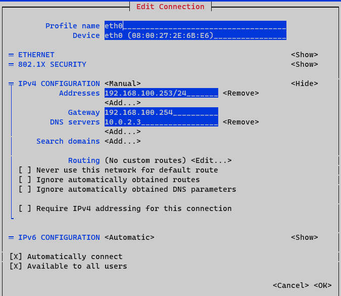
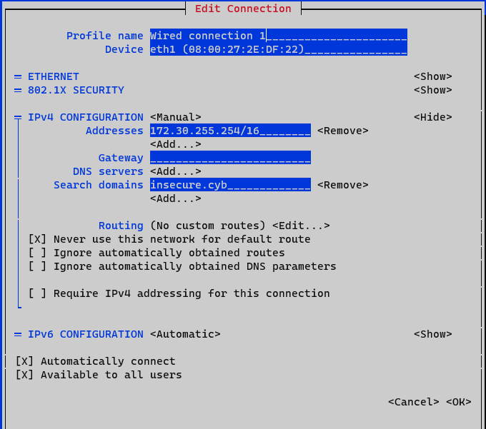
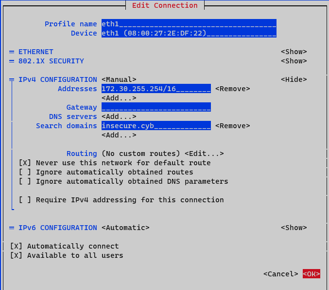
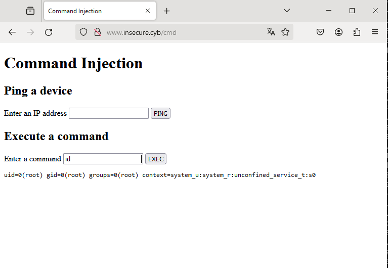

# companyrouter

## Lab 00: Lab environment Guidelines

`All virtual machines should be able to connect to each other`

```console
[vagrant@companyrouter ~]$ ping -c 5 -q 192.168.100.254 | grep trans
5 packets transmitted, 5 received, 0% packet loss, time 4056ms
[vagrant@companyrouter ~]$ ping -c 5 -q 172.30.0.4 | grep trans
5 packets transmitted, 5 received, 0% packet loss, time 4066ms
[vagrant@companyrouter ~]$ ping -c 5 -q 172.30.0.10 | grep trans
5 packets transmitted, 5 received, 0% packet loss, time 4090ms
[vagrant@companyrouter ~]$ ping -c 5 -q 172.30.0.15 | grep trans
5 packets transmitted, 5 received, 0% packet loss, time 4019ms
[vagrant@companyrouter ~]$ ping -c 5 -q 172.30.10.100 | grep trans
5 packets transmitted, 5 received, 0% packet loss, time 4090ms
[vagrant@companyrouter ~]$ ping -c 5 -q 172.30.10.101 | grep trans
5 packets transmitted, 5 received, 0% packet loss, time 4054ms
```

`Every virtual machine should have internet access`

```console
[vagrant@companyrouter ~]$ ping -c 5 -q 8.8.8.8 | grep trans
5 packets transmitted, 5 received, 0% packet loss, time 4008ms
[vagrant@companyrouter ~]$ ping -c 5 -q www.google.be | grep trans
5 packets transmitted, 5 received, 0% packet loss, time 4008ms
```

## Lab 01: Lecture 1 Exercises

`Connecting via ssh, host is on the same internal network`

```code
PS C:\data\git\CA> ssh vagrant@192.168.100.253
vagrant@192.168.100.253's password:
Last login: Wed Nov 29 07:59:33 2023 from 192.168.100.1
[vagrant@companyrouter ~]$
```

`What are we running ...`

```code
[vagrant@companyrouter ~]$ cat /etc/os-release
NAME="AlmaLinux"
VERSION="9.2 (Turquoise Kodkod)"
ID="almalinux"
ID_LIKE="rhel centos fedora"
VERSION_ID="9.2"
PLATFORM_ID="platform:el9"
PRETTY_NAME="AlmaLinux 9.2 (Turquoise Kodkod)"
ANSI_COLOR="0;34"
LOGO="fedora-logo-icon"
CPE_NAME="cpe:/o:almalinux:almalinux:9::baseos"
HOME_URL="https://almalinux.org/"
DOCUMENTATION_URL="https://wiki.almalinux.org/"
BUG_REPORT_URL="https://bugs.almalinux.org/"

ALMALINUX_MANTISBT_PROJECT="AlmaLinux-9"
ALMALINUX_MANTISBT_PROJECT_VERSION="9.2"
REDHAT_SUPPORT_PRODUCT="AlmaLinux"
REDHAT_SUPPORT_PRODUCT_VERSION="9.2"
[vagrant@companyrouter ~]$ uname -a
Linux companyrouter 5.14.0-284.11.1.el9_2.x86_64 #1 SMP PREEMPT_DYNAMIC Tue May 9 05:49:00 EDT 2023 x86_64 x86_64 x86_64 GNU/Linux
```

`Who else is here?`

```code
[vagrant@companyrouter ~]$ grep -vE 'false|nologin|sync|shutdown|halt' /etc/passwd
root:x:0:0:root:/root:/bin/bash
vagrant:x:1000:1000::/home/vagrant:/bin/bash
```

`Checking out the neighbourhood`

```code
[vagrant@companyrouter ~]$ ip -4 addr show | awk '/inet / {print $5, $2}' | grep -v '127.0.0.1'
scope 192.168.100.253/24
scope 172.30.255.254/16
[vagrant@companyrouter ~]$ ip r
default via 192.168.100.254 dev eth0 proto static metric 100
172.30.0.0/16 dev eth1 proto kernel scope link src 172.30.255.254 metric 101
192.168.100.0/24 dev eth0 proto kernel scope link src 192.168.100.253 metric 100
[vagrant@companyrouter ~]$ cat /etc/resolv.conf
# Generated by NetworkManager
search insecure.cyb
nameserver 10.0.2.3
[vagrant@companyrouter ~]$ ip neigh
172.30.0.4 dev eth1 lladdr 08:00:27:cc:a9:66 STALE
172.30.10.100 dev eth1 lladdr 08:00:27:b3:9d:75 STALE
172.30.0.10 dev eth1 lladdr 08:00:27:40:38:29 STALE
192.168.100.254 dev eth0 lladdr 08:00:27:e6:60:9c REACHABLE
192.168.100.1 dev eth0 lladdr 0a:00:27:00:00:1a REACHABLE
172.30.10.101 dev eth1 lladdr 08:00:27:40:38:29 STALE
172.30.0.15 dev eth1 lladdr 08:00:27:a3:98:d1 DELAY
```

```code
sudo nmtui
```





`Renamed this, I have a thing for NO spaces`



`Connectivity for companyrouter was allreasdy checked in Lab 00`

`The default route that was added is persistent since it is managed by Networkmanager:`

```code
[vagrant@companyrouter ~]$ sudo cat /etc/NetworkManager/system-connections/eth0.nmconnection
[connection]
id=eth0
uuid=cd1b691b-85b0-4a40-8c12-8f7ff2e8ce5f
type=ethernet
interface-name=eth0
timestamp=1701622827

[ethernet]

[ipv4]
address1=192.168.100.253/24,192.168.100.254
dns=10.0.2.3;
method=manual

[ipv6]
addr-gen-mode=eui64
method=auto

[proxy]
```

`Investigating the (cleaned up) history to learn what was installed...`

```code
[vagrant@companyrouter ~]$ cat ~/.bash_history
ip a
uname -a
cat /etc/os-release
sudo nmtui
sudo reboot
sudo nmtui
ip a
echo "net.ipv4.ip_forward=1" | sudo tee -a /etc/sysctl.conf
sudo sysctl -p
sudo dnf -y install dhcp-server
sudo vi /etc/dhcp/dhcpd.conf
sudo vi /etc/default/isc-dhcp-server
sudo systemctl enable --now dhcpd
sudo journalctl -u dhcpd
sudo vi /etc/default/isc-dhcp-server
sudo vi /etc/dhcp/dhcpd.conf
sudo systemctl enable --now dhcpd
systemctl status dhcpd
sudo ip route add default via 192.168.100.254
curl google.com
scp app.jar vagrant@172.30.0.10:
sudo poweroff
```

- `net.ipv4.ip_forward=1 allows the kernel to forward`
- `This router also serves dhcp with the following settings`

```code
[vagrant@companyrouter ~]$ sudo cat /etc/dhcp/dhcpd.conf
# dhcpd.conf
#
# Sample configuration file for ISC dhcpd
#

# option definitions common to all supported networks...
option domain-name "insecure.cyb";
option domain-name-servers 172.30.0.4;

default-lease-time 600;
max-lease-time 7200;

# Use this to enble / disable dynamic dns updates globally.
#ddns-update-style none;

# If this DHCP server is the official DHCP server for the local
# network, the authoritative directive should be uncommented.
authoritative;

# Use this to send dhcp log messages to a different log file (you also
# have to hack syslog.conf to complete the redirection).
log-facility local7;


subnet 172.30.0.0 netmask 255.255.0.0 {
  range 172.30.10.100 172.30.10.200;
  option routers 172.30.255.254;
}
```

`This is activated for eth 1`

```code
[vagrant@companyrouter ~]$ cat /etc/default/isc-dhcp-server
INTERFACES="eth1"
```

`And is running`

```code
[vagrant@companyrouter ~]$ systemctl status dhcpd
● dhcpd.service - DHCPv4 Server Daemon
     Loaded: loaded (/usr/lib/systemd/system/dhcpd.service; enabled; preset: disabled)
     Active: active (running) since Wed 2023-11-29 09:40:15 UTC; 6min ago
       Docs: man:dhcpd(8)
             man:dhcpd.conf(5)
   Main PID: 706 (dhcpd)
     Status: "Dispatching packets..."
      Tasks: 1 (limit: 12013)
     Memory: 6.5M
        CPU: 9ms
     CGroup: /system.slice/dhcpd.service
             └─706 /usr/sbin/dhcpd -f -cf /etc/dhcp/dhcpd.conf -user dhcpd -group dhcpd --no-pid
```

`It even gave out some leases (to win10 and web)`

```code
[vagrant@companyrouter ~]$ cat /var/lib/dhcpd/dhcpd.leases
# The format of this file is documented in the dhcpd.leases(5) manual page.
# This lease file was written by isc-dhcp-4.4.2b1

# authoring-byte-order entry is generated, DO NOT DELETE
authoring-byte-order little-endian;

lease 172.30.10.101 {
  starts 0 2023/12/03 17:01:35;
  ends 0 2023/12/03 17:11:35;
  tstp 0 2023/12/03 17:11:35;
  cltt 0 2023/12/03 17:01:35;
  binding state active;
  next binding state free;
  rewind binding state free;
  hardware ethernet 08:00:27:40:38:29;
  uid "\001\010\000'@8)";
  client-hostname "web";
}
lease 172.30.10.100 {
  starts 0 2023/12/03 17:01:46;
  ends 0 2023/12/03 17:11:46;
  tstp 0 2023/12/03 17:11:46;
  cltt 0 2023/12/03 17:01:46;
  binding state active;
  next binding state free;
  rewind binding state free;
  hardware ethernet 08:00:27:b3:9d:75;
  uid "\001\010\000'\263\235u";
  set vendor-class-identifier = "MSFT 5.0";
  client-hostname "win10";
}
server-duid "\000\001\000\001,\377o\374\010\000'.\337\"";

lease 172.30.10.101 {
  starts 0 2023/12/03 17:06:34;
  ends 0 2023/12/03 17:16:34;
  cltt 0 2023/12/03 17:06:34;
  binding state active;
  next binding state free;
  rewind binding state free;
  hardware ethernet 08:00:27:40:38:29;
  uid "\001\010\000'@8)";
  client-hostname "web";
}
lease 172.30.10.100 {
  starts 0 2023/12/03 17:06:45;
  ends 0 2023/12/03 17:16:45;
  cltt 0 2023/12/03 17:06:45;
  binding state active;
  next binding state free;
  rewind binding state free;
  hardware ethernet 08:00:27:b3:9d:75;
  uid "\001\010\000'\263\235u";
  set vendor-class-identifier = "MSFT 5.0";
  client-hostname "win10";
}
```

`Installing some utils. Before I turn 50 I'll take a vim tutorial, but for now I'm going for nano`

```code
[vagrant@companyrouter ~]$ sudo dnf install -yq nano bind-utils

Installed:
  bind-libs-32:9.16.23-14.el9_3.x86_64  bind-license-32:9.16.23-14.el9_3.noarch  bind-utils-32:9.16.23-14.el9_3.x86_64  fstrm-0.6.1-3.el9.x86_64  libmaxminddb-1.5.2-3.el9.x86_64  libuv-1:1.42.0-1.el9.x86_64
  nano-5.6.1-5.el9.x86_64               protobuf-c-1.3.3-13.el9.x86_64

```

***Install the `tcpdump` utility on the `companyrouter` and figure out a way to sniff traffic origination from the `win10` using tcpdump on the `companyrouter`.***

```code
[vagrant@companyrouter ~]$ which tcpdump
/usr/bin/which: no tcpdump in (/home/vagrant/.local/bin:/home/vagrant/bin:/usr/local/bin:/usr/bin:/usr/local/sbin:/usr/sbin)
[vagrant@companyrouter ~]$ sudo dnf install -y tcpdump
Last metadata expiration check: 0:22:42 ago on Wed Nov 22 14:28:24 2023.
Dependencies resolved.
=================================================================================================================================================================================================================
 Package                                         Architecture                                   Version                                                  Repository                                         Size
=================================================================================================================================================================================================================
Installing:
 tcpdump                                         x86_64                                         14:4.99.0-7.el9                                          appstream                                         542 k

Transaction Summary
=================================================================================================================================================================================================================
Install  1 Package

Total download size: 542 k
Installed size: 1.4 M
Downloading Packages:
tcpdump-4.99.0-7.el9.x86_64.rpm                                                                                                                                                   60 kB/s | 542 kB     00:09
-----------------------------------------------------------------------------------------------------------------------------------------------------------------------------------------------------------------
Total                                                                                                                                                                             28 kB/s | 542 kB     00:19
Running transaction check
Transaction check succeeded.
Running transaction test
Transaction test succeeded.
Running transaction
  Preparing        :                                                                                                                                                                                         1/1
  Running scriptlet: tcpdump-14:4.99.0-7.el9.x86_64                                                                                                                                                          1/1
  Installing       : tcpdump-14:4.99.0-7.el9.x86_64                                                                                                                                                          1/1
  Running scriptlet: tcpdump-14:4.99.0-7.el9.x86_64                                                                                                                                                          1/1
  Verifying        : tcpdump-14:4.99.0-7.el9.x86_64                                                                                                                                                          1/1

Installed:
  tcpdump-14:4.99.0-7.el9.x86_64

Complete!
[vagrant@companyrouter ~]$ tcpdump --version
tcpdump version 4.99.0
libpcap version 1.10.0 (with TPACKET_V3)
OpenSSL 3.0.7 1 Nov 2022

```


`installing some extra packages`

```code
[vagrant@companyrouter ~]$ sudo dnf install tmux -yq

Installed:
  tmux-3.2a-5.el9.x86_64

[vagrant@companyrouter ~]$ sudo dnf install -yq traceroute

Installed:
  traceroute-3:2.1.0-16.el9.x86_64

[vagrant@companyrouter ~]$ sudo dnf install -yq conntrack

Installed:
  conntrack-tools-1.4.7-2.el9.x86_64             libnetfilter_cthelper-1.0.0-22.el9.x86_64             libnetfilter_cttimeout-1.0.0-19.el9.x86_64             libnetfilter_queue-1.0.5-1.el9.x86_64

[vagrant@companyrouter ~]$ sudo dnf install -yq ipcalc

Installed:
  geolite2-city-20191217-6.el9.noarch                                    geolite2-country-20191217-6.el9.noarch                                    ipcalc-1.0.0-5.el9.x86_64


[vagrant@companyrouter ~]$ sudo dnf install -yq iperf3

Installed:
  iperf3-3.9-10.el9_2.alma.x86_64                                                                        lksctp-tools-1.0.19-2.el9.x86_64


```


```code
tcpdump
apt
dnf
dnf search tcpdump
tcpdump --version
which tcpdump
dnf install -y tcpdump
which tcpdump
sudo dnf install -y tcpdump
which tcpdump
tcpdump --version
tcpdump
sudo tcpdump
sudo tcpdump -c 10
ip -4 a
ip -a | grep mtu
ip -4 a | grep mt
sudo tcpdump -D
sudo tcpdump -D | grep running
sudo tcpdump -D | grep -i running
sudo tcpdump -i2
sudo tcpdump -i3
sudo tcpdump -i2
shutdown now
sudo shutdown now
exit
which tcpdump
sudo dnf install -y tcpdump
ip -4 a
ip r
cat /etc/resolv.conf
exit
ip -4 a
ipconfig
ip -4 q
ip -4 a
reboot
sudo reboot
ping 172.16.0.4
ping 172.16.0.10
ping 172.30.0.4
sudo poweroff
ping 172.30.100.1
ping 172.30.255.254
ip neigh show
sudo ss -tlnp
ip nei
cd
tcpdump
ip -4 a
tcpdump
sudo tcpdump
tcpdump
sudo tcpdump
sudo tcpdump -c 5
ip -a | grep mtu
ip -4 a | grep mtu
ip -4 a
ip -4 a | grep inet
sudo tcpdump -D
sudo tcpdump -i eth0
sudo tcpdump -i eth1
sudo tcpdump -i lo
sudo tcpdump -i eth1
sudo tcpdump -i eth1 host companyrouter
sudo tcpdump -i eth1
sudo tcpdump -i eth1 host _gateway
sudo tcpdump -i eth1 host "_gateway"
sudo tcpdump -i eth1 -host "_gateway"
sudo tcpdump -i eth1 -host '_gateway'
man tcpdump
cat /etc/host
cat /etc/hosts
ping dc
sudo nano /etc/hosts
sudo vi /etc/hosts
ping
ping dc
sudo tcpdump -i eth1
sudo tcpdump -i eth1 host dc
sudo tcpdump -i eth1
sudo tcpdump -i eth1 src host dc
sudo tcpdump -i eth1 src dst 172.30.0.4
sudo tcpdump -i eth1 src host dst 172.30.0.4
sudo tcpdump -i eth1 dst host 172.30.0.4
08:00:27:cc:a9:66
sudo tcpdump -i eth0 ether host 08:00:27:cc:a9:66
sudo tcpdump -i eth1 ether host 08:00:27:cc:a9:66
sudo tcpdump -i eth1 net 10.0.2.0 mask 255.255.255.0
sudo tcpdump -i eth1 net 10.0.2.2 mask 255.255.255.255
sudo tcpdump -i eth1 net 10.0.2.2 mask 255.255.255.255 -n
sudo tcpdump -i eth1 port 22 -n
sudo tcpdump -i eth1 -n port 22 -n
sudo tcpdump -i eth1 -n port 22
sudo tcpdump -i eth1 port 22 -n
sudo tcpdump -i eth1 -n port 22 -n
sudo tcpdump -i eth1 port -n 22
sudo tcpdump -i eth1 port 22
sudo tcpdump -i eth1 arp
sudo tcpdump -w /tmp/demo.pcap -c 25
ls /tmp/demo.pcap
ls -al /tmp/demo.pcap
cat /tmp/demo.pcap
tcpdump -r /tmp/demo.pcap
tcpdump -r /tmp/demo.pcap | wc -l
tcpdump -r /tmp/demo.pcap
tcpdump -r /tmp/demo.pcap -e
tcpdump -r /tmp/demo.pcap -XX
tcpdump -r /tmp/demo.pcap -xx
tcpdump -r /tmp/demo.pcap -c 1 -xx
tcpdump -r /tmp/demo.pcap -c 1 -XX
tcpdump -r /tmp/demo.pcap -c 1 -x
tcpdump -r /tmp/demo.pcap -c 1 -X
tcpdump -r /tmp/demo.pcap -c 1 -XX
tcpdump -r /tmp/demo.pcap -c 1 -xx
tcpdump -r /tmp/demo.pcap -c 1 -XXX
tcpdump -r /tmp/demo.pcap -c 1 -XXXX
tcpdump -r /tmp/demo.pcap -c 1 -X
tcpdump -r /tmp/demo.pcap -c 1 -x
tcpdump -r /tmp/demo.pcap -c 1 -xx
tcpdump -r /tmp/demo.pcap -c 1 -XX
tcpdump -r /tmp/demo.pcap -c 3
tcpdump -r /tmp/demo.pcap -c 3 -t
tcpdump -r /tmp/demo.pcap -c 3 -tt
tcpdump -r /tmp/demo.pcap -c 3 -ttt
tcpdump -r /tmp/demo.pcap -c 3
tcpdump -r /tmp/demo.pcap -c 3 -tttt
tcpdump -h
tcpdump -v
tcpdump --version
sudo tcpdump -i eth1
sudo tcpdump -i eth1 -s96
sudo tcpdump -i eth1 -s32
sudo tcpdump -i eth1
sudo tcpdump -i eth1 -s 32
sudo tcpdump -i eth1 -s0
sudo tcpdump -i eth1 host 172.30.0.4
sudo tcpdump -i eth1 host 172.30.0.4 -n
sudo tcpdump -i eth1 host -n 172.30.0.4 -n
sudo tcpdump -i eth1 -n
sudo tcpdump -i eth1 -n tcp and dst port 22 -t
sudo tcpdump -i eth1 -n tcp and port 22 -t
sudo tcpdump -i eth1 -n tcp or port 22 -t

sudo tcpdump -i eth1 -n tcp and dst port 22 -t -S
sudo tcpdump -i eth1 port 53 -n
sudo tcpdump -i eth1 dst net "10.0.2.0/24"
sudo tcpdump -i eth1 dst net "10.0.2.0/24" and ip7
sudo tcpdump -i eth1 dst net "10.0.2.0/24" and ip6
sudo tcpdump -i eth1 dst net "10.0.2.0/24" or ip6
ping6 ::1
fg
sudo tcpdump -i eth1 "tcp[tcpflags] & tcp-rst !=0"
sudo tcpdump -i eth1 "tcp[tcpflags] & tcp-syn !=0"
sudo tcpdump -i eth1 "tcp[tcpflags] & tcp-ack !=0"
sudo tcpdump
sudo tcpdump -q
sudo tcpdump -q not host 192.168.100.1
sudo poweroff
ls
ping 172.30.10.100
curl http://172.30.0.10
curl http://172.30.0.10/
curl http://172.30.0.10/cmd
curl http://172.30.10.101
exit
ping www.google.be
tcpdump -i eth1 host 172.30.0.4 host 172.30.10.100
sudo tcpdump -i eth1 host 172.30.0.4 host 172.30.10.100
sudo tcpdump -i eth1 host 172.30.0.4
sudo tcpdump -i eth1 host 172.30.10.100
sudo tcpdump -i eth1 icmp host 172.30.10.100
sudo tcpdump -i eth1 icmp and host 172.30.10.100
sudo tcpdump -i eth1 icmp
sudo tcpdump -i eth1 icmp and arp
sudo tcpdump -i eth1 icmp or arp
sudo tcpdump -i eth1
ping 192.168.100.1
ssh benny@192.168.100.1
sudo tcpdump -i eth1 -w /tmp/lab01.pcap
sudo tcpdump -i eth1 -w /tmp/lab01.pcap -v
sudo tcpdump -i eth1 -v -w /tmp/lab01.pcap
sudo rm /tmp/lab01.pcap
sudo tcpdump -i eth1 -w /tmp/lab01.pcap -v
tcpdump -r /tmp/lab01.pcap
echo scp your_file.txt username@windows_machine_ip:/path/on/windows
scp /tmp/lab01.pcap benny@192.168.100.1:/c/data/git/ca/files
scp /tmp/lab01.pcap benny@192.168.100.1:/c:/data/git/ca/files
sudo tcpdump -i eth1
sudo tcpdump -i eth1 not ssh
sudo tcpdump -i eth1 port not ssh
sudo tcpdump -i eth1 port ssh
sudo tcpdump -i eth1 port 22
sudo tcpdump -i eth1 port not ssh
sudo tcpdump -i eth1 http
sudo tcpdump -i eth1 port http
sudo tcpdump -i eth1 port 8000
sudo tcpdump -i eth1 port 8000 -n
sudo tcpdump -i eth1 -n port 8000 -n
sudo tcpdump -i eth1 -n port 8000 -n and src host 172.30.0.10
sudo tcpdump -i eth1 -n port 8000 -n and "(src host 172.30.0.10 or src dst host 172.30.0.10)"
sudo tcpdump -i eth1 -n port 8000 and "(src host 172.30.0.10 or src dst host 172.30.0.10)"
sudo tcpdump -i eth1 -n port 8000 and '(src host 172.30.0.10 or src dst host 172.30.0.10)'
sudo tcpdump -i eth1 -n "port 8000 and (src host 172.30.0.10 or src dst host 172.30.0.10)"
sudo tcpdump -i eth1 -n "host 172.30.0.10 and (port 80 or port 443)"
sudo tcpdump -i eth1 -n "port 8000 and (src host 172.30.0.10 or dst host 172.30.0.10)"
sudo tcpdump -i eth1 -n "port 8000 and (src host 172.30.0.10 or dst host 172.30.0.10)" -n
sudo tcpdump -i eth1 -n "(port 8000 or port 80) and (src host 172.30.0.10 or dst host 172.30.0.10)" -n
sudo tcpdump -i eth1 -n "(port 8000 or port 80)" -n
sudo tcpdump -i eth1 -n "(port 8000)" -n
sudo ss -tlnp
sudo vim /etc/dhcp/dhcpd.conf
sudo vi /etc/dhcp/dhcpd.conf
sudo cat /etc/default/isc-dhcp-server
cat /var/lib/dhcpd/dhcpd.leases
sudo vi /etc/dhcp/dhcpd.conf
cat /etc/resolv.conf
sudo vi /etc/dhcp/dhcpd.conf
ping www
nslookup www
cat /etc/resolv.conf
cat /etc/networks
cat /etc/netconfig
ip
sudo systemctl status NetworkManager
cat /etc/NetworkManager/
cat /etc/NetworkManager/dnsmasq
cat /etc/NetworkManager/dnsmasq*
cat /etc/NetworkManager/dnsmasq.d/
cat /etc/NetworkManager/dnsmasq.d/*
ls /etc/NetworkManager/dnsmasq.d/*
ls /etc/NetworkManager/dnsmasq.d/
ls /etc/NetworkManager/NetworkManager.conf
cat /etc/NetworkManager/NetworkManager.conf
cat /etc/NetworkManager/conf.d/
ls /etc/NetworkManager/conf.d/
ls /etc/NetworkManager/dispatcher.d/
ls /etc/NetworkManager/system-connections/
ls /etc/NetworkManager/system-connections/eth0.nmconnection
cat /etc/NetworkManager/system-connections/eth0.nmconnection
sudo cat /etc/NetworkManager/system-connections/eth0.nmconnection
sudo cat /etc/NetworkManager/system-connections/Wired\ connection\ 1.nmconnection
ip -6 a
sud shutdown now
sudo shutdown now
exit
ip -4 a
exit
```

## Lab 03: Lecture 3 Exercises

## Lab 04: Lecture 4 Exercises

`installing suticata following https://docs.suricata.io/en/suricata-6.0.2/install.html`

```code
[walt@companyrouter ~]$ sudo dnf install -yq epel-release yum-plugin-copr

Installed:
  dnf-plugins-core-4.3.0-11.el9_3.alma.1.noarch                                                                    epel-release-9-5.el9.noarch

[walt@companyrouter ~]$ sudo dnf copr enable @oisf/suricata-6.0
Enabling a Copr repository. Please note that this repository is not part
of the main distribution, and quality may vary.

The Fedora Project does not exercise any power over the contents of
this repository beyond the rules outlined in the Copr FAQ at
<https://docs.pagure.org/copr.copr/user_documentation.html#what-i-can-build-in-copr>,
and packages are not held to any quality or security level.

Please do not file bug reports about these packages in Fedora
Bugzilla. In case of problems, contact the owner of this repository.

Do you really want to enable copr.fedorainfracloud.org/@oisf/suricata-6.0? [y/N]: y
Repository successfully enabled.
[walt@companyrouter ~]$ sudo dnf install -yq suricata

Installed:
  hiredis-1.0.2-1.el9.x86_64                hyperscan-5.4.1-2.el9.x86_64       libnet-1.2-6.el9.x86_64         nspr-4.35.0-3.el9_2.x86_64      nss-3.90.0-3.el9_2.x86_64  nss-softokn-3.90.0-3.el9_2.x86_64
  nss-softokn-freebl-3.90.0-3.el9_2.x86_64  nss-sysinit-3.90.0-3.el9_2.x86_64  nss-util-3.90.0-3.el9_2.x86_64  suricata-1:6.0.15-1.el9.x86_64

Complete!
```

```code
[walt@companyrouter ~]$ sudo suricata-update
30/12/2023 -- 20:28:29 - <Info> -- Using data-directory /var/lib/suricata.
30/12/2023 -- 20:28:29 - <Info> -- Using Suricata configuration /etc/suricata/suricata.yaml
30/12/2023 -- 20:28:29 - <Info> -- Using /usr/share/suricata/rules for Suricata provided rules.
30/12/2023 -- 20:28:29 - <Info> -- Found Suricata version 6.0.15 at /sbin/suricata.
30/12/2023 -- 20:28:29 - <Info> -- Loading /etc/suricata/suricata.yaml
30/12/2023 -- 20:28:29 - <Info> -- Disabling rules for protocol http2
30/12/2023 -- 20:28:29 - <Info> -- Disabling rules for protocol modbus
30/12/2023 -- 20:28:29 - <Info> -- Disabling rules for protocol dnp3
30/12/2023 -- 20:28:29 - <Info> -- Disabling rules for protocol enip
30/12/2023 -- 20:28:29 - <Info> -- No sources configured, will use Emerging Threats Open
30/12/2023 -- 20:28:29 - <Info> -- Fetching https://rules.emergingthreats.net/open/suricata-6.0.15/emerging.rules.tar.gz.
 100% - 4183328/4183328
30/12/2023 -- 20:28:31 - <Info> -- Done.
30/12/2023 -- 20:28:31 - <Info> -- Loading distribution rule file /usr/share/suricata/rules/app-layer-events.rules
30/12/2023 -- 20:28:31 - <Info> -- Loading distribution rule file /usr/share/suricata/rules/decoder-events.rules
30/12/2023 -- 20:28:31 - <Info> -- Loading distribution rule file /usr/share/suricata/rules/dhcp-events.rules
30/12/2023 -- 20:28:31 - <Info> -- Loading distribution rule file /usr/share/suricata/rules/dnp3-events.rules
30/12/2023 -- 20:28:31 - <Info> -- Loading distribution rule file /usr/share/suricata/rules/dns-events.rules
30/12/2023 -- 20:28:31 - <Info> -- Loading distribution rule file /usr/share/suricata/rules/files.rules
30/12/2023 -- 20:28:31 - <Info> -- Loading distribution rule file /usr/share/suricata/rules/http-events.rules
30/12/2023 -- 20:28:31 - <Info> -- Loading distribution rule file /usr/share/suricata/rules/ipsec-events.rules
30/12/2023 -- 20:28:31 - <Info> -- Loading distribution rule file /usr/share/suricata/rules/kerberos-events.rules
30/12/2023 -- 20:28:31 - <Info> -- Loading distribution rule file /usr/share/suricata/rules/modbus-events.rules
30/12/2023 -- 20:28:31 - <Info> -- Loading distribution rule file /usr/share/suricata/rules/nfs-events.rules
30/12/2023 -- 20:28:31 - <Info> -- Loading distribution rule file /usr/share/suricata/rules/ntp-events.rules
30/12/2023 -- 20:28:31 - <Info> -- Loading distribution rule file /usr/share/suricata/rules/smb-events.rules
30/12/2023 -- 20:28:31 - <Info> -- Loading distribution rule file /usr/share/suricata/rules/smtp-events.rules
30/12/2023 -- 20:28:31 - <Info> -- Loading distribution rule file /usr/share/suricata/rules/stream-events.rules
30/12/2023 -- 20:28:31 - <Info> -- Loading distribution rule file /usr/share/suricata/rules/tls-events.rules
30/12/2023 -- 20:28:31 - <Info> -- Ignoring file rules/emerging-deleted.rules
30/12/2023 -- 20:28:32 - <Info> -- Loaded 46494 rules.
30/12/2023 -- 20:28:32 - <Info> -- Disabled 14 rules.
30/12/2023 -- 20:28:32 - <Info> -- Enabled 0 rules.
30/12/2023 -- 20:28:32 - <Info> -- Modified 0 rules.
30/12/2023 -- 20:28:32 - <Info> -- Dropped 0 rules.
30/12/2023 -- 20:28:33 - <Info> -- Enabled 133 rules for flowbit dependencies.
30/12/2023 -- 20:28:33 - <Info> -- Creating directory /var/lib/suricata/rules.
30/12/2023 -- 20:28:33 - <Info> -- Backing up current rules.
30/12/2023 -- 20:28:33 - <Info> -- Writing rules to /var/lib/suricata/rules/suricata.rules: total: 46494; enabled: 35980; added: 46494; removed 0; modified: 0
30/12/2023 -- 20:28:33 - <Info> -- Writing /var/lib/suricata/rules/classification.config
30/12/2023 -- 20:28:33 - <Info> -- Testing with suricata -T.
30/12/2023 -- 20:28:48 - <Info> -- Done.
```

```code
[walt@companyrouter ~]$ sudo suricata -T -c /etc/suricata/suricata.yaml -v
3/1/2024 -- 15:35:42 - <Info> - Running suricata under test mode
3/1/2024 -- 15:35:42 - <Notice> - This is Suricata version 6.0.15 RELEASE running in SYSTEM mode
3/1/2024 -- 15:35:42 - <Info> - CPUs/cores online: 1
3/1/2024 -- 15:35:42 - <Info> - Setting engine mode to IDS mode by default
3/1/2024 -- 15:35:42 - <Info> - master exception-policy set to: auto
3/1/2024 -- 15:35:42 - <Info> - fast output device (regular) initialized: fast.log
3/1/2024 -- 15:35:42 - <Info> - eve-log output device (regular) initialized: eve.json
3/1/2024 -- 15:35:42 - <Info> - http-log output device (regular) initialized: http.log
3/1/2024 -- 15:35:42 - <Info> - stats output device (regular) initialized: stats.log
3/1/2024 -- 15:35:48 - <Info> - 2 rule files processed. 36007 rules successfully loaded, 0 rules failed
3/1/2024 -- 15:35:48 - <Info> - Threshold config parsed: 0 rule(s) found
3/1/2024 -- 15:35:48 - <Info> - 36010 signatures processed. 1253 are IP-only rules, 5342 are inspecting packet payload, 29205 inspect application layer, 108 are decoder event only
3/1/2024 -- 15:35:56 - <Notice> - Configuration provided was successfully loaded. Exiting.
3/1/2024 -- 15:35:56 - <Info> - cleaning up signature grouping structure... complete
```

`starting the service`

```code
[walt@companyrouter ~]$ sudo systemctl start suricata
[walt@companyrouter ~]$ sudo systemctl status suricata
● suricata.service - Suricata Intrusion Detection Service
     Loaded: loaded (/usr/lib/systemd/system/suricata.service; disabled; preset: disabled)
     Active: active (running) since Wed 2024-01-03 15:36:22 UTC; 7s ago
       Docs: man:suricata(1)
    Process: 1461 ExecStartPre=/bin/rm -f /var/run/suricata.pid (code=exited, status=0/SUCCESS)
   Main PID: 1462 (Suricata-Main)
      Tasks: 1 (limit: 24482)
     Memory: 378.4M
        CPU: 7.694s
     CGroup: /system.slice/suricata.service
             └─1462 /sbin/suricata -c /etc/suricata/suricata.yaml --pidfile /var/run/suricata.pid -i eth0 --user suricata

Jan 03 15:36:22 companyrouter systemd[1]: Starting Suricata Intrusion Detection Service...
Jan 03 15:36:22 companyrouter systemd[1]: Started Suricata Intrusion Detection Service.
Jan 03 15:36:22 companyrouter suricata[1462]: 3/1/2024 -- 15:36:22 - <Notice> - This is Suricata version 6.0.15 RELEASE running in SYSTEM mode

[walt@companyrouter ~]$ sudo ls -al /var/lib/suricata/rules
total 26904
drwxr-s---. 2 root     suricata       57 Dec 30 21:00 .
drwxrws---. 4 suricata suricata       33 Dec 30 20:28 ..
-rw-r--r--. 1 root     suricata     3228 Dec 30 21:00 classification.config
-rw-r--r--. 1 root     suricata 27545448 Dec 30 21:00 suricata.rules
[walt@companyrouter ~]$ curl http://testmynids.org/uid/index.html
uid=0(root) gid=0(root) groups=0(root)

[walt@companyrouter ~]$ sudo cat /var/log/suricata/fast.log
12/30/2023-21:20:27.415279  [**] [1:2100498:7] GPL ATTACK_RESPONSE id check returned root [**] [Classification: Potentially Bad Traffic] [Priority: 2] {TCP} 13.227.219.86:80 -> 192.168.100.253:39602

```



```code
[walt@companyrouter ~]$ sudo tail -2 /var/log/suricata/fast.log
01/03/2024-15:54:56.440238  [**] [1:2019284:3] ET ATTACK_RESPONSE Output of id command from HTTP server [**] [Classification: Potentially Bad Traffic] [Priority: 2] {TCP} 172.30.20.10:80 -> 192.168.100.1:30210
01/03/2024-15:54:56.440238  [**] [1:2100498:7] GPL ATTACK_RESPONSE id check returned root [**] [Classification: Potentially Bad Traffic] [Priority: 2] {TCP} 172.30.20.10:80 -> 192.168.100.1:30210
```


[walt@companyrouter ~]$ sudo suricata-update list-sources
30/12/2023 -- 20:31:43 - <Info> -- Using data-directory /var/lib/suricata.
30/12/2023 -- 20:31:43 - <Info> -- Using Suricata configuration /etc/suricata/suricata.yaml
30/12/2023 -- 20:31:43 - <Info> -- Using /usr/share/suricata/rules for Suricata provided rules.
30/12/2023 -- 20:31:43 - <Info> -- Found Suricata version 6.0.15 at /sbin/suricata.
30/12/2023 -- 20:31:43 - <Info> -- No source index found, running update-sources
30/12/2023 -- 20:31:43 - <Info> -- Downloading https://www.openinfosecfoundation.org/rules/index.yaml
30/12/2023 -- 20:31:43 - <Info> -- Adding all sources
30/12/2023 -- 20:31:43 - <Info> -- Saved /var/lib/suricata/update/cache/index.yaml
Name: et/open
  Vendor: Proofpoint
  Summary: Emerging Threats Open Ruleset
  License: MIT
Name: et/pro
  Vendor: Proofpoint
  Summary: Emerging Threats Pro Ruleset
  License: Commercial
  Replaces: et/open
  Parameters: secret-code
  Subscription: https://www.proofpoint.com/us/threat-insight/et-pro-ruleset
Name: oisf/trafficid
  Vendor: OISF
  Summary: Suricata Traffic ID ruleset
  License: MIT
Name: scwx/enhanced
  Vendor: Secureworks
  Summary: Secureworks suricata-enhanced ruleset
  License: Commercial
  Parameters: secret-code
  Subscription: https://www.secureworks.com/contact/ (Please reference CTU Countermeasures)
Name: scwx/malware
  Vendor: Secureworks
  Summary: Secureworks suricata-malware ruleset
  License: Commercial
  Parameters: secret-code
  Subscription: https://www.secureworks.com/contact/ (Please reference CTU Countermeasures)
Name: scwx/security
  Vendor: Secureworks
  Summary: Secureworks suricata-security ruleset
  License: Commercial
  Parameters: secret-code
  Subscription: https://www.secureworks.com/contact/ (Please reference CTU Countermeasures)
Name: sslbl/ssl-fp-blacklist
  Vendor: Abuse.ch
  Summary: Abuse.ch SSL Blacklist
  License: Non-Commercial
Name: sslbl/ja3-fingerprints
  Vendor: Abuse.ch
  Summary: Abuse.ch Suricata JA3 Fingerprint Ruleset
  License: Non-Commercial
Name: etnetera/aggressive
  Vendor: Etnetera a.s.
  Summary: Etnetera aggressive IP blacklist
  License: MIT
Name: tgreen/hunting
  Vendor: tgreen
  Summary: Threat hunting rules
  License: GPLv3
Name: malsilo/win-malware
  Vendor: malsilo
  Summary: Commodity malware rules
  License: MIT
Name: stamus/lateral
  Vendor: Stamus Networks
  Summary: Lateral movement rules
  License: GPL-3.0-only


[walt@companyrouter ~]$ sudo suricata-update enable-source et/open
30/12/2023 -- 20:34:28 - <Info> -- Using data-directory /var/lib/suricata.
30/12/2023 -- 20:34:28 - <Info> -- Using Suricata configuration /etc/suricata/suricata.yaml
30/12/2023 -- 20:34:28 - <Info> -- Using /usr/share/suricata/rules for Suricata provided rules.
30/12/2023 -- 20:34:28 - <Info> -- Found Suricata version 6.0.15 at /sbin/suricata.
30/12/2023 -- 20:34:28 - <Info> -- Creating directory /var/lib/suricata/update/sources
30/12/2023 -- 20:34:28 - <Info> -- Source et/open enabled
[walt@companyrouter ~]$ sudo suricata-update
30/12/2023 -- 20:34:36 - <Info> -- Using data-directory /var/lib/suricata.
30/12/2023 -- 20:34:36 - <Info> -- Using Suricata configuration /etc/suricata/suricata.yaml
30/12/2023 -- 20:34:36 - <Info> -- Using /usr/share/suricata/rules for Suricata provided rules.
30/12/2023 -- 20:34:36 - <Info> -- Found Suricata version 6.0.15 at /sbin/suricata.
30/12/2023 -- 20:34:36 - <Info> -- Loading /etc/suricata/suricata.yaml
30/12/2023 -- 20:34:36 - <Info> -- Disabling rules for protocol http2
30/12/2023 -- 20:34:36 - <Info> -- Disabling rules for protocol modbus
30/12/2023 -- 20:34:36 - <Info> -- Disabling rules for protocol dnp3
30/12/2023 -- 20:34:36 - <Info> -- Disabling rules for protocol enip
30/12/2023 -- 20:34:36 - <Info> -- Last download less than 15 minutes ago. Not downloading https://rules.emergingthreats.net/open/suricata-6.0.15/emerging.rules.tar.gz.
30/12/2023 -- 20:34:36 - <Info> -- Loading distribution rule file /usr/share/suricata/rules/app-layer-events.rules
30/12/2023 -- 20:34:36 - <Info> -- Loading distribution rule file /usr/share/suricata/rules/decoder-events.rules
30/12/2023 -- 20:34:36 - <Info> -- Loading distribution rule file /usr/share/suricata/rules/dhcp-events.rules
30/12/2023 -- 20:34:36 - <Info> -- Loading distribution rule file /usr/share/suricata/rules/dnp3-events.rules
30/12/2023 -- 20:34:36 - <Info> -- Loading distribution rule file /usr/share/suricata/rules/dns-events.rules
30/12/2023 -- 20:34:36 - <Info> -- Loading distribution rule file /usr/share/suricata/rules/files.rules
30/12/2023 -- 20:34:36 - <Info> -- Loading distribution rule file /usr/share/suricata/rules/http-events.rules
30/12/2023 -- 20:34:36 - <Info> -- Loading distribution rule file /usr/share/suricata/rules/ipsec-events.rules
30/12/2023 -- 20:34:36 - <Info> -- Loading distribution rule file /usr/share/suricata/rules/kerberos-events.rules
30/12/2023 -- 20:34:36 - <Info> -- Loading distribution rule file /usr/share/suricata/rules/modbus-events.rules
30/12/2023 -- 20:34:36 - <Info> -- Loading distribution rule file /usr/share/suricata/rules/nfs-events.rules
30/12/2023 -- 20:34:36 - <Info> -- Loading distribution rule file /usr/share/suricata/rules/ntp-events.rules
30/12/2023 -- 20:34:36 - <Info> -- Loading distribution rule file /usr/share/suricata/rules/smb-events.rules
30/12/2023 -- 20:34:36 - <Info> -- Loading distribution rule file /usr/share/suricata/rules/smtp-events.rules
30/12/2023 -- 20:34:36 - <Info> -- Loading distribution rule file /usr/share/suricata/rules/stream-events.rules
30/12/2023 -- 20:34:36 - <Info> -- Loading distribution rule file /usr/share/suricata/rules/tls-events.rules
30/12/2023 -- 20:34:36 - <Info> -- Ignoring file rules/emerging-deleted.rules
30/12/2023 -- 20:34:37 - <Info> -- Loaded 46494 rules.
30/12/2023 -- 20:34:37 - <Info> -- Disabled 14 rules.
30/12/2023 -- 20:34:37 - <Info> -- Enabled 0 rules.
30/12/2023 -- 20:34:37 - <Info> -- Modified 0 rules.
30/12/2023 -- 20:34:37 - <Info> -- Dropped 0 rules.
30/12/2023 -- 20:34:38 - <Info> -- Enabled 133 rules for flowbit dependencies.
30/12/2023 -- 20:34:38 - <Info> -- Backing up current rules.
30/12/2023 -- 20:34:39 - <Info> -- Writing rules to /var/lib/suricata/rules/suricata.rules: total: 46494; enabled: 35980; added: 0; removed 0; modified: 0
30/12/2023 -- 20:34:39 - <Info> -- Writing /var/lib/suricata/rules/classification.config
30/12/2023 -- 20:34:39 - <Info> -- No changes detected, exiting.


`starting the service`

```code

[walt@companyrouter ~]$ sudo systemctl start suricata
[walt@companyrouter ~]$ sudo systemctl status suricata
● suricata.service - Suricata Intrusion Detection Service
     Loaded: loaded (/usr/lib/systemd/system/suricata.service; disabled; preset: disabled)
     Active: active (running) since Sat 2023-12-30 20:48:48 UTC; 6s ago
       Docs: man:suricata(1)
    Process: 1732 ExecStartPre=/bin/rm -f /var/run/suricata.pid (code=exited, status=0/SUCCESS)
   Main PID: 1733 (Suricata-Main)
      Tasks: 1 (limit: 24482)
     Memory: 227.9M
        CPU: 6.584s
     CGroup: /system.slice/suricata.service
             └─1733 /sbin/suricata -c /etc/suricata/suricata.yaml --pidfile /var/run/suricata.pid -i eth0 --user suricata

Dec 30 20:48:48 companyrouter systemd[1]: Starting Suricata Intrusion Detection Service...
Dec 30 20:48:48 companyrouter systemd[1]: Started Suricata Intrusion Detection Service.
Dec 30 20:48:48 companyrouter suricata[1733]: 30/12/2023 -- 20:48:48 - <Notice> - This is Suricata version 6.0.15 RELEASE running in SYSTEM mode
Dec 30 20:48:48 companyrouter suricata[1733]: 30/12/2023 -- 20:48:48 - <Error> - [ERRCODE: SC_ERR_FOPEN(44)] - Error opening file: "/var/log/suricata//fast.log": Permission denied
Dec 30 20:48:48 companyrouter suricata[1733]: 30/12/2023 -- 20:48:48 - <Warning> - [ERRCODE: SC_ERR_INVALID_ARGUMENT(13)] - output module "fast": setup failed
Dec 30 20:48:48 companyrouter suricata[1733]: 30/12/2023 -- 20:48:48 - <Error> - [ERRCODE: SC_ERR_FOPEN(44)] - Error opening file: "/var/log/suricata//eve.json": Permission denied
Dec 30 20:48:48 companyrouter suricata[1733]: 30/12/2023 -- 20:48:48 - <Warning> - [ERRCODE: SC_ERR_INVALID_ARGUMENT(13)] - output module "eve-log": setup failed
Dec 30 20:48:48 companyrouter suricata[1733]: 30/12/2023 -- 20:48:48 - <Error> - [ERRCODE: SC_ERR_FOPEN(44)] - Error opening file: "/var/log/suricata//stats.log": Permission denied
Dec 30 20:48:48 companyrouter suricata[1733]: 30/12/2023 -- 20:48:48 - <Warning> - [ERRCODE: SC_ERR_INVALID_ARGUMENT(13)] - output module "stats": setup failed

[walt@companyrouter ~]$ sudo ls -al /var/log/suricata/
total 12
drwxr-x---. 2 suricata suricata   75 Dec 30 20:37 .
drwxr-xr-x. 7 root     root     4096 Dec 30 20:00 ..
-rw-r--r--. 1 root     root        0 Dec 30 20:37 eve.json
-rw-r--r--. 1 root     root        0 Dec 30 20:37 fast.log
-rw-r--r--. 1 root     root        0 Dec 30 20:37 stats.log
-rw-r--r--. 1 suricata suricata 8068 Dec 30 20:52 suricata.log
[walt@companyrouter ~]$ ps -auwx | grep suricata
suricata    1769 23.7 10.4 805776 418536 ?       Ssl  20:52   0:15 /sbin/suricata -c /etc/suricata/suricata.yaml --pidfile /var/run/suricata.pid -i eth0 --user suricata
walt        1786  0.0  0.0   3876  2024 pts/0    S+   20:53   0:00 grep --color=auto suricata
[walt@companyrouter ~]$ sudo chown -R suricata:suricata /var/log/suricata/

```

reboot


[walt@companyrouter ~]$ sudo systemctl status suricata
● suricata.service - Suricata Intrusion Detection Service
     Loaded: loaded (/usr/lib/systemd/system/suricata.service; disabled; preset: disabled)
     Active: active (running) since Sat 2023-12-30 21:16:00 UTC; 3s ago
       Docs: man:suricata(1)
    Process: 1298 ExecStartPre=/bin/rm -f /var/run/suricata.pid (code=exited, status=0/SUCCESS)
   Main PID: 1299 (Suricata-Main)
      Tasks: 1 (limit: 24482)
     Memory: 167.0M
        CPU: 3.637s
     CGroup: /system.slice/suricata.service
             └─1299 /sbin/suricata -c /etc/suricata/suricata.yaml --pidfile /var/run/suricata.pid -i eth0 --user suricata

Dec 30 21:16:00 companyrouter systemd[1]: Starting Suricata Intrusion Detection Service...
Dec 30 21:16:00 companyrouter systemd[1]: Started Suricata Intrusion Detection Service.
Dec 30 21:16:00 companyrouter suricata[1299]: 30/12/2023 -- 21:16:00 - <Notice> - This is Suricata version 6.0.15 RELEASE running in SYSTEM mode


[walt@companyrouter ~]$ sudo ls -al /var/lib/suricata/rules
total 26904
drwxr-s---. 2 root     suricata       57 Dec 30 21:00 .
drwxrws---. 4 suricata suricata       33 Dec 30 20:28 ..
-rw-r--r--. 1 root     suricata     3228 Dec 30 21:00 classification.config
-rw-r--r--. 1 root     suricata 27545448 Dec 30 21:00 suricata.rules


[walt@companyrouter ~]$ curl http://testmynids.org/uid/index.html
uid=0(root) gid=0(root) groups=0(root)

[walt@companyrouter ~]$ sudo cat /var/log/suricata/fast.log
12/30/2023-21:20:27.415279  [**] [1:2100498:7] GPL ATTACK_RESPONSE id check returned root [**] [Classification: Potentially Bad Traffic] [Priority: 2] {TCP} 13.227.219.86:80 -> 192.168.100.253:39602


[walt@companyrouter ~]$ sudo suricata-update enable-source oisf/trafficid
30/12/2023 -- 21:35:48 - <Info> -- Using data-directory /var/lib/suricata.
30/12/2023 -- 21:35:48 - <Info> -- Using Suricata configuration /etc/suricata/suricata.yaml
30/12/2023 -- 21:35:48 - <Info> -- Using /usr/share/suricata/rules for Suricata provided rules.
30/12/2023 -- 21:35:48 - <Info> -- Found Suricata version 6.0.15 at /sbin/suricata.
30/12/2023 -- 21:35:48 - <Info> -- Source oisf/trafficid enabled
[walt@companyrouter ~]$ sudo suricata-update enable-source stamus/lateral
30/12/2023 -- 21:36:08 - <Info> -- Using data-directory /var/lib/suricata.
30/12/2023 -- 21:36:08 - <Info> -- Using Suricata configuration /etc/suricata/suricata.yaml
30/12/2023 -- 21:36:08 - <Info> -- Using /usr/share/suricata/rules for Suricata provided rules.
30/12/2023 -- 21:36:08 - <Info> -- Found Suricata version 6.0.15 at /sbin/suricata.
30/12/2023 -- 21:36:08 - <Info> -- Source stamus/lateral enabled
[walt@companyrouter ~]$ sudo suricata-update enable-source tgreen/hunting
30/12/2023 -- 21:36:15 - <Info> -- Using data-directory /var/lib/suricata.
30/12/2023 -- 21:36:15 - <Info> -- Using Suricata configuration /etc/suricata/suricata.yaml
30/12/2023 -- 21:36:15 - <Info> -- Using /usr/share/suricata/rules for Suricata provided rules.
30/12/2023 -- 21:36:15 - <Info> -- Found Suricata version 6.0.15 at /sbin/suricata.
30/12/2023 -- 21:36:15 - <Info> -- Source tgreen/hunting enabled
[walt@companyrouter ~]$ sudo suricata-update
30/12/2023 -- 21:36:19 - <Info> -- Using data-directory /var/lib/suricata.
30/12/2023 -- 21:36:19 - <Info> -- Using Suricata configuration /etc/suricata/suricata.yaml
30/12/2023 -- 21:36:19 - <Info> -- Using /usr/share/suricata/rules for Suricata provided rules.
30/12/2023 -- 21:36:19 - <Info> -- Found Suricata version 6.0.15 at /sbin/suricata.
30/12/2023 -- 21:36:19 - <Info> -- Loading /etc/suricata/suricata.yaml
30/12/2023 -- 21:36:19 - <Info> -- Disabling rules for protocol http2
30/12/2023 -- 21:36:19 - <Info> -- Disabling rules for protocol modbus
30/12/2023 -- 21:36:19 - <Info> -- Disabling rules for protocol dnp3
30/12/2023 -- 21:36:19 - <Info> -- Disabling rules for protocol enip
30/12/2023 -- 21:36:19 - <Info> -- Fetching https://ti.stamus-networks.io/open/stamus-lateral-rules.tar.gz.
 100% - 28430/28430
30/12/2023 -- 21:36:19 - <Info> -- Done.
30/12/2023 -- 21:36:19 - <Info> -- Fetching https://raw.githubusercontent.com/travisbgreen/hunting-rules/master/hunting.rules.
 100% - 77035/77035
30/12/2023 -- 21:36:20 - <Info> -- Done.
30/12/2023 -- 21:36:20 - <Info> -- Fetching https://openinfosecfoundation.org/rules/trafficid/trafficid.rules.
 100% - 9855/9855
30/12/2023 -- 21:36:20 - <Info> -- Done.
30/12/2023 -- 21:36:20 - <Info> -- Checking https://rules.emergingthreats.net/open/suricata-6.0.15/emerging.rules.tar.gz.md5.
30/12/2023 -- 21:36:21 - <Info> -- Remote checksum has not changed. Not fetching.
30/12/2023 -- 21:36:21 - <Info> -- Loading distribution rule file /usr/share/suricata/rules/app-layer-events.rules
30/12/2023 -- 21:36:21 - <Info> -- Loading distribution rule file /usr/share/suricata/rules/decoder-events.rules
30/12/2023 -- 21:36:21 - <Info> -- Loading distribution rule file /usr/share/suricata/rules/dhcp-events.rules
30/12/2023 -- 21:36:21 - <Info> -- Loading distribution rule file /usr/share/suricata/rules/dnp3-events.rules
30/12/2023 -- 21:36:21 - <Info> -- Loading distribution rule file /usr/share/suricata/rules/dns-events.rules
30/12/2023 -- 21:36:21 - <Info> -- Loading distribution rule file /usr/share/suricata/rules/files.rules
30/12/2023 -- 21:36:21 - <Info> -- Loading distribution rule file /usr/share/suricata/rules/http-events.rules
30/12/2023 -- 21:36:21 - <Info> -- Loading distribution rule file /usr/share/suricata/rules/ipsec-events.rules
30/12/2023 -- 21:36:21 - <Info> -- Loading distribution rule file /usr/share/suricata/rules/kerberos-events.rules
30/12/2023 -- 21:36:21 - <Info> -- Loading distribution rule file /usr/share/suricata/rules/modbus-events.rules
30/12/2023 -- 21:36:21 - <Info> -- Loading distribution rule file /usr/share/suricata/rules/nfs-events.rules
30/12/2023 -- 21:36:21 - <Info> -- Loading distribution rule file /usr/share/suricata/rules/ntp-events.rules
30/12/2023 -- 21:36:21 - <Info> -- Loading distribution rule file /usr/share/suricata/rules/smb-events.rules
30/12/2023 -- 21:36:21 - <Info> -- Loading distribution rule file /usr/share/suricata/rules/smtp-events.rules
30/12/2023 -- 21:36:21 - <Info> -- Loading distribution rule file /usr/share/suricata/rules/stream-events.rules
30/12/2023 -- 21:36:21 - <Info> -- Loading distribution rule file /usr/share/suricata/rules/tls-events.rules
30/12/2023 -- 21:36:21 - <Info> -- Ignoring file rules/emerging-deleted.rules
30/12/2023 -- 21:36:23 - <Info> -- Loaded 47286 rules.
30/12/2023 -- 21:36:24 - <Info> -- Disabled 14 rules.
30/12/2023 -- 21:36:24 - <Info> -- Enabled 0 rules.
30/12/2023 -- 21:36:24 - <Info> -- Modified 0 rules.
30/12/2023 -- 21:36:24 - <Info> -- Dropped 0 rules.
30/12/2023 -- 21:36:24 - <Info> -- Enabled 133 rules for flowbit dependencies.
30/12/2023 -- 21:36:24 - <Info> -- Backing up current rules.
30/12/2023 -- 21:36:27 - <Info> -- Writing rules to /var/lib/suricata/rules/suricata.rules: total: 47286; enabled: 36731; added: 792; removed 0; modified: 0
30/12/2023 -- 21:36:28 - <Info> -- Writing /var/lib/suricata/rules/classification.config
30/12/2023 -- 21:36:28 - <Info> -- Testing with suricata -T.
30/12/2023 -- 21:36:55 - <Info> -- Done.
[walt@companyrouter ~]$


## Lab 05: Lecture 5 Exercises

## Lab 06: Lecture 6 No class - Catch-up

## Lab 07: Lecture 7 BorgBackup

## Lab 08: Lecture 8 No class - Catch-up

## Lab 09: Lecture 9 Wazuh

## Lab 10: Lecture 10 IPsec

## Lab 11: Lecture 11 - OpenVPN

## Lab 12: Lecture 12 - Hunting and hardening with ansible
