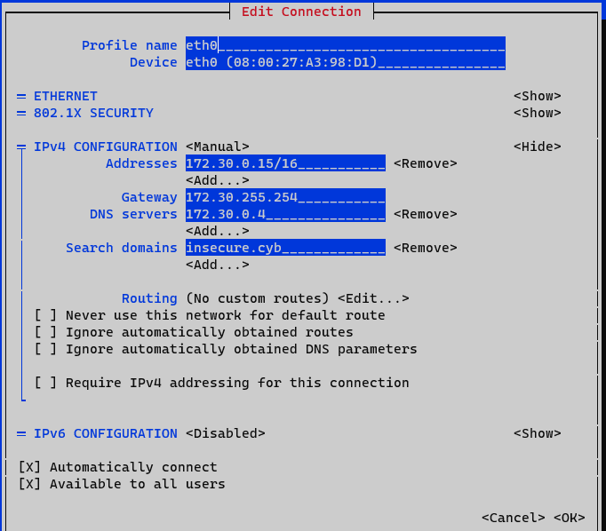

# db

## Lab 00: Lab environment Guidelines

`All virtual machines should be able to connect to each other`

```console
[vagrant@database ~]$ ping -c 5 -q 172.30.0.4 | grep trans
5 packets transmitted, 5 received, 0% packet loss, time 4106ms
[vagrant@database ~]$ ping -c 5 -q 172.30.0.10 | grep trans
5 packets transmitted, 5 received, 0% packet loss, time 4109ms
[vagrant@database ~]$ ping -c 5 -q 172.30.255.254 | grep trans
5 packets transmitted, 5 received, 0% packet loss, time 4121ms
[vagrant@database ~]$ ping -c 5 -q 172.30.10.100 | grep trans
5 packets transmitted, 5 received, 0% packet loss, time 4077ms
[vagrant@database ~]$ ping -c 5 -q 192.168.100.253 | grep trans
5 packets transmitted, 5 received, 0% packet loss, time 4071ms
[vagrant@database ~]$ ping -c 5 -q 192.168.100.254 | grep trans
5 packets transmitted, 5 received, 0% packet loss, time 4127ms
```

`Every virtual machine should have internet access`

```console
[vagrant@database ~]$ ping -c 5 -q 8.8.8.8 | grep trans
5 packets transmitted, 5 received, 0% packet loss, time 4006ms
[vagrant@database ~]$ ping -c 5 -q www.google.be | grep trans
5 packets transmitted, 5 received, 0% packet loss, time 4006ms
```

## Lab 01: Lecture 1 Exercises

`Connecting from companyrouter to have the benefits of ssh`

```code
[vagrant@companyrouter ~]$ ssh vagrant@172.30.0.15
The authenticity of host '172.30.0.15 (172.30.0.15)' can't be established.
ED25519 key fingerprint is SHA256:0DWHYG8LGaH3HKqFFxbHs6Ipnr2aYrjIoyT1t1a3Qfc.
This key is not known by any other names
Are you sure you want to continue connecting (yes/no/[fingerprint])? yes
Warning: Permanently added '172.30.0.15' (ED25519) to the list of known hosts.
vagrant@172.30.0.15's password:
Last login: Wed Sep 20 15:12:00 2023
```

`What are we running ...`

```code
[vagrant@database ~]$ cat /etc/os-release
NAME="AlmaLinux"
VERSION="9.2 (Turquoise Kodkod)"
ID="almalinux"
ID_LIKE="rhel centos fedora"
VERSION_ID="9.2"
PLATFORM_ID="platform:el9"
PRETTY_NAME="AlmaLinux 9.2 (Turquoise Kodkod)"
ANSI_COLOR="0;34"
LOGO="fedora-logo-icon"
CPE_NAME="cpe:/o:almalinux:almalinux:9::baseos"
HOME_URL="https://almalinux.org/"
DOCUMENTATION_URL="https://wiki.almalinux.org/"
BUG_REPORT_URL="https://bugs.almalinux.org/"

ALMALINUX_MANTISBT_PROJECT="AlmaLinux-9"
ALMALINUX_MANTISBT_PROJECT_VERSION="9.2"
REDHAT_SUPPORT_PRODUCT="AlmaLinux"
REDHAT_SUPPORT_PRODUCT_VERSION="9.2"
[vagrant@database ~]$ uname -a
Linux database 5.14.0-284.30.1.el9_2.x86_64 #1 SMP PREEMPT_DYNAMIC Tue Sep 12 09:28:32 EDT 2023 x86_64 x86_64 x86_64 GNU/Linux
```

`Who else is here?`

```code
[vagrant@database ~]$ grep -vE 'false|nologin|sync|shutdown|halt' /etc/passwd
root:x:0:0:root:/root:/bin/bash
vagrant:x:1000:1000::/home/vagrant:/bin/bash
```

`Checking out the neighbourhood`

```code
[vagrant@database ~]$ ip -4 a
1: lo: <LOOPBACK,UP,LOWER_UP> mtu 65536 qdisc noqueue state UNKNOWN group default qlen 1000
    inet 127.0.0.1/8 scope host lo
       valid_lft forever preferred_lft forever
2: eth0: <BROADCAST,MULTICAST,UP,LOWER_UP> mtu 1500 qdisc fq_codel state UP group default qlen 1000
    altname enp0s3
    inet 172.30.0.15/16 brd 172.30.255.255 scope global noprefixroute eth0
       valid_lft forever preferred_lft forever
```

```code
[vagrant@database ~]$ ip r
default via 172.30.255.254 dev eth0 proto static metric 100
172.30.0.0/16 dev eth0 proto kernel scope link src 172.30.0.15 metric 100
```

```code
[vagrant@database ~]$ cat /etc/resolv.conf
# Generated by NetworkManager
search insecure.cyb
nameserver 172.30.0.4
```

```code
[vagrant@database ~]$ ip neigh
172.30.255.254 dev eth0 lladdr 08:00:27:2e:df:22 REACHABLE
172.30.0.4 dev eth0 lladdr 08:00:27:cc:a9:66 STALE
```

```code
[vagrant@database ~]$ sudo nmtui
```



`Connectivity was allready checked in Lab 00`

`Is dns working?`

```console
[vagrant@database ~]$ ping -c5 www
PING www.insecure.cyb (172.30.0.10) 56(84) bytes of data.
64 bytes from 172.30.0.10 (172.30.0.10): icmp_seq=1 ttl=64 time=0.286 ms
64 bytes from 172.30.0.10 (172.30.0.10): icmp_seq=2 ttl=64 time=0.686 ms
64 bytes from 172.30.0.10 (172.30.0.10): icmp_seq=3 ttl=64 time=0.511 ms
64 bytes from 172.30.0.10 (172.30.0.10): icmp_seq=4 ttl=64 time=0.672 ms
64 bytes from 172.30.0.10 (172.30.0.10): icmp_seq=5 ttl=64 time=0.854 ms

--- www.insecure.cyb ping statistics ---
5 packets transmitted, 5 received, 0% packet loss, time 4004ms
rtt min/avg/max/mdev = 0.286/0.601/0.854/0.191 ms
```

`Investigating the history to learn what was installed...`

```code
[vagrant@database ~]$ cat ~/.bash_history
sudo dnf update
sudo dnf install -y mysql mysql-server
sudo systemctl enable mysqld
sudo systemctl start mysqld
mysql_secure_installation
mysql -u root -p
sudo vi /etc/my.cnf.d/mysql-server.cnf
sudo systemctl restart mysqld
sudo poweroff
sudo nmtui
sudo reboot
ip a
systemctl status mysqld
mysql -u root -p
exit
sudo poweroff
```

`Sockets`

```code
[vagrant@database ~]$ sudo ss -tlnp
State             Recv-Q            Send-Q                         Local Address:Port                          Peer Address:Port            Process
LISTEN            0                 4096                                 0.0.0.0:3306                               0.0.0.0:*                users:(("mysqld",pid=767,fd=23))
LISTEN            0                 128                                  0.0.0.0:22                                 0.0.0.0:*                users:(("sshd",pid=678,fd=3))
LISTEN            0                 4096                                 0.0.0.0:111                                0.0.0.0:*                users:(("rpcbind",pid=632,fd=4),("systemd",pid=1,fd=31))
LISTEN            0                 70                                         *:33060                                    *:*                users:(("mysqld",pid=767,fd=21))
LISTEN            0                 128                                     [::]:22                                    [::]:*                users:(("sshd",pid=678,fd=4))
LISTEN            0                 4096                                    [::]:111                                   [::]:*                users:(("rpcbind",pid=632,fd=6),("systemd",pid=1,fd=34))
```

`Mysql-server running?`

```code
[vagrant@database ~]$ systemctl status mysqld
● mysqld.service - MySQL 8.0 database server
     Loaded: loaded (/usr/lib/systemd/system/mysqld.service; enabled; preset: disabled)
     Active: active (running) since Tue 2023-11-28 17:28:14 UTC; 9min ago
    Process: 677 ExecStartPre=/usr/libexec/mysql-check-socket (code=exited, status=0/SUCCESS)
    Process: 712 ExecStartPre=/usr/libexec/mysql-prepare-db-dir mysqld.service (code=exited, status=0/SUCCESS)
   Main PID: 767 (mysqld)
     Status: "Server is operational"
      Tasks: 38 (limit: 5483)
     Memory: 447.6M
        CPU: 3.001s
     CGroup: /system.slice/mysqld.service
             └─767 /usr/libexec/mysqld --basedir=/usr
```

`With what configurations?`

```code
[vagrant@database ~]$ cat /etc/my.cnf.d/mysql-server.cnf
#
# This group are read by MySQL server.
# Use it for options that only the server (but not clients) should see
#
# For advice on how to change settings please see
# http://dev.mysql.com/doc/refman/en/server-configuration-defaults.html

# Settings user and group are ignored when systemd is used.
# If you need to run mysqld under a different user or group,
# customize your systemd unit file for mysqld according to the
# instructions in http://fedoraproject.org/wiki/Systemd

[mysqld]
datadir=/var/lib/mysql
socket=/var/lib/mysql/mysql.sock
log-error=/var/log/mysql/mysqld.log
pid-file=/run/mysqld/mysqld.pid
bind-address = 0.0.0.0
max_connections = 100000
max_connect_errors = 10000
```

`Let's try root/root (unsafe on the cli for the sake of this report)`

```code
[vagrant@database ~]$ mysql -u root -proot
mysql: [Warning] Using a password on the command line interface can be insecure.
ERROR 1045 (28000): Access denied for user 'root'@'localhost' (using password: YES)
```

`Or the credentials i found investigating index.php on the web vm`

```code
[vagrant@database ~]$ mysql -usammy -pFLAG-741852
mysql: [Warning] Using a password on the command line interface can be insecure.
Welcome to the MySQL monitor.  Commands end with ; or \g.
Your MySQL connection id is 15
Server version: 8.0.32 Source distribution

Copyright (c) 2000, 2023, Oracle and/or its affiliates.

Oracle is a registered trademark of Oracle Corporation and/or its
affiliates. Other names may be trademarks of their respective
owners.

Type 'help;' or '\h' for help. Type '\c' to clear the current input statement.

mysql>
```

`Firewall`

```code
[vagrant@database ~]$ getenforce
Enforcing
[vagrant@database ~]$ sudo systemctl status firewalld
○ firewalld.service - firewalld - dynamic firewall daemon
     Loaded: loaded (/usr/lib/systemd/system/firewalld.service; disabled; preset: enabled)
     Active: inactive (dead)
       Docs: man:firewalld(1)
```

<!-- TODO: make networkconfig for database after lab 01 -->

## Lab 02: Lecture 2 Exercises


[vagrant@database ~]$ nc -w1 -vz 172.30.20.254 22
-bash: nc: command not found
[vagrant@database ~]$ sudo dnf install -yq nmap

Installed:
  nmap-3:7.92-1.el9.x86_64                                                                             nmap-ncat-3:7.92-1.el9.x86_64

[vagrant@database ~]$ sudo dnf install -yq iperf3

Installed:
  iperf3-3.9-10.el9_2.alma.x86_64                                                                        lksctp-tools-1.0.19-2.el9.x86_64


## Lab 03: Lecture 3 Exercises

`to check if the uplink to the internet is through the companyrouter`

```code
[vagrant@database ~]$ sudo dnf install -yq traceroute

Installed:
  traceroute-3:2.1.0-16.el9.x86_64

```

`mind you: firewall needs finetuning to allow outgoing traffic for dnf`

`to check if the dc is used as the DNS server`

```code
[vagrant@database ~]$ sudo dnf install -yq bind-utils

Installed:
  bind-libs-32:9.16.23-14.el9_3.x86_64  bind-license-32:9.16.23-14.el9_3.noarch  bind-utils-32:9.16.23-14.el9_3.x86_64  fstrm-0.6.1-3.el9.x86_64  libmaxminddb-1.5.2-3.el9.x86_64  libuv-1:1.42.0-1.el9.x86_64
  protobuf-c-1.3.3-13.el9.x86_64
```

## Lab 04: Lecture 4 Exercises

## Lab 05: Lecture 5 Exercises

## Lab 06: Lecture 6 No class - Catch-up

`Nothing to do`

## Lab 07: Lecture 7 BorgBackup

## Lab 08: Lecture 8 No class - Catch-up

`Nothing to do`

## Lab 09: Lecture 9 Wazuh

## Lab 10: Lecture 10 IPsec

## Lab 11: Lecture 11 - OpenVPN

## Lab 12: Lecture 12 - Hunting and hardening with ansible

