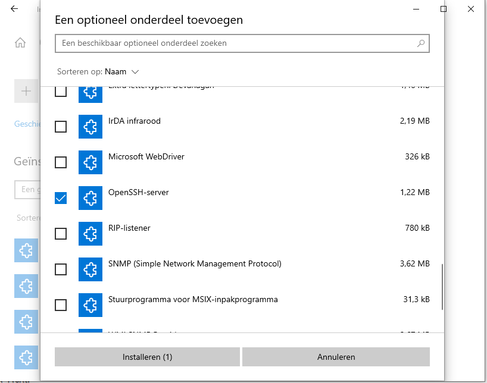

# FLAB2021

## Lab 00: Lab environment Guidelines

`Connection between host (FLAB2021) and virtual hosts`

```code
PS C:\data\git\CA> ping 192.168.100.253

Pinging 192.168.100.253 with 32 bytes of data:
Reply from 192.168.100.253: bytes=32 time<1ms TTL=64
Reply from 192.168.100.253: bytes=32 time<1ms TTL=64
Reply from 192.168.100.253: bytes=32 time<1ms TTL=64
Reply from 192.168.100.253: bytes=32 time<1ms TTL=64

Ping statistics for 192.168.100.253:
    Packets: Sent = 4, Received = 4, Lost = 0 (0% loss),
Approximate round trip times in milli-seconds:
    Minimum = 0ms, Maximum = 0ms, Average = 0ms
PS C:\data\git\CA> ping 192.168.100.254

Pinging 192.168.100.254 with 32 bytes of data:
Reply from 192.168.100.254: bytes=32 time<1ms TTL=64
Reply from 192.168.100.254: bytes=32 time<1ms TTL=64
Reply from 192.168.100.254: bytes=32 time<1ms TTL=64
Reply from 192.168.100.254: bytes=32 time<1ms TTL=64

Ping statistics for 192.168.100.254:
    Packets: Sent = 4, Received = 4, Lost = 0 (0% loss),
Approximate round trip times in milli-seconds:
    Minimum = 0ms, Maximum = 0ms, Average = 0ms
PS C:\Users\Benny> ping 172.30.0.4

Pinging 172.30.0.4 with 32 bytes of data:
PING: transmit failed. General failure.
PING: transmit failed. General failure.
PING: transmit failed. General failure.
PING: transmit failed. General failure.

Ping statistics for 172.30.0.4:
    Packets: Sent = 4, Received = 0, Lost = 4 (100% loss),
```

`To be able to reach the company network, a (permanent) route had to be added`

```code
PS C:\data\git\CA> route -p add 172.30.0.0 mask 255.255.0.0 192.168.100.253
 OK!
PS C:\data\git\CA> route print
===========================================================================

...

===========================================================================
Persistent Routes:
  Network Address          Netmask  Gateway Address  Metric
       172.30.0.0      255.255.0.0  192.168.100.253       1
===========================================================================

...

PS C:\Users\Benny> ping 172.30.0.4

Pinging 172.30.0.4 with 32 bytes of data:
Reply from 192.168.0.196: Destination host unreachable.
Reply from 172.30.0.4: bytes=32 time=28ms TTL=55
Reply from 172.30.0.4: bytes=32 time=34ms TTL=55
Reply from 172.30.0.4: bytes=32 time=27ms TTL=55

Ping statistics for 172.30.0.4:
    Packets: Sent = 4, Received = 4, Lost = 0 (0% loss),
Approximate round trip times in milli-seconds:
    Minimum = 27ms, Maximum = 34ms, Average = 29ms
PS C:\data\git\CA> ping 172.30.0.10
Pinging 172.30.0.10 with 32 bytes of data:
Reply from 172.30.0.10: bytes=32 time<1ms TTL=63
Reply from 172.30.0.10: bytes=32 time<1ms TTL=63
Reply from 172.30.0.10: bytes=32 time<1ms TTL=63
Reply from 172.30.0.10: bytes=32 time<1ms TTL=63

Ping statistics for 172.30.0.10:
    Packets: Sent = 4, Received = 4, Lost = 0 (0% loss),
Approximate round trip times in milli-seconds:
    Minimum = 0ms, Maximum = 0ms, Average = 0ms
PS C:\data\git\CA> ping 172.30.0.15

Pinging 172.30.0.15 with 32 bytes of data:
Reply from 172.30.0.15: bytes=32 time<1ms TTL=63
Reply from 172.30.0.15: bytes=32 time<1ms TTL=63
Reply from 172.30.0.15: bytes=32 time<1ms TTL=63
Reply from 172.30.0.15: bytes=32 time<1ms TTL=63

Ping statistics for 172.30.0.15:
    Packets: Sent = 4, Received = 4, Lost = 0 (0% loss),
Approximate round trip times in milli-seconds:
    Minimum = 0ms, Maximum = 0ms, Average = 0ms
Pinging 172.30.10.100 with 32 bytes of data:
Reply from 172.30.10.100: bytes=32 time<1ms TTL=127
Reply from 172.30.10.100: bytes=32 time<1ms TTL=127
Reply from 172.30.10.100: bytes=32 time<1ms TTL=127
Reply from 172.30.10.100: bytes=32 time<1ms TTL=127

Ping statistics for 172.30.10.100:
    Packets: Sent = 4, Received = 4, Lost = 0 (0% loss),
Approximate round trip times in milli-seconds:
    Minimum = 0ms, Maximum = 0ms, Average = 0ms
```

## Lab 01: Lecture 1 Exercises

`In order to connect more easily to the virtual machines in all labs, some modifications to FLAB2021`

```code
PS C:\data\git\CA> cat C:\Windows\System32\drivers\etc\hosts
# Copyright (c) 1993-2009 Microsoft Corp.
#
# This is a sample HOSTS file used by Microsoft TCP/IP for Windows.
#
# This file contains the mappings of IP addresses to host names. Each
# entry should be kept on an individual line. The IP address should
# be placed in the first column followed by the corresponding host name.
# The IP address and the host name should be separated by at least one
# space.
#
# Additionally, comments (such as these) may be inserted on individual
# lines or following the machine name denoted by a '#' symbol.
#
# For example:
#
#      102.54.94.97     rhino.acme.com          # source server
#       38.25.63.10     x.acme.com              # x client host
192.168.0.209 sma

# localhost name resolution is handled within DNS itself.
#       127.0.0.1       localhost
#       ::1             localhost

# cybersecurity advanced 2023-2024
192.168.100.253 companyrouter
192.168.100.254 isprouter
172.30.0.4 dc
172.30.0.10 web
172.30.0.15 database
172.30.10.100 win10
```

`Copying files from virtual machines to host made possible by installing the openSSH server on FLAB2021`



```code
C:\windows\system32>sc query sshd

SERVICE_NAME: sshd
        TYPE               : 10  WIN32_OWN_PROCESS
        STATE              : 1  STOPPED
        WIN32_EXIT_CODE    : 1077  (0x435)
        SERVICE_EXIT_CODE  : 0  (0x0)
        CHECKPOINT         : 0x0
        WAIT_HINT          : 0x0

C:\windows\system32>sc start sshd

SERVICE_NAME: sshd
        TYPE               : 10  WIN32_OWN_PROCESS
        STATE              : 2  START_PENDING
                                (NOT_STOPPABLE, NOT_PAUSABLE, IGNORES_SHUTDOWN)
        WIN32_EXIT_CODE    : 0  (0x0)
        SERVICE_EXIT_CODE  : 0  (0x0)
        CHECKPOINT         : 0x1
        WAIT_HINT          : 0x12c
        PID                : 8240
        FLAGS              :

C:\windows\system32>sc query sshd

SERVICE_NAME: sshd
        TYPE               : 10  WIN32_OWN_PROCESS
        STATE              : 4  RUNNING
                                (STOPPABLE, NOT_PAUSABLE, IGNORES_SHUTDOWN)
        WIN32_EXIT_CODE    : 0  (0x0)
        SERVICE_EXIT_CODE  : 0  (0x0)
        CHECKPOINT         : 0x0
        WAIT_HINT          : 0x0
```

`Verification in powershell`

```code
PS C:\data\git\CA> Get-Service -Name sshd

Status   Name               DisplayName
------   ----               -----------
Running  sshd               OpenSSH SSH Server
```


192.168.100.166 red
192.168.100.66 kali
172.30.0.10 www.insecure.cyb
172.30.0.10 insecure.cyb


## Lab 02: Lecture 2 Exercises

`Since the ipv4 adresses changed, /etc/hosts needs to be adjusted`

```code
PS C:\data\git\ca> cat C:\Windows\System32\drivers\etc\hosts
# cybersecurity advanced 2023-2024
192.168.100.253 companyrouter
192.168.100.254 isprouter
192.168.100.166 red
192.168.100.66 kali
172.30.0.4 dc
172.30.20.10 web
172.30.20.10 www.insecure.cyb
172.30.20.10 insecure.cyb
172.30.0.15 database
172.30.10.100 win10
```

## Lab 03: Lecture 3 Exercises

## Lab 04: Lecture 4 Exercises

## Lab 05: Lecture 5 Exercises

## Lab 06: Lecture 6 No class - Catch-up

`Nothing to do`

## Lab 07: Lecture 7 BorgBackup

## Lab 08: Lecture 8 No class - Catch-up

`Nothing to do`

## Lab 09: Lecture 9 Wazuh

## Lab 10: Lecture 10 IPsec

## Lab 11: Lecture 11 - OpenVPN

## Lab 12: Lecture 12 - Hunting and hardening with ansible
