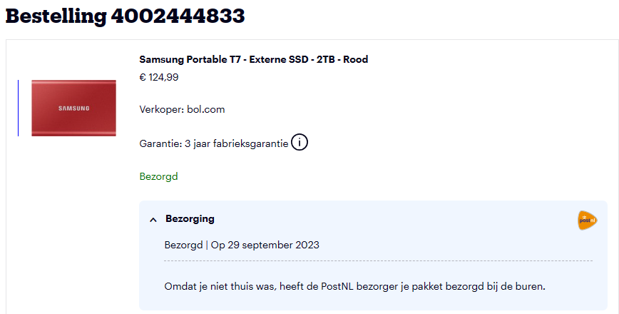
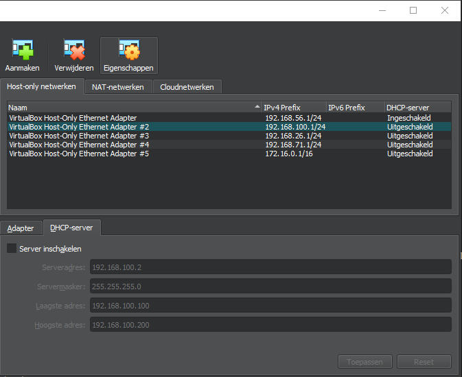
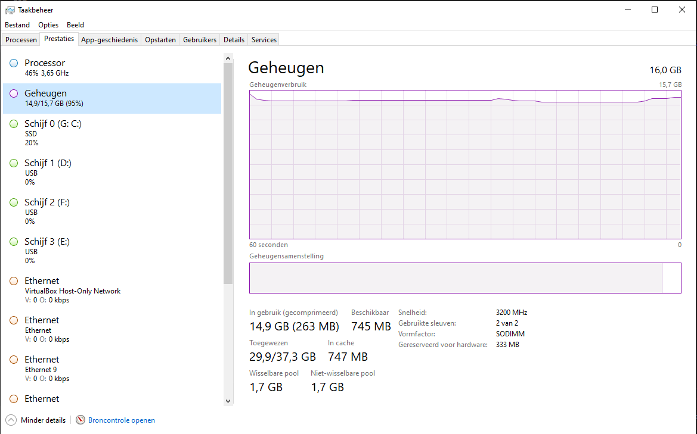
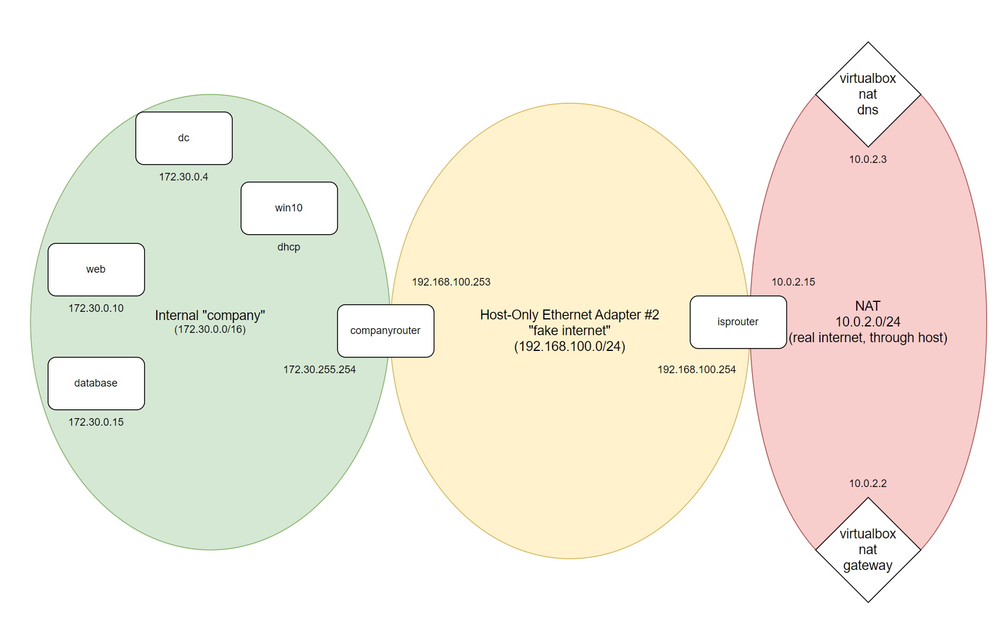

# CSA - Lab environment Guidelines

## Requirements

- ***VirtualBox*** `Check`
- ***At least 50GB free disk space*** `Check`
- ***At least 16GB of memory*** `Check`

## Tip: External SSD connected over USB-C

***People underestimate the power and use of an external SSD from for example the Samsung T7 family. It is a pretty compact disk that can be used as storage but when used in combination with the USB-C adapter (so USB-C from and to the disk and your pc) it can actually run a few virtual machines perfectly. This way you don’t have to give up disk space on your internal drives. We do NOT suggest to run the entire environment on an external disk but one or two (Linux) virtual machines should be fine. Example url: <https://www.bol.com/nl/nl/s/?searchtext=samsung+externe+ssd+t7>***



`Check`

## Downloading the virtual machines

***Start of by downloading the virtual machines on this link: <https://filesender.belnet.be/?s=download&token=91b974d4-dbbf-459e-8c03-03e7349c99df>. This link will expire pretty soon (a limitation of belnet). Double check your disk space before unzipping. The extracted folder with the .ova files will take op +/- 21GB. `Save this zip and all your virtual machines on a location that is not synching with a cloud service like Dropbox or Onedrive!`***

***To verify a succesful download you can issue the PowerShell command:***

***`Get-FileHash .\csa_environment.7z -algorithm md5`***

***it should show: DD58E28D44E5FD9DD82FA93B151DE731***

```console
PS D:\DATA\DOWNLOADS> Get-FileHash .\csa_environment.7z -algorithm md5

Algorithm       Hash                                                                   Path
---------       ----                                                                   ----
MD5             DD58E28D44E5FD9DD82FA93B151DE731                                       D:\DATA\DOWNLOADS\csa_environment.7z
```

`Check`

***The extracted .ova files have the following hashes:***

***`Get-FileHash .\csa_environment\* -algorithm md5`***

```code
Algorithm       Hash                                  Path
---------       ----                                  ----
MD5             45D93F9FE9BCDD88570AB138A904F6DE      companyrouter.ova
MD5             80E139A9B398FB260FA246869EE5476C      database.ova
MD5             BB84D079FF76C38D305407F6BA577B5D      dc.ova
MD5             AFB654F71B0233AE1940D1E682CD0969      isprouter.ova
MD5             A0C00098B9FEEF33215920DD08E6AE87      web.ova
MD5             95EA8C0F51CE8B701622C44A09836FC2      win10.ova
```

```console
PS D:\DATA\UNZIPPED> Get-FileHash .\csa_environment\* -algorithm md5

Algorithm       Hash                                                                   Path
---------       ----                                                                   ----
MD5             45D93F9FE9BCDD88570AB138A904F6DE                                       D:\DATA\UNZIPPED\csa_environment\companyrouter.ova
MD5             80E139A9B398FB260FA246869EE5476C                                       D:\DATA\UNZIPPED\csa_environment\database.ova
MD5             BB84D079FF76C38D305407F6BA577B5D                                       D:\DATA\UNZIPPED\csa_environment\dc.ova
MD5             AFB654F71B0233AE1940D1E682CD0969                                       D:\DATA\UNZIPPED\csa_environment\isprouter.ova
MD5             A0C00098B9FEEF33215920DD08E6AE87                                       D:\DATA\UNZIPPED\csa_environment\web.ova
MD5             95EA8C0F51CE8B701622C44A09836FC2                                       D:\DATA\UNZIPPED\csa_environment\win10.ova
```

`Check`

## Prepare your VirtualBox environment

***Please run the following vboxmanage command (in a prompt as administrator) to create a new host-only adapter (Change the location if needed, depending on where you installed VirtualBox).***

***`& 'C:\Program Files\Oracle\VirtualBox\VBoxManage.exe' hostonlyif create`***

```console
PS D:\DATA\DOWNLOADS> get-command VBoxManage.exe

CommandType     Name                                               Version    Source
-----------     ----                                               -------    ------
Application     VBoxManage.exe                                     7.0.6.5176 C:\Program Files\Oracle\VirtualBox\VBoxManage.exe

PS D:\DATA\DOWNLOADS> VBoxManage hostonlyif create
0%...10%...20%...30%...40%...50%...60%...70%...80%...90%...100%
Interface 'VirtualBox Host-Only Ethernet Adapter #2' was successfully created
```

***Use the GUI (close down virtualbox and restart if necessary) and verify the new host-only adapter is created. `Make sure`:***

- ***DHCP is `disabled`***
- ***The range is 192.168.100.0/`24`***
- ***Leave the default (the first one) host only adapter as is (typically 192.168.56.0/24)***



```console
PS C:\windows\system32> VBoxManage list hostonlyifs

Name:            VirtualBox Host-Only Ethernet Adapter #2
GUID:            f6efdc8e-df8d-4446-925b-9ff584954f82
DHCP:            Disabled
IPAddress:       192.168.100.1
NetworkMask:     255.255.255.0
IPV6Address:     fe80::3d4f:831e:41ed:bd42
IPV6NetworkMaskPrefixLength: 64
HardwareAddress: 0a:00:27:00:00:1a
MediumType:      Ethernet
Wireless:        No
Status:          Up
VBoxNetworkName: HostInterfaceNetworking-VirtualBox Host-Only Ethernet Adapter #2
```

## Import the .ova files

***Go the extracted folder containing the ova files. Double click every ova file and import using the default settings. You are free to change the base machine location (the location where the virtual disk etc will be saved). Beware of dropbox or onedrive locations!***

***By default all settings should remain but below is an overview of the network settings of each machine:***

- ***isprouter - 2 interfaces, 1: nat - 2: host-only adapter created in the previous step (typically #2)***
- ***companyrouter - 2 interfaces, 1: host-only adapter created in the previous step (typically #2) 2: internal network called "company"***
- ***dc - 1 interface: internal network called "company"***
- ***win10 - 1 interface: internal network called "company"***
- ***web - 1 interface: internal network called "company"***
- ***database - 1 interface: internal network called "company"***

```console
PS D:\DATA\DOWNLOADS> VBoxManage list vms | findstr /i /c:"ca_"
"ca_c_isprouter" {f180b421-b15c-4392-a080-77c0d011fc44}
"ca_c_companyrouter" {43197f9b-5c7b-4e60-82f5-4d5a040045ae}
"ca_c_web" {54966cd8-e29a-44ea-9b81-9ad9b72c6bfd}
"ca_c_database" {2af8da17-4b2f-4715-9ed4-daf4e54ec513}
"ca_d_companyrouter" {4ff8fd36-2558-4446-b0f8-65c4497f2691}
"ca_d_database" {b7c104e2-489a-4525-b7a3-79f5d44478d8}
"ca_d_dc" {267be047-9407-470b-8883-d0f1218c6b58}
"ca_d_isprouter" {94ee42fe-7506-46ad-a079-82151c237f96}
"ca_d_web" {23dbf376-9a99-408b-841a-747fa05c54c9}
"ca_d_win10" {63086e28-7824-446a-a59c-ec15633ed680}
```

### Booting machines

***Try to boot all machines (not at the same time) and check if you are able to eventually run everything at the same time. In lecture 2 you should have more insight in the environment resulting in understanding when to boot what if you want to save some memory or if not all machines can run at the same time.***

***We suggest using the following sequence when booting machines:***

- ***isprouter***
- ***dc***
- ***companyrouter***
- ***web***
- ***database***
- ***win10***

```console
PS D:\DATA\DOWNLOADS> VBoxManage startvm "ca_d_isprouter" --type headless
Waiting for VM "ca_d_isprouter" to power on...
VM "ca_d_isprouter" has been successfully started.
PS D:\DATA\DOWNLOADS> VBoxManage startvm "ca_c_dc" --type headless
Waiting for VM "ca_c_dc" to power on...
VM "ca_c_dc" has been successfully started.
PS D:\DATA\DOWNLOADS> VBoxManage startvm "ca_d_companyrouter" --type headless
Waiting for VM "ca_d_companyrouter" to power on...
VM "ca_d_companyrouter" has been successfully started.
PS D:\DATA\DOWNLOADS> VBoxManage startvm "ca_d_web" --type headless
Waiting for VM "ca_d_web" to power on...
VM "ca_d_web" has been successfully started.
PS D:\DATA\DOWNLOADS> VBoxManage startvm "ca_d_database" --type headless
Waiting for VM "ca_d_database" to power on...
VM "ca_d_database" has been successfully started.
PS D:\DATA\DOWNLOADS> VBoxManage startvm "ca_d_win10" --type headless
Waiting for VM "ca_d_win10" to power on...
VM "ca_d_win10" has been successfully started.
```

```console
PS C:\data\git\ca> cat .\start_vms_headless.ps1
VBoxManage startvm "ca_d_isprouter" --type headless
VBoxManage startvm "ca_c_dc" --type headless
VBoxManage startvm "ca_d_companyrouter" --type headless
VBoxManage startvm "ca_d_web" --type headless
VBoxManage startvm "ca_d_database" --type headless
VBoxManage startvm "ca_d_win10" --type headless

PS C:\data\git\ca> .\start_vms_headless.ps1
Waiting for VM "ca_d_isprouter" to power on...
VM "ca_d_isprouter" has been successfully started.
Waiting for VM "ca_c_dc" to power on...
VM "ca_c_dc" has been successfully started.
Waiting for VM "ca_d_companyrouter" to power on...
VM "ca_d_companyrouter" has been successfully started.
Waiting for VM "ca_d_web" to power on...
VM "ca_d_web" has been successfully started.
Waiting for VM "ca_d_database" to power on...
VM "ca_d_database" has been successfully started.
Waiting for VM "ca_d_win10" to power on...
VM "ca_d_win10" has been successfully started.

PS C:\data\git\ca> VBoxManage.exe list runningvms
"ca_d_companyrouter" {4ff8fd36-2558-4446-b0f8-65c4497f2691}
"ca_d_database" {b7c104e2-489a-4525-b7a3-79f5d44478d8}
"ca_c_dc" {267be047-9407-470b-8883-d0f1218c6b58}
"ca_d_isprouter" {94ee42fe-7506-46ad-a079-82151c237f96}
"ca_d_web" {23dbf376-9a99-408b-841a-747fa05c54c9}
"ca_d_win10" {63086e28-7824-446a-a59c-ec15633ed680}
```

***If you have memory issues try to tweak the memory settings of the virtual machines a bit and keep in mind that most machines are not required to run all the time. The first 3 (isprouter, dc, companyrouter) are typically always needed.***



***`Do not edit the network configuration. Everything should work by using this network topology. If everything is setup correctly all machines should be able to connect to each other and every virtual machine should have internet access. For that to be possible it is possible that you have to configure something ;). Below is the network layout. Take a good look and try to figure out what routes should be defined on the routers. Verify and change if necessary.`***



 `Some editing was necessary to match the above configuration, see report`

- A route to 172.30.0.0/16 was added to the isprouter
- Web had an unneccessary dhcp address

## Report

### Machines

#### Discovering the settings

- [isprouter](isprouter.md)
- [comanyrouter](companyrouter.md)
- [web](web.md)
- [database](database.md)
- [dc](dc.md)
- [win10](win10.md)

#### Overview

| vm | interface | ip | default gateway | dns |
| :- | :- | :- | :- | :- |
| isprouter | eth0 | 10.0.2.15 | 10.0.2.2 | 10.0.2.3 |
| isprouter | eth1 | 192.168.100.254 | | 10.0.2.3 |
| companyrouter | eth0 | 192.168.100.253 | 192.168.100.254 | 10.0.2.3 |
| companyrouter | eth1 | 172.30.255.254 | | 10.0.2.3 |
| dc | eth1 | 172.30.0.4 | 172.30.255.254 | 10.0.2.3, 8.8.8.8 |
| web | eth0 | 172.30.0.10 | 172.30.255.254 | 172.30.0.4 |
| database| eth0 | 172.30.0.15 | 172.30.255.254 | 172.30.0.4 |
| win10 | eth0 | 172.30.10.100 (dhcp) | 172.30.255.254 | 172.30.0.4 |
| flab2021 (host) | VirtualBox Host-Only Ethernet Adapter #2 | 192.168.100.1 | telenet | telenet |

### Network

- VirtualBox NAT `10.0.2.0/24`
  - 10.0.2.2 : VirtualBox NAT default gateway
  - 10.0.2.3 : VirtualBox NAT DNS
  - 10.0.2.15 : isprouter eth0
- Host-Only Ethernet Adapter #2 `192.168.100.0/24`
  - 192.168.100.254 : isprouter eth1
  - 192.168.100.253 : companyrouter eth0
  - 192.168.100.100 : FLAB2021 VirtualBox Host-Only Ethernet Adapter #2
- Internal "company" `172.30.0.0/16`
  - 172.30.0.4 : dc
  - 172.30.0.10 : web
  - 172.30.0.15 : database
  - 172.30.10.100 : win10 (dhcp)
- Added routes
  - on isprouter: 172.30.0.0/16 via 192.168.100.253 (companyrouter)
  - on FLAB2021: 172.30.0.0/16 via 192.168.100.254 (isprouter)

## cheatsheat

- VBoxManage hostonlyif create
- VBoxManage list hostonlyifs
- VBoxManage hostonlyif ipconfig \<ifname\> [--dhcp | --ip=IPv4-address --netmask=IPv4-netmask | --ipv6=IPv6-address --netmasklengthv6=length]
- VBoxManage hostonlyif remove \<ifname\>
- VBoxManage controlvm \<vmname\>
- VBoxManage list runningvms
