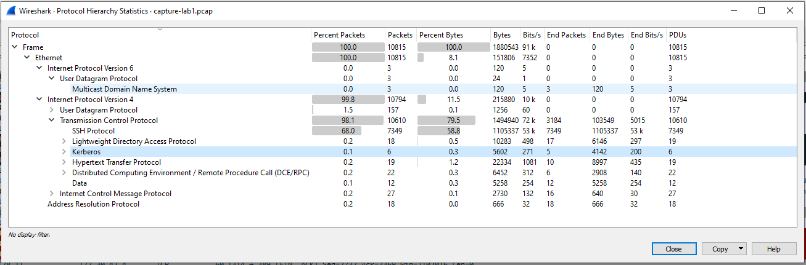
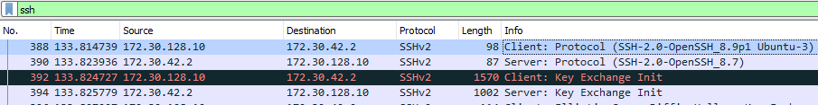
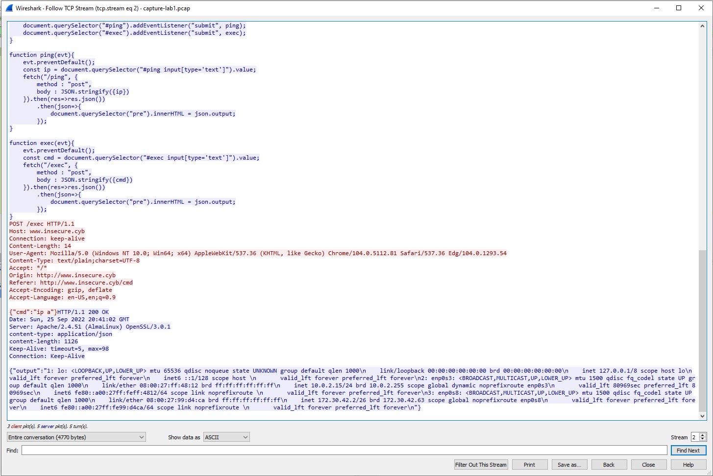
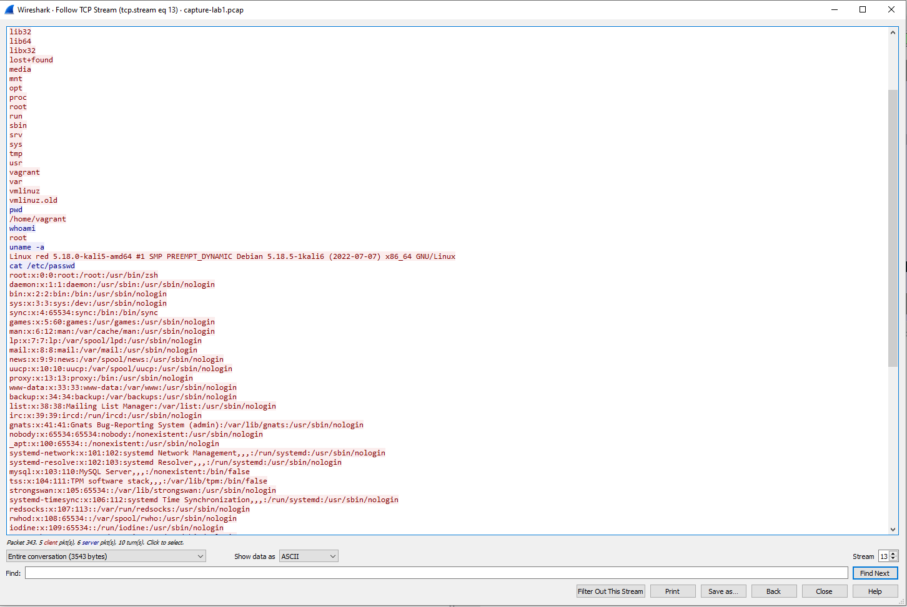
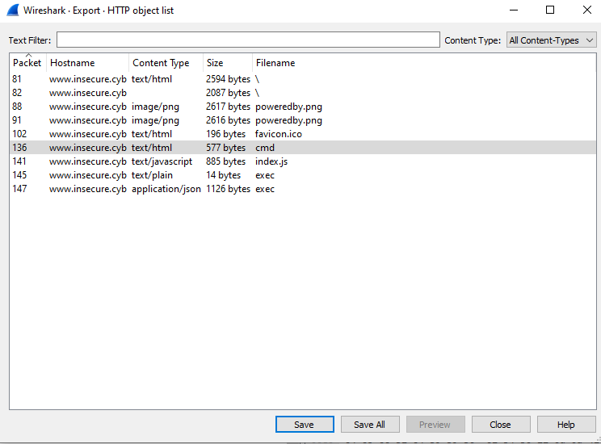
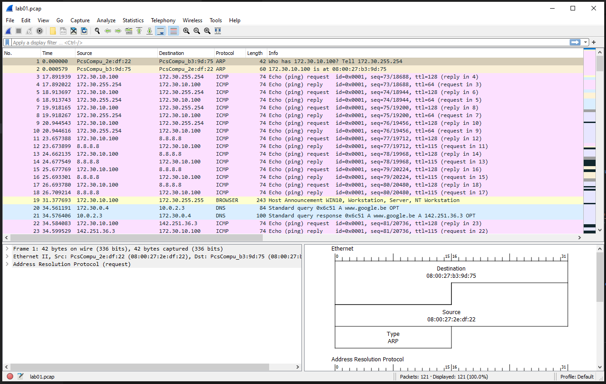
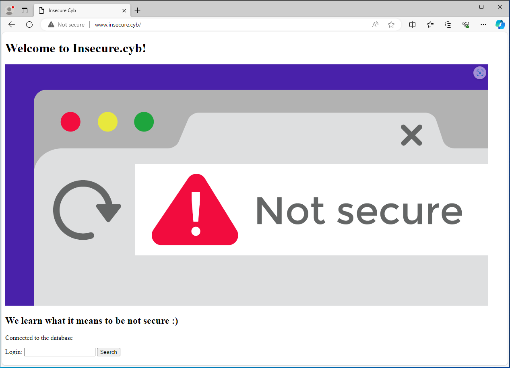
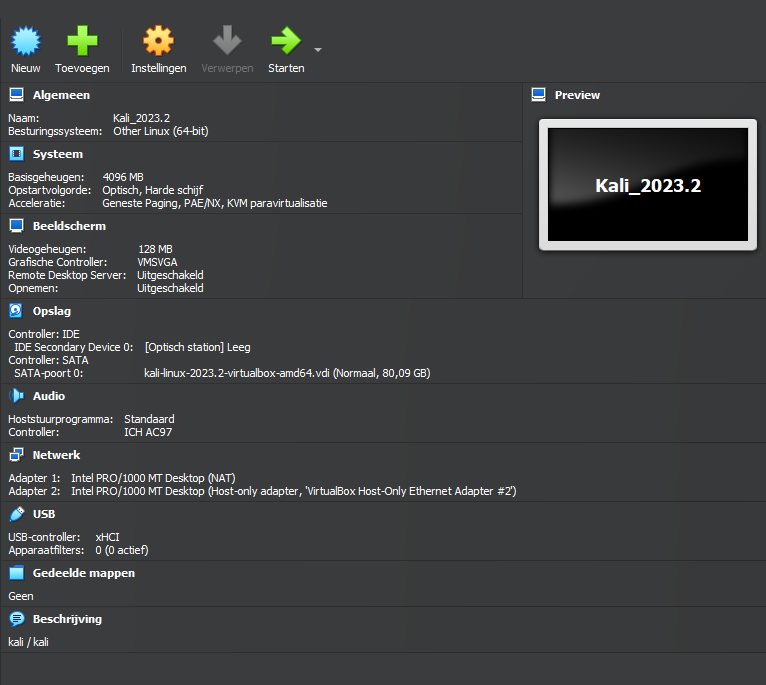
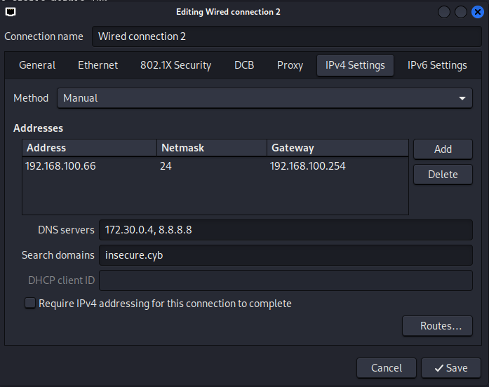

# CSA - Lecture 1 Exercises

## Prepare the lab environment

***If you haven’t already have a look at the download and installation instructions to properly configure the lab environment. If you are still waiting for a download to finish, the first few questions do not require the lab environment but do require wireshark.***

## Recap DNS : Basic DNS queries

***Below a small recap to perform DNS analysis and investigations. Be sure to test out the following examples.***

### `nslookup`

***A DNS client is used by almost every application: an underlying program asks a DNS server which IP address corresponds to the URL specified in the program. This process is called `resolving`. Although occurring in the background, this resolving occurs with almost every request that the computer starts to the outside world - you just don't notice it... Manually, a DNS request can also be triggered with a program like `nslookup`:***

***Try `nslookup www.ugent.be`***

`windows @ school`

```console
C:\Users\Benny>nslookup www.ugent.be
Server:  ns1.hogent.be
Address:  193.190.173.1

Non-authoritative answer:
Name:    www.ugent.be
Address:  157.193.43.50
```

`windows @ home`

```console
Benny@FLAB2021 MINGW64 /c/data/git/SEP-2223-sep-2223-t01 (main)
$ nslookup www.ugent.be
Server:  gent.dnscache01.telenet-ops.be
Address:  195.130.130.2

Non-authoritative answer:
Name:    www.ugent.be
Address:  157.193.43.50
```

`linux`

```console
vagrant@dockerlab:~$ nslookup www.ugent.be
Server:         127.0.0.53
Address:        127.0.0.53#53

Non-authoritative answer:
Name:   www.ugent.be
Address: 157.193.43.50
```

***When resolving, the default DNS server is used here, which is a setting on the host (e.g. done by DHCP). The name and IP address of the DNS server providing us with this information is displayed first, followed by the name and IP address of the URL that was requested.***

***If you explicitly want to use another server to request information, you can do this by also specifying the server address (or name) to the command:***

***`nslookup <URL-to-question> [DNS-server IP-address or name]`***

`windows @ google`

```console
C:\Users\Benny>nslookup www.ugent.be 8.8.8.8
Server:  dns.google
Address:  8.8.8.8

Non-authoritative answer:
Name:    www.ugent.be
Address:  157.193.43.50
```

`windows @ root`

```console
Benny@FLAB2021 MINGW64 /c/data/git/SEP-2223-sep-2223-t01 (main)
$ nslookup www.ugent.be 1.1.1.1
Server:  one.one.one.one
Address:  1.1.1.1

Non-authoritative answer:
Name:    www.ugent.be
Address:  157.193.43.50
```

`linux`

```code
vagrant@dockerlab:~$ nslookup www.ugent.be 8.8.8.8
Server:         8.8.8.8
Address:        8.8.8.8#53

Non-authoritative answer:
Name:   www.ugent.be
Address: 157.193.43.50
```

***Besides the `nslookup` command, which works on both Linux and Windows, Linux users can also use the `host` command (shorter output), or the `dig` command (extensive output).***

### `host`

```console
vagrant@dockerlab:~$ host www.ugent.be
www.ugent.be has address 157.193.43.50
vagrant@dockerlab:~$ host www.ugent.be 8.8.4.4
Using domain server:
Name: 8.8.4.4
Address: 8.8.4.4#53
Aliases:

www.ugent.be has address 157.193.43.50
```

### `dig`

***Using `dig` you can also request additional information, such as e.g. the servers responsible for the details of a particular domain (a.k.a. the authoritative server):***

***`dig +short NS ugent.be`***

```console
vagrant@dockerlab:~$ dig +short NS ugent.be
ugdns2.ugent.be.
ns1.ugent.be.
ugdns3.ugent.be.
ns2.ugent.be.
ugdns1.ugent.be.
ns.belnet.be.
```

***A reverse lookup - converting an IP address to its DNS name - can be done with the -x option:***

***`dig +short -x 157.193.43.50`***

```console
vagrant@dockerlab:~$ dig +short -x 157.193.43.50
portlvs.ugent.be.
```

***When a DNS server is redundant (master/slave), the entire zone can be transferred from the primary server to the secondary server. Nothing wrong there: it is a feature of DNS - see <https://en.wikipedia.org/wiki/DNS_zone_transfer> However, when badly configured, the content of the entire zone might be accessible to everybody on the Internet. Read <https://digi.ninja/projects/zonetransferme.php> for further explanation.***

## Recap Wireshark

***In cybersecurity and virtualization we got to know Wireshark. Most captures were relatively small in size. In a more realistic setting, a capture file will have a lot of packets, often unrelated to what you are searching for. Open the [capture-lab1.pcap](../files/capture-lab1.pcap) file and try to answer the following questions:***

- ***What layers of the OSI model are captured in this capturefile?***

`onduidelijke vraag: vanaf 2?`



- ***Take a look at the conversations. What do you notice?***

`dit is wel een zeer open vraag waar zeer veel antwoorden op mogelijk zijn ...`

```console

precies een lector die labo's aan het voorbereiden is :)
veel ssh en dus incrypted maar ook enkele interessante open dingen zoals telnet en een reverse shell op de website

```

- ***Take a look at the protocol hierarchy. What are the most "interesting" protocols listed here?***

`de conversaties die niet encrypted zijn, ergo http`

- ***Can you spot an SSH session that got established between 2 machines? List the 2 machines. Who was the SSH server and who was the client? What ports were used? Are these ports TCP or UDP?***

`client 172.30.128.10:37700, server 172.30.42.2:22 uiteraard over tcp (en.10 de kali en .2 de webserver)`



- ***Some cleartext data was transferred between two machines. Can you spot the data? Can you deduce what happened here?***

`reverse shell`



`logged into kali`



- ***Someone used a specific way to transfer a png on the wire. Is it possible to export this png easily? Is it possible to export other HTTP related stuff?***




## Capture traffic using the cli

***Start at least the `isprouter`, the `companyrouter`, the `dc` and the `win10` client in your environment. For now you can still use the credentials vagrant/vagrant on all machines.***

```code
PS C:\data\git\CA> VBoxManage startvm "ca_d_isprouter"
Waiting for VM "ca_d_isprouter" to power on...
VM "ca_d_isprouter" has been successfully started.
PS C:\data\git\CA> VBoxManage startvm "ca_d_companyrouter"
Waiting for VM "ca_d_companyrouter" to power on...
VM "ca_d_companyrouter" has been successfully started.
PS C:\data\git\CA> VBoxManage startvm "ca_c_dc"
Waiting for VM "ca_c_dc" to power on...
VM "ca_c_dc" has been successfully started.
PS C:\data\git\CA> VBoxManage startvm "ca_d_win10"
Waiting for VM "ca_d_win10" to power on...
VM "ca_d_win10" has been successfully started.
PS C:\data\git\CA> VBoxManage list runningvms
"ca_d_companyrouter" {4ff8fd36-2558-4446-b0f8-65c4497f2691}
"ca_c_dc" {267be047-9407-470b-8883-d0f1218c6b58}
"ca_d_isprouter" {94ee42fe-7506-46ad-a079-82151c237f96}
"ca_d_win10" {63086e28-7824-446a-a59c-ec15633ed680}
```

`In order to connect more easily to the virtual machines in all labs, some modifications to FLAB2021`

```code
PS C:\data\git\CA> cat C:\Windows\System32\drivers\etc\hosts
# Copyright (c) 1993-2009 Microsoft Corp.
#
# This is a sample HOSTS file used by Microsoft TCP/IP for Windows.
#
# This file contains the mappings of IP addresses to host names. Each
# entry should be kept on an individual line. The IP address should
# be placed in the first column followed by the corresponding host name.
# The IP address and the host name should be separated by at least one
# space.
#
# Additionally, comments (such as these) may be inserted on individual
# lines or following the machine name denoted by a '#' symbol.
#
# For example:
#
#      102.54.94.97     rhino.acme.com          # source server
#       38.25.63.10     x.acme.com              # x client host
192.168.0.209 sma

# localhost name resolution is handled within DNS itself.
#       127.0.0.1       localhost
#       ::1             localhost

# cybersecurity advanced 2023-2024
192.168.100.253 companyrouter
192.168.100.254 isprouter
172.30.0.4 dc
172.30.0.10 web
172.30.0.15 database
172.30.10.100 win10
```

***Install the `tcpdump` utility on the `companyrouter` and figure out a way to sniff traffic origination from the `win10` using tcpdump on the `companyrouter`.***

```code
PS C:\data\git\CA> ssh vagrant@companyrouter
The authenticity of host 'companyrouter (192.168.100.253)' can't be established.
ECDSA key fingerprint is SHA256:nFEZjPxjKgMkp/6kVTg0lIU5c9CDYc/v8BdXUsXGDA0.
Are you sure you want to continue connecting (yes/no/[fingerprint])? yes
Warning: Permanently added 'companyrouter' (ECDSA) to the list of known hosts.
vagrant@companyrouter's password:
Last login: Thu Nov 23 19:50:33 2023
[vagrant@companyrouter ~]$ which tcpdump
/usr/bin/which: no tcpdump in (/home/vagrant/.local/bin:/home/vagrant/bin:/usr/local/bin:/usr/bin:/usr/local/sbin:/usr/sbin)
[vagrant@companyrouter ~]$ sudo dnf install -y tcpdump
Last metadata expiration check: 0:22:42 ago on Wed Nov 22 14:28:24 2023.
Dependencies resolved.
=================================================================================================================================================================================================================
 Package                                         Architecture                                   Version                                                  Repository                                         Size
=================================================================================================================================================================================================================
Installing:
 tcpdump                                         x86_64                                         14:4.99.0-7.el9                                          appstream                                         542 k

Transaction Summary
=================================================================================================================================================================================================================
Install  1 Package

Total download size: 542 k
Installed size: 1.4 M
Downloading Packages:
tcpdump-4.99.0-7.el9.x86_64.rpm                                                                                                                                                   60 kB/s | 542 kB     00:09
-----------------------------------------------------------------------------------------------------------------------------------------------------------------------------------------------------------------
Total                                                                                                                                                                             28 kB/s | 542 kB     00:19
Running transaction check
Transaction check succeeded.
Running transaction test
Transaction test succeeded.
Running transaction
  Preparing        :                                                                                                                                                                                         1/1
  Running scriptlet: tcpdump-14:4.99.0-7.el9.x86_64                                                                                                                                                          1/1
  Installing       : tcpdump-14:4.99.0-7.el9.x86_64                                                                                                                                                          1/1
  Running scriptlet: tcpdump-14:4.99.0-7.el9.x86_64                                                                                                                                                          1/1
  Verifying        : tcpdump-14:4.99.0-7.el9.x86_64                                                                                                                                                          1/1

Installed:
  tcpdump-14:4.99.0-7.el9.x86_64

Complete!
[vagrant@companyrouter ~]$ tcpdump --version
tcpdump version 4.99.0
libpcap version 1.10.0 (with TPACKET_V3)
OpenSSL 3.0.7 1 Nov 2022
```

- ***Have a look at the ip configurations of the dc machine, the win10 client and the companyrouter.***

`From Lab 00:`

| vm | interface | ip | default gateway | dns |
| :- | :- | :- | :- | :- |
| companyrouter | eth0 | 192.168.100.253 | 192.168.100.254 | 10.0.2.3 |
| companyrouter | eth1 | 172.30.255.254 | | 10.0.2.3 |
| dc | eth1 | 172.30.0.4 | 172.30.255.254 | 10.0.2.3, 8.8.8.8 |
| win10 | eth0 | 172.30.10.100 (dhcp) | 172.30.255.254 | 172.30.0.4 |

- ***Which interface on the companyrouter will you use to capture traffic from the dc to the internet?***

```code
[vagrant@companyrouter ~]$ ip -4 a | grep inet
    inet 127.0.0.1/8 scope host lo
    inet 192.168.100.253/24 brd 192.168.100.255 scope global noprefixroute eth0
    inet 172.30.255.254/16 brd 172.30.255.255 scope global noprefixroute eth1
[vagrant@companyrouter ~]$ sudo tcpdump -D | grep -i running
1.eth0 [Up, Running, Connected]
2.eth1 [Up, Running, Connected]
3.any (Pseudo-device that captures on all interfaces) [Up, Running]
4.lo [Up, Running, Loopback]
```

`Twee opties, maar om de filter simpeler te maken - lees: ssh naar companyrouter niet te hoeven filteren - is eth1 de gekozen optie`

- ***Which interface on the companyrouter would you use to capture traffic from dc to win10?***

`De virtuele machines dc en win10 zitten op het intern VirtualBox netwerk 'company', welke een virtuele switch is. Aangezien de ipv4 adressen van beide machines in hetzelfde subnet liggen zullen ze de gateway (companyrouter) niet nodig hebben. Op de companyrouter is eth1 verbonden met 'company'`

- ***Test this out by pinging from win10 to the companyrouter and from win10 to the dc. Are you able to see all pings in tcpdump on the companyrouter?***

```code
C:\Users\vagrant.insecure>ping 172.30.0.4

Pinging 172.30.0.4 with 32 bytes of data:
Reply from 172.30.0.4: bytes=32 time<1ms TTL=128
Reply from 172.30.0.4: bytes=32 time=1ms TTL=128
Reply from 172.30.0.4: bytes=32 time<1ms TTL=128
Reply from 172.30.0.4: bytes=32 time=1ms TTL=128

Ping statistics for 172.30.0.4:
    Packets: Sent = 4, Received = 4, Lost = 0 (0% loss),
Approximate round trip times in milli-seconds:
    Minimum = 0ms, Maximum = 1ms, Average = 0ms

C:\Users\vagrant.insecure>ping 172.30.255.254

Pinging 172.30.255.254 with 32 bytes of data:
Reply from 172.30.255.254: bytes=32 time<1ms TTL=64
Reply from 172.30.255.254: bytes=32 time=1ms TTL=64
Reply from 172.30.255.254: bytes=32 time<1ms TTL=64
Reply from 172.30.255.254: bytes=32 time=1ms TTL=64

Ping statistics for 172.30.255.254:
    Packets: Sent = 4, Received = 4, Lost = 0 (0% loss),
Approximate round trip times in milli-seconds:
    Minimum = 0ms, Maximum = 1ms, Average = 0ms

C:\Users\vagrant.insecure>ping 8.8.8.8

Pinging 8.8.8.8 with 32 bytes of data:
Reply from 8.8.8.8: bytes=32 time=16ms TTL=115
Reply from 8.8.8.8: bytes=32 time=16ms TTL=115
Reply from 8.8.8.8: bytes=32 time=16ms TTL=115
Reply from 8.8.8.8: bytes=32 time=16ms TTL=115

Ping statistics for 8.8.8.8:
    Packets: Sent = 4, Received = 4, Lost = 0 (0% loss),
Approximate round trip times in milli-seconds:
    Minimum = 16ms, Maximum = 16ms, Average = 16ms

C:\Users\vagrant.insecure>ping www.google.be

Pinging www.google.be [142.251.36.3] with 32 bytes of data:
Reply from 142.251.36.3: bytes=32 time=16ms TTL=115
Reply from 142.251.36.3: bytes=32 time=16ms TTL=115
Reply from 142.251.36.3: bytes=32 time=15ms TTL=115
Reply from 142.251.36.3: bytes=32 time=15ms TTL=115

Ping statistics for 142.251.36.3:
    Packets: Sent = 4, Received = 4, Lost = 0 (0% loss),
Approximate round trip times in milli-seconds:
    Minimum = 15ms, Maximum = 16ms, Average = 15ms
```

```code
[vagrant@companyrouter ~]$ sudo tcpdump -i eth1
dropped privs to tcpdump
tcpdump: verbose output suppressed, use -v[v]... for full protocol decode
listening on eth1, link-type EN10MB (Ethernet), snapshot length 262144 bytes
05:52:20.393649 IP 172.30.10.100 > companyrouter: ICMP echo request, id 1, seq 57, length 40
05:52:20.393701 IP companyrouter > 172.30.10.100: ICMP echo reply, id 1, seq 57, length 40
05:52:21.405577 IP 172.30.10.100 > companyrouter: ICMP echo request, id 1, seq 58, length 40
05:52:21.405661 IP companyrouter > 172.30.10.100: ICMP echo reply, id 1, seq 58, length 40
05:52:22.421140 IP 172.30.10.100 > companyrouter: ICMP echo request, id 1, seq 59, length 40
05:52:22.421201 IP companyrouter > 172.30.10.100: ICMP echo reply, id 1, seq 59, length 40
05:52:23.449965 IP 172.30.10.100 > companyrouter: ICMP echo request, id 1, seq 60, length 40
05:52:23.450048 IP companyrouter > 172.30.10.100: ICMP echo reply, id 1, seq 60, length 40
05:52:25.090248 ARP, Request who-has companyrouter (08:00:27:2e:df:22 (oui Unknown)) tell 172.30.10.100, length 46
05:52:25.090305 ARP, Reply companyrouter is-at 08:00:27:2e:df:22 (oui Unknown), length 28
05:52:25.762659 ARP, Request who-has 172.30.10.100 tell companyrouter, length 28
05:52:25.762949 ARP, Reply 172.30.10.100 is-at 08:00:27:b3:9d:75 (oui Unknown), length 46
05:52:31.789578 IP 172.30.10.100 > dns.google: ICMP echo request, id 1, seq 61, length 40
05:52:31.805211 IP dns.google > 172.30.10.100: ICMP echo reply, id 1, seq 61, length 40
05:52:32.795305 IP 172.30.10.100 > dns.google: ICMP echo request, id 1, seq 62, length 40
05:52:32.810880 IP dns.google > 172.30.10.100: ICMP echo reply, id 1, seq 62, length 40
05:52:33.810317 IP 172.30.10.100 > dns.google: ICMP echo request, id 1, seq 63, length 40
05:52:33.825933 IP dns.google > 172.30.10.100: ICMP echo reply, id 1, seq 63, length 40
05:52:34.841642 IP 172.30.10.100 > dns.google: ICMP echo request, id 1, seq 64, length 40
05:52:34.857131 IP dns.google > 172.30.10.100: ICMP echo reply, id 1, seq 64, length 40
05:53:06.239680 IP 172.30.0.10.59774 > 94-224-67-24.access.telenet.be.ntp: NTPv4, Client, length 48
05:53:06.263277 IP 94-224-67-24.access.telenet.be.ntp > 172.30.0.10.59774: NTPv4, Server, length 48
05:53:07.080121 IP 172.30.0.10.48109 > ntp2.unix-solutions.be.ntp: NTPv4, Client, length 48
05:53:07.092542 IP ntp2.unix-solutions.be.ntp > 172.30.0.10.48109: NTPv4, Server, length 48
05:53:11.331008 ARP, Request who-has 172.30.0.10 tell companyrouter, length 28
05:53:11.331238 ARP, Reply 172.30.0.10 is-at 08:00:27:40:38:29 (oui Unknown), length 46
05:53:11.646697 ARP, Request who-has companyrouter tell 172.30.0.10, length 46
05:53:11.646749 ARP, Reply companyrouter is-at 08:00:27:2e:df:22 (oui Unknown), length 28
05:53:12.821242 IP dc.59422 > 10.0.2.3.domain: 13068+ [1au] A? api-msn-com.a-0003.a-msedge.net. (60)
05:53:12.838162 IP 10.0.2.3.domain > dc.59422: 13068 2/0/1 CNAME a-0003.a-msedge.net., A 204.79.197.203 (90)
05:53:12.840651 IP 172.30.10.100.49815 > a-0003.a-msedge.net.https: Flags [S], seq 3603373365, win 65535, options [mss 1460,nop,wscale 8,nop,nop,sackOK], length 0
05:53:12.851912 IP a-0003.a-msedge.net.https > 172.30.10.100.49815: Flags [S.], seq 257728001, ack 3603373366, win 65535, options [mss 1460], length 0
05:53:12.852367 IP 172.30.10.100.49815 > a-0003.a-msedge.net.https: Flags [.], ack 1, win 65535, length 0
05:53:12.854639 IP 172.30.10.100.49815 > a-0003.a-msedge.net.https: Flags [P.], seq 1:197, ack 1, win 65535, length 196
05:53:12.855055 IP a-0003.a-msedge.net.https > 172.30.10.100.49815: Flags [.], ack 197, win 65535, length 0
05:53:12.866195 IP a-0003.a-msedge.net.https > 172.30.10.100.49815: Flags [P.], seq 1:2905, ack 197, win 65535, length 2904
05:53:12.866764 IP 172.30.10.100.49815 > a-0003.a-msedge.net.https: Flags [.], ack 2905, win 65535, length 0
05:53:12.867337 IP a-0003.a-msedge.net.https > 172.30.10.100.49815: Flags [P.], seq 2905:5958, ack 197, win 65535, length 3053
05:53:12.867796 IP 172.30.10.100.49815 > a-0003.a-msedge.net.https: Flags [.], ack 5958, win 65535, length 0
05:53:12.879842 IP 172.30.10.100.49815 > a-0003.a-msedge.net.https: Flags [P.], seq 197:355, ack 5958, win 65535, length 158
05:53:12.880827 IP a-0003.a-msedge.net.https > 172.30.10.100.49815: Flags [.], ack 355, win 65535, length 0
05:53:12.882235 IP 172.30.10.100.49815 > a-0003.a-msedge.net.https: Flags [P.], seq 355:442, ack 5958, win 65535, length 87
05:53:12.882430 IP 172.30.10.100.49815 > a-0003.a-msedge.net.https: Flags [P.], seq 442:1732, ack 5958, win 65535, length 1290
05:53:12.882977 IP a-0003.a-msedge.net.https > 172.30.10.100.49815: Flags [.], ack 442, win 65535, length 0
05:53:12.883135 IP a-0003.a-msedge.net.https > 172.30.10.100.49815: Flags [.], ack 1732, win 65535, length 0
05:53:12.892090 IP a-0003.a-msedge.net.https > 172.30.10.100.49815: Flags [P.], seq 5958:6369, ack 1732, win 65535, length 411
05:53:12.892665 IP 172.30.10.100.49815 > a-0003.a-msedge.net.https: Flags [.], ack 6369, win 65535, length 0
05:53:12.893312 IP a-0003.a-msedge.net.https > 172.30.10.100.49815: Flags [P.], seq 6369:6407, ack 1732, win 65535, length 38
05:53:12.893371 IP 172.30.10.100.49815 > a-0003.a-msedge.net.https: Flags [P.], seq 1732:1770, ack 6369, win 65535, length 38
05:53:12.893760 IP 172.30.10.100.49815 > a-0003.a-msedge.net.https: Flags [.], ack 6407, win 65535, length 0
05:53:12.894117 IP a-0003.a-msedge.net.https > 172.30.10.100.49815: Flags [.], ack 1770, win 65535, length 0
05:53:13.154029 IP a-0003.a-msedge.net.https > 172.30.10.100.49815: Flags [P.], seq 6407:9984, ack 1770, win 65535, length 3577
05:53:13.154636 IP 172.30.10.100.49815 > a-0003.a-msedge.net.https: Flags [.], ack 9984, win 65535, length 0
05:53:17.789519 ARP, Request who-has companyrouter (08:00:27:2e:df:22 (oui Unknown)) tell dc, length 46
05:53:17.789568 ARP, Reply companyrouter is-at 08:00:27:2e:df:22 (oui Unknown), length 28
05:53:17.987056 ARP, Request who-has 172.30.10.100 tell companyrouter, length 28
05:53:17.987108 ARP, Request who-has dc tell companyrouter, length 28
05:53:17.987565 ARP, Reply dc is-at 08:00:27:cc:a9:66 (oui Unknown), length 46
05:53:17.987583 ARP, Reply 172.30.10.100 is-at 08:00:27:b3:9d:75 (oui Unknown), length 46
05:53:18.169180 IP 172.30.10.100.bootpc > companyrouter.bootps: BOOTP/DHCP, Request from 08:00:27:b3:9d:75 (oui Unknown), length 309
05:53:18.175196 IP companyrouter.bootps > 172.30.10.100.bootpc: BOOTP/DHCP, Reply, length 300
05:53:18.178760 IP 172.30.10.100 > igmp.mcast.net: igmp v3 report, 1 group record(s)
05:53:18.183707 IP 172.30.10.100 > igmp.mcast.net: igmp v3 report, 1 group record(s)
05:53:18.185848 IP 172.30.10.100 > igmp.mcast.net: igmp v3 report, 1 group record(s)
05:53:18.186023 IP 172.30.10.100 > igmp.mcast.net: igmp v3 report, 1 group record(s)
05:53:18.235363 IP 172.30.10.100.mdns > mdns.mcast.net.mdns: 0 ANY (QM)? win10.local. (29)
05:53:18.235371 IP 172.30.10.100.mdns > mdns.mcast.net.mdns: 0*- [0q] 1/0/0 A 172.30.10.100 (39)
05:53:18.235931 IP 172.30.10.100.65223 > 224.0.0.252.hostmon: UDP, length 23
05:53:18.236456 IP 172.30.10.100.mdns > mdns.mcast.net.mdns: 0 ANY (QM)? win10.local. (29)
05:53:18.236457 IP 172.30.10.100.mdns > mdns.mcast.net.mdns: 0*- [0q] 1/0/0 A 172.30.10.100 (39)
05:53:18.590194 IP 172.30.10.100 > igmp.mcast.net: igmp v3 report, 1 group record(s)
```

`De pings naar de companyrouter zijn zichtbaar, die naar elkaar niet. Arp requests en trafiek richting internet (meer dan verwacht) worden ook gevangen`

- ***Figure out a way to capture the data in a file. Copy this file from the companyrouter to your host and verify you can analyze this file with wireshark (on your host).***

```code
[vagrant@companyrouter ~]$ sudo tcpdump -i eth1 -w /tmp/lab01.pcap -v
dropped privs to tcpdump
tcpdump: listening on eth1, link-type EN10MB (Ethernet), snapshot length 262144 bytes
^C121 packets captured
121 packets received by filter
0 packets dropped by kernel
```


```code
C:\windows\system32>sc query sshd

SERVICE_NAME: sshd
        TYPE               : 10  WIN32_OWN_PROCESS
        STATE              : 1  STOPPED
        WIN32_EXIT_CODE    : 1077  (0x435)
        SERVICE_EXIT_CODE  : 0  (0x0)
        CHECKPOINT         : 0x0
        WAIT_HINT          : 0x0

C:\windows\system32>sc start sshd

SERVICE_NAME: sshd
        TYPE               : 10  WIN32_OWN_PROCESS
        STATE              : 2  START_PENDING
                                (NOT_STOPPABLE, NOT_PAUSABLE, IGNORES_SHUTDOWN)
        WIN32_EXIT_CODE    : 0  (0x0)
        SERVICE_EXIT_CODE  : 0  (0x0)
        CHECKPOINT         : 0x1
        WAIT_HINT          : 0x12c
        PID                : 8240
        FLAGS              :

C:\windows\system32>sc query sshd

SERVICE_NAME: sshd
        TYPE               : 10  WIN32_OWN_PROCESS
        STATE              : 4  RUNNING
                                (STOPPABLE, NOT_PAUSABLE, IGNORES_SHUTDOWN)
        WIN32_EXIT_CODE    : 0  (0x0)
        SERVICE_EXIT_CODE  : 0  (0x0)
        CHECKPOINT         : 0x0
        WAIT_HINT          : 0x0
```

`Verification in powershell`

```code
PS C:\data\git\CA> Get-Service -Name sshd

Status   Name               DisplayName
------   ----               -----------
Running  sshd               OpenSSH SSH Server
```

`Using scp`

```code
[vagrant@companyrouter ~]$ scp /tmp/lab01.pcap benny@192.168.100.1:/c:/data/git/ca/files
benny@192.168.100.1's password:
lab01.pcap                                                          100%   41KB  33.0MB/s   00:00
```

`Opening the capture in WireShark on FLAB2021`



- ***SSH from win10 to the companyrouter. When scanning with tcpdump you will now see a lot of SSH traffic passing by. How can you start tcpdump and filter out this ssh traffic?***

```code
C:\Users\vagrant.insecure>ssh vagrant@172.30.255.254
The authenticity of host '172.30.255.254 (172.30.255.254)' can't be established.
ECDSA key fingerprint is SHA256:nFEZjPxjKgMkp/6kVTg0lIU5c9CDYc/v8BdXUsXGDA0.
Are you sure you want to continue connecting (yes/no/[fingerprint])? yes
Warning: Permanently added '172.30.255.254' (ECDSA) to the list of known hosts.
vagrant@172.30.255.254's password:
Last login: Fri Nov 24 05:19:55 2023 from 192.168.100.1
[vagrant@companyrouter ~]$ ls
app.jar
[vagrant@companyrouter ~]$ ping 172.30.10.100
PING 172.30.10.100 (172.30.10.100) 56(84) bytes of data.
64 bytes from 172.30.10.100: icmp_seq=1 ttl=128 time=0.517 ms
64 bytes from 172.30.10.100: icmp_seq=2 ttl=128 time=0.919 ms
64 bytes from 172.30.10.100: icmp_seq=3 ttl=128 time=0.533 ms
64 bytes from 172.30.10.100: icmp_seq=4 ttl=128 time=1.10 ms
64 bytes from 172.30.10.100: icmp_seq=5 ttl=128 time=0.965 ms
^C
--- 172.30.10.100 ping statistics ---
5 packets transmitted, 5 received, 0% packet loss, time 4066ms
rtt min/avg/max/mdev = 0.517/0.807/1.101/0.237 ms
[vagrant@companyrouter ~]$
```

```without filter```

```code
[vagrant@companyrouter ~]$ sudo tcpdump -i eth1
dropped privs to tcpdump
tcpdump: verbose output suppressed, use -v[v]... for full protocol decode
listening on eth1, link-type EN10MB (Ethernet), snapshot length 262144 bytes
22:21:57.330662 IP 172.30.10.100.61291 > 239.255.255.250.ssdp: UDP, length 137
22:22:00.346824 IP 172.30.10.100.61291 > 239.255.255.250.ssdp: UDP, length 137
22:22:17.366995 IP 172.30.10.100.50689 > companyrouter.ssh: Flags [S], seq 2005580558, win 64240, options [mss 1460,nop,wscale 8,nop,nop,sackOK], length 0
22:22:17.367080 IP companyrouter.ssh > 172.30.10.100.50689: Flags [S.], seq 4067637709, ack 2005580559, win 64240, options [mss 1460,nop,nop,sackOK,nop,wscale 7], length 0
22:22:17.367430 IP 172.30.10.100.50689 > companyrouter.ssh: Flags [.], ack 1, win 8212, length 0
22:22:17.369878 IP 172.30.10.100.50689 > companyrouter.ssh: Flags [P.], seq 1:34, ack 1, win 8212, length 33: SSH: SSH-2.0-OpenSSH_for_Windows_8.1
22:22:17.369895 IP companyrouter.ssh > 172.30.10.100.50689: Flags [.], ack 34, win 502, length 0
22:22:17.379599 IP companyrouter.ssh > 172.30.10.100.50689: Flags [P.], seq 1:22, ack 34, win 502, length 21: SSH: SSH-2.0-OpenSSH_8.7
22:22:17.382710 IP 172.30.10.100.50689 > companyrouter.ssh: Flags [P.], seq 34:1426, ack 22, win 8212, length 1392
22:22:17.382757 IP companyrouter.ssh > 172.30.10.100.50689: Flags [P.], seq 22:958, ack 1426, win 501, length 936
22:22:17.385408 IP 172.30.10.100.50689 > companyrouter.ssh: Flags [P.], seq 1426:1474, ack 958, win 8208, length 48
22:22:17.389819 IP companyrouter.ssh > 172.30.10.100.50689: Flags [P.], seq 958:1514, ack 1474, win 501, length 556
22:22:17.439504 IP 172.30.10.100.50689 > companyrouter.ssh: Flags [.], ack 1514, win 8212, length 0
22:22:22.163841 IP 172.30.10.100.50689 > companyrouter.ssh: Flags [P.], seq 1474:1490, ack 1514, win 8212, length 16
22:22:22.205321 IP companyrouter.ssh > 172.30.10.100.50689: Flags [.], ack 1490, win 501, length 0
22:22:22.205638 IP 172.30.10.100.50689 > companyrouter.ssh: Flags [P.], seq 1490:1534, ack 1514, win 8212, length 44
22:22:22.205657 IP companyrouter.ssh > 172.30.10.100.50689: Flags [.], ack 1534, win 501, length 0
22:22:22.205776 IP companyrouter.ssh > 172.30.10.100.50689: Flags [P.], seq 1514:1558, ack 1534, win 501, length 44
22:22:22.207045 IP 172.30.10.100.50689 > companyrouter.ssh: Flags [P.], seq 1534:1602, ack 1558, win 8212, length 68
22:22:22.215093 IP companyrouter.ssh > 172.30.10.100.50689: Flags [P.], seq 1558:1642, ack 1602, win 501, length 84
22:22:22.267767 IP 172.30.10.100.50689 > companyrouter.ssh: Flags [.], ack 1642, win 8212, length 0
22:22:24.654088 IP 172.30.10.100.50689 > companyrouter.ssh: Flags [P.], seq 1602:1750, ack 1642, win 8212, length 148
22:22:24.695346 IP companyrouter.ssh > 172.30.10.100.50689: Flags [.], ack 1750, win 501, length 0
22:22:24.698890 IP companyrouter.ssh > 172.30.10.100.50689: Flags [P.], seq 1642:1670, ack 1750, win 501, length 28
22:22:24.708802 IP 172.30.10.100.50689 > companyrouter.ssh: Flags [P.], seq 1750:1862, ack 1670, win 8211, length 112
22:22:24.708826 IP companyrouter.ssh > 172.30.10.100.50689: Flags [.], ack 1862, win 501, length 0
22:22:24.721102 IP companyrouter.ssh > 172.30.10.100.50689: Flags [P.], seq 1670:2298, ack 1862, win 501, length 628
22:22:24.767770 IP 172.30.10.100.50689 > companyrouter.ssh: Flags [.], ack 2298, win 8209, length 0
22:22:24.767804 IP companyrouter.ssh > 172.30.10.100.50689: Flags [P.], seq 2298:2342, ack 1862, win 501, length 44
22:22:24.768381 IP 172.30.10.100.50689 > companyrouter.ssh: Flags [P.], seq 1862:1998, ack 2342, win 8209, length 136
22:22:24.774076 IP companyrouter.ssh > 172.30.10.100.50689: Flags [P.], seq 2342:2450, ack 1998, win 501, length 108
22:22:24.774223 IP companyrouter.ssh > 172.30.10.100.50689: Flags [P.], seq 2450:2542, ack 1998, win 501, length 92
22:22:24.774763 IP 172.30.10.100.50689 > companyrouter.ssh: Flags [.], ack 2542, win 8208, length 0
22:22:24.857186 IP companyrouter.ssh > 172.30.10.100.50689: Flags [P.], seq 2542:2610, ack 1998, win 501, length 68
22:22:24.857492 IP companyrouter.ssh > 172.30.10.100.50689: Flags [P.], seq 2610:2654, ack 1998, win 501, length 44
22:22:24.857633 IP companyrouter.ssh > 172.30.10.100.50689: Flags [P.], seq 2654:2722, ack 1998, win 501, length 68
22:22:24.857890 IP 172.30.10.100.50689 > companyrouter.ssh: Flags [.], ack 2722, win 8207, length 0
22:22:27.632596 IP 172.30.10.100.50689 > companyrouter.ssh: Flags [P.], seq 1998:2034, ack 2722, win 8207, length 36
22:22:27.632786 IP companyrouter.ssh > 172.30.10.100.50689: Flags [P.], seq 2722:2758, ack 2034, win 501, length 36
22:22:27.674503 IP 172.30.10.100.50689 > companyrouter.ssh: Flags [.], ack 2758, win 8207, length 0
22:22:27.772711 IP 172.30.10.100.50689 > companyrouter.ssh: Flags [P.], seq 2034:2070, ack 2758, win 8207, length 36
22:22:27.772914 IP companyrouter.ssh > 172.30.10.100.50689: Flags [P.], seq 2758:2794, ack 2070, win 501, length 36
22:22:27.830921 IP 172.30.10.100.50689 > companyrouter.ssh: Flags [.], ack 2794, win 8207, length 0
22:22:34.413749 IP 172.30.10.100.50689 > companyrouter.ssh: Flags [P.], seq 2070:2106, ack 2794, win 8207, length 36
22:22:34.413910 IP companyrouter.ssh > 172.30.10.100.50689: Flags [P.], seq 2794:2830, ack 2106, win 501, length 36
22:22:34.413954 IP companyrouter.ssh > 172.30.10.100.50689: Flags [P.], seq 2830:2874, ack 2106, win 501, length 44
22:22:34.414176 IP 172.30.10.100.50689 > companyrouter.ssh: Flags [.], ack 2874, win 8207, length 0
22:22:34.415390 IP companyrouter.ssh > 172.30.10.100.50689: Flags [P.], seq 2874:2934, ack 2106, win 501, length 60
22:22:34.415485 IP companyrouter.ssh > 172.30.10.100.50689: Flags [P.], seq 2934:2970, ack 2106, win 501, length 36
22:22:34.415758 IP companyrouter.ssh > 172.30.10.100.50689: Flags [P.], seq 2970:3038, ack 2106, win 501, length 68
22:22:34.415824 IP 172.30.10.100.50689 > companyrouter.ssh: Flags [.], ack 2970, win 8206, length 0
22:22:34.415873 IP companyrouter.ssh > 172.30.10.100.50689: Flags [P.], seq 3038:3082, ack 2106, win 501, length 44
22:22:34.415947 IP companyrouter.ssh > 172.30.10.100.50689: Flags [P.], seq 3082:3150, ack 2106, win 501, length 68
22:22:34.415995 IP 172.30.10.100.50689 > companyrouter.ssh: Flags [.], ack 3082, win 8212, length 0
22:22:34.471308 IP 172.30.10.100.50689 > companyrouter.ssh: Flags [.], ack 3150, win 8212, length 0
22:22:45.804063 IP 172.30.10.100.54554 > 239.255.255.250.ssdp: UDP, length 175
22:22:46.831805 IP 172.30.10.100.54554 > 239.255.255.250.ssdp: UDP, length 175
22:22:47.862257 IP 172.30.10.100.54554 > 239.255.255.250.ssdp: UDP, length 175
22:22:48.877806 IP 172.30.10.100.54554 > 239.255.255.250.ssdp: UDP, length 175
22:23:50.574619 IP 172.30.10.100.50689 > companyrouter.ssh: Flags [P.], seq 2106:2142, ack 3150, win 8212, length 36
22:23:50.574808 IP companyrouter.ssh > 172.30.10.100.50689: Flags [P.], seq 3150:3186, ack 2142, win 501, length 36
22:23:50.628432 IP 172.30.10.100.50689 > companyrouter.ssh: Flags [.], ack 3186, win 8212, length 0
22:23:50.794234 IP 172.30.10.100.50689 > companyrouter.ssh: Flags [P.], seq 2142:2178, ack 3186, win 8212, length 36
22:23:50.794418 IP companyrouter.ssh > 172.30.10.100.50689: Flags [P.], seq 3186:3222, ack 2178, win 501, length 36
22:23:50.846976 IP 172.30.10.100.50689 > companyrouter.ssh: Flags [.], ack 3222, win 8211, length 0
22:23:50.932690 IP 172.30.10.100.50689 > companyrouter.ssh: Flags [P.], seq 2178:2214, ack 3222, win 8211, length 36
22:23:50.932841 IP companyrouter.ssh > 172.30.10.100.50689: Flags [P.], seq 3222:3258, ack 2214, win 501, length 36
22:23:50.987263 IP 172.30.10.100.50689 > companyrouter.ssh: Flags [.], ack 3258, win 8211, length 0
22:23:51.032741 IP 172.30.10.100.50689 > companyrouter.ssh: Flags [P.], seq 2214:2250, ack 3258, win 8211, length 36
22:23:51.032922 IP companyrouter.ssh > 172.30.10.100.50689: Flags [P.], seq 3258:3294, ack 2250, win 501, length 36
22:23:51.080756 IP 172.30.10.100.50689 > companyrouter.ssh: Flags [.], ack 3294, win 8211, length 0
22:23:51.177975 IP 172.30.10.100.50689 > companyrouter.ssh: Flags [P.], seq 2250:2286, ack 3294, win 8211, length 36
22:23:51.178157 IP companyrouter.ssh > 172.30.10.100.50689: Flags [P.], seq 3294:3330, ack 2286, win 501, length 36
22:23:51.236568 IP 172.30.10.100.50689 > companyrouter.ssh: Flags [.], ack 3330, win 8211, length 0
22:23:52.794362 IP 172.30.10.100.50689 > companyrouter.ssh: Flags [P.], seq 2286:2322, ack 3330, win 8211, length 36
22:23:52.794585 IP companyrouter.ssh > 172.30.10.100.50689: Flags [P.], seq 3330:3366, ack 2322, win 501, length 36
22:23:52.846507 IP 172.30.10.100.50689 > companyrouter.ssh: Flags [.], ack 3366, win 8211, length 0
22:23:56.644454 IP 172.30.10.100.50689 > companyrouter.ssh: Flags [P.], seq 2322:2358, ack 3366, win 8211, length 36
22:23:56.644627 IP companyrouter.ssh > 172.30.10.100.50689: Flags [P.], seq 3366:3402, ack 2358, win 501, length 36
22:23:56.690591 IP 172.30.10.100.50689 > companyrouter.ssh: Flags [.], ack 3402, win 8211, length 0
22:23:56.934368 IP 172.30.10.100.50689 > companyrouter.ssh: Flags [P.], seq 2358:2394, ack 3402, win 8211, length 36
22:23:56.934560 IP companyrouter.ssh > 172.30.10.100.50689: Flags [P.], seq 3402:3438, ack 2394, win 501, length 36
22:23:56.987172 IP 172.30.10.100.50689 > companyrouter.ssh: Flags [.], ack 3438, win 8211, length 0
22:23:57.329432 IP 172.30.10.100.50689 > companyrouter.ssh: Flags [P.], seq 2394:2430, ack 3438, win 8211, length 36
22:23:57.329626 IP companyrouter.ssh > 172.30.10.100.50689: Flags [P.], seq 3438:3474, ack 2430, win 501, length 36
22:23:57.377420 IP 172.30.10.100.50689 > companyrouter.ssh: Flags [.], ack 3474, win 8210, length 0
22:23:58.069587 IP 172.30.10.100.50689 > companyrouter.ssh: Flags [P.], seq 2430:2466, ack 3474, win 8210, length 36
22:23:58.069798 IP companyrouter.ssh > 172.30.10.100.50689: Flags [P.], seq 3474:3510, ack 2466, win 501, length 36
22:23:58.109512 IP 172.30.10.100.50689 > companyrouter.ssh: Flags [P.], seq 2466:2502, ack 3510, win 8210, length 36
22:23:58.109690 IP companyrouter.ssh > 172.30.10.100.50689: Flags [P.], seq 3510:3546, ack 2502, win 501, length 36
22:23:58.160007 IP 172.30.10.100.50689 > companyrouter.ssh: Flags [.], ack 3546, win 8210, length 0
22:23:58.725338 IP 172.30.10.100.50689 > companyrouter.ssh: Flags [P.], seq 2502:2538, ack 3546, win 8210, length 36
22:23:58.725570 IP companyrouter.ssh > 172.30.10.100.50689: Flags [P.], seq 3546:3582, ack 2538, win 501, length 36
22:23:58.782656 IP 172.30.10.100.50689 > companyrouter.ssh: Flags [.], ack 3582, win 8210, length 0
22:23:59.219716 IP 172.30.10.100.50689 > companyrouter.ssh: Flags [P.], seq 2538:2574, ack 3582, win 8210, length 36
22:23:59.219929 IP companyrouter.ssh > 172.30.10.100.50689: Flags [P.], seq 3582:3618, ack 2574, win 501, length 36
22:23:59.268567 IP 172.30.10.100.50689 > companyrouter.ssh: Flags [.], ack 3618, win 8210, length 0
22:23:59.464850 IP 172.30.10.100.50689 > companyrouter.ssh: Flags [P.], seq 2574:2610, ack 3618, win 8210, length 36
22:23:59.465029 IP companyrouter.ssh > 172.30.10.100.50689: Flags [P.], seq 3618:3654, ack 2610, win 501, length 36
22:23:59.534169 IP 172.30.10.100.50689 > companyrouter.ssh: Flags [.], ack 3654, win 8210, length 0
22:23:59.604988 IP 172.30.10.100.50689 > companyrouter.ssh: Flags [P.], seq 2610:2646, ack 3654, win 8210, length 36
22:23:59.605192 IP companyrouter.ssh > 172.30.10.100.50689: Flags [P.], seq 3654:3690, ack 2646, win 501, length 36
22:23:59.675322 IP 172.30.10.100.50689 > companyrouter.ssh: Flags [.], ack 3690, win 8210, length 0
22:23:59.900005 IP 172.30.10.100.50689 > companyrouter.ssh: Flags [P.], seq 2646:2682, ack 3690, win 8210, length 36
22:23:59.900230 IP companyrouter.ssh > 172.30.10.100.50689: Flags [P.], seq 3690:3726, ack 2682, win 501, length 36
22:23:59.941026 IP 172.30.10.100.50689 > companyrouter.ssh: Flags [.], ack 3726, win 8209, length 0
22:24:00.150050 IP 172.30.10.100.50689 > companyrouter.ssh: Flags [P.], seq 2682:2718, ack 3726, win 8209, length 36
22:24:00.150296 IP companyrouter.ssh > 172.30.10.100.50689: Flags [P.], seq 3726:3762, ack 2718, win 501, length 36
22:24:00.205913 IP 172.30.10.100.50689 > companyrouter.ssh: Flags [.], ack 3762, win 8209, length 0
22:24:00.335068 IP 172.30.10.100.50689 > companyrouter.ssh: Flags [P.], seq 2718:2754, ack 3762, win 8209, length 36
22:24:00.335255 IP companyrouter.ssh > 172.30.10.100.50689: Flags [P.], seq 3762:3798, ack 2754, win 501, length 36
22:24:00.378171 IP 172.30.10.100.50689 > companyrouter.ssh: Flags [.], ack 3798, win 8209, length 0
22:24:00.519932 IP 172.30.10.100.50689 > companyrouter.ssh: Flags [P.], seq 2754:2790, ack 3798, win 8209, length 36
22:24:00.520132 IP companyrouter.ssh > 172.30.10.100.50689: Flags [P.], seq 3798:3834, ack 2790, win 501, length 36
22:24:00.565892 IP 172.30.10.100.50689 > companyrouter.ssh: Flags [.], ack 3834, win 8209, length 0
22:24:01.279106 IP 172.30.10.100.50689 > companyrouter.ssh: Flags [P.], seq 2790:2826, ack 3834, win 8209, length 36
22:24:01.281382 IP companyrouter.ssh > 172.30.10.100.50689: Flags [P.], seq 3834:3942, ack 2826, win 501, length 108
22:24:01.281454 IP companyrouter.ssh > 172.30.10.100.50689: Flags [P.], seq 3942:4078, ack 2826, win 501, length 136
22:24:01.281813 IP 172.30.10.100.50689 > companyrouter.ssh: Flags [.], ack 4078, win 8208, length 0
22:24:02.298887 IP companyrouter.ssh > 172.30.10.100.50689: Flags [P.], seq 4078:4178, ack 2826, win 501, length 100
22:24:02.299063 IP companyrouter.ssh > 172.30.10.100.50689: Flags [P.], seq 4178:4214, ack 2826, win 501, length 36
22:24:02.299716 IP 172.30.10.100.50689 > companyrouter.ssh: Flags [.], ack 4214, win 8208, length 0
22:24:03.323508 IP companyrouter.ssh > 172.30.10.100.50689: Flags [P.], seq 4214:4314, ack 2826, win 501, length 100
22:24:03.323657 IP companyrouter.ssh > 172.30.10.100.50689: Flags [P.], seq 4314:4350, ack 2826, win 501, length 36
22:24:03.323936 IP 172.30.10.100.50689 > companyrouter.ssh: Flags [.], ack 4350, win 8207, length 0
22:24:04.120464 IP 172.30.10.100.50689 > companyrouter.ssh: Flags [P.], seq 2826:2862, ack 4350, win 8207, length 36
22:24:04.120668 IP companyrouter.ssh > 172.30.10.100.50689: Flags [P.], seq 4350:4386, ack 2862, win 501, length 36
22:24:04.120777 IP companyrouter.ssh > 172.30.10.100.50689: Flags [P.], seq 4386:4422, ack 2862, win 501, length 36
22:24:04.120847 IP companyrouter.ssh > 172.30.10.100.50689: Flags [P.], seq 4422:4498, ack 2862, win 501, length 76
22:24:04.120896 IP companyrouter.ssh > 172.30.10.100.50689: Flags [P.], seq 4498:4534, ack 2862, win 501, length 36
22:24:04.120966 IP companyrouter.ssh > 172.30.10.100.50689: Flags [P.], seq 4534:4634, ack 2862, win 501, length 100
22:24:04.120994 IP 172.30.10.100.50689 > companyrouter.ssh: Flags [.], ack 4498, win 8206, length 0
22:24:04.121024 IP companyrouter.ssh > 172.30.10.100.50689: Flags [P.], seq 4634:4670, ack 2862, win 501, length 36
22:24:04.121081 IP 172.30.10.100.50689 > companyrouter.ssh: Flags [.], ack 4634, win 8212, length 0
22:24:04.121106 IP companyrouter.ssh > 172.30.10.100.50689: Flags [P.], seq 4670:4754, ack 2862, win 501, length 84
22:24:04.121158 IP companyrouter.ssh > 172.30.10.100.50689: Flags [P.], seq 4754:4790, ack 2862, win 501, length 36
22:24:04.121235 IP 172.30.10.100.50689 > companyrouter.ssh: Flags [.], ack 4754, win 8212, length 0
22:24:04.121499 IP 172.30.10.100.50689 > companyrouter.ssh: Flags [.], ack 4790, win 8211, length 0
22:24:04.121638 IP companyrouter.ssh > 172.30.10.100.50689: Flags [P.], seq 4790:4858, ack 2862, win 501, length 68
22:24:04.121878 IP companyrouter.ssh > 172.30.10.100.50689: Flags [P.], seq 4858:4902, ack 2862, win 501, length 44
22:24:04.121951 IP companyrouter.ssh > 172.30.10.100.50689: Flags [P.], seq 4902:4970, ack 2862, win 501, length 68
22:24:04.122017 IP 172.30.10.100.50689 > companyrouter.ssh: Flags [.], ack 4902, win 8211, length 0
22:24:04.190977 IP 172.30.10.100.50689 > companyrouter.ssh: Flags [.], ack 4970, win 8211, length 0
```

```with filter```

```code
[vagrant@companyrouter ~]$ sudo tcpdump -i eth1 port not ssh
dropped privs to tcpdump
tcpdump: verbose output suppressed, use -v[v]... for full protocol decode
listening on eth1, link-type EN10MB (Ethernet), snapshot length 262144 bytes
06:57:11.083869 IP 172.30.10.100.netbios-dgm > 172.30.255.255.netbios-dgm: UDP, length 201
06:57:30.154218 IP companyrouter > 172.30.10.100: ICMP echo request, id 3, seq 1, length 64
06:57:30.154723 IP 172.30.10.100 > companyrouter: ICMP echo reply, id 3, seq 1, length 64
06:57:31.171404 IP companyrouter > 172.30.10.100: ICMP echo request, id 3, seq 2, length 64
06:57:31.172261 IP 172.30.10.100 > companyrouter: ICMP echo reply, id 3, seq 2, length 64
06:57:32.172694 IP companyrouter > 172.30.10.100: ICMP echo request, id 3, seq 3, length 64
06:57:32.173204 IP 172.30.10.100 > companyrouter: ICMP echo reply, id 3, seq 3, length 64
06:57:33.219161 IP companyrouter > 172.30.10.100: ICMP echo request, id 3, seq 4, length 64
06:57:33.220205 IP 172.30.10.100 > companyrouter: ICMP echo reply, id 3, seq 4, length 64
06:57:34.220690 IP companyrouter > 172.30.10.100: ICMP echo request, id 3, seq 5, length 64
06:57:34.221590 IP 172.30.10.100 > companyrouter: ICMP echo reply, id 3, seq 5, length 64
06:57:46.253917 IP 172.30.0.10.35313 > 94-224-67-24.access.telenet.be.ntp: NTPv4, Client, length 48
06:57:46.277188 IP 94-224-67-24.access.telenet.be.ntp > 172.30.0.10.35313: NTPv4, Server, length 48
06:57:51.581963 ARP, Request who-has companyrouter tell 172.30.0.10, length 46
06:57:51.581993 ARP, Reply companyrouter is-at 08:00:27:2e:df:22 (oui Unknown), length 28
06:57:51.778526 ARP, Request who-has 172.30.0.10 tell companyrouter, length 28
06:57:51.778809 ARP, Reply 172.30.0.10 is-at 08:00:27:40:38:29 (oui Unknown), length 46
06:58:18.874495 IP 172.30.10.100.bootpc > companyrouter.bootps: BOOTP/DHCP, Request from 08:00:27:b3:9d:75 (oui Unknown), length 309
06:58:18.880862 IP companyrouter.bootps > 172.30.10.100.bootpc: BOOTP/DHCP, Reply, length 300
```

- ***Start the `web` machine. Find a way to capture only HTTP traffic and only from and to the webserver-machine. Test this out by browsing to `http://www.insecure.cyb` from the `isprouter` machine using curl. This is a website that should be available in the lab environment. Are you able to see this HTTP traffic? Browse on the `win10` client, are you able to see the same HTTP traffic in tcpdump, why is this the case?***

`After make the necessary adjustments to make this site available ...`

```code
isprouter:~$ curl www.insecure.cyb
<!DOCTYPE html>
<html>
<head>
    <title>Insecure Cyb</title>
</head>
<body>

<h1>Welcome to Insecure.cyb!</h1>


<h2>We learn what it means to be not secure :) </h2>

    <p>Connected to the database</p>
    <!-- HTML Form -->
    <form method="POST" action="">
        <label for="login">Login:</label>
        <input type="text" name="login" id="login" />
        <input type="submit" value="Search" />
    </form>
</body>
</html>
```

```code
[vagrant@companyrouter ~]$ sudo tcpdump -i eth1 -n "port http and (src host 172.30.0.10 or dst host 172.30.0.10)" -n
dropped privs to tcpdump
tcpdump: verbose output suppressed, use -v[v]... for full protocol decode
listening on eth1, link-type EN10MB (Ethernet), snapshot length 262144 bytes
22:34:40.568443 IP 192.168.100.254.59580 > 172.30.0.10.80: Flags [S], seq 2359276259, win 29200, options [mss 1460,sackOK,TS val 2710478203 ecr 0,nop,wscale 5], length 0
22:34:40.568685 IP 172.30.0.10.80 > 192.168.100.254.59580: Flags [S.], seq 3682766327, ack 2359276260, win 65160, options [mss 1460,sackOK,TS val 4127065631 ecr 2710478203,nop,wscale 6], length 0
22:34:40.568834 IP 192.168.100.254.59580 > 172.30.0.10.80: Flags [.], ack 1, win 913, options [nop,nop,TS val 2710478204 ecr 4127065631], length 0
22:34:40.568902 IP 192.168.100.254.59580 > 172.30.0.10.80: Flags [P.], seq 1:81, ack 1, win 913, options [nop,nop,TS val 2710478204 ecr 4127065631], length 80: HTTP: GET / HTTP/1.1
22:34:40.569030 IP 172.30.0.10.80 > 192.168.100.254.59580: Flags [.], ack 81, win 1017, options [nop,nop,TS val 4127065632 ecr 2710478204], length 0
22:34:40.571450 IP 172.30.0.10.80 > 192.168.100.254.59580: Flags [P.], seq 1:701, ack 81, win 1017, options [nop,nop,TS val 4127065634 ecr 2710478204], length 700: HTTP: HTTP/1.1 200 OK
22:34:40.571615 IP 192.168.100.254.59580 > 172.30.0.10.80: Flags [.], ack 701, win 957, options [nop,nop,TS val 2710478206 ecr 4127065634], length 0
22:34:40.571822 IP 192.168.100.254.59580 > 172.30.0.10.80: Flags [F.], seq 81, ack 701, win 957, options [nop,nop,TS val 2710478207 ecr 4127065634], length 0
22:34:40.572007 IP 172.30.0.10.80 > 192.168.100.254.59580: Flags [F.], seq 701, ack 82, win 1017, options [nop,nop,TS val 4127065635 ecr 2710478207], length 0
22:34:40.572212 IP 192.168.100.254.59580 > 172.30.0.10.80: Flags [.], ack 702, win 957, options [nop,nop,TS val 2710478207 ecr 4127065635], length 0
^C
10 packets captured
10 packets received by filter
0 packets dropped by kernel
```

`From win10`



`This traffic does not pass throught the router (as explained earlier)`

```code
[vagrant@companyrouter ~]$ sudo tcpdump -i eth1 -n "port http and (src host 172.30.0.10 or dst host 172.30.0.10)" -n
dropped privs to tcpdump
tcpdump: verbose output suppressed, use -v[v]... for full protocol decode
listening on eth1, link-type EN10MB (Ethernet), snapshot length 262144 bytes
^C
0 packets captured
0 packets received by filter
0 packets dropped by kernel
```

## Further information (and captures)

***<https://wiki.wireshark.org/SampleCaptures> is a collection of capture files, sorted per protocol. <https://packetlife.net/captures/> is a collection of capture files on all kinds of protocols. Interesting, but challenging (and a good knowledge of networks is presumed).***

## Understanding the network + Attacker machine - Red

### Part 1

***You are tasked to create a new virtual machine called "red". This will be an attacker machine. You are free to use a kali virtual machine if you have enough disk space and memory. We do however suggest to install a clean debian machine without a graphical user interface. You can use any method you want (install from iso, osboxes, vagrant box, etc.). This has the advantage to be smaller in disk and memory footprint. Since kali is built upon debian, all attacker tools are installable on debian as well. Configure the network of your red machine by adding 1 interface and connecting it to the host-only network adapter (#2)***

`A clean debian cli vm: red_vagrant with fixed ip`

```code
PS C:\data\git\CA\red> cat .\Vagrantfile
# -*- mode: ruby -*-
# vi: set ft=ruby :

Vagrant.configure("2") do |config|
  config.vm.define "red" do |my_machine|
    config.vm.box = "generic-x64/debian12"
    config.vm.hostname = "red"
    config.vm.network "private_network", virtualbox_intnet: "VirtualBox Host-Only Ethernet Adapter #2", type: "static", ip: "192.168.100.166"
    config.vm.provider "virtualbox" do |vb|
      vb.gui = true
      vb.name = "red_vagrant"
      vb.memory = "1024"
      vb.cpus = "1"
      vb.customize ["modifyvm", :id, "--clipboard-mode", "bidirectional"]
    end
  end
end
PS C:\data\git\CA\red> vagrant status
Current machine states:

red                       not created (virtualbox)

The environment has not yet been created. Run `vagrant up` to
create the environment. If a machine is not created, only the
default provider will be shown. So if a provider is not listed,
then the machine is not created for that environment.
```

`Bringing up the machine for the first and chccking if it can reach the vm's in the internal network`

```code
PS C:\data\git\CA\red> vagrant up
Bringing machine 'red' up with 'virtualbox' provider...
==> red: Importing base box 'generic-x64/debian12'...
==> red: Matching MAC address for NAT networking...
==> red: Checking if box 'generic-x64/debian12' version '4.3.6' is up to date...
==> red: Setting the name of the VM: red_vagrant
==> red: Fixed port collision for 22 => 2222. Now on port 2200.
==> red: Clearing any previously set network interfaces...
==> red: Preparing network interfaces based on configuration...
    red: Adapter 1: nat
    red: Adapter 2: hostonly
==> red: Forwarding ports...
    red: 22 (guest) => 2200 (host) (adapter 1)
==> red: Running 'pre-boot' VM customizations...
==> red: Booting VM...
==> red: Waiting for machine to boot. This may take a few minutes...
    red: SSH address: 127.0.0.1:2200
    red: SSH username: vagrant
    red: SSH auth method: private key
    red:
    red: Vagrant insecure key detected. Vagrant will automatically replace
    red: this with a newly generated keypair for better security.
    red:
    red: Inserting generated public key within guest...
    red: Removing insecure key from the guest if it's present...
    red: Key inserted! Disconnecting and reconnecting using new SSH key...
==> red: Machine booted and ready!
==> red: Checking for guest additions in VM...
==> red: Setting hostname...
==> red: Configuring and enabling network interfaces...
PS C:\data\git\CA\red> vagrant ssh
vagrant@red:~$ ip -4 a
1: lo: <LOOPBACK,UP,LOWER_UP> mtu 65536 qdisc noqueue state UNKNOWN group default qlen 1000
    inet 127.0.0.1/8 scope host lo
       valid_lft forever preferred_lft forever
2: eth0: <BROADCAST,MULTICAST,UP,LOWER_UP> mtu 1500 qdisc fq_codel state UP group default qlen 1000
    altname enp0s3
    inet 10.0.2.15/24 brd 10.0.2.255 scope global dynamic eth0
       valid_lft 86341sec preferred_lft 86341sec
3: eth1: <BROADCAST,MULTICAST,UP,LOWER_UP> mtu 1500 qdisc fq_codel state UP group default qlen 1000
    altname enp0s8
    inet 192.168.100.166/24 brd 192.168.100.255 scope global eth1
       valid_lft forever preferred_lft forever
vagrant@red:~$ ip r
default via 10.0.2.2 dev eth0
10.0.2.0/24 dev eth0 proto kernel scope link src 10.0.2.15
192.168.100.0/24 dev eth1 proto kernel scope link src 192.168.100.166
vagrant@red:~$ cat /etc/resolv.conf
# Dynamic resolv.conf(5) file for glibc resolver(3) generated by resolvconf(8)
#     DO NOT EDIT THIS FILE BY HAND -- YOUR CHANGES WILL BE OVERWRITTEN
# 127.0.0.53 is the systemd-resolved stub resolver.
# run "resolvectl status" to see details about the actual nameservers.

nameserver 4.2.2.1
nameserver 4.2.2.2
nameserver 208.67.220.220
search home
vagrant@red:~$ ping -c5 192.168.100.254
PING 192.168.100.254 (192.168.100.254) 56(84) bytes of data.
64 bytes from 192.168.100.254: icmp_seq=1 ttl=64 time=0.352 ms
64 bytes from 192.168.100.254: icmp_seq=2 ttl=64 time=0.272 ms
64 bytes from 192.168.100.254: icmp_seq=3 ttl=64 time=0.280 ms
64 bytes from 192.168.100.254: icmp_seq=4 ttl=64 time=0.701 ms
64 bytes from 192.168.100.254: icmp_seq=5 ttl=64 time=0.637 ms

--- 192.168.100.254 ping statistics ---
5 packets transmitted, 5 received, 0% packet loss, time 4057ms
rtt min/avg/max/mdev = 0.272/0.448/0.701/0.183 ms
vagrant@red:~$ ping -c5 192.168.100.253
PING 192.168.100.253 (192.168.100.253) 56(84) bytes of data.
64 bytes from 192.168.100.253: icmp_seq=1 ttl=64 time=0.375 ms
64 bytes from 192.168.100.253: icmp_seq=2 ttl=64 time=0.303 ms
64 bytes from 192.168.100.253: icmp_seq=3 ttl=64 time=0.920 ms
64 bytes from 192.168.100.253: icmp_seq=4 ttl=64 time=0.858 ms
64 bytes from 192.168.100.253: icmp_seq=5 ttl=64 time=0.902 ms

--- 192.168.100.253 ping statistics ---
5 packets transmitted, 5 received, 0% packet loss, time 4033ms
rtt min/avg/max/mdev = 0.303/0.671/0.920/0.273 ms
vagrant@red:~$ exit
logout
Connection to 127.0.0.1 closed.
```

`Now without vagrant :)`

```code
PS C:\data\git\CA\red> ssh vagrant@192.168.100.166
The authenticity of host '192.168.100.166 (192.168.100.166)' can't be established.
ECDSA key fingerprint is SHA256:DkOADAQWVmh3hkEnkZTKN14PcFXHEsaviuOhQy6W67I.
Are you sure you want to continue connecting (yes/no/[fingerprint])? yes
Warning: Permanently added '192.168.100.166' (ECDSA) to the list of known hosts.
vagrant@192.168.100.166's password:
Last login: Sun Dec  3 23:04:25 2023 from 10.0.2.2
vagrant@red:~$ exit
logout
Connection to 192.168.100.166 closed.
PS C:\data\git\CA\red> vagrant halt
==> red: Attempting graceful shutdown of VM...
```

`Removing the eth0 cable to in VirtualBox to simulate a more realistic setting where the attacker machine is in the 'real fake internet'`

```code
PS C:\data\git\CA\red> VBoxManage modifyvm red_vagrant --cable-connected1=off
```

[cable](img/lab01/kabel_los_rood.PNG)

`Starting and connecting without vagrant and setting the new default route`

```code
PS C:\data\git\CA\red> vboxmanage startvm red_vagrant
Waiting for VM "red_vagrant" to power on...
VM "red_vagrant" has been successfully started.
PS C:\data\git\CA\red> ssh vagrant@192.168.100.166
vagrant@192.168.100.166's password:
Last login: Mon Dec  4 19:10:59 2023 from 192.168.100.1
vagrant@red:~$ ip -4 r
192.168.100.0/24 dev eth1 proto kernel scope link src 192.168.100.166
vagrant@red:~$ ping 8.8.8.8
ping: connect: Network is unreachable
vagrant@red:~$ sudo nano /etc/network/interfaces
vagrant@red:~$ cat /etc/network/interfaces
# This file describes the network interfaces available on your system
# and how to activate them. For more information, see interfaces(5).

source /etc/network/interfaces.d/*

# The loopback network interface

# The primary network interface
allow-hotplug eth0
auto lo
iface lo inet loopback
iface eth0 inet dhcp
dns-nameserver 10.0.2.3
pre-up sleep 2
auto eth1
iface eth1 inet static
      address 192.168.100.166
      netmask 255.255.255.0
      gateway 192.168.100.253

vagrant@red:~$ sudo reboot

Broadcast message from root@red on pts/1 (Sun 2023-12-03 23:12:26 UTC):

The system will reboot now!

vagrant@red:~$ Connection to 192.168.100.166 closed by remote host.
Connection to 192.168.100.166 closed.
```

`Checking connectivity and settings`

```code
PS C:\data\git\CA\red> ssh vagrant@red
The authenticity of host 'red (192.168.100.166)' can't be established.
ECDSA key fingerprint is SHA256:jtZjSRA7xot6kJDv6yAEUjI8eWj9cJyvQ2RGVRo0tHc.
Are you sure you want to continue connecting (yes/no/[fingerprint])? yes
Warning: Permanently added 'red' (ECDSA) to the list of known hosts.
vagrant@red's password:
Last login: Sun Dec  3 23:07:50 2023 from 192.168.100.1
vagrant@red:~$ ip -4 a
1: lo: <LOOPBACK,UP,LOWER_UP> mtu 65536 qdisc noqueue state UNKNOWN group default qlen 1000
    inet 127.0.0.1/8 scope host lo
       valid_lft forever preferred_lft forever
3: eth1: <BROADCAST,MULTICAST,UP,LOWER_UP> mtu 1500 qdisc fq_codel state UP group default qlen 1000
    altname enp0s8
    inet 192.168.100.166/24 brd 192.168.100.255 scope global eth1
       valid_lft forever preferred_lft forever
vagrant@red:~$ ip r
default via 192.168.100.253 dev eth1 onlink
192.168.100.0/24 dev eth1 proto kernel scope link src 192.168.100.166
vagrant@red:~$ cat /etc/resolv.conf
# Dynamic resolv.conf(5) file for glibc resolver(3) generated by resolvconf(8)
#     DO NOT EDIT THIS FILE BY HAND -- YOUR CHANGES WILL BE OVERWRITTEN
# 127.0.0.53 is the systemd-resolved stub resolver.
# run "resolvectl status" to see details about the actual nameservers.

nameserver 10.0.2.3
vagrant@red:~$ ping www.google.be
PING www.google.be (142.251.39.99) 56(84) bytes of data.
64 bytes from ams15s48-in-f3.1e100.net (142.251.39.99): icmp_seq=1 ttl=56 time=36.1 ms
From 192.168.100.253 (192.168.100.253): icmp_seq=2 Redirect Host(New nexthop: 192.168.100.254 (192.168.100.254))
64 bytes from ams15s48-in-f3.1e100.net (142.251.39.99): icmp_seq=2 ttl=56 time=32.8 ms
64 bytes from ams15s48-in-f3.1e100.net (142.251.39.99): icmp_seq=3 ttl=56 time=32.1 ms
64 bytes from ams15s48-in-f3.1e100.net (142.251.39.99): icmp_seq=4 ttl=56 time=28.9 ms
^C
--- www.google.be ping statistics ---
4 packets transmitted, 4 received, 0% packet loss, time 3003ms
rtt min/avg/max/mdev = 28.900/32.466/36.078/2.551 ms
```

`I also had a kali vm from a previous course available: Kali_2023.2`



`This machine could be tweaked in a simular way. Here I even simulate the dns server of the company domain being pubacly available`



```code
┌──(kali㉿kali)-[~]
└─$ ip r                
default via 192.168.100.254 dev eth1 proto static metric 100 
192.168.100.0/24 dev eth1 proto kernel scope link src 192.168.100.66 metric 100 
                                                                                                                                                                     
┌──(kali㉿kali)-[~]
└─$ cat /etc/resolv.conf
# Generated by NetworkManager
search insecure.cyb
nameserver 172.30.0.4
nameserver 8.8.8.8
                                                                                                                                                                     
┌──(kali㉿kali)-[~]
└─$ ping www          
PING www.insecure.cyb (172.30.0.10) 56(84) bytes of data.
64 bytes from 172.30.0.10 (172.30.0.10): icmp_seq=1 ttl=63 time=1.41 ms
From 192.168.100.254 (192.168.100.254): icmp_seq=2 Redirect Host(New nexthop: 192.168.100.253 (192.168.100.253))
64 bytes from 172.30.0.10 (172.30.0.10): icmp_seq=2 ttl=63 time=1.83 ms
From 192.168.100.254 (192.168.100.254): icmp_seq=3 Redirect Host(New nexthop: 192.168.100.253 (192.168.100.253))
64 bytes from 172.30.0.10 (172.30.0.10): icmp_seq=3 ttl=63 time=1.26 ms
64 bytes from 172.30.0.10 (172.30.0.10): icmp_seq=4 ttl=63 time=1.93 ms
^C
--- www.insecure.cyb ping statistics ---
6 packets transmitted, 6 received, 0% packet loss, time 7015ms
rtt min/avg/max/mdev = 1.262/1.775/2.177/0.285 ms
                                                                                                                                                                
┌──(kali㉿kali)-[~]
└─$ ping www.google.be -c4
PING www.google.be (142.251.36.3) 56(84) bytes of data.
64 bytes from ams15s44-in-f3.1e100.net (142.251.36.3): icmp_seq=1 ttl=116 time=15.1 ms
64 bytes from ams15s44-in-f3.1e100.net (142.251.36.3): icmp_seq=2 ttl=116 time=15.2 ms
64 bytes from ams15s44-in-f3.1e100.net (142.251.36.3): icmp_seq=3 ttl=116 time=15.2 ms
64 bytes from ams15s44-in-f3.1e100.net (142.251.36.3): icmp_seq=4 ttl=116 time=15.3 ms

--- www.google.be ping statistics ---
4 packets transmitted, 4 received, 0% packet loss, time 3002ms
rtt min/avg/max/mdev = 15.099/15.199/15.281/0.065 ms
```

***Refer to the network layout, this machine should be part of the yellow network. Configure this machine correctly in such a way that it has internet access and is able to connect to all other virtual machines of the environment.***

<!-- TODO: perhaps een powerpoint foto van yellow network -->

### Part 2

***In the exercises of next week you will be given an overview of some features of the network. Using the red machine you will be able to attack some services and figure out what is insecure. For now, try to gain as much insight as possible in the network. Do not assume the current setup is perfect! `Create your own network diagram and include all notes of the given setup (*). From now on we expect you to build and improve your own notes and documentation each week`. Try to answer and include the following questions in your overview:***

- ***What did you have to configure on your red machine to have internet and to properly ping the web machine?***

`The 'real' internet is reached via the isprouter because the cable of the natnetwork was detached and the default route was set to the isprouter; It was not necessary to add an extra route to find the company network this network is allready known by the isprouter. Since nowhere on the 'real' or 'fake' internet there are records of the company machines they were manually added to /etc/hosts on the vagrant machine to 'properly' ping machines with their fqdn.`

```code
vagrant@red:~$ cat /etc/hosts
127.0.0.1       localhost
127.0.1.1       debian

# The following lines are desirable for IPv6 capable hosts
::1     localhost ip6-localhost ip6-loopback
ff02::1 ip6-allnodes
ff02::2 ip6-allrouters

127.0.0.1 debian12.localdomain

127.0.2.1 red red

172.30.0.4 dc.insecure.cyb
172.30.0.10 www.insecure.cyb
172.30.0.15 database.insecure.cyb
172.30.10.100 win10.insecure.cyb
vagrant@red:~$ ping -c5 www.insecure.cyb
PING www.insecure.cyb (172.30.0.10) 56(84) bytes of data.
64 bytes from www.insecure.cyb (172.30.0.10): icmp_seq=1 ttl=63 time=0.943 ms
64 bytes from www.insecure.cyb (172.30.0.10): icmp_seq=2 ttl=63 time=0.650 ms
64 bytes from www.insecure.cyb (172.30.0.10): icmp_seq=3 ttl=63 time=1.65 ms
64 bytes from www.insecure.cyb (172.30.0.10): icmp_seq=4 ttl=63 time=1.55 ms
64 bytes from www.insecure.cyb (172.30.0.10): icmp_seq=5 ttl=63 time=1.58 ms

--- www.insecure.cyb ping statistics ---
5 packets transmitted, 5 received, 0% packet loss, time 4032ms
rtt min/avg/max/mdev = 0.650/1.273/1.646/0.401 ms
```

`I do remember that there is a dhcp server running on the isprouter, but then I would have had less control of the ipv4 address`

```code
isprouter:~$ sudo cat /etc/dhcp/dhcpd.conf
subnet 192.168.100.0 netmask 255.255.255.0 {
  range 192.168.100.100 192.168.100.200;
  option domain-name-servers 10.0.2.3;
  option routers 192.168.100.254;
}
```

- ***What is the default gateway of each machine?***
- ***What is the DNS server of each machine?***
- ***Which machines have a static IP and which use DHCP?***

`This data was allready gathered previously, now updated with attacker machines`

| vm | interface | network | ip/mask | default gateway | dns |
| :- | :- | :- | :- | :- | :- |
| isprouter | eth0 | NAT | 10.0.2.15/16 | 10.0.2.2 | 10.0.2.3 |
| isprouter | eth1 | hostonly #2 | 192.168.100.254/24 | | 10.0.2.3 |
| companyrouter | eth0 | hostonly #2 | 192.168.100.253/24 | 192.168.100.254 | 10.0.2.3 |
| companyrouter | eth1 | company | 172.30.255.254/16 | | 10.0.2.3 |
| dc | eth1 | company |172.30.0.4 | 172.30.255.254/16 | 10.0.2.3, 8.8.8.8 |
| web | eth0 | company |172.30.0.10 | 172.30.255.254/16 | 172.30.0.4 |
| database| eth0 | company |172.30.0.15 | 172.30.255.254/16 | 172.30.0.4 |
| win10 | eth0 | company |172.30.10.100 (dhcp) | 172.30.255.254/16 | 172.30.0.4 |
| flab2021 (host) | VirtualBox Host-Only Ethernet Adapter #2 | hostonly #2 | 192.168.100.1/24 | telenet | telenet |
| red | eth1 |  hostonly #2 |192.168.100.166/24 | 192.168.100.254 | telenet |
| kali | eth1 |  hostonly #2 |192.168.100.66/24 | 192.168.100.254 | 172.30.0.4, 8.8.8.8 |

- ***What routes should be configured and where, how do you make it persistent?***
- ***Which users exist on which machines?***
- ***What is the purpose (which processes or packages for example are essential) of each machine?***

`See individual machines reports`

- ***Investigate whether the DNS server of the company network is vulnerable to a DNS Zone Transfer "attack" as discussed above. What exactly does this attack involve? If possible, try to configure the server to prevent this attack. Document this update: How can you execute this attack or check if the DNS server is vulnerable and how can you fix it? Can you perform this "attack" both on Windows and Linux? Document your findings properly.***

`linux`

```code
vagrant@red:~$ dig axfr @172.30.0.4 insecure.cyb > zonetransfer_insecure.cyb
vagrant@red:~$ cat zonetransfer_insecure.cyb

; <<>> DiG 9.18.19-1~deb12u1-Debian <<>> axfr @172.30.0.4 insecure.cyb
; (1 server found)
;; global options: +cmd
insecure.cyb.           3600    IN      SOA     dc.insecure.cyb. hostmaster.insecure.cyb. 28 900 600 86400 3600
insecure.cyb.           600     IN      A       172.30.0.4
insecure.cyb.           3600    IN      NS      dc.insecure.cyb.
_msdcs.insecure.cyb.    3600    IN      NS      dc.insecure.cyb.
_gc._tcp.Default-First-Site-Name._sites.insecure.cyb. 600 IN SRV 0 100 3268 dc.insecure.cyb.
_kerberos._tcp.Default-First-Site-Name._sites.insecure.cyb. 600 IN SRV 0 100 88 dc.insecure.cyb.
_ldap._tcp.Default-First-Site-Name._sites.insecure.cyb. 600 IN SRV 0 100 389 dc.insecure.cyb.
_gc._tcp.insecure.cyb.  600     IN      SRV     0 100 3268 dc.insecure.cyb.
_kerberos._tcp.insecure.cyb. 600 IN     SRV     0 100 88 dc.insecure.cyb.
_kpasswd._tcp.insecure.cyb. 600 IN      SRV     0 100 464 dc.insecure.cyb.
_ldap._tcp.insecure.cyb. 600    IN      SRV     0 100 389 dc.insecure.cyb.
_kerberos._udp.insecure.cyb. 600 IN     SRV     0 100 88 dc.insecure.cyb.
_kpasswd._udp.insecure.cyb. 600 IN      SRV     0 100 464 dc.insecure.cyb.
database.insecure.cyb.  3600    IN      A       172.30.0.15
db.insecure.cyb.        3600    IN      A       172.30.0.15
dc.insecure.cyb.        3600    IN      A       172.30.0.4
DomainDnsZones.insecure.cyb. 600 IN     A       172.30.0.4
_ldap._tcp.Default-First-Site-Name._sites.DomainDnsZones.insecure.cyb. 600 IN SRV 0 100 389 dc.insecure.cyb.
_ldap._tcp.DomainDnsZones.insecure.cyb. 600 IN SRV 0 100 389 dc.insecure.cyb.
flag.insecure.cyb.      3600    IN      TXT     "This TXT record should be hidden!"
ForestDnsZones.insecure.cyb. 600 IN     A       172.30.0.4
_ldap._tcp.Default-First-Site-Name._sites.ForestDnsZones.insecure.cyb. 600 IN SRV 0 100 389 dc.insecure.cyb.
_ldap._tcp.ForestDnsZones.insecure.cyb. 600 IN SRV 0 100 389 dc.insecure.cyb.
web.insecure.cyb.       3600    IN      A       172.30.0.10
win10.insecure.cyb.     1200    IN      A       172.30.10.100
www.insecure.cyb.       3600    IN      A       172.30.0.10
insecure.cyb.           3600    IN      SOA     dc.insecure.cyb. hostmaster.insecure.cyb. 28 900 600 86400 3600
;; Query time: 0 msec
;; SERVER: 172.30.0.4#53(172.30.0.4) (TCP)
;; WHEN: Mon Dec 04 18:26:50 UTC 2023
;; XFR size: 27 records (messages 1, bytes 1263)
```

`windows`

```code
PS C:\data\git\CA> nslookup
Default Server:  gent.dnscache01.telenet-ops.be
Address:  195.130.130.2

> server 172.30.0.4
Default Server:  [172.30.0.4]
Address:  172.30.0.4

> set type=AXFR
> ls -d insecure.cyb > files/zonetrasfer.txt
[[172.30.0.4]]
Received 27 records.
> exit
PS C:\data\git\CA> cat .\files\zonetrasfer.txt
> ls -d insecure.cyb
[[172.30.0.4]]
 insecure.cyb.                  SOA    dc.insecure.cyb hostmaster.insecure.cyb. (28 900 600 86400 3600)
 insecure.cyb.                  A      172.30.0.4
 insecure.cyb.                  NS     dc.insecure.cyb
 _msdcs                         NS     dc.insecure.cyb
 _gc._tcp.Default-First-Site-Name._sites SRV    priority=0, weight=100, port=3268, dc.insecure.cyb
 _kerberos._tcp.Default-First-Site-Name._sites SRV    priority=0, weight=100, port=88, dc.insecure.cyb
 _ldap._tcp.Default-First-Site-Name._sites SRV    priority=0, weight=100, port=389, dc.insecure.cyb
 _gc._tcp                       SRV    priority=0, weight=100, port=3268, dc.insecure.cyb
 _kerberos._tcp                 SRV    priority=0, weight=100, port=88, dc.insecure.cyb
 _kpasswd._tcp                  SRV    priority=0, weight=100, port=464, dc.insecure.cyb
 _ldap._tcp                     SRV    priority=0, weight=100, port=389, dc.insecure.cyb
 _kerberos._udp                 SRV    priority=0, weight=100, port=88, dc.insecure.cyb
 _kpasswd._udp                  SRV    priority=0, weight=100, port=464, dc.insecure.cyb
 database                       A      172.30.0.15
 db                             A      172.30.0.15
 dc                             A      172.30.0.4
 DomainDnsZones                 A      172.30.0.4
 _ldap._tcp.Default-First-Site-Name._sites.DomainDnsZones SRV    priority=0, weight=100, port=389, dc.insecure.cyb
 _ldap._tcp.DomainDnsZones      SRV    priority=0, weight=100, port=389, dc.insecure.cyb
 flag                           TXT             "This TXT record should be hidden!"

 ForestDnsZones                 A      172.30.0.4
 _ldap._tcp.Default-First-Site-Name._sites.ForestDnsZones SRV    priority=0, weight=100, port=389, dc.insecure.cyb
 _ldap._tcp.ForestDnsZones      SRV    priority=0, weight=100, port=389, dc.insecure.cyb
 web                            A      172.30.0.10
 win10                          A      172.30.10.100
 www                            A      172.30.0.10
 insecure.cyb.                  SOA    dc.insecure.cyb hostmaster.insecure.cyb. (28 900 600 86400 3600)
```

`Trying to secure dc`

```code
PS C:\data\git\CA> ssh vagrant@dc
vagrant@dc's password:

Microsoft Windows [Version 10.0.20348.887]
(c) Microsoft Corporation. All rights reserved.

insecure\vagrant@DC C:\Users\vagrant>powershell
Windows PowerShell
Copyright (C) Microsoft Corporation. All rights reserved.

Install the latest PowerShell for new features and improvements! https://aka.ms/PSWindows

PS C:\Users\vagrant> Get-DnsServerZone | Where-Object {$_.ZoneName -eq "insecure.cyb"} | Select-Object ZoneName, ZoneType, SecondaryServers, SecureSecondaries

ZoneName     ZoneType SecondaryServers SecureSecondaries
--------     -------- ---------------- -----------------
insecure.cyb Primary                   TransferAnyServer


PS C:\Users\vagrant> Set-DnsServerPrimaryZone -Name "insecure.cyb" -SecureSecondaries NoTransfer
PS C:\Users\vagrant> Get-DnsServerZone | Where-Object {$_.ZoneName -eq "insecure.cyb"} | Select-Object ZoneName, ZoneType, SecondaryServers, SecureSecondaries

ZoneName     ZoneType SecondaryServers SecureSecondaries
--------     -------- ---------------- -----------------
insecure.cyb Primary                   NoTransfer
```

`Testing the fix`

```code
vagrant@red:~$ dig axfr @172.30.0.4 insecure.cyb

; <<>> DiG 9.18.19-1~deb12u1-Debian <<>> axfr @172.30.0.4 insecure.cyb
; (1 server found)
;; global options: +cmd
; Transfer failed.
```

***(\*) Everything in the environment we gave you should be reproducable with your current knowledge. This means we expect you to be mindful and responsible. If a machine is not acting properly anymore you should be able to fix it OR create it completely from scratch. "Machine x stopped working" is not a valid excuse, ever!***

`My dog ate my markdown :)`
