# CSA - Lecture 2 Exercises

## Attacker virtual machine `red`

***Use your documentation from lecture 1 and configure the `red` machine in such a way that this machine can ping ALL other devices of the environment if that wasn't the case yet (similar questions from lecture 1).***

- ***What routes do you need to add?***
- ***What is the default gateway?***
- ***Does your `red` has internet? If not, is it possibly? Why not OR how?***

`Red was allready fully configured in Lab 01.`

- `The NAT nic was disabled and the isprouter was configured as default gateway`
- `Isprouter allready has a route to 172.30.0.0/16 so no additional routes had to be added`
- `For convenience some (enumerated from the lab 01 zone transfer) names were added to /etc/hosts`
- `Red reaches the internet via the isprouter. Another option was leaving NAT enabled, but then an additional route for the company network would have to be added.`

## The insecure "fake internet" host only network

***In this environment, the host-only network that was created when setting up the environment can be seen as an "insecure" network. Assume hackers can create machines and do whatever they want in this network. The `red` machine symbolizes this metaphor. `companyrouter`` is the bridge between the internal company network and the "external" (fake internet) network.***

```code
PS C:\data\git\ca> .\start_vms_labo02.ps1
Waiting for VM "ca_d_isprouter" to power on...
VM "ca_d_isprouter" has been successfully started.
Waiting for VM "ca_c_dc" to power on...
VM "ca_c_dc" has been successfully started.
Waiting for VM "ca_d_companyrouter" to power on...
VM "ca_d_companyrouter" has been successfully started.
Waiting for VM "ca_d_web" to power on...
VM "ca_d_web" has been successfully started.
Waiting for VM "ca_d_database" to power on...
VM "ca_d_database" has been successfully started.
Waiting for VM "red_vagrant" to power on...
VM "red_vagrant" has been successfully started.
Waiting for VM "Kali_2023.2" to power on...
VM "Kali_2023.2" has been successfully started.
"Kali_2023.2" {65007202-86f2-4153-9db9-8f43b014afc9}
"ca_d_companyrouter" {4ff8fd36-2558-4446-b0f8-65c4497f2691}
"ca_d_database" {b7c104e2-489a-4525-b7a3-79f5d44478d8}
"ca_c_dc" {267be047-9407-470b-8883-d0f1218c6b58}
"ca_d_isprouter" {94ee42fe-7506-46ad-a079-82151c237f96}
"ca_d_web" {23dbf376-9a99-408b-841a-747fa05c54c9}
"red_vagrant" {865127c6-c9c5-4b37-9b97-3c85de88cb79}
```

***From your `red` machine perform the following red team attacks. Make sure to improve your documentation for all "insecure" stuff you notice.***

- ***Use a web browser to browse to <http://www.insecure.cyb>***

`Sending information over http is only good for educational purposes`

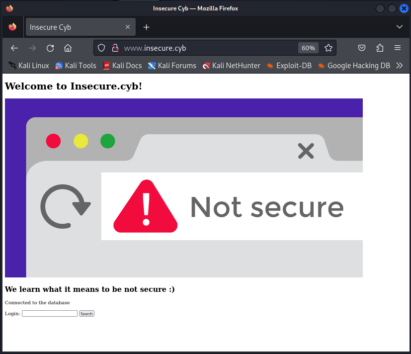

`Website seems to be vulnerable for SQL injection`

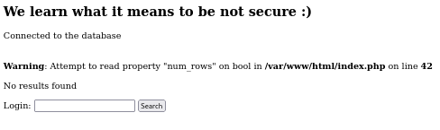

`Perhaps a wordlist over the users in burpsuit would give us some other result`

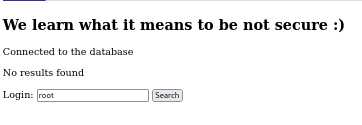

`Or the security is even weaker if we just use the letter 'u'`

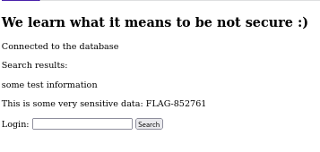

- ***Use a web browser to browse to <http://www.insecure.cyb/cmd> and test out this insecure application.***

`Exploring the network internally (as root)`

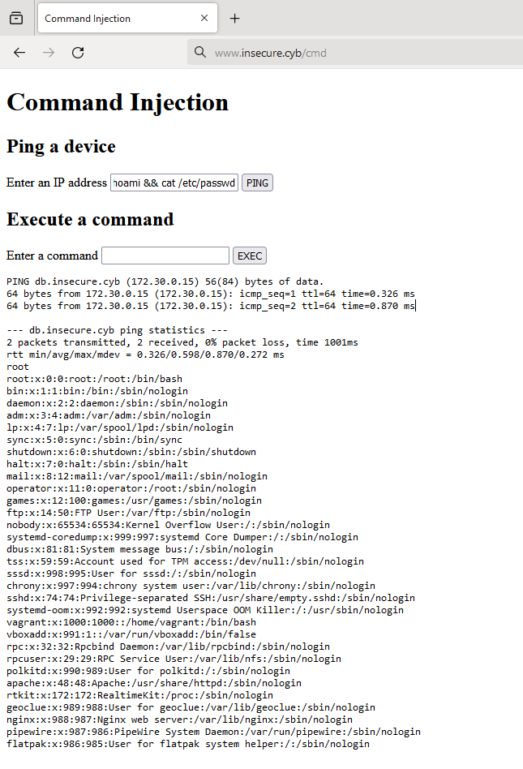

`All is possible i guess`

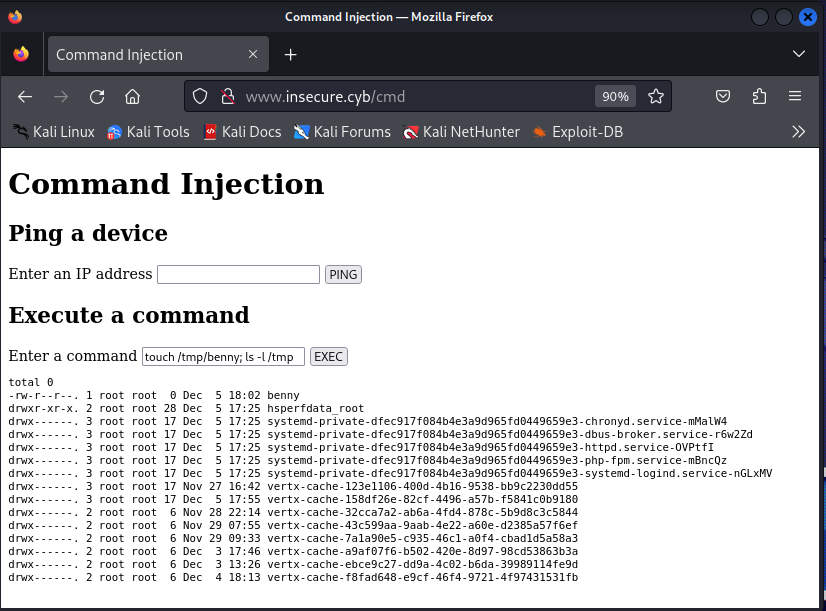

- ***perform a default nmap scan on all machines.***

`First we'll need to install nmap on our fresh debian vm`

```code
vagrant@red:~$ which nmap
vagrant@red:~$ sudo apt install -y nmap >/dev/null 2>&1
vagrant@red:~$ which nmap
/usr/bin/nmap
```

`A ping scan of the company network shows us what is up (or we use the info enumerated from the zone transfer in Lab 01)`

```code
vagrant@red:~$ sudo nmap -sn 172.30.0.0/16
Starting Nmap 7.93 ( https://nmap.org ) at 2023-12-05 18:16 UTC
Nmap scan report for dc.insecure.cyb (172.30.0.4)
Host is up (0.0011s latency).
Nmap scan report for www.insecure.cyb (172.30.0.10)
Host is up (0.00051s latency).
Nmap scan report for database.insecure.cyb (172.30.0.15)
Host is up (0.0015s latency).
Nmap scan report for win10.insecure.cyb (172.30.10.100)
Host is up (0.0010s latency).
```

`companyrouter`

```code
vagrant@red:~$ sudo nmap 172.30.255.254
Starting Nmap 7.93 ( https://nmap.org ) at 2023-12-05 19:28 UTC
Nmap scan report for 172.30.255.254
Host is up (0.00013s latency).
Not shown: 998 closed tcp ports (reset)
PORT    STATE SERVICE
22/tcp  open  ssh
111/tcp open  rpcbind

Nmap done: 1 IP address (1 host up) scanned in 0.14 seconds
```

`dc`

```code
vagrant@red:~$ sudo nmap 172.30.0.4
Starting Nmap 7.93 ( https://nmap.org ) at 2023-12-05 19:28 UTC
Nmap scan report for dc.insecure.cyb (172.30.0.4)
Host is up (0.0013s latency).
Not shown: 987 filtered tcp ports (no-response)
PORT     STATE SERVICE
22/tcp   open  ssh
53/tcp   open  domain
88/tcp   open  kerberos-sec
135/tcp  open  msrpc
139/tcp  open  netbios-ssn
389/tcp  open  ldap
445/tcp  open  microsoft-ds
464/tcp  open  kpasswd5
593/tcp  open  http-rpc-epmap
636/tcp  open  ldapssl
3268/tcp open  globalcatLDAP
3269/tcp open  globalcatLDAPssl
3389/tcp open  ms-wbt-server

Nmap done: 1 IP address (1 host up) scanned in 4.57 seconds
```

`win10`

```code
vagrant@red:~$ sudo nmap 172.30.10.100
Starting Nmap 7.93 ( https://nmap.org ) at 2023-12-05 19:28 UTC
Nmap scan report for win10.insecure.cyb (172.30.10.100)
Host is up (0.00092s latency).
Not shown: 995 closed tcp ports (reset)
PORT     STATE SERVICE
22/tcp   open  ssh
135/tcp  open  msrpc
139/tcp  open  netbios-ssn
445/tcp  open  microsoft-ds
3389/tcp open  ms-wbt-server

Nmap done: 1 IP address (1 host up) scanned in 19.03 seconds
```

`web`

```code
vagrant@red:~$ sudo nmap 172.30.0.10
Starting Nmap 7.93 ( https://nmap.org ) at 2023-12-05 19:28 UTC
Nmap scan report for www.insecure.cyb (172.30.0.10)
Host is up (0.00028s latency).
Not shown: 996 closed tcp ports (reset)
PORT     STATE SERVICE
22/tcp   open  ssh
80/tcp   open  http
111/tcp  open  rpcbind
8000/tcp open  http-alt

Nmap done: 1 IP address (1 host up) scanned in 0.13 seconds
```

`database`

```code
vagrant@red:~$ sudo nmap 172.30.0.15
Starting Nmap 7.93 ( https://nmap.org ) at 2023-12-05 19:28 UTC
Nmap scan report for database.insecure.cyb (172.30.0.15)
Host is up (0.00028s latency).
Not shown: 997 closed tcp ports (reset)
PORT     STATE SERVICE
22/tcp   open  ssh
111/tcp  open  rpcbind
3306/tcp open  mysql

Nmap done: 1 IP address (1 host up) scanned in 0.12 seconds
```

- ***Enumerate the most interesting ports (you found in the previous step) by issuing a service enumeration scan (banner grab scan).***

`companyrouter`

```code
vagrant@red:~$ sudo nmap -sV 172.30.255.254
Starting Nmap 7.93 ( https://nmap.org ) at 2023-12-05 19:39 UTC
Nmap scan report for 172.30.255.254
Host is up (0.000071s latency).
Not shown: 998 closed tcp ports (reset)
PORT    STATE SERVICE VERSION
22/tcp  open  ssh     OpenSSH 8.7 (protocol 2.0)
111/tcp open  rpcbind 2-4 (RPC #100000)

Service detection performed. Please report any incorrect results at https://nmap.org/submit/ .
Nmap done: 1 IP address (1 host up) scanned in 6.36 seconds
```

`dc`

```code
vagrant@red:~$ sudo nmap -sV 172.30.0.4
Starting Nmap 7.93 ( https://nmap.org ) at 2023-12-05 19:41 UTC
Nmap scan report for dc.insecure.cyb (172.30.0.4)
Host is up (0.0012s latency).
Not shown: 987 filtered tcp ports (no-response)
PORT     STATE SERVICE       VERSION
22/tcp   open  ssh           OpenSSH for_Windows_8.0 (protocol 2.0)
53/tcp   open  domain        Simple DNS Plus
88/tcp   open  kerberos-sec  Microsoft Windows Kerberos (server time: 2023-12-05 19:41:24Z)
135/tcp  open  msrpc         Microsoft Windows RPC
139/tcp  open  netbios-ssn   Microsoft Windows netbios-ssn
389/tcp  open  ldap          Microsoft Windows Active Directory LDAP (Domain: insecure.cyb0., Site: Default-First-Site-Name)
445/tcp  open  microsoft-ds?
464/tcp  open  kpasswd5?
593/tcp  open  ncacn_http    Microsoft Windows RPC over HTTP 1.0
636/tcp  open  tcpwrapped
3268/tcp open  ldap          Microsoft Windows Active Directory LDAP (Domain: insecure.cyb0., Site: Default-First-Site-Name)
3269/tcp open  tcpwrapped
3389/tcp open  ms-wbt-server Microsoft Terminal Services
Service Info: Host: DC; OS: Windows; CPE: cpe:/o:microsoft:windows

Service detection performed. Please report any incorrect results at https://nmap.org/submit/ .
Nmap done: 1 IP address (1 host up) scanned in 10.80 seconds
```

`win10`

```code
vagrant@red:~$ sudo nmap -sV 172.30.10.100
Starting Nmap 7.93 ( https://nmap.org ) at 2023-12-05 19:41 UTC
Nmap scan report for win10.insecure.cyb (172.30.10.100)
Host is up (0.0012s latency).
Not shown: 995 closed tcp ports (reset)
PORT     STATE SERVICE       VERSION
22/tcp   open  ssh           OpenSSH for_Windows_8.0 (protocol 2.0)
135/tcp  open  msrpc         Microsoft Windows RPC
139/tcp  open  netbios-ssn   Microsoft Windows netbios-ssn
445/tcp  open  microsoft-ds?
3389/tcp open  ms-wbt-server Microsoft Terminal Services
Service Info: OS: Windows; CPE: cpe:/o:microsoft:windows

Service detection performed. Please report any incorrect results at https://nmap.org/submit/ .
Nmap done: 1 IP address (1 host up) scanned in 8.20 seconds
```

`web`

```code
vagrant@red:~$ sudo nmap -sV 172.30.0.10
Starting Nmap 7.93 ( https://nmap.org ) at 2023-12-05 19:42 UTC
WARNING: Service 172.30.0.10:8000 had already soft-matched rtsp, but now soft-matched sip; ignoring second value
Nmap scan report for www.insecure.cyb (172.30.0.10)
Host is up (0.00025s latency).
Not shown: 996 closed tcp ports (reset)
PORT     STATE SERVICE VERSION
22/tcp   open  ssh     OpenSSH 8.7 (protocol 2.0)
80/tcp   open  http    Apache httpd 2.4.53 ((AlmaLinux))
111/tcp  open  rpcbind 2-4 (RPC #100000)
8000/tcp open  rtsp
1 service unrecognized despite returning data. If you know the service/version, please submit the following fingerprint at https://nmap.org/cgi-bin/submit.cgi?new-service :
SF-Port8000-TCP:V=7.93%I=7%D=12/5%Time=656F7D30%P=x86_64-pc-linux-gnu%r(Ge
SF:tRequest,328,"HTTP/1\.0\x20200\x20OK\r\naccept-ranges:\x20bytes\r\ncont
SF:ent-length:\x20577\r\ncache-control:\x20public,\x20immutable,\x20max-ag
SF:e=86400\r\nlast-modified:\x20Tue,\x205\x20Dec\x202023\x2017:55:04\x20GM
SF:T\r\ndate:\x20Tue,\x205\x20Dec\x202023\x2019:42:40\x20GMT\r\ncontent-ty
SF:pe:\x20text/html;charset=UTF-8\r\n\r\n<!DOCTYPE\x20html>\n<html\x20lang
SF:=\"en\">\n<head>\n\x20\x20\x20\x20<meta\x20charset=\"UTF-8\">\n\x20\x20
SF:\x20\x20<title>Command\x20Injection</title>\n\x20\x20\x20\x20<script\x2
SF:0src=\"assets/javascript/index\.js\"></script>\n</head>\n<body>\n<h1>Co
SF:mmand\x20Injection</h1>\n<form\x20id=\"ping\">\n\x20\x20\x20\x20<h2>Pin
SF:g\x20a\x20device</h2>\n\x20\x20\x20\x20<label\x20for=\"ip\">Enter\x20an
SF:\x20IP\x20address</label>\n\x20\x20\x20\x20<input\x20id=\"ip\"\x20type=
SF:\"text\"/>\n\x20\x20\x20\x20<input\x20type=\"submit\"\x20value=\"PING\"
SF:>\n</form>\n\n<form\x20id=\"exec\">\n\x20\x20\x20\x20<h2>Execute\x20a\x
SF:20command</h2>\n\x20\x20\x20\x20<label\x20for=\"cmd\">Enter\x20a\x20com
SF:mand</label>\n\x20\x20\x20\x20<input\x20id=\"cmd\"\x20type=\"text\"/>\n
SF:\x20\x20\x20\x20<input\x20type=\"submit\"\x20value=\"EXEC\">\n</form>\n
SF:\n<pre></pre>\n</body>\n</html>\n")%r(FourOhFourRequest,8B,"HTTP/1\.0\x
SF:20404\x20Not\x20Found\r\ncontent-type:\x20text/html;\x20charset=utf-8\r
SF:\ncontent-length:\x2053\r\n\r\n<html><body><h1>Resource\x20not\x20found
SF:</h1></body></html>")%r(Socks5,2F,"HTTP/1\.0\x20400\x20Bad\x20Request\r
SF:\ncontent-length:\x200\r\n\r\n")%r(HTTPOptions,8B,"HTTP/1\.0\x20404\x20
SF:Not\x20Found\r\ncontent-type:\x20text/html;\x20charset=utf-8\r\ncontent
SF:-length:\x2053\r\n\r\n<html><body><h1>Resource\x20not\x20found</h1></bo
SF:dy></html>")%r(RTSPRequest,33,"RTSP/1\.0\x20501\x20Not\x20Implemented\r
SF:\ncontent-length:\x200\r\n\r\n")%r(SIPOptions,32,"SIP/2\.0\x20501\x20No
SF:t\x20Implemented\r\ncontent-length:\x200\r\n\r\n");

Service detection performed. Please report any incorrect results at https://nmap.org/submit/ .
Nmap done: 1 IP address (1 host up) scanned in 21.45 seconds
```

`database`

```code
vagrant@red:~$ sudo nmap -sV 172.30.0.15
Starting Nmap 7.93 ( https://nmap.org ) at 2023-12-05 19:43 UTC
Nmap scan report for database.insecure.cyb (172.30.0.15)
Host is up (0.00022s latency).
Not shown: 997 closed tcp ports (reset)
PORT     STATE SERVICE VERSION
22/tcp   open  ssh     OpenSSH 8.7 (protocol 2.0)
111/tcp  open  rpcbind 2-4 (RPC #100000)
3306/tcp open  mysql   MySQL 8.0.32

Service detection performed. Please report any incorrect results at https://nmap.org/submit/ .
Nmap done: 1 IP address (1 host up) scanned in 6.35 seconds
```

- ***What database software is running on the database machine? What version?***

`MySQL 8.0.32`

- ***Try to search for a nmap script to brute-force the database. Another (even easier tool) is called [hydra](https://github.com/vanhauser-thc/thc-hydra). Search online for a good wordlist. For example: <https://github.com/danielmiessler/SecLists> We suggest to try the default username of the database software and attack the database machine. Another interesting username worth a try is "toor".***

`Trying the default and some nmap scripts`

```code
vagrant@red:~$ sudo nmap -sC 172.30.0.15
Starting Nmap 7.93 ( https://nmap.org ) at 2023-12-05 19:47 UTC
Nmap scan report for database.insecure.cyb (172.30.0.15)
Host is up (0.00024s latency).
Not shown: 997 closed tcp ports (reset)
PORT     STATE SERVICE
22/tcp   open  ssh
| ssh-hostkey:
|   256 3781735afffe28e41d282616c2c88b6a (ECDSA)
|_  256 90d8bed196143b9bd29d52658ba97727 (ED25519)
111/tcp  open  rpcbind
| rpcinfo:
|   program version    port/proto  service
|   100000  2,3,4        111/tcp   rpcbind
|   100000  2,3,4        111/udp   rpcbind
|   100000  3,4          111/tcp6  rpcbind
|_  100000  3,4          111/udp6  rpcbind
3306/tcp open  mysql
| ssl-cert: Subject: commonName=MySQL_Server_8.0.32_Auto_Generated_Server_Certificate
| Not valid before: 2023-09-20T14:20:11
|_Not valid after:  2033-09-17T14:20:11
| mysql-info:
|   Protocol: 10
|   Version: 8.0.32
|   Thread ID: 43
|   Capabilities flags: 65535
|   Some Capabilities: Speaks41ProtocolOld, InteractiveClient, IgnoreSigpipes, LongColumnFlag, ODBCClient, SupportsCompression, LongPassword, ConnectWithDatabase, Speaks41ProtocolNew, SupportsTransactions, SwitchToSSLAfterHandshake, IgnoreSpaceBeforeParenthesis, FoundRows, DontAllowDatabaseTableColumn, Support41Auth, SupportsLoadDataLocal, SupportsMultipleResults, SupportsMultipleStatments, SupportsAuthPlugins
|   Status: Autocommit
|   Salt: m>z\x01ZD&e   'E]zH*<?t|\x15
|_  Auth Plugin Name: caching_sha2_password
|_ssl-date: TLS randomness does not represent time

Nmap done: 1 IP address (1 host up) scanned in 1.50 seconds

vagrant@red:~$ sudo nmap -sV --script=mysql-enum -p 3306 172.30.0.15
Starting Nmap 7.93 ( https://nmap.org ) at 2023-12-05 19:57 UTC
Nmap scan report for database.insecure.cyb (172.30.0.15)
Host is up (0.0013s latency).

PORT     STATE SERVICE VERSION
3306/tcp open  mysql   MySQL 8.0.32
| mysql-enum:
|   Valid usernames:
|     root:<empty> - Valid credentials
|     netadmin:<empty> - Valid credentials
|     guest:<empty> - Valid credentials
|     user:<empty> - Valid credentials
|     web:<empty> - Valid credentials
|     sysadmin:<empty> - Valid credentials
|     administrator:<empty> - Valid credentials
|     webadmin:<empty> - Valid credentials
|     admin:<empty> - Valid credentials
|     test:<empty> - Valid credentials
|_  Statistics: Performed 10 guesses in 1 seconds, average tps: 10.0

Service detection performed. Please report any incorrect results at https://nmap.org/submit/ .
Nmap done: 1 IP address (1 host up) scanned in 0.32 seconds

vagrant@red:~$ sudo nmap --script=mysql-brute -p 3306 172.30.0.15
Starting Nmap 7.93 ( https://nmap.org ) at 2023-12-05 20:19 UTC
Nmap scan report for database.insecure.cyb (172.30.0.15)
Host is up (0.00061s latency).

PORT     STATE SERVICE
3306/tcp open  mysql
| mysql-brute:
|   Accounts: No valid accounts found
|_  Statistics: Performed 50009 guesses in 16 seconds, average tps: 3125.6

Nmap done: 1 IP address (1 host up) scanned in 17.09 seconds
```

`Now with some hints, without witch I doubt it would be possible (root can only log in locally, toor is not an easy guess and sammy has no guessable password)`

```code
vagrant@red:~$ sudo apt-get update >/dev/null 2>&1
vagrant@red:~$ sudo apt-get install -y hydra >/dev/null 2>&1
vagrant@red:~$ git clone https://github.com/danielmiessler/SecLists.git >/dev/null 2>&1
vagrant@red:~$ sudo hydra -s 3306 -l toor -P SecLists/Passwords/xato-net-10-million-passwords-100000.txt mysql://172.30.0.15
Hydra v9.4 (c) 2022 by van Hauser/THC & David Maciejak - Please do not use in military or secret service organizations, or for illegal purposes (this is non-binding, these *** ignore laws and ethics anyway).

Hydra (https://github.com/vanhauser-thc/thc-hydra) starting at 2023-12-05 21:10:18
[INFO] Reduced number of tasks to 4 (mysql does not like many parallel connections)
[DATA] max 4 tasks per 1 server, overall 4 tasks, 100000 login tries (l:1/p:100000), ~25000 tries per task
[DATA] attacking mysql://172.30.0.15:3306/
[3306][mysql] host: 172.30.0.15   login: toor   password: summer
1 of 1 target successfully completed, 1 valid password found
[WARNING] Writing restore file because 1 final worker threads did not complete until end.
[ERROR] 1 target did not resolve or could not be connected
[ERROR] 0 target did not complete
Hydra (https://github.com/vanhauser-thc/thc-hydra) finished at 2023-12-05 21:10:29
```

`On kali hydra and other wordlists were allready installed ...`

```code
┌──(kali㉿kali)-[/usr/share/wordlists]
└─$ sudo hydra -s 3306 -l toor -P /usr/share/wordlists/rockyou.txt mysql://172.30.0.15
Hydra v9.5 (c) 2023 by van Hauser/THC & David Maciejak - Please do not use in military or secret service organizations, or for illegal purposes (this is non-binding, these *** ignore laws and ethics anyway).

Hydra (https://github.com/vanhauser-thc/thc-hydra) starting at 2023-12-05 15:56:17
[INFO] Reduced number of tasks to 4 (mysql does not like many parallel connections)
[DATA] max 4 tasks per 1 server, overall 4 tasks, 14344399 login tries (l:1/p:14344399), ~3586100 tries per task
[DATA] attacking mysql://172.30.0.15:3306/
[3306][mysql] host: 172.30.0.15   login: toor   password: summer
1 of 1 target successfully completed, 1 valid password found
Hydra (https://github.com/vanhauser-thc/thc-hydra) finished at 2023-12-05 15:56:29
```

- ***What webserver software is running on web?***

`Apache httpd 2.4.53 ((AlmaLinux))`

- ***Does scanning the DC show you the name of the domain?***

`yes`

```code
vagrant@red:~$ sudo nmap -sC 172.30.0.4
Starting Nmap 7.93 ( https://nmap.org ) at 2023-11-22 14:22 UTC
Nmap scan report for 172.30.0.4
Host is up (0.0014s latency).
Not shown: 987 filtered tcp ports (no-response)
PORT     STATE SERVICE
22/tcp   open  ssh
| ssh-hostkey:
|   3072 f6697c71d51e8258924d4eeacba3ffb1 (RSA)
|   256 62fff4b81282b6d9c08d3641696cd44a (ECDSA)
|_  256 8294ffc7de7605e11be894d3508ea346 (ED25519)
53/tcp   open  domain
88/tcp   open  kerberos-sec
135/tcp  open  msrpc
139/tcp  open  netbios-ssn
389/tcp  open  ldap
445/tcp  open  microsoft-ds
464/tcp  open  kpasswd5
593/tcp  open  http-rpc-epmap
636/tcp  open  ldapssl
3268/tcp open  globalcatLDAP
3269/tcp open  globalcatLDAPssl
3389/tcp open  ms-wbt-server
|_ssl-date: 2023-11-22T14:22:42+00:00; +2s from scanner time.
| rdp-ntlm-info:
|   Target_Name: insecure
|   NetBIOS_Domain_Name: insecure
|   NetBIOS_Computer_Name: DC
|   DNS_Domain_Name: insecure.cyb
|   DNS_Computer_Name: dc.insecure.cyb
|   DNS_Tree_Name: insecure.cyb
|   Product_Version: 10.0.20348
|_  System_Time: 2023-11-22T14:22:42+00:00
| ssl-cert: Subject: commonName=dc.insecure.cyb
| Not valid before: 2023-09-19T13:03:52
|_Not valid after:  2024-03-20T13:03:52

Host script results:
|_clock-skew: mean: 1s, deviation: 0s, median: 1s
| smb2-security-mode:
|   311:
|_    Message signing enabled and required
| smb2-time:
|   date: 2023-11-22T14:22:47
|_  start_date: N/A

Nmap done: 1 IP address (1 host up) scanned in 44.84 seconds
```

- ***Try the -sC option with nmap on the windows 10. What is this option?***

`SCRIPT SCAN: -sC: equivalent to --script=default`

```code
vagrant@red:~$ sudo nmap -sC 172.30.10.100
Starting Nmap 7.93 ( https://nmap.org ) at 2023-12-05 20:02 UTC
Nmap scan report for win10.insecure.cyb (172.30.10.100)
Host is up (0.00070s latency).
Not shown: 995 closed tcp ports (reset)
PORT     STATE SERVICE
22/tcp   open  ssh
| ssh-hostkey:
|   3072 965649e71db01c51a23c90b2f45d6b0a (RSA)
|   256 a2a604d35dbb075f58bdaa7b7bdb7b9b (ECDSA)
|_  256 e1215c82625ecffdb0da549974333205 (ED25519)
135/tcp  open  msrpc
139/tcp  open  netbios-ssn
445/tcp  open  microsoft-ds
3389/tcp open  ms-wbt-server
| rdp-ntlm-info:
|   Target_Name: insecure
|   NetBIOS_Domain_Name: insecure
|   NetBIOS_Computer_Name: WIN10
|   DNS_Domain_Name: insecure.cyb
|   DNS_Computer_Name: win10.insecure.cyb
|   Product_Version: 10.0.19041
|_  System_Time: 2023-12-05T20:02:07+00:00
|_ssl-date: 2023-12-05T20:02:07+00:00; 0s from scanner time.
| ssl-cert: Subject: commonName=win10.insecure.cyb
| Not valid before: 2023-09-19T13:18:12
|_Not valid after:  2024-03-20T13:18:12

Host script results:
| smb2-time:
|   date: 2023-12-05T20:02:09
|_  start_date: N/A
| smb2-security-mode:
|   311:
|_    Message signing enabled but not required

Nmap done: 1 IP address (1 host up) scanned in 16.63 seconds
```

- ***Try to SSH (using vagrant/vagrant) from red to another machine. Is this possible?***

`yes`

```code
vagrant@red:~$ cat ~/.ssh/config
Host 172.30.*.*
  StrictHostKeyChecking no
vagrant@red:~$ sudo apt install -y sshpass >/dev/null 2>&1
vagrant@red:~$ sshpass -p 'vagrant' ssh vagrant@172.30.255.254 whoami
Warning: Permanently added '172.30.255.254' (ED25519) to the list of known hosts.
vagrant
vagrant@red:~$ sshpass -p 'vagrant' ssh vagrant@172.30.0.4 whoami
Warning: Permanently added '172.30.0.4' (ED25519) to the list of known hosts.
insecure\vagrant
vagrant@red:~$ sshpass -p 'vagrant' ssh vagrant@172.30.10.100 whoami
Warning: Permanently added '172.30.10.100' (ED25519) to the list of known hosts.
win10\vagrant
vagrant@red:~$ sshpass -p 'vagrant' ssh vagrant@172.30.0.10 whoami
Warning: Permanently added '172.30.0.10' (ED25519) to the list of known hosts.
vagrant
vagrant@red:~$ sshpass -p 'vagrant' ssh vagrant@172.30.0.15 whoami
Warning: Permanently added '172.30.0.15' (ED25519) to the list of known hosts.
vagrant
vagrant@red:~$ cat ~/.ssh/known_hosts
|1|0p5LAg1waXA1bG/Elccu8P5Ge0M=|PB5XBS1DMxBYzzocYfCAHie2c2c= ssh-ed25519 AAAAC3NzaC1lZDI1NTE5AAAAIBmTmKjxcwxgxwSHB/D+gXZ42VlegYQA6SgOrhsQZLV4
|1|8oThlYs04rgAf5LlkY0KYePg+/A=|nQj9Jw8Gf6ZeJdRiSuiYYtO93bk= ssh-ed25519 AAAAC3NzaC1lZDI1NTE5AAAAIHOB+qCorv8u4TqdQZpJABk/QdT5Yd1DC1lQtZN9VHBf
|1|bbwgW4u0TyxGphM/sf4AwmSAGRo=|PEl/v7UIj5sKUVLuYCWnPUxhDJw= ssh-ed25519 AAAAC3NzaC1lZDI1NTE5AAAAIAGF6UvFBGLaJRuSWHrbLq+ORfBy9OvITCYdh201+GuU
|1|swhYzpww4/A2EwMXBtZVoyf/0Vw=|Tf2oHseHEwxlGUMrFyNhBizU9L4= ssh-ed25519 AAAAC3NzaC1lZDI1NTE5AAAAIHnInhOlAbyQWbKImezQKabs7erE10Y5O4t2PtVm74OQ
|1|kGvw+xV4X9CgKM3qVt3VSATvZ68=|JQOkjgc7vAFxgDqbmH8OD95MOlY= ssh-ed25519 AAAAC3NzaC1lZDI1NTE5AAAAIAeaodC2l9Fh2AAwBULgZ8SaO5TQIg5pew/zBYCGnv8M
```

## Network Segmentation

***As you can see, a hacker on this host-only network, has no restrictions to interact with the other machines. This is not a best-practice! A way to resolve this issue, is using network segmentation. By dividing the network in several segments and properly configuring the access to and from these subnets you can reduce the attack vector a lot.***

- ***What is meant with the term "attack vector"?***

`chatGPT to the rescue and not such a bad definition`

```code
In the context of network segmentation, an "attack vector" refers to the pathway or means by which a malicious actor could potentially exploit vulnerabilities and gain unauthorized access to a specific segment or area of a network. Network segmentation involves dividing a computer network into smaller, isolated segments to enhance security and minimize the impact of potential security breaches.

An attack vector could be any route or method through which an attacker might attempt to compromise the security of a network segment. The goal of network segmentation is to limit these attack vectors by restricting communication between different segments and controlling access to sensitive resources.

Effective network segmentation aims to reduce the number of potential attack vectors by implementing measures such as access controls, firewalls, and intrusion detection systems. By doing so, organizations can enhance their overall security posture and mitigate the impact of security incidents by containing threats within specific network segments.
```

- ***Is there already network segmentation done on the company network?***

`No, it is one giant network: 172.30.0.0/16`

- ***Remember what a DMZ is? What machines would be in the DMZ in this environment?***

`Only the web vm should be in the DMZ`

- ***What could be a disadvantage of using network segmentation in this case? Tip: `win10` <-> `dc` interaction.***

`All traffice would have to pass through the router, using it's cpu and making it a SPOF`

***Configure the environment, and especially `companyrouter` to make sure that the `red` machine is not able to interact with most systems anymore. The only requirements that are left for the `red` machine are:***

- ***Browsing to <http://www.insecure.cyb> should work. Note: you are allowed to manually add a DNS entry to the red machine to tell the system how to resolve "www.insecure.cyb". Do be mindful why this is needed!***

`Since the ip of web will change....`

```code
vagrant@red:~$ cat /etc/hosts
127.0.0.1       localhost
127.0.1.1       debian

# The following lines are desirable for IPv6 capable hosts
::1     localhost ip6-localhost ip6-loopback
ff02::1 ip6-allnodes
ff02::2 ip6-allrouters

127.0.0.1 debian12.localdomain

127.0.2.1 red red

172.30.0.4 dc.insecure.cyb
172.30.20.10 www.insecure.cyb
172.30.20.10 web.insecure.cyb
172.30.0.15 database.insecure.cyb
172.30.10.100 win10.insecure.cyb
```

`And also on my host (cat C:\Windows\System32\drivers\etc\hosts)`

```code
# cybersecurity advanced 2023-2024
192.168.100.253 companyrouter
192.168.100.254 isprouter
192.168.100.166 red
192.168.100.66 kali
172.30.0.4 dc
172.30.20.10 web
172.30.20.10 www.insecure.cyb
172.30.20.10 insecure.cyb
172.30.0.15 database
172.30.10.100 win10
```

- ***All machines in the company network should still have internet access***
- ***You should verify what functionality you might lose implementing the network segmentation. List out and create an overview of the advantages and disadvantages.***
- ***You should be able to revert back easily: Create proper documentation!*** `Easily is a liberal interpretation`

`First step before setting up a firewall is segmenting the network in three new zones and recheck connectivity`

- `servers @ 172.30.0.0/24: dc, database`
- `clients @ 172.30.10.0/24: win10`
- `dmz @ 172.30.20.0/24: web`

`companyrouter`

- `power down the vm and attach the new zones to nic 2 (servers), 3 (clients) and 4 (dmz)`


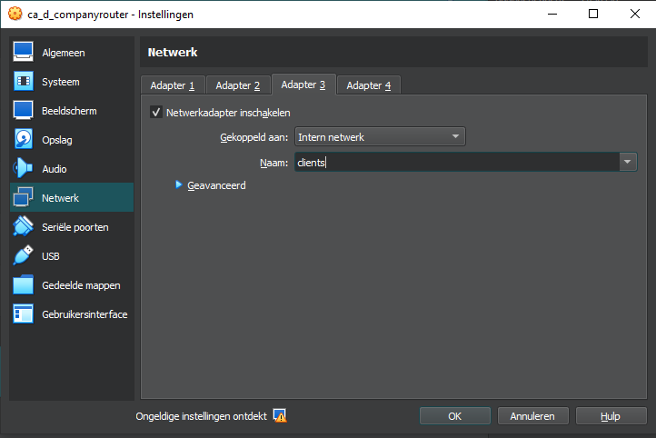


- `adjust settings of nics`

```code
PS C:\data\git\ca> VBoxManage startvm "ca_d_companyrouter" --type headless
Waiting for VM "ca_d_companyrouter" to power on...
VM "ca_d_companyrouter" has been successfully started.
PS C:\data\git\ca> ssh vagrant@companyrouter
vagrant@companyrouter's password:
Last login: Tue Dec  5 19:22:50 2023 from 192.168.100.1
[vagrant@companyrouter ~]$sudo nmtui
[vagrant@companyrouter ~]$sudo reboot
[vagrant@companyrouter ~]$ Connection to companyrouter closed by remote host.
Connection to companyrouter closed.
PS C:\data\git\ca> ssh vagrant@companyrouter
vagrant@companyrouter's password:
Last login: Tue Dec  5 22:58:06 2023 from 192.168.100.1
[vagrant@companyrouter ~]$ ip -4 a
1: lo: <LOOPBACK,UP,LOWER_UP> mtu 65536 qdisc noqueue state UNKNOWN group default qlen 1000
    inet 127.0.0.1/8 scope host lo
       valid_lft forever preferred_lft forever
2: eth0: <BROADCAST,MULTICAST,UP,LOWER_UP> mtu 1500 qdisc fq_codel state UP group default qlen 1000
    altname enp0s3
    inet 192.168.100.253/24 brd 192.168.100.255 scope global noprefixroute eth0
       valid_lft forever preferred_lft forever
3: eth1: <BROADCAST,MULTICAST,UP,LOWER_UP> mtu 1500 qdisc fq_codel state UP group default qlen 1000
    altname enp0s8
    inet 172.30.0.254/24 brd 172.30.0.255 scope global noprefixroute eth1
       valid_lft forever preferred_lft forever
4: eth2: <BROADCAST,MULTICAST,UP,LOWER_UP> mtu 1500 qdisc fq_codel state UP group default qlen 1000
    altname enp0s9
    inet 172.30.10.254/24 brd 172.30.10.255 scope global noprefixroute eth2
       valid_lft forever preferred_lft forever
5: eth3: <BROADCAST,MULTICAST,UP,LOWER_UP> mtu 1500 qdisc fq_codel state UP group default qlen 1000
    altname enp0s10
    inet 172.30.20.254/24 brd 172.30.20.255 scope global noprefixroute eth3
       valid_lft forever preferred_lft forever
[vagrant@companyrouter ~]$ ip r
default via 192.168.100.254 dev eth0 proto static metric 100
172.30.0.0/24 dev eth1 proto kernel scope link src 172.30.0.254 metric 101
172.30.10.0/24 dev eth2 proto kernel scope link src 172.30.10.254 metric 102
172.30.20.0/24 dev eth3 proto kernel scope link src 172.30.20.254 metric 103
192.168.100.0/24 dev eth0 proto kernel scope link src 192.168.100.253 metric 100
```

- `configure dhcp settings (gateway and listening eth) so clients will get correct information`

```code
[vagrant@companyrouter ~]$ sudo cat /etc/dhcp/dhcpd.conf
# dhcpd.conf
#
# Sample configuration file for ISC dhcpd
#

# option definitions common to all supported networks...
option domain-name "insecure.cyb";
option domain-name-servers 172.30.0.4;

default-lease-time 600;
max-lease-time 7200;

# Use this to enble / disable dynamic dns updates globally.
#ddns-update-style none;

# If this DHCP server is the official DHCP server for the local
# network, the authoritative directive should be uncommented.
authoritative;

# Use this to send dhcp log messages to a different log file (you also
# have to hack syslog.conf to complete the redirection).
log-facility local7;


subnet 172.30.10.0 netmask 255.255.255.0 {
  range 172.30.10.100 172.30.10.200;
  option routers 172.30.10.254;
}
[vagrant@companyrouter ~]$ sudo cat /etc/default/isc-dhcp-server
INTERFACES="eth2"
[vagrant@companyrouter ~]$ sudo systemctl restart dhcpd

```

`dc`

- `power down the vm and attach the nic to zone servers`

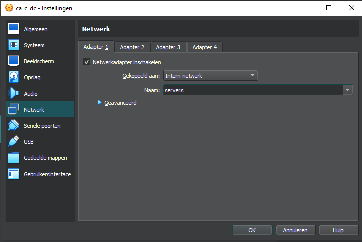

- `set a new gateway`

`Na ENORM veel geklooi met powershell`

```code
New-NetIPAddress -InterfaceAlias "Ethernet" -IPAddress NewIPAddress -PrefixLength 24 -DefaultGateway NewDefaultGateway
Set-NetIPAddress -InterfaceIndex 5 -IPAddress 172.30.0.44 -AddressFamily IPv4 -PrefixLength 24

PS C:\Users\vagrant> Remove-NetIPAddress -IPAddress 172.30.0.4

Confirm
Are you sure you want to perform this action?
Performing operation "Remove" on Target "NetIPAddress -IPv4Address 172.30.0.4 -InterfaceIndex 5 -Store Active"
[Y] Yes  [A] Yes to All  [N] No  [L] No to All  [S] Suspend  [?] Help (default is "Y"): y

Confirm
Are you sure you want to perform this action?
Performing operation "Remove" on Target "NetIPAddress -IPv4Address 172.30.0.4 -InterfaceIndex 5 -Store Persistent"
[Y] Yes  [A] Yes to All  [N] No  [L] No to All  [S] Suspend  [?] Help (default is "Y"): y
PS C:\Users\vagrant>
                   > Restart-NetAdapter -InterfaceAlias "Ethernet"
client_loop: send disconnect: Connection reset
PS C:\data\git\ca> ssh vagrant@172.30.0.44
vagrant@172.30.0.44's password:
Microsoft Windows [Version 10.0.20348.887]
(c) Microsoft Corporation. All rights reserved.

insecure\vagrant@DC C:\Users\vagrant>ipconfig

Windows IP Configuration


Ethernet adapter Ethernet:

   Connection-specific DNS Suffix  . :
   Link-local IPv6 Address . . . . . : fe80::b84c:9536:3ca6:f5eb%5
   IPv4 Address. . . . . . . . . . . : 172.30.0.44
   Subnet Mask . . . . . . . . . . . : 255.255.255.0
   Default Gateway . . . . . . . . . : 172.30.255.254
                                       172.30.0.254

PS C:\Users\vagrant> Get-NetRoute -DestinationPrefix 0.0.0.0/0

ifIndex DestinationPrefix                              NextHop                                  RouteMetric ifMetric PolicyStore
------- -----------------                              -------                                  ----------- -------- -----------
5       0.0.0.0/0                                      172.30.0.254                                     256 25       ActiveStore
5       0.0.0.0/0                                      172.30.255.254                                     1 25       ActiveStore


PS C:\Users\vagrant>
                     Remove-NetRoute -InterfaceIndex 5 -DestinationPrefix 0.0.0.0/0

Confirm
Are you sure you want to perform this action?
Performing operation "Remove" on Target "NetRoute -DestinationPrefix 0.0.0.0/0 -InterfaceIndex 5 -NextHop 172.30.0.254 -Store Active"
[Y] Yes  [A] Yes to All  [N] No  [L] No to All  [S] Suspend  [?] Help (default is "Y"): n

Confirm
Are you sure you want to perform this action?
Performing operation "Remove" on Target "NetRoute -DestinationPrefix 0.0.0.0/0 -InterfaceIndex 5 -NextHop 172.30.255.254 -Store Active"
[Y] Yes  [A] Yes to All  [N] No  [L] No to All  [S] Suspend  [?] Help (default is "Y"): y

Confirm
Are you sure you want to perform this action?
Performing operation "Remove" on Target "NetRoute -DestinationPrefix 0.0.0.0/0 -InterfaceIndex 5 -NextHop 172.30.0.254 -Store Persistent"
[Y] Yes  [A] Yes to All  [N] No  [L] No to All  [S] Suspend  [?] Help (default is "Y"): n

Confirm
Are you sure you want to perform this action?
Performing operation "Remove" on Target "NetRoute -DestinationPrefix 0.0.0.0/0 -InterfaceIndex 5 -NextHop 172.30.255.254 -Store Persistent"
[Y] Yes  [A] Yes to All  [N] No  [L] No to All  [S] Suspend  [?] Help (default is "Y"): y
PS C:\Users\vagrant>
```

```code
insecure\vagrant@DC C:\Users\vagrant>ipconfig /all

Windows IP Configuration

   Host Name . . . . . . . . . . . . : dc
   Primary Dns Suffix  . . . . . . . : insecure.cyb
   Node Type . . . . . . . . . . . . : Hybrid
   IP Routing Enabled. . . . . . . . : No
   WINS Proxy Enabled. . . . . . . . : No
   DNS Suffix Search List. . . . . . : insecure.cyb

Ethernet adapter Ethernet:

   Connection-specific DNS Suffix  . :
   Description . . . . . . . . . . . : Intel(R) PRO/1000 MT Desktop Adapter
   Physical Address. . . . . . . . . : 08-00-27-CC-A9-66
   DHCP Enabled. . . . . . . . . . . : No
   Autoconfiguration Enabled . . . . : Yes
   Link-local IPv6 Address . . . . . : fe80::b84c:9536:3ca6:f5eb%5(Preferred)
   IPv4 Address. . . . . . . . . . . : 172.30.0.4(Preferred)
   Subnet Mask . . . . . . . . . . . : 255.255.255.0
   Default Gateway . . . . . . . . . : 172.30.0.254
   DNS Servers . . . . . . . . . . . : ::1
                                       127.0.0.1
   NetBIOS over Tcpip. . . . . . . . : Enabled
```

- `adjust dns records`

`Om geklooi met powersheel even te laten rusten ... voor het gemak gekozen en aangepast met servermanager vanop win10 (straks)`

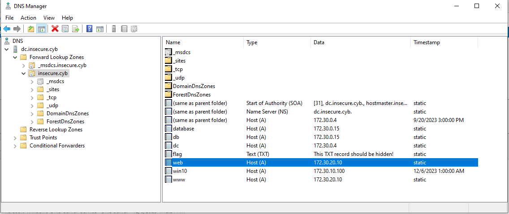

```code
PS C:\Users\vagrant> Get-DnsServerResourceRecord -ZoneName "insecure.cyb" -RRType A

HostName                  RecordType Type       Timestamp            TimeToLive      RecordData
--------                  ---------- ----       ---------            ----------      ----------
@                         A          1          9/20/2023 3:00:00 PM 00:10:00        172.30.0.4
database                  A          1          0                    01:00:00        172.30.0.15
db                        A          1          0                    01:00:00        172.30.0.15
dc                        A          1          0                    01:00:00        172.30.0.4
DomainDnsZones            A          1          9/20/2023 3:00:00 PM 00:10:00        172.30.0.4
ForestDnsZones            A          1          9/20/2023 3:00:00 PM 00:10:00        172.30.0.4
web                       A          1          0                    01:00:00        172.30.20.10
win10                     A          1          12/6/2023 1:00:00 AM 00:20:00        172.30.10.100
www                       A          1          0                    01:00:00        172.30.20.10
```

`win10`

- power down the vm and attach the nic to zone clients

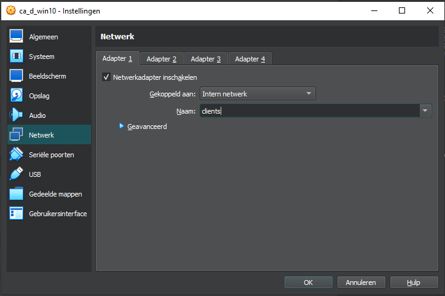

`long live dhcp`

```code
C:\Users\vagrant.insecure>ipconfig /all

Windows IP Configuration

   Host Name . . . . . . . . . . . . : win10
   Primary Dns Suffix  . . . . . . . : insecure.cyb
   Node Type . . . . . . . . . . . . : Hybrid
   IP Routing Enabled. . . . . . . . : No
   WINS Proxy Enabled. . . . . . . . : No
   DNS Suffix Search List. . . . . . : insecure.cyb

Ethernet adapter Ethernet:

   Connection-specific DNS Suffix  . : insecure.cyb
   Description . . . . . . . . . . . : Intel(R) PRO/1000 MT Desktop Adapter
   Physical Address. . . . . . . . . : 08-00-27-B3-9D-75
   DHCP Enabled. . . . . . . . . . . : Yes
   Autoconfiguration Enabled . . . . : Yes
   IPv4 Address. . . . . . . . . . . : 172.30.10.100(Preferred)
   Subnet Mask . . . . . . . . . . . : 255.255.255.0
   Lease Obtained. . . . . . . . . . : Wednesday, December 6, 2023 1:23:37 AM
   Lease Expires . . . . . . . . . . : Wednesday, December 6, 2023 1:33:37 AM
   Default Gateway . . . . . . . . . : 172.30.10.254
   DHCP Server . . . . . . . . . . . : 172.30.10.254
   DNS Servers . . . . . . . . . . . : 172.30.0.4
   NetBIOS over Tcpip. . . . . . . . : Enabled

C:\Users\vagrant.insecure>ping dc

Pinging dc.insecure.cyb [172.30.0.4] with 32 bytes of data:
Reply from 172.30.0.4: bytes=32 time=1ms TTL=127
Reply from 172.30.0.4: bytes=32 time=1ms TTL=127
Reply from 172.30.0.4: bytes=32 time=1ms TTL=127
Reply from 172.30.0.4: bytes=32 time=1ms TTL=127

Ping statistics for 172.30.0.4:
    Packets: Sent = 4, Received = 4, Lost = 0 (0% loss),
Approximate round trip times in milli-seconds:
    Minimum = 1ms, Maximum = 1ms, Average = 1ms

C:\Users\vagrant.insecure>tracert www.google.be

Tracing route to www.google.be [172.217.23.195]
over a maximum of 30 hops:

  1    <1 ms    <1 ms    <1 ms  172.30.10.254
  2     1 ms     1 ms    <1 ms  192.168.100.254
  3     1 ms     1 ms     1 ms  10.0.2.2
  4     5 ms     3 ms     3 ms  192.168.0.1
...

C:\Users\vagrant.insecure>ping www.hln.be

Pinging e27717.dscb.akamaiedge.net [88.221.83.195] with 32 bytes of data:
Reply from 88.221.83.195: bytes=32 time=22ms TTL=55
Reply from 88.221.83.195: bytes=32 time=13ms TTL=55
Reply from 88.221.83.195: bytes=32 time=13ms TTL=55
Reply from 88.221.83.195: bytes=32 time=19ms TTL=55

Ping statistics for 88.221.83.195:
    Packets: Sent = 4, Received = 4, Lost = 0 (0% loss),
Approximate round trip times in milli-seconds:
    Minimum = 13ms, Maximum = 22ms, Average = 16ms
```

```code
[vagrant@companyrouter ~]$ cat /var/lib/dhcpd/dhcpd.leases
# The format of this file is documented in the dhcpd.leases(5) manual page.
# This lease file was written by isc-dhcp-4.4.2b1

# authoring-byte-order entry is generated, DO NOT DELETE
authoring-byte-order little-endian;

lease 172.30.10.100 {
  starts 3 2023/12/06 00:23:37;
  ends 3 2023/12/06 00:33:37;
  cltt 3 2023/12/06 00:23:37;
  binding state active;
  next binding state free;
  rewind binding state free;
  hardware ethernet 08:00:27:b3:9d:75;
  uid "\001\010\000'\263\235u";
  set vendor-class-identifier = "MSFT 5.0";
  client-hostname "win10";
}
[vagrant@companyrouter ~]$ date
Wed Dec  6 00:28:28 UTC 2023
```

`web`

- power down the vm and attach the nic to zone dmz


- set a new ip and gateway

```code
[vagrant@web ~]$ sudo nmtui
```

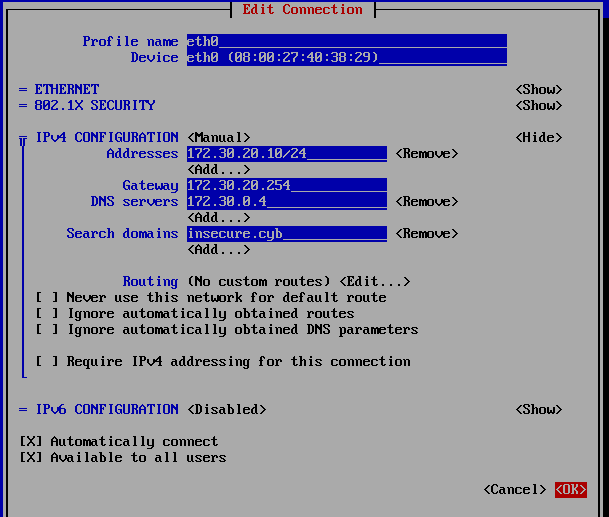

```code
[vagrant@web ~]$ sudo cat /etc/NetworkManager/system-connections/eth0.nmconnection
[connection]
id=eth0
uuid=cd1b691b-85b0-4a40-8c12-8f7ff2e8ce5f
type=ethernet
interface-name=eth0
timestamp=1701822660

[ethernet]

[ipv4]
address1=172.30.20.10/24,172.30.20.254
dns=172.30.0.4;
dns-search=insecure.cyb;
method=manual

[ipv6]
addr-gen-mode=eui64
method=disabled

[proxy]
[vagrant@web ~]$ ip -4 a
1: lo: <LOOPBACK,UP,LOWER_UP> mtu 65536 qdisc noqueue state UNKNOWN group default qlen 1000
    inet 127.0.0.1/8 scope host lo
       valid_lft forever preferred_lft forever
2: eth0: <BROADCAST,MULTICAST,UP,LOWER_UP> mtu 1500 qdisc fq_codel state UP group default qlen 1000
    altname enp0s3
    inet 172.30.20.10/24 brd 172.30.20.255 scope global noprefixroute eth0
       valid_lft forever preferred_lft forever
[vagrant@web ~]$ ip r
default via 172.30.20.254 dev eth0 proto static metric 100
172.30.20.0/24 dev eth0 proto kernel scope link src 172.30.20.10 metric 100
```

`database`

- power down the vm and attach the nic to zone servers


- set a new gateway

```code
[vagrant@database ~]$ sudo cat /etc/NetworkManager/system-connections/eth0.nmconnection
[connection]
id=eth0
uuid=cd1b691b-85b0-4a40-8c12-8f7ff2e8ce5f
type=ethernet
interface-name=eth0
timestamp=1695220166

[ethernet]

[ipv4]
address1=172.30.0.15/24,172.30.0.254
dns=172.30.0.4;
dns-search=insecure.cyb;
method=manual

[ipv6]
addr-gen-mode=eui64
method=disabled

[proxy]
[vagrant@database ~]$ sudo reboot
[vagrant@database ~]$ Connection to database closed by remote host.
Connection to database closed.
PS C:\data\git\ca> ssh vagrant@database "ip -4 a; ip r"
vagrant@database's password:
1: lo: <LOOPBACK,UP,LOWER_UP> mtu 65536 qdisc noqueue state UNKNOWN group default qlen 1000
    inet 127.0.0.1/8 scope host lo
       valid_lft forever preferred_lft forever
2: eth0: <BROADCAST,MULTICAST,UP,LOWER_UP> mtu 1500 qdisc fq_codel state UP group default qlen 1000
    altname enp0s3
    inet 172.30.0.15/24 brd 172.30.0.255 scope global noprefixroute eth0
       valid_lft forever preferred_lft forever
default via 172.30.0.254 dev eth0 proto static metric 100
172.30.0.0/16 dev eth0 proto kernel scope link src 172.30.0.15 metric 100
```

`testing connectivity`

```code
vagrant@red:~$ sshpass -p 'vagrant' ssh vagrant@172.30.0.4 whoami
insecure\vagrant
vagrant@red:~$ sshpass -p 'vagrant' ssh vagrant@172.30.10.100 whoami
win10\vagrant
vagrant@red:~$ sshpass -p 'vagrant' ssh vagrant@172.30.20.10 whoami
Warning: Permanently added '172.30.20.10' (ED25519) to the list of known hosts.
vagrant
vagrant@red:~$ sshpass -p 'vagrant' ssh vagrant@172.30.0.15 whoami
vagrant
```

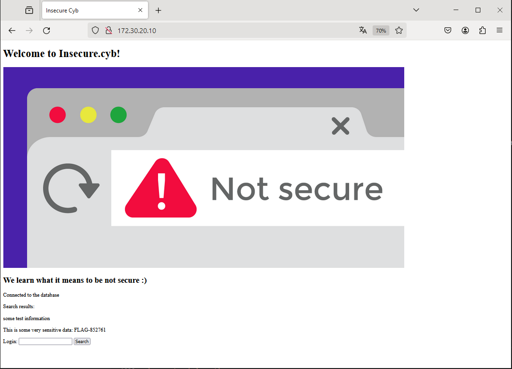

`new network layout`

<!-- TODO: SCHEME -->

## Firewall

***You are free to choose how you will implement this but be sure to be able to explain your reasoning. Document everything properly before making changes to existing configuration files. We suggest to use your knowledge of virtualbox as well. The goal of this exercise is to configure `companyrouter` as a firewall. Software that can help is for example `firewall-cmd`, `iptables` or `nftables`.***

`Lab 01 and this output from iptables shows the default filter (ACCEPT) is applied (-t = table, -L = list, -n = numeric, -v = verboseS)`

```code
[vagrant@companyrouter ~]$ sudo iptables -S
-P INPUT ACCEPT
-P FORWARD ACCEPT
-P OUTPUT ACCEPT

[vagrant@companyrouter ~]$ sudo iptables -t filter -L -n -v
Chain INPUT (policy ACCEPT 0 packets, 0 bytes)
 pkts bytes target     prot opt in     out     source               destination

Chain FORWARD (policy ACCEPT 0 packets, 0 bytes)
 pkts bytes target     prot opt in     out     source               destination

Chain OUTPUT (policy ACCEPT 0 packets, 0 bytes)
 pkts bytes target     prot opt in     out     source               destination
```

```code
[vagrant@companyrouter ~]$ ls /etc/iptables/rules-save
ls: cannot access '/etc/iptables/rules-save': No such file or directory
```

`Nftables is allready available on the company router and also shows nothing is configured`

```code
[vagrant@companyrouter ~]$ which nft
/usr/sbin/nft
[vagrant@companyrouter ~]$ nft --version
nftables v1.0.4 (Lester Gooch #3)
[vagrant@companyrouter ~]$ sudo nft list tables
```


## Open, closed, filtered ports

***Finish by performing a nmap scan to `web` on ports `80`, `22` and `666`. For port `80` you should see "open", what do you notice on port `22` and `666`? Can you explain this result? Make your firewall insecure again and rerun the scan, analyze the differences. We expect you to learn and know the difference between open/closed/filtered!***


vagrant@red:~$ sudo nmap -sn 172.30.0.0/24
Starting Nmap 7.93 ( https://nmap.org ) at 2023-11-22 14:22 UTC
Nmap scan report for 172.30.0.4
Host is up (0.0015s latency).
Nmap done: 256 IP addresses (1 host up) scanned in 4.02 seconds


vagrant@red:~$ sudo nmap -A 172.30.0.4
Starting Nmap 7.93 ( https://nmap.org ) at 2023-11-22 14:38 UTC
Nmap scan report for 172.30.0.4
Host is up (0.0013s latency).
Not shown: 987 filtered tcp ports (no-response)
PORT     STATE SERVICE       VERSION
22/tcp   open  ssh           OpenSSH for_Windows_8.0 (protocol 2.0)
| ssh-hostkey:
|   3072 f6697c71d51e8258924d4eeacba3ffb1 (RSA)
|   256 62fff4b81282b6d9c08d3641696cd44a (ECDSA)
|_  256 8294ffc7de7605e11be894d3508ea346 (ED25519)
53/tcp   open  domain        Simple DNS Plus
88/tcp   open  kerberos-sec  Microsoft Windows Kerberos (server time: 2023-11-22 14:39:08Z)
135/tcp  open  msrpc         Microsoft Windows RPC
139/tcp  open  netbios-ssn   Microsoft Windows netbios-ssn
389/tcp  open  ldap          Microsoft Windows Active Directory LDAP (Domain: insecure.cyb0., Site: Default-First-Site-Name)
445/tcp  open  microsoft-ds?
464/tcp  open  kpasswd5?
593/tcp  open  ncacn_http    Microsoft Windows RPC over HTTP 1.0
636/tcp  open  tcpwrapped
3268/tcp open  ldap          Microsoft Windows Active Directory LDAP (Domain: insecure.cyb0., Site: Default-First-Site-Name)
3269/tcp open  tcpwrapped
3389/tcp open  ms-wbt-server Microsoft Terminal Services
| ssl-cert: Subject: commonName=dc.insecure.cyb
| Not valid before: 2023-09-19T13:03:52
|_Not valid after:  2024-03-20T13:03:52
|_ssl-date: 2023-11-22T14:39:52+00:00; +1s from scanner time.
| rdp-ntlm-info:
|   Target_Name: insecure
|   NetBIOS_Domain_Name: insecure
|   NetBIOS_Computer_Name: DC
|   DNS_Domain_Name: insecure.cyb
|   DNS_Computer_Name: dc.insecure.cyb
|   DNS_Tree_Name: insecure.cyb
|   Product_Version: 10.0.20348
|_  System_Time: 2023-11-22T14:39:12+00:00
Warning: OSScan results may be unreliable because we could not find at least 1 open and 1 closed port
Device type: general purpose
Running (JUST GUESSING): Microsoft Windows 2016|10|2012|Vista (93%)
OS CPE: cpe:/o:microsoft:windows_server_2016 cpe:/o:microsoft:windows_10 cpe:/o:microsoft:windows_server_2012:r2 cpe:/o:microsoft:windows_vista::sp1:home_premium
Aggressive OS guesses: Microsoft Windows Server 2016 (93%), Microsoft Windows 10 (89%), Microsoft Windows Server 2012 or Windows Server 2012 R2 (87%), Microsoft Windows Vista Home Premium SP1 (85%), Microsoft Windows Server 2012 R2 (85%)
No exact OS matches for host (test conditions non-ideal).
Network Distance: 2 hops
Service Info: Host: DC; OS: Windows; CPE: cpe:/o:microsoft:windows

Host script results:
| smb2-time:
|   date: 2023-11-22T14:39:17
|_  start_date: N/A
| smb2-security-mode:
|   311:
|_    Message signing enabled and required

TRACEROUTE (using port 139/tcp)
HOP RTT     ADDRESS
1   0.76 ms 192.168.100.253
2   1.63 ms 172.30.0.4

OS and Service detection performed. Please report any incorrect results at https://nmap.org/submit/ .
Nmap done: 1 IP address (1 host up) scanned in 54.95 seconds
```

```code
vagrant@red:~$ dig axfr @172.30.0.4 insecure.cyb

; <<>> DiG 9.18.19-1~deb12u1-Debian <<>> axfr @172.30.0.4 insecure.cyb
; (1 server found)
;; global options: +cmd
insecure.cyb.           3600    IN      SOA     dc.insecure.cyb. hostmaster.insecure.cyb. 28 900 600 86400 3600
insecure.cyb.           600     IN      A       172.30.0.4
insecure.cyb.           3600    IN      NS      dc.insecure.cyb.
_msdcs.insecure.cyb.    3600    IN      NS      dc.insecure.cyb.
_gc._tcp.Default-First-Site-Name._sites.insecure.cyb. 600 IN SRV 0 100 3268 dc.insecure.cyb.
_kerberos._tcp.Default-First-Site-Name._sites.insecure.cyb. 600 IN SRV 0 100 88 dc.insecure.cyb.
_ldap._tcp.Default-First-Site-Name._sites.insecure.cyb. 600 IN SRV 0 100 389 dc.insecure.cyb.
_gc._tcp.insecure.cyb.  600     IN      SRV     0 100 3268 dc.insecure.cyb.
_kerberos._tcp.insecure.cyb. 600 IN     SRV     0 100 88 dc.insecure.cyb.
_kpasswd._tcp.insecure.cyb. 600 IN      SRV     0 100 464 dc.insecure.cyb.
_ldap._tcp.insecure.cyb. 600    IN      SRV     0 100 389 dc.insecure.cyb.
_kerberos._udp.insecure.cyb. 600 IN     SRV     0 100 88 dc.insecure.cyb.
_kpasswd._udp.insecure.cyb. 600 IN      SRV     0 100 464 dc.insecure.cyb.
database.insecure.cyb.  3600    IN      A       172.30.0.15
db.insecure.cyb.        3600    IN      A       172.30.0.15
dc.insecure.cyb.        3600    IN      A       172.30.0.4
DomainDnsZones.insecure.cyb. 600 IN     A       172.30.0.4
_ldap._tcp.Default-First-Site-Name._sites.DomainDnsZones.insecure.cyb. 600 IN SRV 0 100 389 dc.insecure.cyb.
_ldap._tcp.DomainDnsZones.insecure.cyb. 600 IN SRV 0 100 389 dc.insecure.cyb.
flag.insecure.cyb.      3600    IN      TXT     "This TXT record should be hidden!"
ForestDnsZones.insecure.cyb. 600 IN     A       172.30.0.4
_ldap._tcp.Default-First-Site-Name._sites.ForestDnsZones.insecure.cyb. 600 IN SRV 0 100 389 dc.insecure.cyb.
_ldap._tcp.ForestDnsZones.insecure.cyb. 600 IN SRV 0 100 389 dc.insecure.cyb.
web.insecure.cyb.       3600    IN      A       172.30.0.10
win10.insecure.cyb.     1200    IN      A       172.30.10.100
www.insecure.cyb.       3600    IN      A       172.30.0.10
insecure.cyb.           3600    IN      SOA     dc.insecure.cyb. hostmaster.insecure.cyb. 28 900 600 86400 3600
;; Query time: 4 msec
;; SERVER: 172.30.0.4#53(172.30.0.4) (TCP)
;; WHEN: Wed Nov 22 14:42:01 UTC 2023
;; XFR size: 27 records (messages 1, bytes 1263)
```

```code
vagrant@red:~$ dig axfr @172.30.0.4 insecure.cyb > zonetransfer_insecure.cyb
vagrant@red:~$ cat zonetransfer_insecure.cyb

; <<>> DiG 9.18.19-1~deb12u1-Debian <<>> axfr @172.30.0.4 insecure.cyb
; (1 server found)
;; global options: +cmd
insecure.cyb.           3600    IN      SOA     dc.insecure.cyb. hostmaster.insecure.cyb. 28 900 600 86400 3600
insecure.cyb.           600     IN      A       172.30.0.4
insecure.cyb.           3600    IN      NS      dc.insecure.cyb.
_msdcs.insecure.cyb.    3600    IN      NS      dc.insecure.cyb.
_gc._tcp.Default-First-Site-Name._sites.insecure.cyb. 600 IN SRV 0 100 3268 dc.insecure.cyb.
_kerberos._tcp.Default-First-Site-Name._sites.insecure.cyb. 600 IN SRV 0 100 88 dc.insecure.cyb.
_ldap._tcp.Default-First-Site-Name._sites.insecure.cyb. 600 IN SRV 0 100 389 dc.insecure.cyb.
_gc._tcp.insecure.cyb.  600     IN      SRV     0 100 3268 dc.insecure.cyb.
_kerberos._tcp.insecure.cyb. 600 IN     SRV     0 100 88 dc.insecure.cyb.
_kpasswd._tcp.insecure.cyb. 600 IN      SRV     0 100 464 dc.insecure.cyb.
_ldap._tcp.insecure.cyb. 600    IN      SRV     0 100 389 dc.insecure.cyb.
_kerberos._udp.insecure.cyb. 600 IN     SRV     0 100 88 dc.insecure.cyb.
_kpasswd._udp.insecure.cyb. 600 IN      SRV     0 100 464 dc.insecure.cyb.
database.insecure.cyb.  3600    IN      A       172.30.0.15
db.insecure.cyb.        3600    IN      A       172.30.0.15
dc.insecure.cyb.        3600    IN      A       172.30.0.4
DomainDnsZones.insecure.cyb. 600 IN     A       172.30.0.4
_ldap._tcp.Default-First-Site-Name._sites.DomainDnsZones.insecure.cyb. 600 IN SRV 0 100 389 dc.insecure.cyb.
_ldap._tcp.DomainDnsZones.insecure.cyb. 600 IN SRV 0 100 389 dc.insecure.cyb.
flag.insecure.cyb.      3600    IN      TXT     "This TXT record should be hidden!"
ForestDnsZones.insecure.cyb. 600 IN     A       172.30.0.4
_ldap._tcp.Default-First-Site-Name._sites.ForestDnsZones.insecure.cyb. 600 IN SRV 0 100 389 dc.insecure.cyb.
_ldap._tcp.ForestDnsZones.insecure.cyb. 600 IN SRV 0 100 389 dc.insecure.cyb.
web.insecure.cyb.       3600    IN      A       172.30.0.10
win10.insecure.cyb.     1200    IN      A       172.30.10.100
www.insecure.cyb.       3600    IN      A       172.30.0.10
insecure.cyb.           3600    IN      SOA     dc.insecure.cyb. hostmaster.insecure.cyb. 28 900 600 86400 3600
;; Query time: 0 msec
;; SERVER: 172.30.0.4#53(172.30.0.4) (TCP)
;; WHEN: Wed Nov 22 14:44:06 UTC 2023
;; XFR size: 27 records (messages 1, bytes 1263)
```


[vagrant@web ~]$ nc -w1 -vz 172.30.20.254 22
Ncat: Version 7.92 ( https://nmap.org/ncat )
Ncat: Connected to 172.30.20.254:22.
Ncat: 0 bytes sent, 0 bytes received in 0.03 seconds.


[vagrant@companyrouter ~]$ sudo tcpdump -i eth3 -n "not (port ntp or arp) and (host not 192.168.100.1)" -n
dropped privs to tcpdump
tcpdump: verbose output suppressed, use -v[v]... for full protocol decode
listening on eth3, link-type EN10MB (Ethernet), snapshot length 262144 bytes
22:38:23.167437 IP 172.30.20.10.49320 > 172.30.20.254.22: Flags [S], seq 2804449848, win 64240, options [mss 1460,sackOK,TS val 3913310983 ecr 0,nop,wscale 6], length 0
22:38:23.167470 IP 172.30.20.254.22 > 172.30.20.10.49320: Flags [S.], seq 928661469, ack 2804449849, win 65160, options [mss 1460,sackOK,TS val 299359987 ecr 3913310983,nop,wscale 7], length 0
22:38:23.167633 IP 172.30.20.10.49320 > 172.30.20.254.22: Flags [.], ack 1, win 1004, options [nop,nop,TS val 3913310984 ecr 299359987], length 0
22:38:23.168245 IP 172.30.20.10.49320 > 172.30.20.254.22: Flags [F.], seq 1, ack 1, win 1004, options [nop,nop,TS val 3913310985 ecr 299359987], length 0
22:38:23.168860 IP 172.30.20.254.22 > 172.30.20.10.49320: Flags [.], ack 2, win 510, options [nop,nop,TS val 299359988 ecr 3913310985], length 0
22:38:23.176970 IP 172.30.20.254.22 > 172.30.20.10.49320: Flags [P.], seq 1:22, ack 2, win 510, options [nop,nop,TS val 299359996 ecr 3913310985], length 21: SSH: SSH-2.0-OpenSSH_8.7
22:38:23.177137 IP 172.30.20.10.49320 > 172.30.20.254.22: Flags [R], seq 2804449850, win 0, length 0


[vagrant@web ~]$ nc -w1 -vz 172.30.20.254 22
Ncat: Version 7.92 ( https://nmap.org/ncat )
Ncat: Connected to 172.30.20.254:22.
Ncat: 0 bytes sent, 0 bytes received in 0.03 seconds.
[vagrant@web ~]$ nc -w1 -v 172.30.20.254 22
Ncat: Version 7.92 ( https://nmap.org/ncat )
Ncat: Connected to 172.30.20.254:22.
SSH-2.0-OpenSSH_8.7
hallo
Invalid SSH identification string.
^C


[vagrant@companyrouter ~]$ sudo tcpdump -i eth3 -n "not (port ntp or arp) and (host not 192.168.100.1)" -n
dropped privs to tcpdump
tcpdump: verbose output suppressed, use -v[v]... for full protocol decode
listening on eth3, link-type EN10MB (Ethernet), snapshot length 262144 bytes
22:39:45.410970 IP 172.30.20.10.35718 > 172.30.20.254.22: Flags [S], seq 1856824338, win 64240, options [mss 1460,sackOK,TS val 3913393227 ecr 0,nop,wscale 6], length 0
22:39:45.411015 IP 172.30.20.254.22 > 172.30.20.10.35718: Flags [S.], seq 385982485, ack 1856824339, win 65160, options [mss 1460,sackOK,TS val 299442230 ecr 3913393227,nop,wscale 7], length 0
22:39:45.411431 IP 172.30.20.10.35718 > 172.30.20.254.22: Flags [.], ack 1, win 1004, options [nop,nop,TS val 3913393228 ecr 299442230], length 0
22:39:45.419922 IP 172.30.20.254.22 > 172.30.20.10.35718: Flags [P.], seq 1:22, ack 1, win 510, options [nop,nop,TS val 299442239 ecr 3913393228], length 21: SSH: SSH-2.0-OpenSSH_8.7
22:39:45.420649 IP 172.30.20.10.35718 > 172.30.20.254.22: Flags [.], ack 22, win 1004, options [nop,nop,TS val 3913393237 ecr 299442239], length 0
22:40:47.002290 IP 172.30.20.10.35718 > 172.30.20.254.22: Flags [P.], seq 1:7, ack 22, win 1004, options [nop,nop,TS val 3913454818 ecr 299442239], length 6
22:40:47.002310 IP 172.30.20.254.22 > 172.30.20.10.35718: Flags [.], ack 7, win 510, options [nop,nop,TS val 299503822 ecr 3913454818], length 0
22:40:47.002514 IP 172.30.20.254.22 > 172.30.20.10.35718: Flags [P.], seq 22:56, ack 7, win 510, options [nop,nop,TS val 299503822 ecr 3913454818], length 34
22:40:47.002637 IP 172.30.20.10.35718 > 172.30.20.254.22: Flags [.], ack 56, win 1004, options [nop,nop,TS val 3913454819 ecr 299503822], length 0
22:40:47.002643 IP 172.30.20.254.22 > 172.30.20.10.35718: Flags [P.], seq 56:58, ack 7, win 510, options [nop,nop,TS val 299503822 ecr 3913454819], length 2
22:40:47.002804 IP 172.30.20.10.35718 > 172.30.20.254.22: Flags [.], ack 58, win 1004, options [nop,nop,TS val 3913454819 ecr 299503822], length 0
22:40:47.003177 IP 172.30.20.254.22 > 172.30.20.10.35718: Flags [F.], seq 58, ack 7, win 510, options [nop,nop,TS val 299503822 ecr 3913454819], length 0
22:40:47.044840 IP 172.30.20.10.35718 > 172.30.20.254.22: Flags [.], ack 59, win 1004, options [nop,nop,TS val 3913454861 ecr 299503822], length 0
22:41:27.660492 IP 172.30.20.10.35718 > 172.30.20.254.22: Flags [F.], seq 7, ack 59, win 1004, options [nop,nop,TS val 3913495477 ecr 299503822], length 0
22:41:27.660506 IP 172.30.20.254.22 > 172.30.20.10.35718: Flags [.], ack 8, win 510, options [nop,nop,TS val 299544480 ecr 3913495477], length 0


[vagrant@web ~]$ nc -w1 -vz 172.30.20.254 6666
Ncat: Version 7.92 ( https://nmap.org/ncat )
Ncat: Connection refused.

[vagrant@companyrouter ~]$ sudo tcpdump -i eth3 -n "not (port ntp or arp) and (host not 192.168.100.1)" -n
dropped privs to tcpdump
tcpdump: verbose output suppressed, use -v[v]... for full protocol decode
listening on eth3, link-type EN10MB (Ethernet), snapshot length 262144 bytes
22:44:59.314979 IP 172.30.20.10.41186 > 172.30.20.254.6666: Flags [S], seq 2012038141, win 64240, options [mss 1460,sackOK,TS val 3913707131 ecr 0,nop,wscale 6], length 0
22:44:59.315004 IP 172.30.20.254.6666 > 172.30.20.10.41186: Flags [R.], seq 0, ack 2012038142, win 0, length 0


with reject:

vagrant@red:~$ sudo nmap -p22,80,666 web.insecure.cyb
Starting Nmap 7.93 ( https://nmap.org ) at 2023-12-26 22:01 UTC
Nmap scan report for web.insecure.cyb (172.30.20.10)
Host is up (0.00047s latency).
rDNS record for 172.30.20.10: www.insecure.cyb

PORT    STATE    SERVICE
22/tcp  open     ssh
80/tcp  open     http
666/tcp filtered doom

Nmap done: 1 IP address (1 host up) scanned in 0.09 seconds
vagrant@red:~$ nc -w1 -vz 172.30.20.10 22
www.insecure.cyb [172.30.20.10] 22 (ssh) open
vagrant@red:~$ nc -w1 -vz 172.30.20.10 80
www.insecure.cyb [172.30.20.10] 80 (http) open
vagrant@red:~$ nc -w1 -vz 172.30.20.10 666
www.insecure.cyb [172.30.20.10] 666 (?) : Connection refused


        set webcounter {
                typeof ip saddr . ip daddr . tcp dport
                size 65535
                flags dynamic
                counter
                elements = { 192.168.100.166 . 172.30.20.10 . 80 counter packets 3 bytes 144,
                             192.168.100.166 . 172.30.20.10 . 443 counter packets 1 bytes 44 }
        }

                set all_rejected {
                type ipv4_addr . ipv4_addr . inet_proto . inet_service . ct_state
                size 65535
                flags dynamic
                counter
                elements = { 192.168.100.166 . 172.30.20.10 . tcp . 666 . new counter packets 2 bytes 104 }
        }

                chain benny_forward_2 {
                type filter hook forward priority filter; policy accept;
                counter packets 27 bytes 1309
                ip saddr @internal_range ip protocol icmp add @pings { ip saddr . ip daddr } accept
                ip saddr @internal_range ip daddr 172.30.0.4 counter packets 0 bytes 0 accept
                ip saddr 172.30.20.10 ip daddr 172.30.0.15 tcp dport 3306 counter packets 0 bytes 0 accept
                ip saddr @internal_range ip daddr 172.30.20.10 tcp dport 8000 counter packets 0 bytes 0 accept
                ct state invalid counter packets 0 bytes 0 drop
                ct state new tcp dport 22 counter packets 2 bytes 104 accept
                ct state new tcp dport { 80, 443 } add @webcounter { ip saddr . ip daddr . tcp dport } accept
                ct state established,related counter packets 17 bytes 845 accept
                ct state new udp dport { 53, 123 } add @forwarded_udp_connections_accepted { ip saddr . ip daddr . udp dport } accept
                ct state new udp dport != { 53, 123 } add @forwarded_udp_connections_rejected { ip saddr . ip daddr . udp dport }
                ct state new add @all_rejected { ip saddr . ip daddr . ip protocol . tcp dport . ct state }
                counter packets 4 bytes 172 reject
        }


vagrant@red:~$ sudo nmap -p22,80,666 web.insecure.cyb
Starting Nmap 7.93 ( https://nmap.org ) at 2023-12-26 22:05 UTC
Nmap scan report for web.insecure.cyb (172.30.20.10)
Host is up (0.0015s latency).
rDNS record for 172.30.20.10: www.insecure.cyb

PORT    STATE    SERVICE
22/tcp  open     ssh
80/tcp  open     http
666/tcp filtered doom

Nmap done: 1 IP address (1 host up) scanned in 1.29 seconds
vagrant@red:~$ nc -w1 -vz 172.30.20.10 22
www.insecure.cyb [172.30.20.10] 22 (ssh) open
vagrant@red:~$ nc -w1 -vz 172.30.20.10 80
www.insecure.cyb [172.30.20.10] 80 (http) open
vagrant@red:~$ nc -w1 -vz 172.30.20.10 666
www.insecure.cyb [172.30.20.10] 666 (?) : Connection timed out


        set webcounter {
                typeof ip saddr . ip daddr . tcp dport
                size 65535
                flags dynamic
                counter
                elements = { 192.168.100.166 . 172.30.20.10 . 80 counter packets 3 bytes 144,
                             192.168.100.166 . 172.30.20.10 . 443 counter packets 1 bytes 44 }
        }

        set all_rejected {
                type ipv4_addr . ipv4_addr . inet_proto . inet_service . ct_state
                size 65535
                flags dynamic
                counter
                elements = { 192.168.100.166 . 172.30.20.10 . tcp . 666 . new counter packets 3 bytes 148 }
        }

        chain benny_output_2 {
                type filter hook output priority filter; policy accept;
                ct state new add @outgoing_tcp_connections { meta skuid . ip daddr . tcp dport }
                ct state new add @outgoing_udp_connections { meta skuid . ip daddr . udp dport }
                counter packets 8 bytes 1256 accept
        }

        chain benny_forward_2 {
                type filter hook forward priority filter; policy accept;
                counter packets 36 bytes 1783
                ip saddr @internal_range ip protocol icmp add @pings { ip saddr . ip daddr } accept
                ip saddr @internal_range ip daddr 172.30.0.4 counter packets 0 bytes 0 accept
                ip saddr 172.30.20.10 ip daddr 172.30.0.15 tcp dport 3306 counter packets 0 bytes 0 accept
                ip saddr @internal_range ip daddr 172.30.20.10 tcp dport 8000 counter packets 0 bytes 0 accept
                ct state invalid counter packets 0 bytes 0 drop
                ct state new tcp dport 22 counter packets 2 bytes 104 accept
                ct state new tcp dport { 80, 443 } add @webcounter { ip saddr . ip daddr . tcp dport } accept
                ct state established,related counter packets 24 bytes 1199 accept
                ct state new udp dport { 53, 123 } add @forwarded_udp_connections_accepted { ip saddr . ip daddr . udp dport } accept
                ct state new udp dport != { 53, 123 } add @forwarded_udp_connections_rejected { ip saddr . ip daddr . udp dport }
                ct state new add @all_rejected { ip saddr . ip daddr . ip protocol . tcp dport . ct state }
                counter packets 5 bytes 216 drop
        }

        


