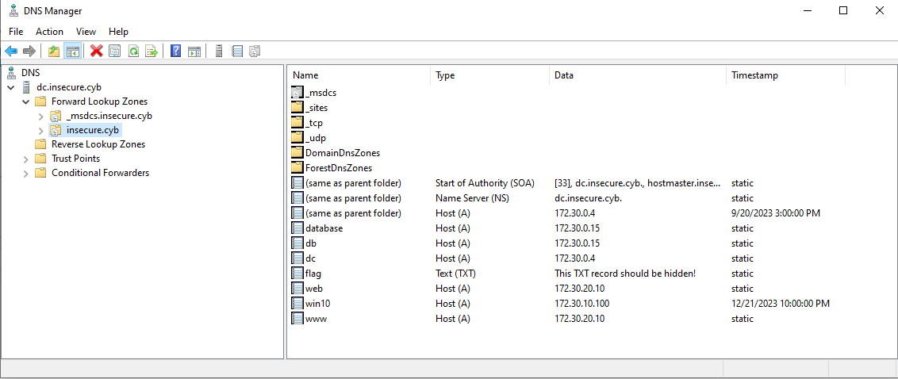
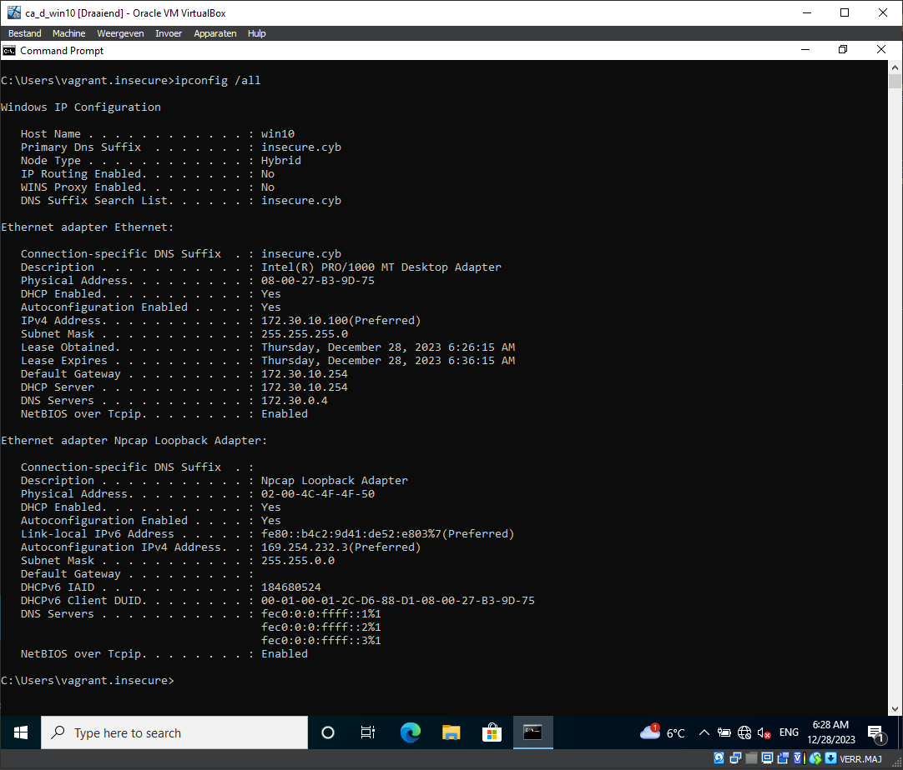
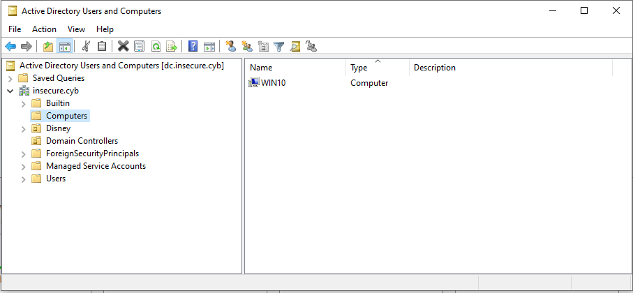
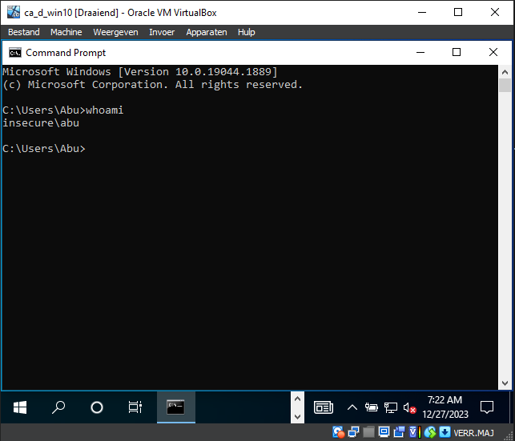
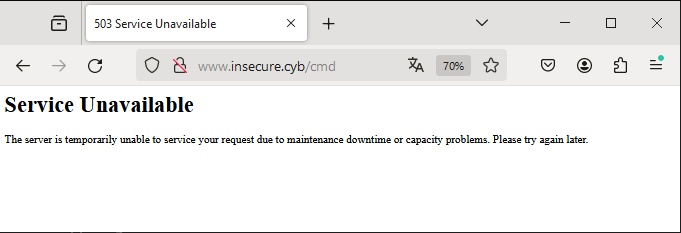

# CSA - Lecture 3 Exercises

## Walt has left the building

***Walt, the system administrator of the company is sick and will be for a long time. He has left some notes for you. Take extra care as he has written down some todo's both as mental notes for himself as for you.***

`Let's take a look at those notes`

[notes](../files/Insecurecybnoteswalt.pdf)

### Insecure.cyb – Documentation

- Uplink to the internet is (should be) through the companyrouter for each machine.
- The DC is a Windows Server Core and is also the DNS server for the insecure.cyb environment/domain.
- The companyrouter should also be a DHCP server. `TODO`: check configuration and rethink network-layout for network segmentation/ firewalling.
- Conclusion after external meeting 29 september with external firm secure.xyz:
  - Make sure to perform network segmentation
  - Implement routes (= all machines should be able to access each other on layer 3)
  - Configure firewall rules to default block all protocols and ports
  - Only allow specific ports: `TODO`: check which ports/services
- The database server runs mysql. The developers of the websites have let me know they used other credentials on a feature on the webserver that requires mysql. My own credentials are root/summer but `TODO`: check which credentials they used on the website to connect to the database.
- The webserver runs apache to host the main <www.insecure.cyb> website.
- The webserver also acts as a reverse proxy for another (java-application). The app can be viewed by browsing to <www.insecure.cyb/cmd>. The java application is configured with a systemd service. `TODO`: double check this configuration and how it is properly configured.
- There is a Windows Active Directory domain (insecure.cyb) created. Win10is a Windows 10 machine and is domain joined. All AD users (see below) should be able to login on the domain.
- If necessary, you can use my (Walt) credentials: Username: Walt; Password: Friday13th!
- `TODO`: I lost access to some systems, please created a walt user with the above password if there is no walt user and update my password if the password is not correct.

#### AD users and groups

| Name | OU | Group | Password | Notes |
| :-   | :- | :-    | :-       | :-    |
| Aladdin | Aladdin | Agrabah | Hogentpass123! | |
| Jasmine | Aladdin | Agrabah | Hogentpass123! | |
| Genie | Aladdin | Agrabah | Hogentpass123! | |
| Jafar | Aladdin | Agrabah | Hogentpass123! | |
| Iago | Aladdin | Agrabah | Hogentpass123! | |
| Abu | Aladdin | Agrabah | Hogentpass123! | |
| Carpet | Aladdin | Agrabah | Hogentpass123! | |
| Sultan | Aladdin | Agrabah | Hogentpass123! | |
| Rajah | Aladdin | Agrabah | Hogentpass123! | |
| Simba | LionKing | Pride lands | Hogentpass123! | |
| Nala | LionKing | Pride lands | Hogentpass123! | |
| Timon | LionKing | Pride lands | Hogentpass123! | |
| Pumbaa | LionKing | Pride lands | Hogentpass123! | |
| Scar | LionKing | Pride lands | Hogentpass123! | |
| Mufasa | LionKing | Pride lands | Hogentpass123! | |
| Zazu | LionKing | Pride lands | Hogentpass123! | |
| Rafiki | LionKing | Pride lands | Hogentpass123! | |
| Sarabi | LionKing | Pride lands | Hogentpass123! | |
| Sarafina | LionKing | Pride lands | Hogentpass123! | |
| Shenzi | LionKing | Pride lands | Hogentpass123! | |
| Banzai | LionKing | Pride lands | Hogentpass123! | |
| Ed | LionKing | Pride lands | Hogentpass123! | |
| Gopher | LionKing | Pride lands | Hogentpass123! | |
| Walt |  |  | Friday13th! | Admin |

Kind regards, good luck, and talk to you later when I get back!

- Walt

### Let's make it happen

***Uplink to the internet is (should be) through the companyrouter for each machine.***

`Allready fixed in lab 02, doublechecking if the traceroute passes 172.30.x.254`

`dc`

```code
insecure\vagrant@DC C:\Users\vagrant>tracert 8.8.8.8

Tracing route to dns.google [8.8.8.8]
over a maximum of 30 hops:

  1    <1 ms    <1 ms    <1 ms  172.30.0.254
  2     1 ms     1 ms     1 ms  192.168.100.254
  3    <1 ms    <1 ms    <1 ms  10.0.2.2
  4    17 ms    11 ms     9 ms  10.224.0.1
  5    11 ms    10 ms    11 ms  192.168.255.1
  6    18 ms    12 ms     9 ms  212-123-2-70.ifiber.telenet-ops.be [212.123.2.70]

...
```

`win10`

```code
C:\Users\vagrant.insecure>tracert 8.8.8.8

Tracing route to dns.google [8.8.8.8]
over a maximum of 30 hops:

  1    <1 ms    <1 ms    <1 ms  172.30.10.254
  2     1 ms     1 ms     1 ms  192.168.100.254
  3     1 ms    <1 ms     1 ms  10.0.2.2
  4    12 ms    10 ms     9 ms  10.224.0.1
  5    11 ms    10 ms    11 ms  192.168.255.1
  6    10 ms     9 ms    10 ms  212-123-2-70.ifiber.telenet-ops.be [212.123.2.70]

...
```

`web`

```code
[vagrant@web ~]$ traceroute 8.8.8.8
-bash: traceroute: command not found
[vagrant@web ~]$ sudo dnf install -yq traceroute

Installed:
  traceroute-3:2.1.0-16.el9.x86_64

[vagrant@web ~]$ traceroute 8.8.8.8
traceroute to 8.8.8.8 (8.8.8.8), 30 hops max, 60 byte packets
 1  _gateway (172.30.20.254)  0.285 ms  0.268 ms  0.307 ms
 2  192.168.100.254 (192.168.100.254)  0.809 ms  0.759 ms  0.709 ms
 3  10.0.2.2 (10.0.2.2)  0.675 ms  0.630 ms  0.757 ms

...
```

`database`

```code
[vagrant@database ~]$  traceroute 8.8.8.8
-bash: traceroute: command not found
[vagrant@database ~]$ sudo dnf install -yq traceroute

Installed:
  traceroute-3:2.1.0-16.el9.x86_64

[vagrant@database ~]$  traceroute 8.8.8.8
traceroute to 8.8.8.8 (8.8.8.8), 30 hops max, 60 byte packets
 1  _gateway (172.30.0.254)  0.367 ms  0.335 ms  0.326 ms
 2  192.168.100.254 (192.168.100.254)  0.661 ms  0.651 ms  0.642 ms
 3  10.0.2.2 (10.0.2.2)  0.652 ms  0.643 ms  0.633 ms

...
```

***The DC is a Windows Server Core and is also the DNS server for theinsecure.cybenvironment/domain.***

```code
PS C:\Users\vagrant> Get-ComputerInfo | Select-Object WindowsProductName, WindowsInstallationType

WindowsProductName                      WindowsInstallationType
------------------                      -----------------------
Windows Server 2022 Standard Evaluation Server Core
```

```code
PS C:\Users\vagrant> Get-WindowsFeature -Name DNS

Display Name                                            Name                       Install State
------------                                            ----                       -------------
[X] DNS Server                                          DNS                            Installed
```



```code
insecure\vagrant@DC C:\Users\vagrant>nslookup web.insecure.cyb
Server:  localhost
Address:  ::1

Name:    web.insecure.cyb
Address:  172.30.20.10
```

```code
C:\Users\vagrant.insecure>nslookup web.insecure.cyb
Server:  UnKnown
Address:  172.30.0.4

Name:    web.insecure.cyb
Address:  172.30.20.10

```

```code
[vagrant@web ~]$ nslookup web.insecure.cyb
Server:         172.30.0.4
Address:        172.30.0.4#53

Name:   web.insecure.cyb
Address: 172.30.20.10
```

```code
[vagrant@database ~]$ nslookup web.insecure.cyb
-bash: nslookup: command not found
[vagrant@database ~]$ sudo dnf install -yq bind-utils

Installed:
  bind-libs-32:9.16.23-14.el9_3.x86_64  bind-license-32:9.16.23-14.el9_3.noarch  bind-utils-32:9.16.23-14.el9_3.x86_64  fstrm-0.6.1-3.el9.x86_64  libmaxminddb-1.5.2-3.el9.x86_64  libuv-1:1.42.0-1.el9.x86_64
  protobuf-c-1.3.3-13.el9.x86_64

[vagrant@database ~]$ nslookup web.insecure.cyb
Server:         172.30.0.4
Address:        172.30.0.4#53

Name:   web.insecure.cyb
Address: 172.30.20.10
```

***The companyrouter should also be a DHCP server. `TODO`: check configuration and rethink network-layout for network segmentation/ firewalling.***

`configuration allready adjusted (to only listen on eth2 where the clients are connected to and with correct router address) in lab 02`

```code
[vagrant@companyrouter ~]$ cat /etc/default/isc-dhcp-server
INTERFACES="eth2"
```

```code
[vagrant@companyrouter ~]$ sudo cat /etc/dhcp/dhcpd.conf | grep -Ev "^#|^$"
option domain-name "insecure.cyb";
option domain-name-servers 172.30.0.4;
default-lease-time 600;
max-lease-time 7200;
authoritative;
log-facility local7;
subnet 172.30.10.0 netmask 255.255.255.0 {
  range 172.30.10.100 172.30.10.200;
  option routers 172.30.10.254;
}
```

`the server is running`

```code
[vagrant@companyrouter ~]$ systemctl status dhcpd
● dhcpd.service - DHCPv4 Server Daemon
     Loaded: loaded (/usr/lib/systemd/system/dhcpd.service; enabled; preset: disabled)
     Active: active (running) since Thu 2023-12-21 21:42:50 UTC; 6 days ago
       Docs: man:dhcpd(8)
             man:dhcpd.conf(5)
   Main PID: 757 (dhcpd)
     Status: "Dispatching packets..."
      Tasks: 1 (limit: 12013)
     Memory: 6.5M
        CPU: 43ms
     CGroup: /system.slice/dhcpd.service
             └─757 /usr/sbin/dhcpd -f -cf /etc/dhcp/dhcpd.conf -user dhcpd -group dhcpd --no-pid
```

`leases are given ...`

```code
[vagrant@companyrouter ~]$ cat /var/lib/dhcpd/dhcpd.leases
# The format of this file is documented in the dhcpd.leases(5) manual page.
# This lease file was written by isc-dhcp-4.4.2b1

# authoring-byte-order entry is generated, DO NOT DELETE
authoring-byte-order little-endian;

...

lease 172.30.10.100 {
  starts 3 2023/12/27 07:12:05;
  ends 3 2023/12/27 07:22:05;
  tstp 3 2023/12/27 07:22:05;
  cltt 3 2023/12/27 07:12:05;
  binding state free;
  hardware ethernet 08:00:27:b3:9d:75;
  uid "\001\010\000'\263\235u";
  set vendor-class-identifier = "MSFT 5.0";
}
```

`... and logged`

```code
[vagrant@companyrouter ~]$ sudo cat /var/log/boot.log |less

...

Dec 21 21:42:50 companyrouter dhcpd[757]: Internet Systems Consortium DHCP Server 4.4.2b1
Dec 21 21:42:50 companyrouter dhcpd[757]: Copyright 2004-2019 Internet Systems Consortium.
Dec 21 21:42:50 companyrouter dhcpd[757]: All rights reserved.
Dec 21 21:42:50 companyrouter dhcpd[757]: For info, please visit https://www.isc.org/software/dhcp/
Dec 21 21:42:50 companyrouter dhcpd[757]: Source compiled to use binary-leases
Dec 21 21:42:50 companyrouter dhcpd[757]: Wrote 2 leases to leases file.
Dec 21 21:42:50 companyrouter dhcpd[757]:
Dec 21 21:42:50 companyrouter dhcpd[757]: No subnet declaration for eth3 (172.30.20.254).
Dec 21 21:42:50 companyrouter dhcpd[757]: ** Ignoring requests on eth3.  If this is not what
Dec 21 21:42:50 companyrouter dhcpd[757]:   you want, please write a subnet declaration
Dec 21 21:42:50 companyrouter dhcpd[757]:   in your dhcpd.conf file for the network segment
Dec 21 21:42:50 companyrouter dhcpd[757]:   to which interface eth3 is attached. **
Dec 21 21:42:50 companyrouter dhcpd[757]:
Dec 21 21:42:50 companyrouter dhcpd[757]: Listening on LPF/eth2/08:00:27:4d:eb:e9/172.30.10.0/24
Dec 21 21:42:50 companyrouter dhcpd[757]: Sending on   LPF/eth2/08:00:27:4d:eb:e9/172.30.10.0/24
Dec 21 21:42:50 companyrouter dhcpd[757]:
Dec 21 21:42:50 companyrouter dhcpd[757]: No subnet declaration for eth1 (172.30.0.254).
Dec 21 21:42:50 companyrouter dhcpd[757]: ** Ignoring requests on eth1.  If this is not what
Dec 21 21:42:50 companyrouter dhcpd[757]:   you want, please write a subnet declaration
Dec 21 21:42:50 companyrouter dhcpd[757]:   in your dhcpd.conf file for the network segment
Dec 21 21:42:50 companyrouter dhcpd[757]:   to which interface eth1 is attached. **
Dec 21 21:42:50 companyrouter dhcpd[757]:
Dec 21 21:42:50 companyrouter dhcpd[757]:
Dec 21 21:42:50 companyrouter dhcpd[757]: No subnet declaration for eth0 (192.168.100.253).
Dec 21 21:42:50 companyrouter dhcpd[757]: ** Ignoring requests on eth0.  If this is not what
Dec 21 21:42:50 companyrouter dhcpd[757]:   you want, please write a subnet declaration
Dec 21 21:42:50 companyrouter dhcpd[757]:   in your dhcpd.conf file for the network segment
Dec 21 21:42:50 companyrouter dhcpd[757]:   to which interface eth0 is attached. **
Dec 21 21:42:50 companyrouter dhcpd[757]:
Dec 21 21:42:50 companyrouter dhcpd[757]: Sending on   Socket/fallback/fallback-net
Dec 21 21:42:50 companyrouter dhcpd[757]: Server starting service.
Dec 21 21:43:24 companyrouter dhcpd[757]: DHCPDISCOVER from 08:00:27:b3:9d:75 via eth2
Dec 21 21:43:25 companyrouter dhcpd[757]: DHCPOFFER on 172.30.10.100 to 08:00:27:b3:9d:75 (win10) via eth2
Dec 21 21:43:25 companyrouter dhcpd[757]: DHCPREQUEST for 172.30.10.100 (172.30.10.254) from 08:00:27:b3:9d:75 (win10) via eth2
Dec 21 21:43:25 companyrouter dhcpd[757]: DHCPACK on 172.30.10.100 to 08:00:27:b3:9d:75 (win10) via eth2
Dec 21 21:48:24 companyrouter dhcpd[757]: DHCPREQUEST for 172.30.10.100 from 08:00:27:b3:9d:75 (win10) via eth2
Dec 21 21:48:24 companyrouter dhcpd[757]: DHCPACK on 172.30.10.100 to 08:00:27:b3:9d:75 (win10) via eth2
Dec 21 21:53:25 companyrouter dhcpd[757]: DHCPREQUEST for 172.30.10.100 from 08:00:27:b3:9d:75 (win10) via eth2
Dec 21 21:53:25 companyrouter dhcpd[757]: DHCPACK on 172.30.10.100 to 08:00:27:b3:9d:75 (win10) via eth2

...
```

`windows 10 client is on eth2 subnet`



`captured on companyrouter while booting win10`

```code
[vagrant@companyrouter ~]$ sudo tcpdump -i any -v -n udp port 67 or port 68
tcpdump: data link type LINUX_SLL2
dropped privs to tcpdump
tcpdump: listening on any, link-type LINUX_SLL2 (Linux cooked v2), snapshot length 262144 bytes
05:39:20.895446 eth2  B   IP (tos 0x0, ttl 128, id 4837, offset 0, flags [none], proto UDP (17), length 343)
    0.0.0.0.bootpc > 255.255.255.255.bootps: BOOTP/DHCP, Request from 08:00:27:b3:9d:75, length 315, xid 0x110e93d1, Flags [none]
          Client-Ethernet-Address 08:00:27:b3:9d:75
          Vendor-rfc1048 Extensions
            Magic Cookie 0x63825363
            DHCP-Message (53), length 1: Request
            Client-ID (61), length 7: ether 08:00:27:b3:9d:75
            Requested-IP (50), length 4: 172.30.10.100
            Hostname (12), length 5: "win10"
            FQDN (81), length 21: "win10.insecure.cyb"
            Vendor-Class (60), length 8: "MSFT 5.0"
            Parameter-Request (55), length 14:
              Subnet-Mask (1), Default-Gateway (3), Domain-Name-Server (6), Domain-Name (15)
              Router-Discovery (31), Static-Route (33), Vendor-Option (43), Netbios-Name-Server (44)
              Netbios-Node (46), Netbios-Scope (47), Unknown (119), Classless-Static-Route (121)
              Classless-Static-Route-Microsoft (249), Unknown (252)
05:39:20.895616 eth2  Out IP (tos 0x10, ttl 128, id 0, offset 0, flags [none], proto UDP (17), length 328)
    172.30.10.254.bootps > 172.30.10.100.bootpc: BOOTP/DHCP, Reply, length 300, xid 0x110e93d1, Flags [none]
          Your-IP 172.30.10.100
          Client-Ethernet-Address 08:00:27:b3:9d:75
          Vendor-rfc1048 Extensions
            Magic Cookie 0x63825363
            DHCP-Message (53), length 1: ACK
            Server-ID (54), length 4: 172.30.10.254
            Lease-Time (51), length 4: 553
            Subnet-Mask (1), length 4: 255.255.255.0
            Default-Gateway (3), length 4: 172.30.10.254
            Domain-Name-Server (6), length 4: 172.30.0.4
            Domain-Name (15), length 12: "insecure.cyb"

...
```

`firewalling dhcp traffic would be an overkill for now since all internall traffic is allowed for now`

***Make sure to perform network segmentation***

<!-- TODO: picture of new network layout-->

***Implement routes (= all machines should be able to access each other on layer 3)***

`connectivity was allready checked in lab 02`

***Configure firewall rules to default block all protocols and ports***

<!-- TODO perhaps only implement this for traffic coming from outside-->

***Only allow specific ports: `TODO`: check which ports/services***

<!-- TODO: not yet implemented fully since this requires a lot of whitelisting for dc -->

***The database server runs mysql. The developers of the websites have let me know they used other credentials on a feature on the webserver that requires mysql. My own credentials are root/summerbut `TODO`: check which credentials they used on the website to connect to the database.***

`as allready found during lab 01`

```code
[vagrant@web ~]$ grep -A7 "Define your database credentials" /var/www/html/index.php
    // Define your database credentials
    $servername = "172.30.0.15";
    $username = "sammy";
    $password = "FLAG-741852";
    $database = "users";

    // Create a connection to the database
    $conn = new mysqli($servername, $username, $password, $database);
```

`testing this captured flag :)`

```code
[vagrant@database ~]$ mysql -usammy -pFLAG-741852
mysql: [Warning] Using a password on the command line interface can be insecure.
Welcome to the MySQL monitor.  Commands end with ; or \g.
Your MySQL connection id is 15
Server version: 8.0.32 Source distribution

Copyright (c) 2000, 2023, Oracle and/or its affiliates.

Oracle is a registered trademark of Oracle Corporation and/or its
affiliates. Other names may be trademarks of their respective
owners.

Type 'help;' or '\h' for help. Type '\c' to clear the current input statement.

mysql> SELECT * FROM users.users;
+----------+---------------+-----------------------------------------------+
| PersonId | name          | information                                   |
+----------+---------------+-----------------------------------------------+
|        1 | firstuser     | some test information                         |
|        2 | sensitiveuser | This is some very sensitive data: FLAG-852761 |
+----------+---------------+-----------------------------------------------+
2 rows in set (0.00 sec)
```

***The webserver runs apache to host the main <www.insecure.cyb> website.***

`the service was allready enabled during lab 01`

```code
[vagrant@web ~]$ sudo systemctl status httpd
● httpd.service - The Apache HTTP Server
     Loaded: loaded (/usr/lib/systemd/system/httpd.service; enabled; preset: disabled)
    Drop-In: /usr/lib/systemd/system/httpd.service.d
             └─php-fpm.conf
     Active: active (running) since Fri 2023-12-22 08:08:51 UTC; 5 days ago
       Docs: man:httpd.service(8)
    Process: 4773 ExecReload=/usr/sbin/httpd $OPTIONS -k graceful (code=exited, status=0/SUCCESS)
   Main PID: 744 (httpd)
     Status: "Total requests: 18; Idle/Busy workers 100/0;Requests/sec: 3.5e-05; Bytes served/sec:   0 B/sec"
      Tasks: 213 (limit: 2262)
     Memory: 17.3M
        CPU: 4min 4.958s
     CGroup: /system.slice/httpd.service
             ├─ 744 /usr/sbin/httpd -DFOREGROUND
             ├─4783 /usr/sbin/httpd -DFOREGROUND
             ├─4784 /usr/sbin/httpd -DFOREGROUND
             ├─4785 /usr/sbin/httpd -DFOREGROUND
             └─4786 /usr/sbin/httpd -DFOREGROUND

Dec 22 08:08:51 web httpd[744]: [Fri Dec 22 08:08:51.891442 2023] [so:warn] [pid 744:tid 744] AH01574: module proxy_http_module is already loaded, skipping
Dec 22 08:08:51 web httpd[744]: AH00558: httpd: Could not reliably determine the server's fully qualified domain name, using 127.0.1.1. Set the 'ServerName' directive globally to suppress this message
Dec 22 08:08:51 web systemd[1]: Started The Apache HTTP Server.
Dec 22 08:08:51 web httpd[744]: Server configured, listening on: port 80
```

`fix for this fqdn error`

```code
[vagrant@web ~]$ grep ServerName /etc/httpd/conf/httpd.conf
# ServerName gives the name and port that the server uses to identify itself.
#ServerName www.example.com:80
ServerName www.insecure.cyb
[vagrant@web ~]$ sudo systemctl restart httpd
[vagrant@web ~]$ sudo httpd -t
[Thu Dec 28 07:23:37.909283 2023] [so:warn] [pid 8069:tid 8069] AH01574: module proxy_module is already loaded, skipping
[Thu Dec 28 07:23:37.910263 2023] [so:warn] [pid 8069:tid 8069] AH01574: module proxy_http_module is already loaded, skipping
Syntax OK
```

<!-- TODO: img -->

***The webserver also acts as a reverse proxy for another (java-application). The app can be viewed by browsing to <www.insecure.cyb/cmd>. The java application is configured with a systemd service.`TODO`: double check this configuration and how it is properly configured.***

`taking a look at the reverse proxy settings`

```code
[vagrant@web ~]$ grep proxy_module -A9 /etc/httpd/conf/httpd.conf
LoadModule proxy_module modules/mod_proxy.so
LoadModule proxy_http_module modules/mod_proxy_http.so

ProxyPass "/cmd" "http://localhost:8000/"
ProxyPassReverse "/aaa" "http://localhost:8000/"
ProxyPass "/assets" "http://localhost:8000/assets"
ProxyPassReverse "/assets" "http://localhost:8000/assets"
ProxyPass "/exec" "http://localhost:8000/exec"
ProxyPassReverse "/exec" "http://localhost:8000/exec"
```

`study mode:`

- <https://www.ionos.com/digitalguide/server/know-how/what-is-a-reverse-proxy/>
- <https://www.theserverside.com/blog/Coffee-Talk-Java-News-Stories-and-Opinions/How-to-configure-Apache-as-a-reverse-proxy-example>

`where does the 8000 come from?`

```code
[vagrant@web ~]$ sudo systemctl status insecurewebapp
● insecurewebapp.service - start script for insecurewebapp
     Loaded: loaded (/etc/systemd/system/insecurewebapp.service; enabled; preset: disabled)
     Active: active (running) since Thu 2023-12-28 08:14:35 UTC; 24min ago
   Main PID: 657 (java)
      Tasks: 19 (limit: 2262)
     Memory: 96.5M
        CPU: 2.015s
     CGroup: /system.slice/insecurewebapp.service
             └─657 /usr/bin/java -server -Xms128m -Xmx512m -jar /opt/insecurewebapp/app.jar

Dec 28 08:14:35 web systemd[1]: Started start script for insecurewebapp.
Dec 28 08:14:37 web insecurewebapp[657]: Dec 28, 2023 8:14:36 AM io.vertx.core.impl.launcher.commands.VertxIsolatedDeployer
Dec 28 08:14:37 web insecurewebapp[657]: INFO: Succeeded in deploying verticle
Dec 28 08:14:37 web insecurewebapp[657]: Dec 28, 2023 8:14:36 AM be.programming101.dt.web.WebServer lambda$start$1
Dec 28 08:14:37 web insecurewebapp[657]: INFO: Server is listening on port: 8,000
Dec 28 08:19:04 web insecurewebapp[657]: Dec 28, 2023 8:19:04 AM be.programming101.dt.web.WebApp log
Dec 28 08:19:04 web insecurewebapp[657]: INFO: http://localhost:8000/
```

`let's inspect this be.programming101.dt.web.WebServer`

```code
[vagrant@web legal]$ sudo dnf install -yq java-17-openjdk-devel

Upgraded:
  java-17-openjdk-1:17.0.9.0.9-2.el9.x86_64                                                          java-17-openjdk-headless-1:17.0.9.0.9-2.el9.x86_64
Installed:
  java-17-openjdk-devel-1:17.0.9.0.9-2.el9.x86_64

[vagrant@web ~]$ jar -tf /opt/insecurewebapp/app.jar > /dev/null
[vagrant@web ~]$ javap -c jar/be/programming101/dt/web/WebServer.class | grep 8000
      25: sipush        8000
[vagrant@web ~]$ curl -O https://www.benf.org/other/cfr/cfr-0.152.jar
  % Total    % Received % Xferd  Average Speed   Time    Time     Time  Current
                                 Dload  Upload   Total   Spent    Left  Speed
100 2111k  100 2111k    0     0  4570k      0 --:--:-- --:--:-- --:--:-- 4570k
[vagrant@web ~]$ java -jar cfr-0.152.jar jar/be/programming101/dt/web/WebServer.class
/*
 * Decompiled with CFR 0.152.
 */
package be.programming101.dt.web;

import be.programming101.dt.web.WebApp;
import io.vertx.core.AbstractVerticle;
import io.vertx.core.Handler;
import io.vertx.core.http.HttpServerRequest;
import java.util.logging.Level;
import java.util.logging.Logger;

public class WebServer
extends AbstractVerticle
implements Handler<HttpServerRequest> {
    private static final int PORT = 8000;
    private static final Logger LOGGER = Logger.getLogger(WebServer.class.getName());

    @Override
    public void start() {
        this.vertx.createHttpServer().requestHandler(new WebApp(this.vertx)).listen(8000).onFailure(cause -> LOGGER.log(Level.WARNING, "Failed to start server", (Throwable)cause)).onSuccess(server -> LOGGER.log(Level.INFO, "Server is listening on port: {0}", server.actualPort()));
    }

    @Override
    public void handle(HttpServerRequest event) {
        LOGGER.log(Level.INFO, event.absoluteURI());
    }
}
```

`so changing 8000 is beyond the scope of this olod, but explains why it is used in the reverse proxy`

`where do assets and exec come from?`

```code
[vagrant@web ~]$ cat jar/www/assets/javascript/index.js
document.addEventListener("DOMContentLoaded", init);


function init() {
    document.querySelector("#ping").addEventListener("submit", ping);
    document.querySelector("#exec").addEventListener("submit", exec);
}

function ping(evt){
    evt.preventDefault();
    const ip = document.querySelector("#ping input[type='text']").value;
    fetch("/ping", {
        method : "post",
        body : JSON.stringify({ip})
    }).then(res=>res.json())
        .then(json=>{
            document.querySelector("pre").innerHTML = json.output;
        });
}

function exec(evt){
    evt.preventDefault();
    const cmd = document.querySelector("#exec input[type='text']").value;
    fetch("/exec", {
        method : "post",
        body : JSON.stringify({cmd})
    }).then(res=>res.json())
        .then(json=>{
            document.querySelector("pre").innerHTML = json.output;
        });
}
```

`so this seems a right fix and explains why the ping not allways worked (trial and error but building web apps seems out of scope)`

```code
[vagrant@web ~]$ grep proxy_module -A12 /etc/httpd/conf/httpd.conf
LoadModule proxy_module modules/mod_proxy.so
LoadModule proxy_http_module modules/mod_proxy_http.so

ProxyPass "/cmd" "http://localhost:8000/"
ProxyPassReverse "/cmd" "http://localhost:8000"
ProxyPass "/assets" "http://localhost:8000/assets"
ProxyPassReverse "/assets" "http://localhost:8000/assets"
ProxyPass "/exec" "http://localhost:8000/exec"
ProxyPassReverse "/exec" "http://localhost:8000/exec"
ProxyPass "/ping" "http://localhost:8000/ping"
ProxyPassReverse "/ping" "http://localhost:8000/ping"

Include conf.modules.d/*.conf
[vagrant@web ~]$ sudo systemctl restart httpd
```

`looking into the systemd service config`

```code
[vagrant@web ~]$ cat /etc/systemd/system/insecurewebapp.service
[Unit]
Description=start script for insecurewebapp
After=network.target nss-lookup.target

[Service]
SyslogIdentifier=insecurewebapp
Type=simple
ExecStart=/usr/bin/java -server -Xms128m -Xmx512m -jar /opt/insecurewebapp/app.jar
User=root

[Install]
WantedBy=multi-user.target
```

`Perhaps out of the scope of this olod, but it is probably not a good idea to allow root access to the system or let the app take up more memory size then available. Changing to existing user apache just as a POC in case this was the 'properly configured' part`

```code
[Unit]
Description=start script for insecurewebapp
After=network.target nss-lookup.target

[Service]
SyslogIdentifier=insecurewebapp
Type=simple
ExecStart=/usr/bin/java -server -Xms64m -Xmx128m -jar /opt/insecurewebapp/app.jar
User=apache

[Install]
WantedBy=multi-user.target
[vagrant@web ~]$ sudo systemctl daemon-reload
[vagrant@web ~]$ sudo systemctl restart insecurewebapp
```

***There is a Windows Active Directory domain (insecure.cyb) created. Win10 is a Windows 10 machine and is domain joined. All AD users (see below) should be able to loginon the domain.***

`the domain is allready created`

```code
PS C:\Users\vagrant> Get-ADDomain


AllowedDNSSuffixes                 : {}
ChildDomains                       : {}
ComputersContainer                 : CN=Computers,DC=insecure,DC=cyb
DeletedObjectsContainer            : CN=Deleted Objects,DC=insecure,DC=cyb
DistinguishedName                  : DC=insecure,DC=cyb
DNSRoot                            : insecure.cyb
DomainControllersContainer         : OU=Domain Controllers,DC=insecure,DC=cyb
DomainMode                         : Windows2016Domain
DomainSID                          : S-1-5-21-2681222979-3123228727-1689025860
ForeignSecurityPrincipalsContainer : CN=ForeignSecurityPrincipals,DC=insecure,DC=cyb
Forest                             : insecure.cyb
InfrastructureMaster               : dc.insecure.cyb
LastLogonReplicationInterval       :
LinkedGroupPolicyObjects           : {CN={31B2F340-016D-11D2-945F-00C04FB984F9},CN=Policies,CN=System,DC=insecure,DC=cyb}
LostAndFoundContainer              : CN=LostAndFound,DC=insecure,DC=cyb
ManagedBy                          :
Name                               : insecure
NetBIOSName                        : insecure
ObjectClass                        : domainDNS
ObjectGUID                         : c63d9af2-e900-46dd-86ce-7733172b5dc6
ParentDomain                       :
PDCEmulator                        : dc.insecure.cyb
PublicKeyRequiredPasswordRolling   : True
QuotasContainer                    : CN=NTDS Quotas,DC=insecure,DC=cyb
ReadOnlyReplicaDirectoryServers    : {}
ReplicaDirectoryServers            : {dc.insecure.cyb}
RIDMaster                          : dc.insecure.cyb
SubordinateReferences              : {DC=ForestDnsZones,DC=insecure,DC=cyb, DC=DomainDnsZones,DC=insecure,DC=cyb, CN=Configuration,DC=insecure,DC=cyb}
SystemsContainer                   : CN=System,DC=insecure,DC=cyb
UsersContainer                     : CN=Users,DC=insecure,DC=cyb
```

`win10 is Windows 10`

```code
PS C:\Users\vagrant> Get-ComputerInfo | Select-Object WindowsProductName, WindowsInstallationType

WindowsProductName               WindowsInstallationType
------------------               -----------------------
Windows 10 Enterprise Evaluation Client
```

`win10 is part of the domain`

```code
PS C:\Users\vagrant> (Get-WmiObject Win32_ComputerSystem).Domain
insecure.cyb
```



`trying to log in with Abu / Hogentpass123!`



***If necessary, you can use my (Walt) credentials: Username: Walt; Password: Friday13th!***

`did this to run the RSAT tools on win10 and take some dc configuration screenshots`

***`TODO`: I lost access to some systems, please created a walt user with the above password if there is no walt user and update my password if the password is not correct.***

`using red (with disabled firewall) to quickly test this`

```code
vagrant@red:~$ sshpass -p 'Friday13th!' ssh walt@172.30.0.254 whoami
Permission denied, please try again.
vagrant@red:~$ sshpass -p 'Friday13th!' ssh walt@172.30.0.4 whoami
insecure\walt
vagrant@red:~$ sshpass -p 'Friday13th!' ssh walt@172.30.10.100 whoami
insecure\walt
vagrant@red:~$ sshpass -p 'Friday13th!' ssh walt@172.30.20.10 whoami
Permission denied, please try again.
vagrant@red:~$ sshpass -p 'Friday13th!' ssh walt@172.30.0.15 whoami
Permission denied, please try again.
```

`adding walt as a user on the linux machines`

```code
[vagrant@companyrouter ~]$ walt_pass="$(openssl passwd -1 'Friday13th!')"
[vagrant@companyrouter ~]$ sudo useradd -m -s /bin/bash -p "$walt_pass" walt
```

```code
[vagrant@database ~]$ sudo useradd -m -s /bin/bash -p "$(openssl passwd -1 'Friday13th!')" walt
```

```code
[vagrant@web ~]$ sudo useradd -m -s /bin/bash -p "$(openssl passwd -1 'Friday13th!')" walt
```

`since walt is also the admin ...`

```code
[vagrant@companyrouter ~]$ sudo cp /etc/sudoers.d/vagrant /etc/sudoers.d/walt
[vagrant@companyrouter ~]$ sudo sed -i 's/vagrant/walt/g' /etc/sudoers.d/walt
[vagrant@companyrouter ~]$ sudo cat /etc/sudoers.d/walt
walt     ALL=(ALL)     NOPASSWD: ALL
[vagrant@companyrouter ~]$ sudo su - walt
[walt@companyrouter ~]$ whoami
walt
[walt@companyrouter ~]$ sudo whoami
root
```

```code
[vagrant@web ~]$ sudo cp /etc/sudoers.d/vagrant /etc/sudoers.d/walt
[vagrant@web ~]$ sudo sed -i 's/vagrant/walt/g' /etc/sudoers.d/walt
[vagrant@web ~]$ sudo cat /etc/sudoers.d/walt
walt     ALL=(ALL)     NOPASSWD: ALL
[vagrant@web ~]$ sudo su - walt
[walt@web ~]$ whoami
walt
[walt@web ~]$ sudo whoami
root
```

```code
[vagrant@database ~]$ sudo cp /etc/sudoers.d/vagrant /etc/sudoers.d/walt
[vagrant@database ~]$ sudo sed -i 's/vagrant/walt/g' /etc/sudoers.d/walt
[vagrant@database ~]$ sudo cat /etc/sudoers.d/walt
walt     ALL=(ALL)     NOPASSWD: ALL
[vagrant@database ~]$ sudo su - walt
[walt@database ~]$ whoami
walt
[walt@database ~]$ sudo whoami
root
```

`test (on red with sshpass installed)`

```code
vagrant@red:~$ sshpass -p 'Friday13th!' ssh walt@172.30.0.254 whoami
walt
vagrant@red:~$ sshpass -p 'Friday13th!' ssh walt@172.30.0.254 sudo whoami
root
vagrant@red:~$ sshpass -p 'Friday13th!' ssh walt@172.30.20.10 whoami
walt
vagrant@red:~$ sshpass -p 'Friday13th!' ssh walt@172.30.20.10 sudo whoami
root
vagrant@red:~$ sshpass -p 'Friday13th!' ssh walt@172.30.0.15 whoami
walt
vagrant@red:~$ sshpass -p 'Friday13th!' ssh walt@172.30.0.15 sudo whoami
root
```

### Explore (maybe again)

***The configuration of the webserver (the <http://www.insecure.cyb> website) and how it is connected to the database, what are the credentials, is this secure?***

`see also above`

`pasword in plain text in the config file, and user can log in from anywhere with god knows what rights`

```code
mysql> SELECT user, host FROM mysql.user;
+------------------+-----------+
| user             | host      |
+------------------+-----------+
| sammy            | %         |
| toor             | %         |
| mysql.infoschema | localhost |
| mysql.session    | localhost |
| mysql.sys        | localhost |
| root             | localhost |
+------------------+-----------+
6 rows in set (0.00 sec)
```

`better practice would be to use php config files, properly secure this and include it in index.php. and restrict access and user rights to the database. also now traffic is going from the dmz to the server since the web app is in the dmz. perhps only the reverse proxy should be in the dmz and the webserver on a different server which is in the same subnet as the database`

***The configuration of the webserver as a reverse proxy to <http://www.insecure.cyb/cmd>. How is this setup, explore the reverse proxy configuration and the systemd config file. What port is the java app running? Where is the jar located? Where is the systemd configuration file located? How can you bring this application down without bringing <http://www.insecure.cyb> down?***

`most questions allready answered earlier`

```code
[vagrant@web ~]$ sudo systemctl stop insecurewebapp
```

`disable to make this persistent`



## SSH client config

***Create a SSH client configuration on your host in such a way that you can easily connect over SSH to all machines of the network. Use a jump / bastion host if necessary. While testing you can use the credentials of vagrant but refer to the theory for more suitable methods. Document properly how you implemented this, make sure you are able to explain how everything works. What files are transferred to what machines? Ask yourself is this is the most secure method and be very critical!***

`Adding the public key of my windows user to the companyrouter, which is allways accessible from the 'web'`

```code
PS C:\data\git\CA\bastion> ssh walt@companyrouter
walt@companyrouter's password:
Last login: Fri Dec 29 18:03:46 2023
[walt@companyrouter ~]$ ls -al .ssh
ls: cannot access '.ssh': No such file or directory
[walt@companyrouter ~]$ logout
Connection to companyrouter closed.
PS C:\data\git\CA\bastion> ssh walt@companyrouter 'mkdir -p ~/.ssh && chmod 700 ~/.ssh && touch ~/.ssh/authorized_keys && chmod 600 ~/.ssh/authorized_keys'
walt@companyrouter's password:
PS C:\data\git\CA\bastion> cat C:\users\benny\.ssh\id_rsa.pub
ssh-rsa AAAAB3NzaC1yc2EAAAADAQABAAABgQDFI4Qm7YeH2CZQlKcmlpj2U0zpIYT74nRpiVfWnYy9p+vjChA0lF4lZ9XSGevq+ZVHWV3RBzpmcBS5i0XrZSGbEfh6zwsYpAy7K8ErIbSepdNJkBm1jMslGO3E5gabU2tP/+TUpyfrHuuV377IrwQ3XxPOjuCPj0WOwlcFgZovtLc0ZH39ns6O8K3SVYLkho2NdgMXi4gJAlQCOj99kjA+ZT5xhOJ832w2rJn7t8XfS+fgOwoNhErv9Mq6r8c7zyE3eYKkMfk0S24jFyC66fZSu7/LERC/F4ipGGc4MyB9ODu47CAE9knRA358nuB9x4lnklVYP7twPP0iOPrgqLEcYt6fakNaniHCJxmyokINys2NqtjZNDJEBkPBWvOPoRoM555GNIsVpnsJparVmFVoCtMGCUNnvyClRBI90To1t39LMhiN8oTshU0zbuErdkln2iHX4E8czQyfcYkSNtZ0x8FPWBQxzsc/t5UR6NDLHorZTBqbXS0gHH0oxJvVL58= benny.clemmens@student.hogent.be
PS C:\data\git\CA\bastion> ssh walt@companyrouter 'echo "ssh-rsa AAAAB3NzaC1yc2EAAAADAQABAAABgQDFI4Qm7YeH2CZQlKcmlpj2U0zpIYT74nRpiVfWnYy9p+vjChA0lF4lZ9XSGevq+ZVHWV3RBzpmcBS5i0XrZSGbEfh6zwsYpAy7K8ErIbSepdNJkBm1jMslGO3E5gabU2tP/+TUpyfrHuuV377IrwQ3XxPOjuCPj0WOwlcFgZovtLc0ZH39ns6O8K3SVYLkho2NdgMXi4gJAlQCOj99kjA+ZT5xhOJ832w2rJn7t8XfS+fgOwoNhErv9Mq6r8c7zyE3eYKkMfk0S24jFyC66fZSu7/LERC/F4ipGGc4MyB9ODu47CAE9knRA358nuB9x4lnklVYP7twPP0iOPrgqLEcYt6fakNaniHCJxmyokINys2NqtjZNDJEBkPBWvOPoRoM555GNIsVpnsJparVmFVoCtMGCUNnvyClRBI90To1t39LMhiN8oTshU0zbuErdkln2iHX4E8czQyfcYkSNtZ0x8FPWBQxzsc/t5UR6NDLHorZTBqbXS0gHH0oxJvVL58= benny.clemmens@student.hogent.be" >> ~/.ssh/authorized_keys'
walt@companyrouter's password:
PS C:\data\git\CA\bastion> ssh walt@companyrouter
Last login: Fri Dec 29 18:06:16 2023 from 192.168.100.1
[walt@companyrouter ~]$ cat .ssh/authorized_keys
ssh-rsa AAAAB3NzaC1yc2EAAAADAQABAAABgQDFI4Qm7YeH2CZQlKcmlpj2U0zpIYT74nRpiVfWnYy9p+vjChA0lF4lZ9XSGevq+ZVHWV3RBzpmcBS5i0XrZSGbEfh6zwsYpAy7K8ErIbSepdNJkBm1jMslGO3E5gabU2tP/+TUpyfrHuuV377IrwQ3XxPOjuCPj0WOwlcFgZovtLc0ZH39ns6O8K3SVYLkho2NdgMXi4gJAlQCOj99kjA+ZT5xhOJ832w2rJn7t8XfS+fgOwoNhErv9Mq6r8c7zyE3eYKkMfk0S24jFyC66fZSu7/LERC/F4ipGGc4MyB9ODu47CAE9knRA358nuB9x4lnklVYP7twPP0iOPrgqLEcYt6fakNaniHCJxmyokINys2NqtjZNDJEBkPBWvOPoRoM555GNIsVpnsJparVmFVoCtMGCUNnvyClRBI90To1t39LMhiN8oTshU0zbuErdkln2iHX4E8czQyfcYkSNtZ0x8FPWBQxzsc/t5UR6NDLHorZTBqbXS0gHH0oxJvVL58= benny.clemmens@student.hogent.be
```

`instead of exposing all vm's to the 'web', a bastion host is set up`

<!-- TODO: link naar bastion ? -->

***Note: if you don't want to fiddle with your (own host / ) Windows, you can always configure everything from one of the routers. That way you treat that machine as your "host". We do believe however that if you choose to run Windows a daily driver, it is worth getting this up and running.***

`I fiddled with my own host`
