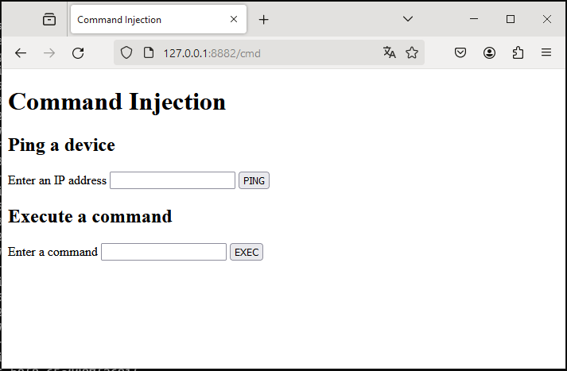
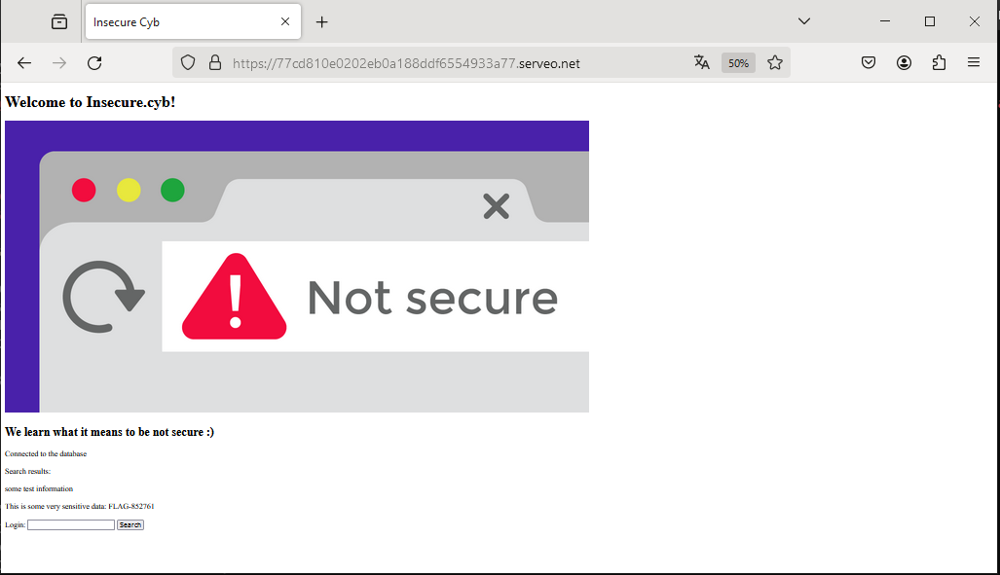
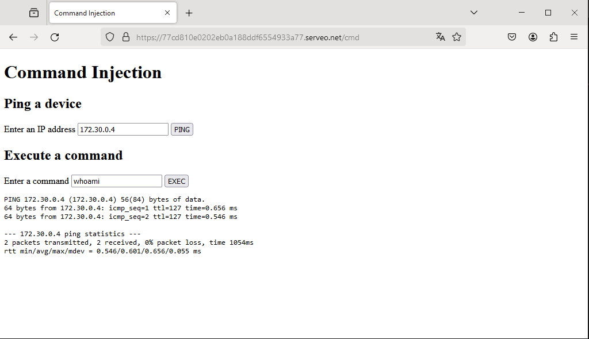
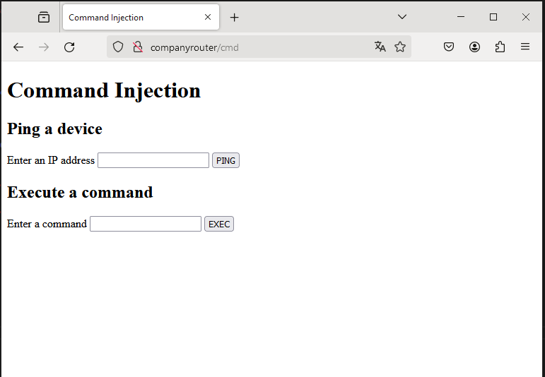

# CSA - Lecture 4 Exercises

## SSH Port Forwarding

***Being able to forward ports over SSH is a very important skill to have in cybersecurity both for red, purple and blue team activities. Figure out a way to perform SSH port forwarding to open a port (we suggest the same) on the router that connects back to the database server. In other words, by using SSH someone from the fake internet can reach the database although a direct connection to the database is blocked by the firewall. You do not have to make this persistent!***

`Before trying to open a port, an overview of the situation: SSH connections are active from flab2021 to all involved machines -red, database (through bastion) and companyrouter`

```code
vagrant@red:~$ sudo ss -tlnp
State                Recv-Q               Send-Q                             Local Address:Port                               Peer Address:Port               Process
LISTEN               0                    1024                                   127.0.0.1:11211                                   0.0.0.0:*                   users:(("memcached",pid=488,fd=22))
LISTEN               0                    100                                      0.0.0.0:25                                      0.0.0.0:*                   users:(("master",pid=939,fd=13))
LISTEN               0                    128                                      0.0.0.0:22                                      0.0.0.0:*                   users:(("sshd",pid=503,fd=3))
LISTEN               0                    100                                         [::]:25                                         [::]:*                   users:(("master",pid=939,fd=14))
LISTEN               0                    128                                         [::]:22                                         [::]:*                   users:(("sshd",pid=503,fd=4))
vagrant@red:~$ sudo ss -tnp
State                  Recv-Q                  Send-Q                                       Local Address:Port                                      Peer Address:Port                   Process
ESTAB                  0                       52                                         192.168.100.166:22                                       192.168.100.1:32340                   users:(("sshd",pid=1187,fd=4),("sshd",pid=1161,fd=4))
```

```code
[walt@database ~]$ sudo ss -tlnp
State             Recv-Q            Send-Q                         Local Address:Port                          Peer Address:Port            Process
LISTEN            0                 4096                                 0.0.0.0:111                                0.0.0.0:*                users:(("rpcbind",pid=632,fd=4),("systemd",pid=1,fd=31))
LISTEN            0                 128                                  0.0.0.0:22                                 0.0.0.0:*                users:(("sshd",pid=681,fd=3))
LISTEN            0                 4096                                 0.0.0.0:3306                               0.0.0.0:*                users:(("mysqld",pid=756,fd=23))
LISTEN            0                 4096                                    [::]:111                                   [::]:*                users:(("rpcbind",pid=632,fd=6),("systemd",pid=1,fd=34))
LISTEN            0                 128                                     [::]:22                                    [::]:*                users:(("sshd",pid=681,fd=4))
LISTEN            0                 70                                         *:33060                                    *:*                users:(("mysqld",pid=756,fd=17))
[walt@database ~]$ sudo ss -tnp
State                   Recv-Q                   Send-Q                                     Local Address:Port                                     Peer Address:Port                   Process
ESTAB                   0                        0                                            172.30.0.15:22                                       172.30.20.20:40838                   users:(("sshd",pid=2652,fd=4),("sshd",pid=2639,fd=4))
```

```code
[walt@bastion ~]$ sudo ss -tlnp
State                    Recv-Q                   Send-Q                                     Local Address:Port                                     Peer Address:Port                  Process
LISTEN                   0                        128                                         172.30.20.20:699                                           0.0.0.0:*                      users:(("sshd",pid=693,fd=3))
[walt@bastion ~]$ sudo ss -tnp
State             Recv-Q             Send-Q                         Local Address:Port                           Peer Address:Port             Process
ESTAB             0                  0                               172.30.20.20:40838                           172.30.0.15:22                users:(("sshd",pid=1593,fd=8))
ESTAB             0                  0                               172.30.20.20:50318                          172.30.20.10:22                users:(("sshd",pid=1573,fd=8))
ESTAB             0                  0                               172.30.20.20:699                           192.168.100.1:35727             users:(("sshd",pid=1518,fd=4),("sshd",pid=1515,fd=4))
ESTAB             0                  0                               172.30.20.20:699                           192.168.100.1:30404             users:(("sshd",pid=1229,fd=4),("sshd",pid=1216,fd=4))
ESTAB             0                  0                               172.30.20.20:699                           192.168.100.1:35780             users:(("sshd",pid=1573,fd=4),("sshd",pid=1570,fd=4))
ESTAB             0                  0                               172.30.20.20:699                           192.168.100.1:37214             users:(("sshd",pid=1593,fd=4),("sshd",pid=1590,fd=4))
```

```code
[walt@companyrouter ~]$ sudo ss -tlnp
State             Recv-Q             Send-Q                         Local Address:Port                         Peer Address:Port            Process                                                              
LISTEN            0                  128                                  0.0.0.0:22                                0.0.0.0:*                users:(("sshd",pid=672,fd=3))                                       
LISTEN            0                  4096                                 0.0.0.0:111                               0.0.0.0:*                users:(("rpcbind",pid=625,fd=4),("systemd",pid=1,fd=31))            
LISTEN            0                  128                                     [::]:22                                   [::]:*                users:(("sshd",pid=672,fd=4))                                       
LISTEN            0                  4096                                    [::]:111                                  [::]:*                users:(("rpcbind",pid=625,fd=6),("systemd",pid=1,fd=34))            
[walt@companyrouter ~]$ sudo ss -tnp
State                  Recv-Q                  Send-Q                                       Local Address:Port                                      Peer Address:Port                   Process                  ESTAB                  0                       0                                          192.168.100.253:22                                       192.168.100.1:30784                   users:(("sshd",pid=1632,fd=4),("sshd",pid=1629,fd=4))
```

`Trying to reach the database running at 172.30.0.15:3306 from red : filtered by companyrouter`

```code
vagrant@red:~$ sudo nmap -Pn -p3306 -sV database
Starting Nmap 7.93 ( https://nmap.org ) at 2024-01-01 22:39 UTC
Nmap scan report for database (172.30.0.15)
Host is up (0.00073s latency).
rDNS record for 172.30.0.15: database.insecure.cyb

PORT     STATE    SERVICE VERSION
3306/tcp filtered mysql

Service detection performed. Please report any incorrect results at https://nmap.org/submit/ .
Nmap done: 1 IP address (1 host up) scanned in 0.29 seconds
```

`Showing the firewall counters to illustrate that this traffic was blocked`

```code
        set forwarded_dropped_tcp_connections {
                typeof ip saddr . ip daddr . tcp sport . tcp dport
                size 65535
                flags dynamic
                counter
                elements = { 192.168.100.166 . 172.30.0.15 . 55868 . 3306 counter packets 1 bytes 44 }
        }
```

`There are several ways to implement a solution this question. In both methods, a publicly accessible accessible ssh-server must be used. Here that is the companyrouter, though the bastion could also be used for this`

`Solution 1: create a local tunnel between red and companyrouter`

```code
[walt@companyrouter ~]$ sudo useradd -m -s /bin/bash -p "$(openssl passwd -1 'localpfw')" localpfw
```

```code
vagrant@red:~$ ssh-copy-id localpfw@companyrouter
/usr/bin/ssh-copy-id: INFO: Source of key(s) to be installed: "/home/vagrant/.ssh/id_rsa.pub"
/usr/bin/ssh-copy-id: INFO: attempting to log in with the new key(s), to filter out any that are already installed
/usr/bin/ssh-copy-id: INFO: 1 key(s) remain to be installed -- if you are prompted now it is to install the new keys
localpfw@companyrouter's password:

Number of key(s) added: 1

Now try logging into the machine, with:   "ssh 'localpfw@companyrouter'"
and check to make sure that only the key(s) you wanted were added.

vagrant@red:~$ ssh localpfw@companyrouter whoami
localpfw
```

```code
<!-- vagrant@red:~$ ssh -nNT -L 127.0.0.1:8881:172.30.0.15:3306 localpfw@companyrouter &
[1] 1370
vagrant@red:~$ sudo ss -tlnp | grep 8881
LISTEN 0      128        127.0.0.1:8881       0.0.0.0:*    users:(("ssh",pid=1370,fd=4))
vagrant@red:~$ sudo ss -tnp
State            Recv-Q            Send-Q                         Local Address:Port                             Peer Address:Port             Process
ESTAB            0                 76                           192.168.100.166:22                              192.168.100.1:32340             users:(("sshd",pid=1187,fd=4),("sshd",pid=1161,fd=4))
ESTAB            0                 0                            192.168.100.166:54780                         192.168.100.253:22                users:(("ssh",pid=1370,fd=3))
```

```code
[walt@companyrouter ~]$ sudo ss -tnp
State            Recv-Q            Send-Q                          Local Address:Port                            Peer Address:Port             Process
ESTAB            0                 0                             192.168.100.253:22                           192.168.100.166:54780             users:(("sshd",pid=1954,fd=4),("sshd",pid=1939,fd=4))
ESTAB            0                 0                             192.168.100.253:22                             192.168.100.1:30784             users:(("sshd",pid=1632,fd=4),("sshd",pid=1629,fd=4))
[walt@companyrouter ~]$ sudo systemctl status sshd

...
Jan 01 21:10:19 companyrouter sshd[1629]: pam_unix(sshd:session): session opened for user walt(uid=1003) by (uid=0)
Jan 01 22:46:42 companyrouter sshd[1939]: main: sshd: ssh-rsa algorithm is disabled
Jan 01 22:46:42 companyrouter sshd[1939]: Accepted publickey for localpfw from 192.168.100.166 port 54780 ssh2: RSA SHA256:HhGVZVFmXYjvpQuTUMvRxOLKLD4Nn6Q/Y592BB2JTpU
Jan 01 22:46:42 companyrouter sshd[1939]: pam_unix(sshd:session): session opened for user localpfw(uid=1004) by (uid=0)
```

`This new connection also shows up on the firewall counters`

```code
        set incoming_new_tcp_connections {
                typeof ip saddr . tcp sport . ip daddr . tcp dport
                size 65535
                flags dynamic
                counter
                elements = { 192.168.100.166 . 54780 . 192.168.100.253 . 22 counter packets 1 bytes 60 }
        }
```

`When sending data through the tunnel ....`

```code
vagrant@red:~$ mysql -utoor -psummer -P8881
Welcome to the MariaDB monitor.  Commands end with ; or \g.
Your MySQL connection id is 13
Server version: 8.0.32 Source distribution

Copyright (c) 2000, 2018, Oracle, MariaDB Corporation Ab and others.

Type 'help;' or '\h' for help. Type '\c' to clear the current input statement.

MySQL [(none)]>
[2]+  Stopped                 mysql -utoor -psummer -P8881
vagrant@red:~$ bg
[2]+ mysql -utoor -psummer -P8881 &
vagrant@red:~$ sudo ss -tnp
State            Recv-Q            Send-Q                         Local Address:Port                             Peer Address:Port             Process
ESTAB            0                 0                                  127.0.0.1:8881                                127.0.0.1:37596             users:(("ssh",pid=1370,fd=5))
ESTAB            0                 76                           192.168.100.166:22                              192.168.100.1:32340             users:(("sshd",pid=1187,fd=4),("sshd",pid=1161,fd=4))
ESTAB            0                 0                            192.168.100.166:54780                         192.168.100.253:22                users:(("ssh",pid=1370,fd=3))
ESTAB            0                 0                                  127.0.0.1:37596                               127.0.0.1:8881              users:(("mysql",pid=1402,fd=3))
```

```code
[walt@companyrouter ~]$ sudo ss -tnp
State            Recv-Q            Send-Q                         Local Address:Port                             Peer Address:Port             Process
ESTAB            0                 0                            192.168.100.253:22                            192.168.100.166:54780             users:(("sshd",pid=1954,fd=4),("sshd",pid=1939,fd=4))
ESTAB            0                 0                               172.30.0.254:47546                             172.30.0.15:3306              users:(("sshd",pid=1954,fd=8))
ESTAB            0                 0                            192.168.100.253:22                              192.168.100.1:30784             users:(("sshd",pid=1632,fd=4),("sshd",pid=1629,fd=4))
```

```code
[walt@database ~]$ sudo ss -tnp
State             Recv-Q             Send-Q                         Local Address:Port                         Peer Address:Port              Process
ESTAB             0                  0                                172.30.0.15:22                           172.30.20.20:40838              users:(("sshd",pid=2652,fd=4),("sshd",pid=2639,fd=4))
ESTAB             0                  0                                172.30.0.15:3306                         172.30.0.254:47546              users:(("mysqld",pid=756,fd=36))
```

```code
        set outgoing_new_tcp_connections {
                typeof meta skuid . ip daddr . tcp dport
                size 65535
                flags dynamic
                counter
                elements = { 0 . 193.105.133.127 . 80 counter packets 3 bytes 180,
                             0 . 35.174.102.7 . 443 counter packets 2 bytes 120,
                             0 . 67.202.3.24 . 443 counter packets 1 bytes 60,
                             0 . 13.225.239.46 . 443 counter packets 1 bytes 60,
                             0 . 193.105.133.127 . 443 counter packets 3 bytes 180,
                             0 . 152.19.134.198 . 443 counter packets 1 bytes 60,
                             1004 . 172.30.0.15 . 3306 counter packets 1 bytes 60 }
        }
```

```code
[walt@companyrouter ~]$ grep 1004 /etc/passwd
localpfw:x:1004:1004::/home/localpfw:/bin/bash
```

```code
vagrant@red:~$ sudo nmap -p22,8881 -sV localhost
Starting Nmap 7.93 ( https://nmap.org ) at 2024-01-01 23:10 UTC
Nmap scan report for localhost (127.0.0.1)
Host is up (0.000036s latency).
Other addresses for localhost (not scanned): ::1

PORT     STATE SERVICE VERSION
22/tcp   open  ssh     OpenSSH 9.2p1 Debian 2+deb12u1 (protocol 2.0)
8881/tcp open  mysql   MySQL 8.0.32
Service Info: OS: Linux; CPE: cpe:/o:linux:linux_kernel

Service detection performed. Please report any incorrect results at https://nmap.org/submit/ .
Nmap done: 1 IP address (1 host up) scanned in 0.28 seconds
```

`After killing all background jobs the local port 8881 is no longer listening`

```code
vagrant@red:~$ sudo nmap -p22,8881 -sV localhost
Starting Nmap 7.93 ( https://nmap.org ) at 2024-01-01 23:18 UTC
Nmap scan report for localhost (127.0.0.1)
Host is up (0.000030s latency).
Other addresses for localhost (not scanned): ::1

PORT     STATE  SERVICE  VERSION
22/tcp   open   ssh      OpenSSH 9.2p1 Debian 2+deb12u1 (protocol 2.0)
8881/tcp closed galaxy4d
Service Info: OS: Linux; CPE: cpe:/o:linux:linux_kernel

Service detection performed. Please report any incorrect results at https://nmap.org/submit/ .
Nmap done: 1 IP address (1 host up) scanned in 0.27 seconds
```

`Mind you: local can be even more then local only!`

```code
vagrant@red:~$ ssh -nNT -L 0.0.0.0:8881:172.30.0.15:3306 localpfw@companyrouter &
[1] 1454
```

```code
isprouter:~$ nc -w1 -vz 192.168.100.166 8881
192.168.100.166 (192.168.100.166:8881) open
```

```code
[walt@database ~]$ mysql -utoor -psummer -P8881 -h192.168.100.166
mysql: [Warning] Using a password on the command line interface can be insecure.
Welcome to the MySQL monitor.  Commands end with ; or \g.
Your MySQL connection id is 17
Server version: 8.0.32 Source distribution

Copyright (c) 2000, 2023, Oracle and/or its affiliates.

Oracle is a registered trademark of Oracle Corporation and/or its
affiliates. Other names may be trademarks of their respective
owners.

Type 'help;' or '\h' for help. Type '\c' to clear the current input statement.

mysql>
[1]+  Stopped                 mysql -utoor -psummer -P8881 -h192.168.100.166
[walt@database ~]$ bg
[1]+ mysql -utoor -psummer -P8881 -h192.168.100.166 &
[walt@database ~]$ sudo ss -tnp
State            Recv-Q            Send-Q                         Local Address:Port                             Peer Address:Port             Process
ESTAB            0                 0                                172.30.0.15:58554                         192.168.100.166:8881              users:(("mysql",pid=2703,fd=3))
ESTAB            0                 0                                172.30.0.15:22                               172.30.20.20:40838             users:(("sshd",pid=2652,fd=4),("sshd",pid=2639,fd=4))
ESTAB            0                 0                                172.30.0.15:3306                             172.30.0.254:52746             users:(("mysqld",pid=756,fd=36))

[1]+  Stopped                 mysql -utoor -psummer -P8881 -h192.168.100.166
```

```code
vagrant@red:~$ sudo ss -tnp
State            Recv-Q            Send-Q                         Local Address:Port                             Peer Address:Port             Process
ESTAB            0                 52                           192.168.100.166:22                              192.168.100.1:32340             users:(("sshd",pid=1187,fd=4),("sshd",pid=1161,fd=4))
ESTAB            0                 0                            192.168.100.166:56254                         192.168.100.253:22                users:(("ssh",pid=1454,fd=3))
ESTAB            0                 0                            192.168.100.166:8881                              172.30.0.15:58554             users:(("ssh",pid=1454,fd=5))
```

```code
[walt@companyrouter ~]$ sudo ss -tnp
State            Recv-Q            Send-Q                         Local Address:Port                             Peer Address:Port             Process
ESTAB            0                 76                           192.168.100.253:22                              192.168.100.1:30784             users:(("sshd",pid=1632,fd=4),("sshd",pid=1629,fd=4))
ESTAB            0                 0                            192.168.100.253:22                            192.168.100.166:56254             users:(("sshd",pid=2024,fd=4),("sshd",pid=2011,fd=4))
ESTAB            0                 0                               172.30.0.254:52746                             172.30.0.15:3306              users:(("sshd",pid=2024,fd=8))
```

`Solution 2: create a remote tunnel between database and companyrouter`

`ajust sshd config`

```code
[walt@companyrouter ~]$ sudo cat /etc/ssh/sshd_config | grep GatewayPorts
GatewayPorts yes
[walt@companyrouter ~]$ sudo systemctl restart sshd
```

`added'ct state new tcp dport { 22 , 8881, 8882, 8891, 8892 } add @incoming_new_tcp_connections { ip saddr . tcp sport . ip daddr . tcp dport } accept;' to the incoming chain`

```code
[walt@companyrouter ~]$ sudo nft -f lab03_with_bastion.nft
```

`adding a user`

```code
[walt@companyrouter ~]$ sudo useradd -m -s /bin/bash -p "$(openssl passwd -1 'remotepfw')" remotepfw
```

`connections before setting up the tunnel`

```code
vagrant@red:~$ sudo ss -tnp
State                  Recv-Q                  Send-Q                                       Local Address:Port                                      Peer Address:Port                   Process
ESTAB                  0                       52                                         192.168.100.166:22                                       192.168.100.1:57630                   users:(("sshd",pid=3234,fd=4),("sshd",pid=3228,fd=4))
```

```code
[walt@database ~]$ sudo ss -tnp
State                   Recv-Q                   Send-Q                                     Local Address:Port                                     Peer Address:Port                   Process
ESTAB                   0                        0                                            172.30.0.15:22                                       172.30.20.20:37434                   users:(("sshd",pid=1446,fd=4),("sshd",pid=1433,fd=4))
```

```code
[walt@bastion ~]$ sudo ss -tnp
State             Recv-Q             Send-Q                         Local Address:Port                           Peer Address:Port             Process
ESTAB             0                  0                               172.30.20.20:699                           192.168.100.1:59594             users:(("sshd",pid=1405,fd=4),("sshd",pid=1392,fd=4))
ESTAB             0                  0                               172.30.20.20:699                           192.168.100.1:59584             users:(("sshd",pid=1391,fd=4),("sshd",pid=1378,fd=4))
ESTAB             0                  0                               172.30.20.20:37434                           172.30.0.15:22                users:(("sshd",pid=1391,fd=8))
```

```code
[walt@companyrouter ~]$ sudo ss -tlnp
State             Recv-Q             Send-Q                         Local Address:Port                         Peer Address:Port            Process
LISTEN            0                  128                                  0.0.0.0:22                                0.0.0.0:*                users:(("sshd",pid=1922,fd=3))
LISTEN            0                  4096                                 0.0.0.0:111                               0.0.0.0:*                users:(("rpcbind",pid=623,fd=4),("systemd",pid=1,fd=31))
LISTEN            0                  128                                     [::]:22                                   [::]:*                users:(("sshd",pid=1922,fd=4))
LISTEN            0                  4096                                    [::]:111                                  [::]:*                users:(("rpcbind",pid=623,fd=6),("systemd",pid=1,fd=34))
```

`setting up the tunnel`

```code
[walt@database ~]$ echo '172.30.0.254 companyrouter' | sudo tee -a /etc/hosts
172.30.0.254 companyrouter
[walt@database ~]$ sudo useradd -m -s /bin/bash -p "$(openssl passwd -1 'remotepfw')" remotepfw
[walt@database ~]$ sudo su - remotepfw
[remotepfw@database ~]$ ssh-keygen
Generating public/private rsa key pair.
Enter file in which to save the key (/home/remotepfw/.ssh/id_rsa):
Created directory '/home/remotepfw/.ssh'.
Enter passphrase (empty for no passphrase):
Enter same passphrase again:
Your identification has been saved in /home/remotepfw/.ssh/id_rsa
Your public key has been saved in /home/remotepfw/.ssh/id_rsa.pub
The key fingerprint is:
SHA256:VXCuK3p8glUGh8npIr8Hougw2q0KWuc22eKTJFA4s+Q remotepfw@database
The key's randomart image is:
+---[RSA 3072]----+
| .     . +..o    |
|+..     * .+     |
|o=     . o. .    |
|oE  . . ..o.     |
| .   o .So.      |
|  . o o .  .     |
|+..+.= *. .      |
|*+.+B +.=..      |
|=oo+++.o o       |
+----[SHA256]-----+
[remotepfw@database ~]$ ssh-copy-id remotepfw@companyrouter
/usr/bin/ssh-copy-id: INFO: Source of key(s) to be installed: "/home/remotepfw/.ssh/id_rsa.pub"
The authenticity of host 'companyrouter (172.30.0.254)' can't be established.
ED25519 key fingerprint is SHA256:+KItuvzdodGYaCzEV6MY+V6qX60REdBpiA8eztJYK04.
This key is not known by any other names
Are you sure you want to continue connecting (yes/no/[fingerprint])? yes
/usr/bin/ssh-copy-id: INFO: attempting to log in with the new key(s), to filter out any that are already installed
/usr/bin/ssh-copy-id: INFO: 1 key(s) remain to be installed -- if you are prompted now it is to install the new keys
remotepfw@companyrouter's password:

Number of key(s) added: 1

Now try logging into the machine, with:   "ssh 'remotepfw@companyrouter'"
and check to make sure that only the key(s) you wanted were added.

[remotepfw@database ~]$ ssh remotepfw@companyrouter whoami
remotepfw
[remotepfw@database ~]$ ssh -N -R 192.168.100.253:8891:127.0.0.1:3306 remotepfw@companyrouter &
[1] 1513
[remotepfw@database ~]$ su - walt
Password:
Last login: Wed Jan  3 09:49:15 UTC 2024 from 172.30.20.20 on pts/0
[walt@database ~]$ sudo ss -tnp
State                Recv-Q                Send-Q                               Local Address:Port                                Peer Address:Port                Process
ESTAB                0                     0                                      172.30.0.15:60950                               172.30.0.254:22                   users:(("ssh",pid=1513,fd=3))
ESTAB                0                     0                                      172.30.0.15:22                                  172.30.20.20:37434                users:(("sshd",pid=1446,fd=4),("sshd",pid=1433,fd=4))```

```code
[walt@companyrouter ~]$ sudo ss -tnp
State            Recv-Q             Send-Q                           Local Address:Port                          Peer Address:Port             Process
ESTAB            0                  0                                 172.30.0.254:22                             172.30.0.15:60950             users:(("sshd",pid=2118,fd=4),("sshd",pid=2115,fd=4))
ESTAB            0                  52                             192.168.100.253:22                           192.168.100.1:58878             users:(("sshd",pid=1245,fd=4),("sshd",pid=1232,fd=4))
[walt@companyrouter ~]$ sudo ss -tlnp
State             Recv-Q             Send-Q                         Local Address:Port                         Peer Address:Port            Process
LISTEN            0                  128                                  0.0.0.0:22                                0.0.0.0:*                users:(("sshd",pid=1922,fd=3))
LISTEN            0                  4096                                 0.0.0.0:111                               0.0.0.0:*                users:(("rpcbind",pid=623,fd=4),("systemd",pid=1,fd=31))
LISTEN            0                  128                                  0.0.0.0:8891                              0.0.0.0:*                users:(("sshd",pid=2118,fd=8))
LISTEN            0                  128                                     [::]:22                                   [::]:*                users:(("sshd",pid=1922,fd=4))
LISTEN            0                  4096                                    [::]:111                                  [::]:*                users:(("rpcbind",pid=623,fd=6),("systemd",pid=1,fd=34))
LISTEN            0                  128                                     [::]:8891                                 [::]:*                users:(("sshd",pid=2118,fd=9))
```

`scanning`

```code
vagrant@red:~$ sudo nmap -p22,8891 -sV companyrouter
Starting Nmap 7.93 ( https://nmap.org ) at 2024-01-03 10:01 UTC
Nmap scan report for companyrouter (192.168.100.253)
Host is up (0.00060s latency).

PORT     STATE SERVICE VERSION
22/tcp   open  ssh     OpenSSH 8.7 (protocol 2.0)
8891/tcp open  mysql   MySQL 8.0.32
MAC Address: 08:00:27:2E:6B:E6 (Oracle VirtualBox virtual NIC)

Service detection performed. Please report any incorrect results at https://nmap.org/submit/ .
Nmap done: 1 IP address (1 host up) scanned in 0.30 seconds
```

`trying to connect`

```code
vagrant@red:~$ mysql -utoor -psummer -P8891 -hcompanyrouter
Welcome to the MariaDB monitor.  Commands end with ; or \g.
Your MySQL connection id is 9
Server version: 8.0.32 Source distribution

Copyright (c) 2000, 2018, Oracle, MariaDB Corporation Ab and others.

Type 'help;' or '\h' for help. Type '\c' to clear the current input statement.

MySQL [(none)]>
[1]+  Stopped                 mysql -utoor -psummer -P8891 -hcompanyrouter
vagrant@red:~$ sudo ss -tnp
State               Recv-Q               Send-Q                               Local Address:Port                                 Peer Address:Port                Process
ESTAB               0                    0                                  192.168.100.166:55350                             192.168.100.253:8891                 users:(("mysql",pid=3391,fd=3))
ESTAB               0                    52                                 192.168.100.166:22                                  192.168.100.1:57630                users:(("sshd",pid=3234,fd=4),("sshd",pid=3228,fd=4))
```

```code
[walt@companyrouter ~]$ sudo ss -tnp
State            Recv-Q            Send-Q                          Local Address:Port                            Peer Address:Port             Process
ESTAB            0                 0                             192.168.100.253:8891                         192.168.100.166:55350             users:(("sshd",pid=2118,fd=10))
ESTAB            0                 0                                172.30.0.254:22                               172.30.0.15:60950             users:(("sshd",pid=2118,fd=4),("sshd",pid=2115,fd=4))
ESTAB            0                 52                            192.168.100.253:22                             192.168.100.1:58878             users:(("sshd",pid=1245,fd=4),("sshd",pid=1232,fd=4))
```

```code
[walt@database ~]$ sudo ss -tnp
State             Recv-Q             Send-Q                         Local Address:Port                          Peer Address:Port             Process
ESTAB             0                  0                                  127.0.0.1:42034                            127.0.0.1:3306              users:(("ssh",pid=1513,fd=4))
ESTAB             0                  0                                172.30.0.15:60950                         172.30.0.254:22                users:(("ssh",pid=1513,fd=3))
ESTAB             0                  0                                172.30.0.15:22                            172.30.20.20:37434             users:(("sshd",pid=1446,fd=4),("sshd",pid=1433,fd=4))
ESTAB             0                  0                                  127.0.0.1:3306                             127.0.0.1:42034             users:(("mysqld",pid=778,fd=36))
```

`In the counters:`

```code
        set incoming_new_tcp_connections {
                typeof ip saddr . tcp sport . ip daddr . tcp dport
                size 65535
                flags dynamic
                counter
                elements = { 172.30.0.15 . 60950 . 172.30.0.254 . 22 counter packets 1 bytes 60,
                             192.168.100.166 . 55350 . 192.168.100.253 . 8891 counter packets 1 bytes 60 }
        }
```

`Conlusion : port forwading works. Local / remote is the perspective where the tunnel entrance is`

***Questions:***

***Why is this an interesting approach from a security point-of-view?***

`It is interesting in the way that you might think that having a firewall where you can only ssh into is safe, while in fact this traffic can hide other traffic and circumvent the firewall`

***When would you use local port forwarding?***

`When you want to access remote resources you can't normally acces because eg. a firewall is blocking the port 80. This way you can tunnel the content via port 22. you start a local server on your own machine to start the tunnel, that kinda acts as a forward proxy, tunneling to an ssh-server that does have access to the resource. It can be used to sneak data out of a restricted area or into it, as demonstrated above. Sneaking out was not demonstrated because the firewall allows outgoing traffic. Drawback: you need a tunnel for each seperate url you want to visit ...`

***When would you use remote port forwarding?***

`When you want external people to access local resources that normally aren't accessible for them, eg. a local web server or in our case a database server, still via public ssh server that listens on a port and all traffic to that port goes to you`

***Which of the two are more "common" in security?***

<!-- TODO -->

***Some people call SSH port forwarding also a "poor man's VPN". Why?***

<!-- TODO -->

***You can find some visual guides here:***

- ***https://unix.stackexchange.com/questions/115897/whats-ssh-port-forwarding-and-whats-the-difference-between-ssh-local-and-remot***
- ***https://iximiuz.com/en/posts/ssh-tunnels/***

***At this point we expect that you ...***

***can SSH in every machine from your laptop, even with the firewall on, by using the company router as an SSH bastion. What do you need to configure on the firewall to do this? By using SSH, you will save a lot of time on the exam and during labs (you can copy-paste, scroll through output, ...). `Use the VirtualBox window only if you really have to.`***

***use SSH keys everywhere (preferably, password authentication is disabled).***

`allready mostly covered in the previous lab allthougg password authentication is mostly still available since adding new users (or copying their ssh-id's) still requires the password and I don't want to risk locking myself out :)`

***can use SSH tunneling to reach all services on internal networks, even with the firewall on. You know how the -L and -R option work, and how they differ.***

`see examples and answers there`

***Example 1: use port forwarding to get to see the webpage from the webserver in the browser on the host (your laptop).***

`Since the webserver is allready in the DMZ this is kinda an obsolete question, but some ways ...`

```code
PS C:\data\git\CA> ssh -nNT -L 127.0.0.1:8882:172.30.20.10:80 localpfw@companyrouter
localpfw@companyrouter's password:
```



`And i could open up a remote tunnel on the companyrouter (as in example 2 for the database), but perhaps this is more in the spirit of the question`

```code
[walt@web ~]$ ssh -R 80:127.0.0.1:80 serveo.net
Forwarding HTTP traffic from https://77cd810e0202eb0a188ddf6554933a77.serveo.net
HTTP request from 78.21.213.103 to https://77cd810e0202eb0a188ddf6554933a77.serveo.net/
HTTP request from 78.21.213.103 to https://77cd810e0202eb0a188ddf6554933a77.serveo.net/favicon.ico
HTTP request from 78.21.213.103 to https://77cd810e0202eb0a188ddf6554933a77.serveo.net/
HTTP request from 78.21.213.103 to https://77cd810e0202eb0a188ddf6554933a77.serveo.net/cmd
HTTP request from 78.21.213.103 to https://77cd810e0202eb0a188ddf6554933a77.serveo.net/assets/javascript/index.js
HTTP request from 78.21.213.103 to https://77cd810e0202eb0a188ddf6554933a77.serveo.net/exec
HTTP request from 78.21.213.103 to https://77cd810e0202eb0a188ddf6554933a77.serveo.net/ping
HTTP request from 78.21.213.103 to https://77cd810e0202eb0a188ddf6554933a77.serveo.net/
HTTP request from 78.21.213.103 to https://77cd810e0202eb0a188ddf6554933a77.serveo.net/
Connection to serveo.net closed.
[walt@web ~]$




```

`these don't even show up in the firewall counter as such since 'ip saddr @super_internal_range counter accept' is in the forward chain`

***Example 2: use port forwarding to access the database from the host (your laptop).***

`see above`

***Example 3: combine both examples in a single command so you can see the webpage and access the database both at the same time from the host (your laptop).***

```code
[walt@companyrouter ~]$ sudo ssh -nNT -L 0.0.0.0:80:172.30.20.10:80 -L 0.0.0.0:3306:172.30.0.15:3306 localpfw@127.0.0.1
localpfw@127.0.0.1's password:
^Z
[1]+  Stopped                 sudo ssh -nNT -L 0.0.0.0:80:172.30.20.10:80 -L 0.0.0.0:3306:172.30.0.15:3306 localpfw@127.0.0.1
[walt@companyrouter ~]$ bg
[1]+ sudo ssh -nNT -L 0.0.0.0:80:172.30.20.10:80 -L 0.0.0.0:3306:172.30.0.15:3306 localpfw@127.0.0.1 &
[walt@companyrouter ~]$ sudo ss -tlnp
State             Recv-Q             Send-Q                         Local Address:Port                         Peer Address:Port            Process
LISTEN            0                  128                                  0.0.0.0:22                                0.0.0.0:*                users:(("sshd",pid=668,fd=3))
LISTEN            0                  128                                  0.0.0.0:80                                0.0.0.0:*                users:(("ssh",pid=1359,fd=4))
LISTEN            0                  4096                                 0.0.0.0:111                               0.0.0.0:*                users:(("rpcbind",pid=623,fd=4),("systemd",pid=1,fd=31))
LISTEN            0                  128                                  0.0.0.0:3306                              0.0.0.0:*                users:(("ssh",pid=1359,fd=5))
LISTEN            0                  128                                     [::]:22                                   [::]:*                users:(("sshd",pid=668,fd=4))
LISTEN            0                  4096                                    [::]:111                                  [::]:*                users:(("rpcbind",pid=623,fd=6),("systemd",pid=1,fd=34))
```

```code
vagrant@red:~$ mysql -utoor -psummer -h192.168.100.253 -e "show databases;"
+--------------------+
| Database           |
+--------------------+
| information_schema |
| mysql              |
| performance_schema |
| sys                |
| users              |
+--------------------+
```



***can use the -J option. Example: try to log in on web from the host (your laptop).***

`This was allready covered in the previous lab, let's use walt as a jumpuser on the companyrouter to so I don't have to run the bastion vm every time and save resources. The -J option is configured in my .ssh/configfile so i don't have to type it in every time. Offcourse this is not as secure as with the actual bastion since walt can log in and is also a sudo user, but this is for convenience`

```code
[walt@companyrouter ~]$ sudo nft -f lab03_without_bastion.nft
[walt@companyrouter ~]$ cat /etc/hosts
127.0.0.1   localhost localhost.localdomain localhost4 localhost4.localdomain4
::1         localhost localhost.localdomain localhost6 localhost6.localdomain6
127.0.1.1 companyrouter companyrouter
172.30.0.4 dc
172.30.0.15 database
172.30.20.10 web
172.30.10.100 win10
172.30.20.20 bastion
```

```code
PS C:\Users\Benny> ssh databaseR
Last login: Wed Jan  3 14:47:52 2024 from 172.30.0.254
[walt@database ~]$ sudo ss -tnp
State                   Recv-Q                   Send-Q                                     Local Address:Port                                     Peer Address:Port                   Process
ESTAB                   0                        0                                            172.30.0.15:22                                       172.30.0.254:56160                   users:(("sshd",pid=1296,fd=4),("sshd",pid=1283,fd=4))
```

```code
[walt@companyrouter ~]$ sudo ss -tnp
State            Recv-Q            Send-Q                           Local Address:Port                           Peer Address:Port             Process
ESTAB            0                 0                              192.168.100.253:22                            192.168.100.1:28059             users:(("sshd",pid=1246,fd=4),("sshd",pid=1233,fd=4))
ESTAB            0                 0                              192.168.100.253:22                            192.168.100.1:28063             users:(("sshd",pid=1272,fd=4),("sshd",pid=1269,fd=4))
ESTAB            0                 0                                 172.30.0.254:56160                           172.30.0.15:22                users:(("sshd",pid=1272,fd=8))
```

```code
PS C:\Users\Benny> ssh webR
Last login: Wed Jan  3 14:49:09 2024 from 172.30.20.254
[walt@web ~]$ sudo ss -tnp
State                   Recv-Q                   Send-Q                                     Local Address:Port                                      Peer Address:Port                   Process
ESTAB                   0                        0                                           172.30.20.10:22                                       172.30.20.254:42320                   users:(("sshd",pid=1473,fd=4),("sshd",pid=1459,fd=4))
```

```code
[walt@companyrouter ~]$ sudo ss -tnp
State            Recv-Q            Send-Q                           Local Address:Port                           Peer Address:Port             Process
ESTAB            0                 0                                172.30.20.254:42320                          172.30.20.10:22                users:(("sshd",pid=1283,fd=8))
ESTAB            0                 52                             192.168.100.253:22                            192.168.100.1:28059             users:(("sshd",pid=1246,fd=4),("sshd",pid=1233,fd=4))
ESTAB            0                 0                              192.168.100.253:22                            192.168.100.1:28107             users:(("sshd",pid=1283,fd=4),("sshd",pid=1280,fd=4))
ESTAB            0                 0                              192.168.100.253:22                            192.168.100.1:28063             users:(("sshd",pid=1272,fd=4),("sshd",pid=1269,fd=4))
ESTAB            0                 0                                 172.30.0.254:56160                           172.30.0.15:22                users:(("sshd",pid=1272,fd=8))
```

## IDS/IPS

*Note: Disable the firewall configuration from the previous lab(s) to avoid confusion. Focus on the IDS/IPS configuration separately. As mentioned in step 2, Suricata requires extra memory, so tune your memory configuration of the companyrouter to at least 4GB of memory for this lab.*

***One of the topics that came up when Walt was still around was the idea of setting up an IDS and/or IPS system using the Suricata software: <https://suricata.io/>.***

`Sysadmins lika Walt seem to have great idea's as long as they don't have to implement it themselves`

***Another common used tool is snort. Suricata uses the same rules as snort so that might be an interesting tip when searching the web for help.***

`Snort definitly has the cooler logo`

***Ask yourself which system (or systems) in the network layout of the company would be best suited to install IDS/IPS software on. Revert back to the original network diagram of the initial setup and answer the same questions as well.***

`Since we want to inspect as much traffic as possible the companyrouter seems the best choice, allthough in production it is perhaps prefered to have a dedicated machine for this`

***What traffic can be seen?***

`The raffic that is configured to be monitored in the suricata settings and passes the device (by mirroring or inline)`

***What traffic (if any) will be missed and when?***

`Traffic not passing the device, such as traffic only passing a VirtualBox virtual switch in an internal network`

***For this exercise, disable the firewall so that you can reach the database. Install tcpdump on the machine where you will install Suricata on and increase the memory (temporary if needed) to at least 4GB. Reboot if necessary.***

```code
[walt@companyrouter ~]$ sudo shutdown now
[walt@companyrouter ~]$ Connection to companyrouter closed by remote host.
Connection to companyrouter closed.
PS C:\data\git\ca> VBoxManage modifyvm "ca_d_companyrouter" --memory 4096
PS C:\data\git\ca> VBoxManage startvm "ca_d_companyrouter" --type headless
Waiting for VM "ca_d_companyrouter" to power on...
VM "ca_d_companyrouter" has been successfully started.
PS C:\data\git\ca> ssh companyrouterD
Last login: Tue Jan  2 07:32:36 2024 from 192.168.100.1
[walt@companyrouter ~]$ sudo nft flush ruleset
[walt@companyrouter ~]$ sudo nft list ruleset | wc -l
0
[walt@companyrouter ~]$ which tcpdump
/usr/sbin/tcpdump
```

```code
vagrant@red:~$ nc -w1 -vz 172.30.0.15 3306
database.insecure.cyb [172.30.0.15] 3306 (mysql) open
```

***Verify that you see packets (in tcpdump) from red to the database. Try this by issuing a ping and by using the hydra mysql attack as seen previously. Are you able to see this traffic in tcpdump? What about a ping between the webserver and the database?***

```code
vagrant@red:~$ ping -c4 database
PING database (172.30.0.15) 56(84) bytes of data.
64 bytes from database.insecure.cyb (172.30.0.15): icmp_seq=1 ttl=63 time=0.770 ms
64 bytes from database.insecure.cyb (172.30.0.15): icmp_seq=2 ttl=63 time=0.622 ms
64 bytes from database.insecure.cyb (172.30.0.15): icmp_seq=3 ttl=63 time=0.541 ms
64 bytes from database.insecure.cyb (172.30.0.15): icmp_seq=4 ttl=63 time=0.594 ms

--- database ping statistics ---
4 packets transmitted, 4 received, 0% packet loss, time 3051ms
rtt min/avg/max/mdev = 0.541/0.631/0.770/0.084 ms
```

```code
[walt@companyrouter ~]$ sudo tcpdump -i any icmp -n
tcpdump: data link type LINUX_SLL2
dropped privs to tcpdump
tcpdump: verbose output suppressed, use -v[v]... for full protocol decode
listening on any, link-type LINUX_SLL2 (Linux cooked v2), snapshot length 262144 bytes
15:03:27.864354 eth0  In  IP 192.168.100.166 > 172.30.0.15: ICMP echo request, id 53407, seq 1, length 64
15:03:27.864361 eth1  Out IP 192.168.100.166 > 172.30.0.15: ICMP echo request, id 53407, seq 1, length 64
15:03:27.864697 eth1  In  IP 172.30.0.15 > 192.168.100.166: ICMP echo reply, id 53407, seq 1, length 64
15:03:27.864708 eth0  Out IP 172.30.0.15 > 192.168.100.166: ICMP echo reply, id 53407, seq 1, length 64
15:03:28.868592 eth0  In  IP 192.168.100.166 > 172.30.0.15: ICMP echo request, id 53407, seq 2, length 64
15:03:28.868635 eth1  Out IP 192.168.100.166 > 172.30.0.15: ICMP echo request, id 53407, seq 2, length 64
15:03:28.868918 eth1  In  IP 172.30.0.15 > 192.168.100.166: ICMP echo reply, id 53407, seq 2, length 64
15:03:28.868924 eth0  Out IP 172.30.0.15 > 192.168.100.166: ICMP echo reply, id 53407, seq 2, length 64
15:03:29.892177 eth0  In  IP 192.168.100.166 > 172.30.0.15: ICMP echo request, id 53407, seq 3, length 64
15:03:29.892213 eth1  Out IP 192.168.100.166 > 172.30.0.15: ICMP echo request, id 53407, seq 3, length 64
15:03:29.892519 eth1  In  IP 172.30.0.15 > 192.168.100.166: ICMP echo reply, id 53407, seq 3, length 64
15:03:29.892522 eth0  Out IP 172.30.0.15 > 192.168.100.166: ICMP echo reply, id 53407, seq 3, length 64
15:03:30.915497 eth0  In  IP 192.168.100.166 > 172.30.0.15: ICMP echo request, id 53407, seq 4, length 64
15:03:30.915527 eth1  Out IP 192.168.100.166 > 172.30.0.15: ICMP echo request, id 53407, seq 4, length 64
15:03:30.915884 eth1  In  IP 172.30.0.15 > 192.168.100.166: ICMP echo reply, id 53407, seq 4, length 64
15:03:30.915890 eth0  Out IP 172.30.0.15 > 192.168.100.166: ICMP echo reply, id 53407, seq 4, length 64
```

```code
vagrant@red:~$ sudo hydra -s 3306 -l toor -P SecLists/Passwords/xato-net-10-million-passwords-100000.txt mysql://172.30.0.15
Hydra v9.4 (c) 2022 by van Hauser/THC & David Maciejak - Please do not use in military or secret service organizations, or for illegal purposes (this is non-binding, these *** ignore laws and ethics anyway).

Hydra (https://github.com/vanhauser-thc/thc-hydra) starting at 2024-01-03 15:08:02
[INFO] Reduced number of tasks to 4 (mysql does not like many parallel connections)
[WARNING] Restorefile (you have 10 seconds to abort... (use option -I to skip waiting)) from a previous session found, to prevent overwriting, ./hydra.restore
[DATA] max 4 tasks per 1 server, overall 4 tasks, 100000 login tries (l:1/p:100000), ~25000 tries per task
[DATA] attacking mysql://172.30.0.15:3306/
[3306][mysql] host: 172.30.0.15   login: toor   password: summer
1 of 1 target successfully completed, 1 valid password found
Hydra (https://github.com/vanhauser-thc/thc-hydra) finished at 2024-01-03 15:08:13
```

```code
[walt@companyrouter ~]$ sudo tcpdump -i any host 192.168.100.166

....
15:08:16.895887 eth0  In  IP 192.168.100.166.60418 > database.mysql: Flags [P.], seq 206:211, ack 85, win 502, options [nop,nop,TS val 3027446046 ecr 1761069361], length 5
15:08:16.895890 eth1  Out IP 192.168.100.166.60418 > database.mysql: Flags [P.], seq 206:211, ack 85, win 502, options [nop,nop,TS val 3027446046 ecr 1761069361], length 5
15:08:16.896007 eth1  In  IP database.mysql > 192.168.100.166.60418: Flags [P.], seq 85:541, ack 211, win 509, options [nop,nop,TS val 1761069361 ecr 3027446046], length 456
15:08:16.896010 eth0  Out IP database.mysql > 192.168.100.166.60418: Flags [P.], seq 85:541, ack 211, win 509, options [nop,nop,TS val 1761069361 ecr 3027446046], length 456
15:08:16.896171 eth1  In  IP database.mysql > 192.168.100.166.60384: Flags [P.], seq 541:552, ack 471, win 507, options [nop,nop,TS val 1761069361 ecr 3027446037], length 11
15:08:16.896173 eth0  Out IP database.mysql > 192.168.100.166.60384: Flags [P.], seq 541:552, ack 471, win 507, options [nop,nop,TS val 1761069361 ecr 3027446037], length 11
15:08:16.896985 eth0  In  IP 192.168.100.166.60418 > database.mysql: Flags [P.], seq 211:471, ack 541, win 501, options [nop,nop,TS val 3027446047 ecr 1761069361], length 260
15:08:16.896989 eth1  Out IP 192.168.100.166.60418 > database.mysql: Flags [P.], seq 211:471, ack 541, win 501, options [nop,nop,TS val 3027446047 ecr 1761069361], length 260
15:08:16.902421 eth1  In  IP database.mysql > 192.168.100.166.60396: Flags [P.], seq 541:623, ack 471, win 507, options [nop,nop,TS val 1761069367 ecr 3027446038], length 82
15:08:16.902422 eth1  In  IP database.mysql > 192.168.100.166.60396: Flags [F.], seq 623, ack 471, win 507, options [nop,nop,TS val 1761069367 ecr 3027446038], length 0
15:08:16.902428 eth0  Out IP database.mysql > 192.168.100.166.60396: Flags [P.], seq 541:623, ack 471, win 507, options [nop,nop,TS val 1761069367 ecr 3027446038], length 82
15:08:16.902435 eth0  Out IP database.mysql > 192.168.100.166.60396: Flags [F.], seq 623, ack 471, win 507, options [nop,nop,TS val 1761069367 ecr 3027446038], length 0
15:08:16.902552 eth1  In  IP database.mysql > 192.168.100.166.60418: Flags [P.], seq 541:623, ack 471, win 507, options [nop,nop,TS val 1761069367 ecr 3027446047], length 82
15:08:16.902553 eth1  In  IP database.mysql > 192.168.100.166.60418: Flags [F.], seq 623, ack 471, win 507, options [nop,nop,TS val 1761069367 ecr 3027446047], length 0
15:08:16.902558 eth0  Out IP database.mysql > 192.168.100.166.60418: Flags [P.], seq 541:623, ack 471, win 507, options [nop,nop,TS val 1761069367 ecr 3027446047], length 82
15:08:16.902578 eth0  Out IP database.mysql > 192.168.100.166.60418: Flags [F.], seq 623, ack 471, win 507, options [nop,nop,TS val 1761069367 ecr 3027446047], length 0
15:08:16.902594 eth0  In  IP 192.168.100.166.60396 > database.mysql: Flags [F.], seq 471, ack 624, win 501, options [nop,nop,TS val 3027446053 ecr 1761069367], length 0
15:08:16.902596 eth1  Out IP 192.168.100.166.60396 > database.mysql: Flags [F.], seq 471, ack 624, win 501, options [nop,nop,TS val 3027446053 ecr 1761069367], length 0
15:08:16.902672 eth1  In  IP database.mysql > 192.168.100.166.60396: Flags [.], ack 472, win 507, options [nop,nop,TS val 1761069368 ecr 3027446053], length 0
15:08:16.902674 eth0  Out IP database.mysql > 192.168.100.166.60396: Flags [.], ack 472, win 507, options [nop,nop,TS val 1761069368 ecr 3027446053], length 0
15:08:16.902688 eth0  In  IP 192.168.100.166.60418 > database.mysql: Flags [F.], seq 471, ack 624, win 501, options [nop,nop,TS val 3027446053 ecr 1761069367], length 0
15:08:16.902689 eth1  Out IP 192.168.100.166.60418 > database.mysql: Flags [F.], seq 471, ack 624, win 501, options [nop,nop,TS val 3027446053 ecr 1761069367], length 0
15:08:16.902763 eth1  In  IP database.mysql > 192.168.100.166.60418: Flags [.], ack 472, win 507, options [nop,nop,TS val 1761069368 ecr 3027446053], length 0
15:08:16.902765 eth0  Out IP database.mysql > 192.168.100.166.60418: Flags [.], ack 472, win 507, options [nop,nop,TS val 1761069368 ecr 3027446053], length 0
15:08:16.913222 eth0  In  IP 192.168.100.166.60384 > database.mysql: Flags [F.], seq 471, ack 552, win 501, options [nop,nop,TS val 3027446063 ecr 1761069361], length 0
15:08:16.913238 eth1  Out IP 192.168.100.166.60384 > database.mysql: Flags [F.], seq 471, ack 552, win 501, options [nop,nop,TS val 3027446063 ecr 1761069361], length 0
15:08:16.913532 eth1  In  IP database.mysql > 192.168.100.166.60384: Flags [P.], seq 552:607, ack 472, win 507, options [nop,nop,TS val 1761069378 ecr 3027446063], length 55
15:08:16.913537 eth0  Out IP database.mysql > 192.168.100.166.60384: Flags [P.], seq 552:607, ack 472, win 507, options [nop,nop,TS val 1761069378 ecr 3027446063], length 55
15:08:16.913604 eth1  In  IP database.mysql > 192.168.100.166.60384: Flags [F.], seq 607, ack 472, win 507, options [nop,nop,TS val 1761069379 ecr 3027446063], length 0
15:08:16.913606 eth0  Out IP database.mysql > 192.168.100.166.60384: Flags [F.], seq 607, ack 472, win 507, options [nop,nop,TS val 1761069379 ecr 3027446063], length 0
15:08:16.913664 eth0  In  IP 192.168.100.166.60384 > database.mysql: Flags [R], seq 1544259436, win 0, length 0
15:08:16.913666 eth1  Out IP 192.168.100.166.60384 > database.mysql: Flags [R], seq 1544259436, win 0, length 0
15:08:16.913721 eth0  In  IP 192.168.100.166.60384 > database.mysql: Flags [R], seq 1544259436, win 0, length 0
15:08:16.913723 eth1  Out IP 192.168.100.166.60384 > database.mysql: Flags [R], seq 1544259436, win 0, length 0
```

```code
[walt@companyrouter ~]$ sudo tcpdump -i any host 192.168.100.166 -w /tmp/hydra_attack_1.pcap -v
tcpdump: data link type LINUX_SLL2
dropped privs to tcpdump
tcpdump: listening on any, link-type LINUX_SLL2 (Linux cooked v2), snapshot length 262144 bytes
^C4874 packets captured
4877 packets received by filter
0 packets dropped by kernel
```

```code
[walt@companyrouter ~]$ scp /tmp/hydra_attack_1.pcap benny@192.168.100.1:/c:/data/git/ca/files
The authenticity of host '192.168.100.1 (192.168.100.1)' can't be established.
ED25519 key fingerprint is SHA256:8o9KeCAD+DCkcq6Gp8BaAu+xtC1DURd3byUCQBjJCsk.
This key is not known by any other names
Are you sure you want to continue connecting (yes/no/[fingerprint])? yes
Warning: Permanently added '192.168.100.1' (ED25519) to the list of known hosts.
benny@192.168.100.1's password:
hydra_attack_1.pcap
```

```code
[walt@web ~]$ ping -c4 database
PING database.insecure.cyb (172.30.0.15) 56(84) bytes of data.
64 bytes from 172.30.0.15 (172.30.0.15): icmp_seq=1 ttl=63 time=0.509 ms
64 bytes from 172.30.0.15 (172.30.0.15): icmp_seq=2 ttl=63 time=1.34 ms
64 bytes from 172.30.0.15 (172.30.0.15): icmp_seq=3 ttl=63 time=1.69 ms
64 bytes from 172.30.0.15 (172.30.0.15): icmp_seq=4 ttl=63 time=0.625 ms

--- database.insecure.cyb ping statistics ---
4 packets transmitted, 4 received, 0% packet loss, time 3006ms
rtt min/avg/max/mdev = 0.509/1.041/1.693/0.492 ms
```

```code
[walt@companyrouter ~]$ sudo tcpdump -i any icmp -n
tcpdump: data link type LINUX_SLL2
dropped privs to tcpdump
tcpdump: verbose output suppressed, use -v[v]... for full protocol decode
listening on any, link-type LINUX_SLL2 (Linux cooked v2), snapshot length 262144 bytes
15:12:01.432078 eth3  In  IP 172.30.20.10 > 172.30.0.15: ICMP echo request, id 2, seq 1, length 64
15:12:01.432083 eth1  Out IP 172.30.20.10 > 172.30.0.15: ICMP echo request, id 2, seq 1, length 64
15:12:01.432365 eth1  In  IP 172.30.0.15 > 172.30.20.10: ICMP echo reply, id 2, seq 1, length 64
15:12:01.432369 eth3  Out IP 172.30.0.15 > 172.30.20.10: ICMP echo reply, id 2, seq 1, length 64
15:12:02.435783 eth3  In  IP 172.30.20.10 > 172.30.0.15: ICMP echo request, id 2, seq 2, length 64
15:12:02.435824 eth1  Out IP 172.30.20.10 > 172.30.0.15: ICMP echo request, id 2, seq 2, length 64
15:12:02.436473 eth1  In  IP 172.30.0.15 > 172.30.20.10: ICMP echo reply, id 2, seq 2, length 64
15:12:02.436483 eth3  Out IP 172.30.0.15 > 172.30.20.10: ICMP echo reply, id 2, seq 2, length 64
15:12:03.438753 eth3  In  IP 172.30.20.10 > 172.30.0.15: ICMP echo request, id 2, seq 3, length 64
15:12:03.438772 eth1  Out IP 172.30.20.10 > 172.30.0.15: ICMP echo request, id 2, seq 3, length 64
15:12:03.439588 eth1  In  IP 172.30.0.15 > 172.30.20.10: ICMP echo reply, id 2, seq 3, length 64
15:12:03.439602 eth3  Out IP 172.30.0.15 > 172.30.20.10: ICMP echo reply, id 2, seq 3, length 64
15:12:04.442732 eth3  In  IP 172.30.20.10 > 172.30.0.15: ICMP echo request, id 2, seq 4, length 64
15:12:04.442767 eth1  Out IP 172.30.20.10 > 172.30.0.15: ICMP echo request, id 2, seq 4, length 64
15:12:04.443026 eth1  In  IP 172.30.0.15 > 172.30.20.10: ICMP echo reply, id 2, seq 4, length 64
15:12:04.443033 eth3  Out IP 172.30.0.15 > 172.30.20.10: ICMP echo reply, id 2, seq 4, length 64
```

***Install and configure the Suricata software. Keep it simple and stick to the default configuration file(s) as much as possible. Change the interface to the one you want to sniff on in the correct Suricata configuration file. Focus on 1 interface when starting out!***

`see companyrouter.md`

[companyrouter.md](companyrouter.md)

***Create your own alert rules.***

```code
[walt@companyrouter ~]$ sudo cat /var/lib/suricata/rules/custom_suricata.rules
alert icmp $HOME_NET any -> $HOME_NET any (msg:"BENNY1 ICMP Ping intern"; sid:123456781; rev:1;)
alert icmp $EXTERNAL_NET any -> $HOME_NET any (msg:"BENNY2 ICMP Ping extern"; sid:123456782; rev:1;)
alert icmp $EXTERNAL_NET any -> $HOME_NET any (msg:"BENNY3"; classtype:misc-activity; sid:123456783; rev:8; metadata:created_at 2010_09_23, updated_at 2010_09_23;)
alert ip any any -> any any (msg:"BENNY4 GPL ATTACK_RESPONSE id check returned root"; content:"uid=0|28|root|29|"; classtype:bad-unknown; sid:123456784; rev:1; metadata:created_at 2010_09_23, updated_at 2024_01_03;)
```

***What is the difference between the fast.log and the eve.json files?***

`fast: simple one-line output, whereas the json allows easy integration with 3rd party tools (logstash, wazzuh)`

```code
[walt@companyrouter ~]$ sudo dnf -yq install jq

Installed:
  jq-1.6-15.el9.x86_64                                                                               oniguruma-6.9.6-1.el9.5.x86_64

[walt@companyrouter ~]$ sudo tail -3 /var/log/suricata/fast.log
01/04/2024-07:23:55.653237  [**] [1:2019284:3] ET ATTACK_RESPONSE Output of id command from HTTP server [**] [Classification: Potentially Bad Traffic] [Priority: 2] {TCP} 172.30.20.10:80 -> 192.168.100.1:20704
01/04/2024-07:23:55.653237  [**] [1:2100498:7] GPL ATTACK_RESPONSE id check returned root [**] [Classification: Potentially Bad Traffic] [Priority: 2] {TCP} 172.30.20.10:80 -> 192.168.100.1:20704
01/04/2024-07:23:55.653237  [**] [1:123456784:1] BENNY4 GPL ATTACK_RESPONSE id check returned root [**] [Classification: Potentially Bad Traffic] [Priority: 2] {TCP} 172.30.20.10:80 -> 192.168.100.1:20704
[walt@companyrouter ~]$ sudo jq 'select(.alert .signature_id==123456784)' /var/log/suricata/eve.json
{
  "timestamp": "2024-01-04T07:17:26.624704+0000",
  "flow_id": 1879702562578022,
  "in_iface": "eth0",
  "event_type": "alert",
  "src_ip": "13.225.239.80",
  "src_port": 80,
  "dest_ip": "192.168.100.253",
  "dest_port": 53260,
  "proto": "TCP",
  "community_id": "1:o7uwRjuE0MhIMvJB6QeP32N2yyg=",
  "alert": {
    "action": "allowed",
    "gid": 1,
    "signature_id": 123456784,
    "rev": 1,
    "signature": "BENNY4 GPL ATTACK_RESPONSE id check returned root",
    "category": "Potentially Bad Traffic",
    "severity": 2,
    "metadata": {
      "created_at": [
        "2010_09_23"
      ],
      "updated_at": [
        "2024_01_03"
      ]
    }
  },
  "http": {
    "hostname": "testmynids.org",
    "url": "/uid/index.html",
    "http_user_agent": "curl/7.76.1",
    "http_content_type": "text/html",
    "http_method": "GET",
    "protocol": "HTTP/1.1",
    "status": 200,
    "length": 39
  },
  "files": [
    {
      "filename": "/uid/index.html",
      "sid": [],
      "gaps": false,
      "state": "CLOSED",
      "stored": false,
      "size": 39,
      "tx_id": 0
    }
  ],
  "app_proto": "http",
  "flow": {
    "pkts_toserver": 5,
    "pkts_toclient": 4,
    "bytes_toserver": 382,
    "bytes_toclient": 772,
    "start": "2024-01-04T07:17:26.564838+0000"
  }
}
{
  "timestamp": "2024-01-04T07:23:55.653237+0000",
  "flow_id": 1793599230887492,
  "in_iface": "eth0",
  "event_type": "alert",
  "src_ip": "172.30.20.10",
  "src_port": 80,
  "dest_ip": "192.168.100.1",
  "dest_port": 20704,
  "proto": "TCP",
  "community_id": "1:3W0bQh/DD8h06gGCaceeAcy+oQo=",
  "alert": {
    "action": "allowed",
    "gid": 1,
    "signature_id": 123456784,
    "rev": 1,
    "signature": "BENNY4 GPL ATTACK_RESPONSE id check returned root",
    "category": "Potentially Bad Traffic",
    "severity": 2,
    "metadata": {
      "created_at": [
        "2010_09_23"
      ],
      "updated_at": [
        "2024_01_03"
      ]
    }
  },
  "http": {
    "hostname": "www.insecure.cyb",
    "url": "/exec",
    "http_user_agent": "Mozilla/5.0 (Windows NT 10.0; Win64; x64; rv:121.0) Gecko/20100101 Firefox/121.0",
    "http_content_type": "application/json",
    "http_refer": "http://www.insecure.cyb/cmd",
    "http_method": "POST",
    "protocol": "HTTP/1.1",
    "status": 200,
    "length": 103
  },
  "files": [
    {
      "filename": "/exec",
      "sid": [],
      "gaps": false,
      "state": "CLOSED",
      "stored": false,
      "size": 103,
      "tx_id": 0
    }
  ],
  "app_proto": "http",
  "flow": {
    "pkts_toserver": 4,
    "pkts_toclient": 4,
    "bytes_toserver": 635,
    "bytes_toclient": 531,
    "start": "2024-01-04T07:23:50.640580+0000"
  }
}
```

***Create a rule that alerts as soon as a ping is performed between two machines (for example red and database)***

```code

```

***Test your out-of-the-box configuration and browse on your red machine to <www.insecure.cyb/cmd> and enter "id" as an evil command. Does it trigger an alert? If not are you able to make it trigger an alert?***

```code

```

***Create an alert that checks the mysql tcp port and rerun a hydra attack to check this rule. Can you visually see this bruteforce attack in the fast.log file? Tip: monitor the file live with an option of tail.***

`the out-of-the box ruleset picks this up`

```code
vagrant@red:~$ sudo hydra -s 3306 -l toor -P SecLists/Passwords/xato-net-10-million-passwords-100000.txt mysql://172.30.0.15
Hydra v9.4 (c) 2022 by van Hauser/THC & David Maciejak - Please do not use in military or secret service organizations, or for illegal purposes (this is non-binding, these *** ignore laws and ethics anyway).

Hydra (https://github.com/vanhauser-thc/thc-hydra) starting at 2024-01-04 07:35:34
[INFO] Reduced number of tasks to 4 (mysql does not like many parallel connections)
[DATA] max 4 tasks per 1 server, overall 4 tasks, 100000 login tries (l:1/p:100000), ~25000 tries per task
[DATA] attacking mysql://172.30.0.15:3306/
[3306][mysql] host: 172.30.0.15   login: toor   password: summer
1 of 1 target successfully completed, 1 valid password found
[WARNING] Writing restore file because 1 final worker threads did not complete until end.
[ERROR] 1 target did not resolve or could not be connected
[ERROR] 0 target did not complete
Hydra (https://github.com/vanhauser-thc/thc-hydra) finished at 2024-01-04 07:35:35
```

```code
[walt@companyrouter ~]$ sudo tail -f /var/log/suricata/fast.log
01/03/2024-16:16:15.168154  [**] [1:123456782:1] BENNY2 ICMP Ping extern [**] [Classification: (null)] [Priority: 3] {ICMP} 192.168.100.166:8 -> 172.30.0.15:0
01/03/2024-16:16:15.168154  [**] [1:123456783:8] BENNY3 [**] [Classification: Misc activity] [Priority: 3] {ICMP} 192.168.100.166:8 -> 172.30.0.15:0
01/03/2024-16:16:16.170086  [**] [1:2100366:8] GPL ICMP_INFO PING *NIX [**] [Classification: Misc activity] [Priority: 3] {ICMP} 192.168.100.166:8 -> 172.30.0.15:0
01/03/2024-16:16:16.170086  [**] [1:123456782:1] BENNY2 ICMP Ping extern [**] [Classification: (null)] [Priority: 3] {ICMP} 192.168.100.166:8 -> 172.30.0.15:0
01/03/2024-16:16:16.170086  [**] [1:123456783:8] BENNY3 [**] [Classification: Misc activity] [Priority: 3] {ICMP} 192.168.100.166:8 -> 172.30.0.15:0
01/04/2024-07:17:26.624704  [**] [1:2100498:7] GPL ATTACK_RESPONSE id check returned root [**] [Classification: Potentially Bad Traffic] [Priority: 2] {TCP} 13.225.239.80:80 -> 192.168.100.253:53260
01/04/2024-07:17:26.624704  [**] [1:123456784:1] BENNY4 GPL ATTACK_RESPONSE id check returned root [**] [Classification: Potentially Bad Traffic] [Priority: 2] {TCP} 13.225.239.80:80 -> 192.168.100.253:53260
01/04/2024-07:23:55.653237  [**] [1:2019284:3] ET ATTACK_RESPONSE Output of id command from HTTP server [**] [Classification: Potentially Bad Traffic] [Priority: 2] {TCP} 172.30.20.10:80 -> 192.168.100.1:20704
01/04/2024-07:23:55.653237  [**] [1:2100498:7] GPL ATTACK_RESPONSE id check returned root [**] [Classification: Potentially Bad Traffic] [Priority: 2] {TCP} 172.30.20.10:80 -> 192.168.100.1:20704
01/04/2024-07:23:55.653237  [**] [1:123456784:1] BENNY4 GPL ATTACK_RESPONSE id check returned root [**] [Classification: Potentially Bad Traffic] [Priority: 2] {TCP} 172.30.20.10:80 -> 192.168.100.1:20704
01/04/2024-07:35:35.899351  [**] [1:2010937:3] ET SCAN Suspicious inbound to mySQL port 3306 [**] [Classification: Potentially Bad Traffic] [Priority: 2] {TCP} 192.168.100.166:43086 -> 172.30.0.15:3306
01/04/2024-07:35:35.899356  [**] [1:2010937:3] ET SCAN Suspicious inbound to mySQL port 3306 [**] [Classification: Potentially Bad Traffic] [Priority: 2] {TCP} 192.168.100.166:43102 -> 172.30.0.15:3306
01/04/2024-07:35:35.899356  [**] [1:2010937:3] ET SCAN Suspicious inbound to mySQL port 3306 [**] [Classification: Potentially Bad Traffic] [Priority: 2] {TCP} 192.168.100.166:43110 -> 172.30.0.15:3306
01/04/2024-07:35:35.899357  [**] [1:2010937:3] ET SCAN Suspicious inbound to mySQL port 3306 [**] [Classification: Potentially Bad Traffic] [Priority: 2] {TCP} 192.168.100.166:43116 -> 172.30.0.15:3306
01/04/2024-07:35:35.902730  [**] [1:2010937:3] ET SCAN Suspicious inbound to mySQL port 3306 [**] [Classification: Potentially Bad Traffic] [Priority: 2] {TCP} 192.168.100.166:43122 -> 172.30.0.15:3306
01/04/2024-07:35:35.944470  [**] [1:2010494:4] ET SCAN Multiple MySQL Login Failures Possible Brute Force Attempt [**] [Classification: Attempted Information Leak] [Priority: 2] {TCP} 172.30.0.15:3306 -> 192.168.100.166:43182
01/04/2024-07:35:35.984129  [**] [1:2010494:4] ET SCAN Multiple MySQL Login Failures Possible Brute Force Attempt [**] [Classification: Attempted Information Leak] [Priority: 2] {TCP} 172.30.0.15:3306 -> 192.168.100.166:43252
01/04/2024-07:35:36.040922  [**] [1:2010494:4] ET SCAN Multiple MySQL Login Failures Possible Brute Force Attempt [**] [Classification: Attempted Information Leak] [Priority: 2] {TCP} 172.30.0.15:3306 -> 192.168.100.166:43350
01/04/2024-07:35:36.073737  [**] [1:2010494:4] ET SCAN Multiple MySQL Login Failures Possible Brute Force Attempt [**] [Classification: Attempted Information Leak] [Priority: 2] {TCP} 172.30.0.15:3306 -> 192.168.100.166:43422
01/04/2024-07:35:36.113808  [**] [1:2010494:4] ET SCAN Multiple MySQL Login Failures Possible Brute Force Attempt [**] [Classification: Attempted Information Leak] [Priority: 2] {TCP} 172.30.0.15:3306 -> 192.168.100.166:43508
01/04/2024-07:35:36.156289  [**] [1:2010494:4] ET SCAN Multiple MySQL Login Failures Possible Brute Force Attempt [**] [Classification: Attempted Information Leak] [Priority: 2] {TCP} 172.30.0.15:3306 -> 192.168.100.166:43560
01/04/2024-07:35:36.198746  [**] [1:2010494:4] ET SCAN Multiple MySQL Login Failures Possible Brute Force Attempt [**] [Classification: Attempted Information Leak] [Priority: 2] {TCP} 172.30.0.15:3306 -> 192.168.100.166:43670
01/04/2024-07:35:36.250655  [**] [1:2010494:4] ET SCAN Multiple MySQL Login Failures Possible Brute Force Attempt [**] [Classification: Attempted Information Leak] [Priority: 2] {TCP} 172.30.0.15:3306 -> 192.168.100.166:43762
01/04/2024-07:35:36.292243  [**] [1:2010494:4] ET SCAN Multiple MySQL Login Failures Possible Brute Force Attempt [**] [Classification: Attempted Information Leak] [Priority: 2] {TCP} 172.30.0.15:3306 -> 192.168.100.166:43836
01/04/2024-07:35:36.324558  [**] [1:2010494:4] ET SCAN Multiple MySQL Login Failures Possible Brute Force Attempt [**] [Classification: Attempted Information Leak] [Priority: 2] {TCP} 172.30.0.15:3306 -> 192.168.100.166:43960
01/04/2024-07:35:36.368213  [**] [1:2010494:4] ET SCAN Multiple MySQL Login Failures Possible Brute Force Attempt [**] [Classification: Attempted Information Leak] [Priority: 2] {TCP} 172.30.0.15:3306 -> 192.168.100.166:44026
01/04/2024-07:35:36.412894  [**] [1:2010494:4] ET SCAN Multiple MySQL Login Failures Possible Brute Force Attempt [**] [Classification: Attempted Information Leak] [Priority: 2] {TCP} 172.30.0.15:3306 -> 192.168.100.166:44158
01/04/2024-07:35:36.445778  [**] [1:2010494:4] ET SCAN Multiple MySQL Login Failures Possible Brute Force Attempt [**] [Classification: Attempted Information Leak] [Priority: 2] {TCP} 172.30.0.15:3306 -> 192.168.100.166:44224
01/04/2024-07:35:36.485610  [**] [1:2010494:4] ET SCAN Multiple MySQL Login Failures Possible Brute Force Attempt [**] [Classification: Attempted Information Leak] [Priority: 2] {TCP} 172.30.0.15:3306 -> 192.168.100.166:44320
01/04/2024-07:35:36.523873  [**] [1:2010494:4] ET SCAN Multiple MySQL Login Failures Possible Brute Force Attempt [**] [Classification: Attempted Information Leak] [Priority: 2] {TCP} 172.30.0.15:3306 -> 192.168.100.166:44392
01/04/2024-07:35:36.569704  [**] [1:2010494:4] ET SCAN Multiple MySQL Login Failures Possible Brute Force Attempt [**] [Classification: Attempted Information Leak] [Priority: 2] {TCP} 172.30.0.15:3306 -> 192.168.100.166:44462
01/04/2024-07:35:36.611105  [**] [1:2010494:4] ET SCAN Multiple MySQL Login Failures Possible Brute Force Attempt [**] [Classification: Attempted Information Leak] [Priority: 2] {TCP} 172.30.0.15:3306 -> 192.168.100.166:44574
```

***Go have a look at the Suricata documentation. What is the default configuration of Suricata, is it an IPS or IDS?***

`IDS`

***What do you have to change to the setup to switch to the other (IPS or IDS)? You are free to experiment more and go all out with variables (for the networks) and rules. Make sure you can conceptually explain why certain rules would be useful and where (= from which subnet to which subnet) they should be applied?***

<!-- TODO -->

***To illustrate the difference between an IPS and firewall, enable the firewall and redo the hydra attack through an SSH tunnel. Can you make sure that Suricata detects this attack as an IPS? Do you understand why Suricata can offer this protection whilst a firewall cannot? What is the difference between an IPS and firewall? On which layers of the OSI-model do they work?***

<!-- TODO -->
`not this way`

```code
vagrant@red:~$ sudo hydra -s 8881 -l toor -P SecLists/Passwords/xato-net-10-million-passwords-100000.txt mysql://127.0.0.1
Hydra v9.4 (c) 2022 by van Hauser/THC & David Maciejak - Please do not use in military or secret service organizations, or for illegal purposes (this is non-binding, these *** ignore laws and ethics anyway).

Hydra (https://github.com/vanhauser-thc/thc-hydra) starting at 2024-01-04 07:40:07
[INFO] Reduced number of tasks to 4 (mysql does not like many parallel connections)
[DATA] max 4 tasks per 1 server, overall 4 tasks, 100000 login tries (l:1/p:100000), ~25000 tries per task
[DATA] attacking mysql://127.0.0.1:8881/
[8881][mysql] host: 127.0.0.1   login: toor   password: summer
1 of 1 target successfully completed, 1 valid password found
Hydra (https://github.com/vanhauser-thc/thc-hydra) finished at 2024-01-04 07:40:10
```

`perhaps this way`

```code
vagrant@red:~$ sudo hydra -s 8891 -l toor -P SecLists/Passwords/xato-net-10-million-passwords-100000.txt mysql://192.168.100.253
Hydra v9.4 (c) 2022 by van Hauser/THC & David Maciejak - Please do not use in military or secret service organizations, or for illegal purposes (this is non-binding, these *** ignore laws and ethics anyway).

Hydra (https://github.com/vanhauser-thc/thc-hydra) starting at 2024-01-04 07:48:14
[INFO] Reduced number of tasks to 4 (mysql does not like many parallel connections)
[DATA] max 4 tasks per 1 server, overall 4 tasks, 100000 login tries (l:1/p:100000), ~25000 tries per task
[DATA] attacking mysql://192.168.100.253:8891/
[8891][mysql] host: 192.168.100.253   login: toor   password: summer
1 of 1 target successfully completed, 1 valid password found
Hydra (https://github.com/vanhauser-thc/thc-hydra) finished at 2024-01-04 07:48:17
```

`this way: firewall is up`

```code
vagrant@red:~$ sudo hydra -s 3306 -l toor -P SecLists/Passwords/xato-net-10-million-passwords-100000.txt mysql://172.30.0.15
Hydra v9.4 (c) 2022 by van Hauser/THC & David Maciejak - Please do not use in military or secret service organizations, or for illegal purposes (this is non-binding, these *** ignore laws and ethics anyway).

Hydra (https://github.com/vanhauser-thc/thc-hydra) starting at 2024-01-05 08:27:06
[INFO] Reduced number of tasks to 4 (mysql does not like many parallel connections)
[DATA] max 4 tasks per 1 server, overall 4 tasks, 100000 login tries (l:1/p:100000), ~25000 tries per task
[DATA] attacking mysql://172.30.0.15:3306/
[ERROR] Child with pid 5616 terminating, can not connect
[ERROR] Child with pid 5615 terminating, can not connect
[ERROR] Child with pid 5617 terminating, can not connect
[ERROR] Child with pid 5618 terminating, can not connect
[ERROR] all children were disabled due too many connection errors
0 of 1 target completed, 0 valid password found
Hydra (https://github.com/vanhauser-thc/thc-hydra) finished at 2024-01-05 08:27:10
```

`now through the tunnel`

```code
vagrant@red:~$ sudo hydra -s 8881 -l toor -P SecLists/Passwords/xato-net-10-million-passwords-100000.txt mysql://192.168.100.253
Hydra v9.4 (c) 2022 by van Hauser/THC & David Maciejak - Please do not use in military or secret service organizations, or for illegal purposes (this is non-binding, these *** ignore laws and ethics anyway).

Hydra (https://github.com/vanhauser-thc/thc-hydra) starting at 2024-01-05 08:28:00
[INFO] Reduced number of tasks to 4 (mysql does not like many parallel connections)
[DATA] max 4 tasks per 1 server, overall 4 tasks, 100000 login tries (l:1/p:100000), ~25000 tries per task
[DATA] attacking mysql://192.168.100.253:8881/
[8881][mysql] host: 192.168.100.253   login: toor   password: summer
1 of 1 target successfully completed, 1 valid password found
Hydra (https://github.com/vanhauser-thc/thc-hydra) finished at 2024-01-05 08:28:02
```

`logfile`

```code
01/05/2024-08:28:02.170611  [**] [1:1234567893:1] BENNY13 hydra detected [**] [Classification: Attempted Information Leak] [Priority: 2] {TCP} 172.30.0.15:3306 -> 172.30.0.254:43926
01/05/2024-08:28:02.239591  [**] [1:1234567893:1] BENNY13 hydra detected [**] [Classification: Attempted Information Leak] [Priority: 2] {TCP} 172.30.0.15:3306 -> 172.30.0.254:44002
01/05/2024-08:28:02.350315  [**] [1:1234567893:1] BENNY13 hydra detected [**] [Classification: Attempted Information Leak] [Priority: 2] {TCP} 172.30.0.15:3306 -> 172.30.0.254:44060
01/05/2024-08:28:02.410083  [**] [1:1234567893:1] BENNY13 hydra detected [**] [Classification: Attempted Information Leak] [Priority: 2] {TCP} 172.30.0.15:3306 -> 172.30.0.254:44128
01/05/2024-08:28:02.488246  [**] [1:1234567893:1] BENNY13 hydra detected [**] [Classification: Attempted Information Leak] [Priority: 2] {TCP} 172.30.0.15:3306 -> 172.30.0.254:44222
01/05/2024-08:28:02.627100  [**] [1:1234567893:1] BENNY13 hydra detected [**] [Classification: Attempted Information Leak] [Priority: 2] {TCP} 172.30.0.15:3306 -> 172.30.0.254:44318
01/05/2024-08:28:02.716755  [**] [1:1234567893:1] BENNY13 hydra detected [**] [Classification: Attempted Information Leak] [Priority: 2] {TCP} 172.30.0.15:3306 -> 172.30.0.254:44410
01/05/2024-08:28:02.791797  [**] [1:1234567893:1] BENNY13 hydra detected [**] [Classification: Attempted Information Leak] [Priority: 2] {TCP} 172.30.0.15:3306 -> 172.30.0.254:44492
01/05/2024-08:28:02.840160  [**] [1:1234567893:1] BENNY13 hydra detected [**] [Classification: Attempted Information Leak] [Priority: 2] {TCP} 172.30.0.15:3306 -> 172.30.0.254:44562
01/05/2024-08:28:02.935346  [**] [1:1234567893:1] BENNY13 hydra detected [**] [Classification: Attempted Information Leak] [Priority: 2] {TCP} 172.30.0.15:3306 -> 172.30.0.254:44648
01/05/2024-08:28:03.067457  [**] [1:1234567893:1] BENNY13 hydra detected [**] [Classification: Attempted Information Leak] [Priority: 2] {TCP} 172.30.0.15:3306 -> 172.30.0.254:44742
01/05/2024-08:28:03.194602  [**] [1:1234567893:1] BENNY13 hydra detected [**] [Classification: Attempted Information Leak] [Priority: 2] {TCP} 172.30.0.15:3306 -> 172.30.0.254:44830
01/05/2024-08:28:03.260950  [**] [1:1234567893:1] BENNY13 hydra detected [**] [Classification: Attempted Information Leak] [Priority: 2] {TCP} 172.30.0.15:3306 -> 172.30.0.254:38618
01/05/2024-08:28:03.341033  [**] [1:1234567893:1] BENNY13 hydra detected [**] [Classification: Attempted Information Leak] [Priority: 2] {TCP} 172.30.0.15:3306 -> 172.30.0.254:38728
01/05/2024-08:28:03.414305  [**] [1:1234567893:1] BENNY13 hydra detected [**] [Classification: Attempted Information Leak] [Priority: 2] {TCP} 172.30.0.15:3306 -> 172.30.0.254:38774
01/05/2024-08:28:03.476728  [**] [1:1234567893:1] BENNY13 hydra detected [**] [Classification: Attempted Information Leak] [Priority: 2] {TCP} 172.30.0.15:3306 -> 172.30.0.254:38844
01/05/2024-08:28:03.566663  [**] [1:1234567893:1] BENNY13 hydra detected [**] [Classification: Attempted Information Leak] [Priority: 2] {TCP} 172.30.0.15:3306 -> 172.30.0.254:38920
```

***If needed, bring the memory back down from the machine running Suricata and disable the systemd service for future labs.***

```code
[walt@companyrouter ~]$ sudo shutdown now
[walt@companyrouter ~]$ Connection to companyrouter closed by remote host.
Connection to companyrouter closed.
PS C:\data\git\ca> VBoxManage modifyvm "ca_d_companyrouter" --memory 2048
```

<!-- TODO : systemd -->


`after writing new rules ...`

```code

```

```code

```

```code

```

```code

```

```code

```

```code

```

```code

```

```code

```

```code

```

