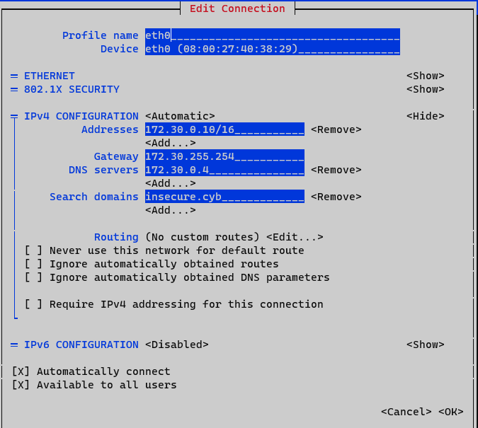

# web

## Lab 00: Lab environment Guidelines

`All virtual machines should be able to connect to each other`

```console
[vagrant@web ~]$ ping -c 5 -q 172.30.0.4 | grep trans
5 packets transmitted, 5 received, 0% packet loss, time 4128ms
[vagrant@web ~]$ ping -c 5 -q 172.30.0.15 | grep trans
5 packets transmitted, 5 received, 0% packet loss, time 4113ms
[vagrant@web ~]$ ping -c 5 -q 172.30.255.254 | grep trans
5 packets transmitted, 5 received, 0% packet loss, time 4045ms
[vagrant@web ~]$ ping -c 5 -q 172.30.10.100 | grep trans
5 packets transmitted, 5 received, 0% packet loss, time 4102ms
[vagrant@web ~]$ ping -c 5 -q 192.168.100.253 | grep trans
5 packets transmitted, 5 received, 0% packet loss, time 4107ms
[vagrant@web ~]$ ping -c 5 -q 192.168.100.254 | grep trans
5 packets transmitted, 5 received, 0% packet loss, time 4067ms
```

`Every virtual machine should have internet access`

```console
[vagrant@web ~]$ ping -c 5 -q 8.8.8.8 | grep trans
5 packets transmitted, 5 received, 0% packet loss, time 4008ms
[vagrant@web ~]$ ping -c 5 -q www.google.be | grep trans
5 packets transmitted, 5 received, 0% packet loss, time 4008ms
```

## Lab 01: Lecture 1 Exercises

`Connecting from companyrouter to have the benefits of ssh`

```code
[vagrant@companyrouter ~]$ ssh vagrant@172.30.0.10
vagrant@172.30.0.10's password:
Last login: Tue Nov 28 17:32:00 2023 from 192.168.100.1
[vagrant@web ~]$
```

`What are we running ...`

```code
[vagrant@web ~]$ cat /etc/os-release
NAME="AlmaLinux"
VERSION="9.2 (Turquoise Kodkod)"
ID="almalinux"
ID_LIKE="rhel centos fedora"
VERSION_ID="9.2"
PLATFORM_ID="platform:el9"
PRETTY_NAME="AlmaLinux 9.2 (Turquoise Kodkod)"
ANSI_COLOR="0;34"
LOGO="fedora-logo-icon"
CPE_NAME="cpe:/o:almalinux:almalinux:9::baseos"
HOME_URL="https://almalinux.org/"
DOCUMENTATION_URL="https://wiki.almalinux.org/"
BUG_REPORT_URL="https://bugs.almalinux.org/"

ALMALINUX_MANTISBT_PROJECT="AlmaLinux-9"
ALMALINUX_MANTISBT_PROJECT_VERSION="9.2"
REDHAT_SUPPORT_PRODUCT="AlmaLinux"
REDHAT_SUPPORT_PRODUCT_VERSION="9.2"
[vagrant@web ~]$ uname -a
Linux web 5.14.0-284.30.1.el9_2.x86_64 #1 SMP PREEMPT_DYNAMIC Tue Sep 12 09:28:32 EDT 2023 x86_64 x86_64 x86_64 GNU/Linux
```

`Who else is here?`

```code
[vagrant@web ~]$ grep -vE 'false|nologin|sync|shutdown|halt' /etc/passwd
root:x:0:0:root:/root:/bin/bash
vagrant:x:1000:1000::/home/vagrant:/bin/bash
```

`Checking out the neighbourhood`

```code
[vagrant@web ~]$ ip -4 a
1: lo: <LOOPBACK,UP,LOWER_UP> mtu 65536 qdisc noqueue state UNKNOWN group default qlen 1000
    inet 127.0.0.1/8 scope host lo
       valid_lft forever preferred_lft forever
2: eth0: <BROADCAST,MULTICAST,UP,LOWER_UP> mtu 1500 qdisc fq_codel state UP group default qlen 1000
    altname enp0s3
    inet 172.30.0.10/16 brd 172.30.255.255 scope global noprefixroute eth0
       valid_lft forever preferred_lft forever
    inet 172.30.10.101/16 brd 172.30.255.255 scope global secondary dynamic noprefixroute eth0
       valid_lft 591sec preferred_lft 591sec
[vagrant@web ~]$ ip r
default via 172.30.255.254 dev eth0 proto static metric 100
172.30.0.0/16 dev eth0 proto kernel scope link src 172.30.0.10 metric 100
172.30.0.0/16 dev eth0 proto kernel scope link src 172.30.10.101 metric 100
[vagrant@web ~]$ cat /etc/resolv.conf
# Generated by NetworkManager
search insecure.cyb
nameserver 172.30.0.4
[vagrant@web ~]$ ip neigh
172.30.0.15 dev eth0 lladdr 08:00:27:a3:98:d1 STALE
172.30.0.4 dev eth0 lladdr 08:00:27:cc:a9:66 STALE
172.30.255.254 dev eth0 lladdr 08:00:27:2e:df:22 REACHABLE
```

```code
[vagrant@web ~]$ sudo nmtui
```



`This explains why web has a second ipv4 address. Fixing this and rebooting`


```code
[vagrant@web ~]$ ip -4 a
1: lo: <LOOPBACK,UP,LOWER_UP> mtu 65536 qdisc noqueue state UNKNOWN group default qlen 1000
    inet 127.0.0.1/8 scope host lo
       valid_lft forever preferred_lft forever
2: eth0: <BROADCAST,MULTICAST,UP,LOWER_UP> mtu 1500 qdisc fq_codel state UP group default qlen 1000
    altname enp0s3
    inet 172.30.0.10/16 brd 172.30.255.255 scope global noprefixroute eth0
       valid_lft forever preferred_lft forever

```

`Connectivity was allready checked in Lab 00`

`Investigating the history to learn what was installed...`

```code
[vagrant@web ~]$ cat ~/.bash_history
cat /etc/os-release
sudo dnf update
sudo dnf install -y java-17-openjdk python3-libsemanage httpd php php-mysqlnd
sudo nmtui
sudo reboot
sudo mkdir /opt/insecurewebapp
sudo cp app.jar /opt/insecurewebapp/app.jar
ls -alh /opt/insecurewebapp/
rm app.jar
sudo /usr/sbin/setsebool httpd_can_network_connect 1
sudo chown root:root /opt/insecurewebapp/app.jar
sudo ls -alh /var/www/html
sudo chcon -R -h -t httpd_sys_content_t /var/www/html
sudo chown -R apache:apache /var/www/html
sudo vi /etc/httpd/conf/httpd.conf
sudo vi /etc/systemd/system/insecurewebapp.service
sudo vi /var/www/html/index.php
sudo systemctl daemon-reload
sudo systemctl enable insecurewebapp
sudo systemctl restart insecurewebapp
sudo systemctl restart httpd
sudo vi /var/www/html/index.php
sudo vi /etc/httpd/conf/httpd.conf
exit
ip a
sudo poweroff
```

`Sockets`

```code
[vagrant@database ~]$ sudo ss -tlnp
State             Recv-Q            Send-Q                         Local Address:Port                          Peer Address:Port            Process
LISTEN            0                 4096                                 0.0.0.0:3306                               0.0.0.0:*                users:(("mysqld",pid=767,fd=23))
LISTEN            0                 128                                  0.0.0.0:22                                 0.0.0.0:*                users:(("sshd",pid=678,fd=3))
LISTEN            0                 4096                                 0.0.0.0:111                                0.0.0.0:*                users:(("rpcbind",pid=632,fd=4),("systemd",pid=1,fd=31))
LISTEN            0                 70                                         *:33060                                    *:*                users:(("mysqld",pid=767,fd=21))
LISTEN            0                 128                                     [::]:22                                    [::]:*                users:(("sshd",pid=678,fd=4))
LISTEN            0                 4096                                    [::]:111                                   [::]:*                users:(("rpcbind",pid=632,fd=6),("systemd",pid=1,fd=34))                                  [::]:*                users:(("sshd",pid=691,fd=4))
```

`What is running on port 8000`

```code
[vagrant@web ~]$ sudo systemctl status insecurewebapp
● insecurewebapp.service - start script for insecurewebapp
     Loaded: loaded (/etc/systemd/system/insecurewebapp.service; enabled; preset: disabled)
     Active: active (running) since Tue 2023-11-28 17:28:03 UTC; 1h 52min ago
   Main PID: 657 (java)
      Tasks: 18 (limit: 2262)
     Memory: 57.0M
        CPU: 6.732s
     CGroup: /system.slice/insecurewebapp.service
             └─657 /usr/bin/java -server -Xms128m -Xmx512m -jar /opt/insecurewebapp/app.jar

Nov 28 17:28:03 web systemd[1]: Started start script for insecurewebapp.
Nov 28 17:28:06 web insecurewebapp[657]: Nov 28, 2023 5:28:06 PM io.vertx.core.impl.launcher.commands.VertxIsolatedDeployer
Nov 28 17:28:06 web insecurewebapp[657]: INFO: Succeeded in deploying verticle
Nov 28 17:28:06 web insecurewebapp[657]: Nov 28, 2023 5:28:06 PM be.programming101.dt.web.WebServer lambda$start$1
Nov 28 17:28:06 web insecurewebapp[657]: INFO: Server is listening on port: 8,000
```

`This is running because the service was created and enabled (and systemd reloaded with sudo systemctl daemon-reload)`

```code
[vagrant@web ~]$ cat /etc/systemd/system/insecurewebapp.service
[Unit]
Description = start script for insecurewebapp

[Service]
SyslogIdentifier=insecurewebapp
Type=simple
ExecStart = /usr/bin/java -server -Xms128m -Xmx512m -jar /opt/insecurewebapp/app.jar
User=root

[Install]
WantedBy = multi-user.target
```

`What is this?`

```code
[vagrant@web ~]$ ls -lhZ /opt/insecurewebapp/
total 5.9M
-rw-r--r--. 1 root root unconfined_u:object_r:usr_t:s0 5.9M Sep 20 14:37 app.jar
[vagrant@web ~]$ curl localhost:8000
<!DOCTYPE html>
<html lang="en">
<head>
    <meta charset="UTF-8">
    <title>Command Injection</title>
    <script src="assets/javascript/index.js"></script>
</head>
<body>
<h1>Command Injection</h1>
<form id="ping">
    <h2>Ping a device</h2>
    <label for="ip">Enter an IP address</label>
    <input id="ip" type="text"/>
    <input type="submit" value="PING">
</form>

<form id="exec">
    <h2>Execute a command</h2>
    <label for="cmd">Enter a command</label>
    <input id="cmd" type="text"/>
    <input type="submit" value="EXEC">
</form>

<pre></pre>
</body>
</html>
```

`Allthough there seems to be a lot of http-configuration going on, port 80 doesn't seem to be up.`

```code
[vagrant@web ~]$ sudo systemctl status httpd
○ httpd.service - The Apache HTTP Server
     Loaded: loaded (/usr/lib/systemd/system/httpd.service; disabled; preset: disabled)
    Drop-In: /usr/lib/systemd/system/httpd.service.d
             └─php-fpm.conf
     Active: inactive (dead)
       Docs: man:httpd.service(8)
```

`What configfiles/content`

```code
[vagrant@web ~]$ sudo ls -alhZ /var/www/html
total 4.0K
drwxr-xr-x. 2 apache apache system_u:object_r:httpd_sys_content_t:s0       23 Nov 28 04:34 .
drwxr-xr-x. 4 root   root   system_u:object_r:httpd_sys_content_t:s0       33 Sep 20 14:25 ..
-rw-r--r--. 1 root   root   unconfined_u:object_r:httpd_sys_content_t:s0 1.8K Sep 20 14:43 index.php
[vagrant@web ~]$ cat /var/www/html/index.php
<!DOCTYPE html>
<html>
<head>
    <title>Insecure Cyb</title>
</head>
<body>

<h1>Welcome to Insecure.cyb!</h1>


<h2>We learn what it means to be not secure :) </h2>

    <?php
    // Enable error reporting for debugging
    ini_set('display_errors', 1);
    ini_set('display_startup_errors', 1);
    error_reporting(E_ALL);

    // Define your database credentials
    $servername = "172.30.0.15";
    $username = "sammy";
    $password = "FLAG-741852";
    $database = "users";

    // Create a connection to the database
    $conn = new mysqli($servername, $username, $password, $database);

    // Check the connection
    if ($conn->connect_error) {
        echo "<p>Error: Could not connect to the database</p>";
    } else {
        echo "<p>Connected to the database</p>";

        // Check if the form is submitted
        if (isset($_POST['login'])) {
            $searchTerm = $_POST['login'];

            // Create and execute the SQL query
            $sql = "SELECT information FROM users WHERE name LIKE '%" . $searchTerm . "%'";
            $result = $conn->query($sql);

            if ($result->num_rows > 0) {
                // Output the data
                echo "<p>Search results:</p>";
                while ($row = $result->fetch_assoc()) {
                    echo "<p>" . $row['information'] . "</p>";
                }
            } else {
                echo "<p>No results found</p>";
            }
        }

        // Close the database connection
        $conn->close();
    }
    ?>

    <!-- HTML Form -->
    <form method="POST" action="">
        <label for="login">Login:</label>
        <input type="text" name="login" id="login" />
        <input type="submit" value="Search" />
    </form>
</body>
</html>
```

```code
[vagrant@web ~]$ cat /etc/httpd/conf/httpd.conf | grep -vE '^\s*#|^#.*'

ServerRoot "/etc/httpd"

Listen 80


LoadModule proxy_module modules/mod_proxy.so
LoadModule proxy_http_module modules/mod_proxy_http.so

ProxyPass "/cmd" "http://localhost:8000/"
ProxyPassReverse "/aaa" "http://localhost:8000/"
ProxyPass "/assets" "http://localhost:8000/assets"
ProxyPassReverse "/assets" "http://localhost:8000/assets"
ProxyPass "/exec" "http://localhost:8000/exec"
ProxyPassReverse "/exec" "http://localhost:8000/exec"


Include conf.modules.d/*.conf

User apache
Group apache


ServerAdmin root@localhost


<Directory />
    AllowOverride none
    Require all denied
</Directory>


DocumentRoot "/var/www/html"

<Directory "/var/www">
    AllowOverride None
    Require all granted
</Directory>

<Directory "/var/www/html">
    Options Indexes FollowSymLinks

    AllowOverride None

    Require all granted
</Directory>

<IfModule dir_module>
    DirectoryIndex index.html
</IfModule>

<Files ".ht*">
    Require all denied
</Files>

ErrorLog "logs/error_log"

LogLevel warn

<IfModule log_config_module>
    LogFormat "%h %l %u %t \"%r\" %>s %b \"%{Referer}i\" \"%{User-Agent}i\"" combined
    LogFormat "%h %l %u %t \"%r\" %>s %b" common

    <IfModule logio_module>
      LogFormat "%h %l %u %t \"%r\" %>s %b \"%{Referer}i\" \"%{User-Agent}i\" %I %O" combinedio
    </IfModule>


    CustomLog "logs/access_log" combined
</IfModule>

<IfModule alias_module>


    ScriptAlias /cgi-bin/ "/var/www/cgi-bin/"

</IfModule>

<Directory "/var/www/cgi-bin">
    AllowOverride None
    Options None
    Require all granted
</Directory>

<IfModule mime_module>
    TypesConfig /etc/mime.types

    AddType application/x-compress .Z
    AddType application/x-gzip .gz .tgz


    AddType text/html .shtml
    AddOutputFilter INCLUDES .shtml
</IfModule>

AddDefaultCharset UTF-8

<IfModule mime_magic_module>
    MIMEMagicFile conf/magic
</IfModule>


EnableSendfile on

IncludeOptional conf.d/*.conf
```

`Firewall`

```code
[vagrant@web ~]$ getenforce
Enforcing
[vagrant@web ~]$ systemctl status firewalld
○ firewalld.service - firewalld - dynamic firewall daemon
     Loaded: loaded (/usr/lib/systemd/system/firewalld.service; disabled; preset: enabled)
     Active: inactive (dead)
       Docs: man:firewalld(1)
```

`Some utils. Before I turn 50 I'll take a vim tutorial, but for now I'm going for nano`

```code
[vagrant@web ~]$ sudo dnf install -yq nano bind-utils

Installed:
  bind-libs-32:9.16.23-14.el9_3.x86_64  bind-license-32:9.16.23-14.el9_3.noarch  bind-utils-32:9.16.23-14.el9_3.x86_64  fstrm-0.6.1-3.el9.x86_64  libmaxminddb-1.5.2-3.el9.x86_64  libuv-1:1.42.0-1.el9.x86_64
  nano-5.6.1-5.el9.x86_64               protobuf-c-1.3.3-13.el9.x86_64

```

`Lab 01 suggests that http://www.insecure.cyb should be available in the lab environment. Time to make some tweaks and properly configure the persistence of the website`

```code
[vagrant@web ~]$ curl localhost
curl: (7) Failed to connect to localhost port 80: Connection refused
[vagrant@web ~]$ sudo systemctl enable httpd
Created symlink /etc/systemd/system/multi-user.target.wants/httpd.service → /usr/lib/systemd/system/httpd.service.
[vagrant@web ~]$ sudo systemctl restart httpd
[vagrant@web ~]$ curl localhost
<!DOCTYPE html>
<html>
<head>
    <title>Insecure Cyb</title>
</head>
<body>

<h1>Welcome to Insecure.cyb!</h1>


<h2>We learn what it means to be not secure :) </h2>

    <br />
<b>Warning</b>:  mysqli::__construct(): (HY000/2002): Permission denied in <b>/var/www/html/index.php</b> on line <b>26</b><br />
<p>Error: Could not connect to the database</p>
    <!-- HTML Form -->
    <form method="POST" action="">
        <label for="login">Login:</label>
        <input type="text" name="login" id="login" />
        <input type="submit" value="Search" />
    </form>
</body>
</html>
[vagrant@web ~]$ sudo setsebool -P httpd_can_network_connect 1
[vagrant@web ~]$ curl localhost
<!DOCTYPE html>
<html>
<head>
    <title>Insecure Cyb</title>
</head>
<body>

<h1>Welcome to Insecure.cyb!</h1>


<h2>We learn what it means to be not secure :) </h2>

    <p>Connected to the database</p>
    <!-- HTML Form -->
    <form method="POST" action="">
        <label for="login">Login:</label>
        <input type="text" name="login" id="login" />
        <input type="submit" value="Search" />
    </form>
</body>
</html>
[vagrant@web ~]$
```
<!-- TODO: make networkconfig for isprouter after lab 01 -->

## Lab 02: Lecture 2 Exercises

```code
[vagrant@web ~]$ sudo dnf install -yq nc

Installed:
  nmap-ncat-3:7.92-1.el9.x86_64

```


[vagrant@web ~]$ sudo dnf install -yq nmap

Installed:
  nmap-3:7.92-1.el9.x86_64


## Lab 03: Lecture 3 Exercises

`to check if the uplink to the internet is through the companyrouter`

```code
[vagrant@web ~]$ sudo dnf install -yq traceroute

Installed:
  traceroute-3:2.1.0-16.el9.x86_64

```

`mind you: firewall needs finetuning to allow outgoing traffic for dnf`

## Lab 04: Lecture 4 Exercises

## Lab 05: Lecture 5 Exercises

## Lab 06: Lecture 6 No class - Catch-up

`Nothing to do`

## Lab 07: Lecture 7 BorgBackup

## Lab 08: Lecture 8 No class - Catch-up

`Nothing to do`

## Lab 09: Lecture 9 Wazuh

## Lab 10: Lecture 10 IPsec

## Lab 11: Lecture 11 - OpenVPN

## Lab 12: Lecture 12 - Hunting and hardening with ansible
